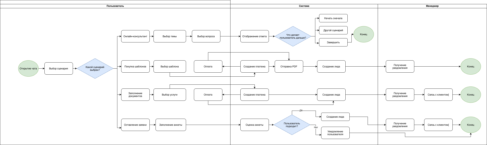
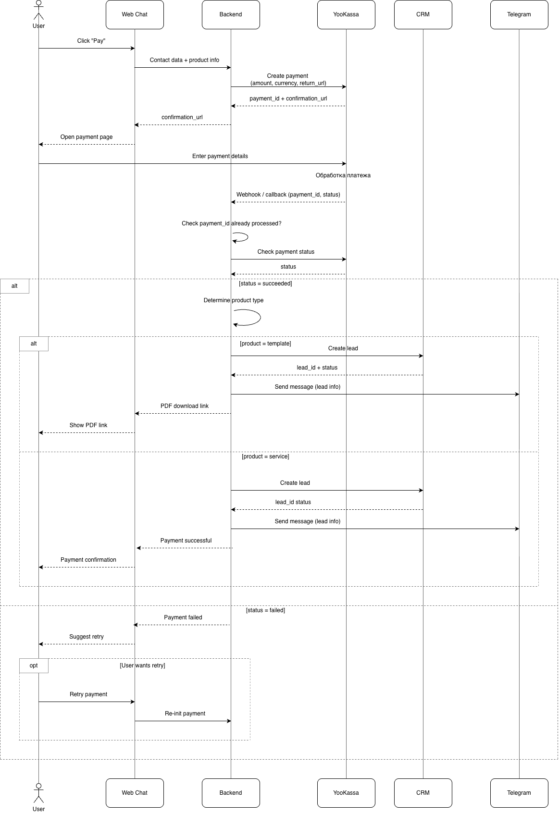
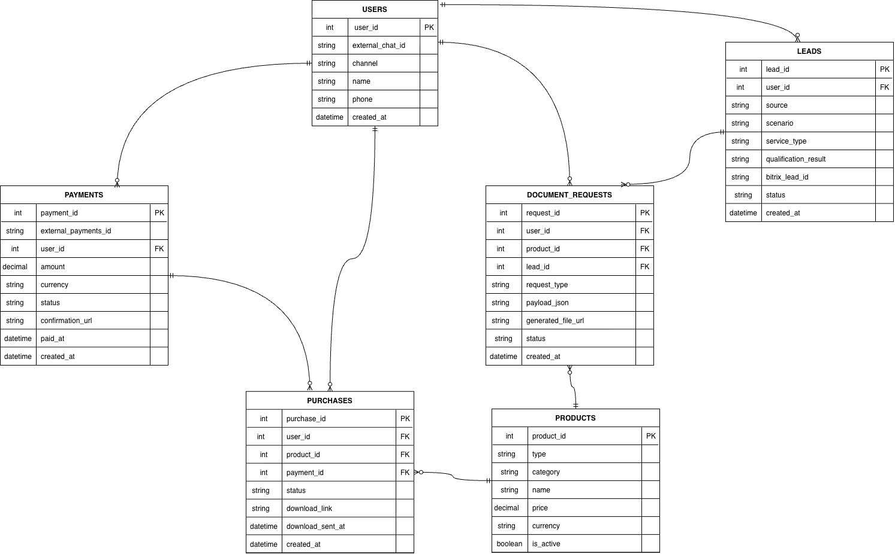
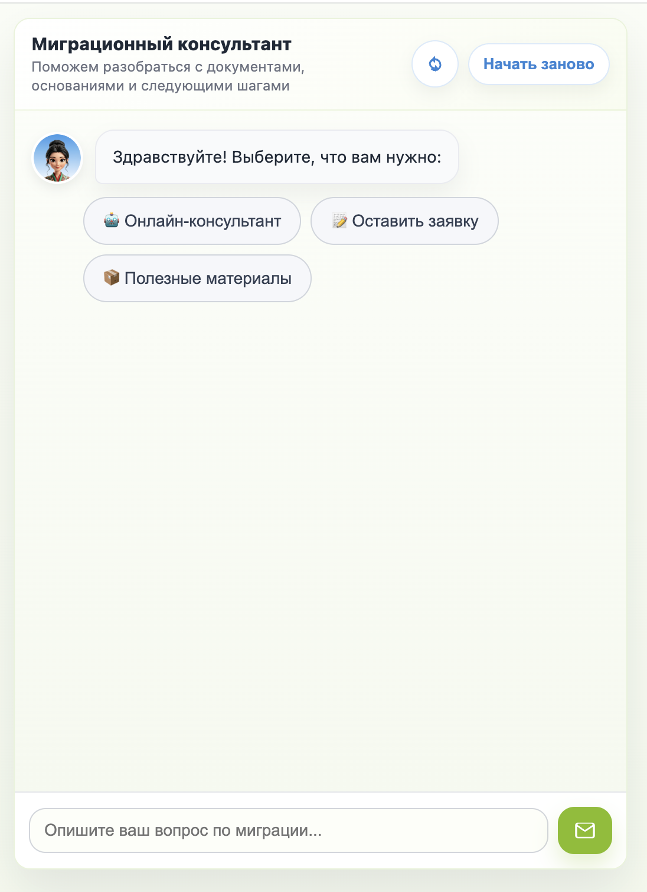
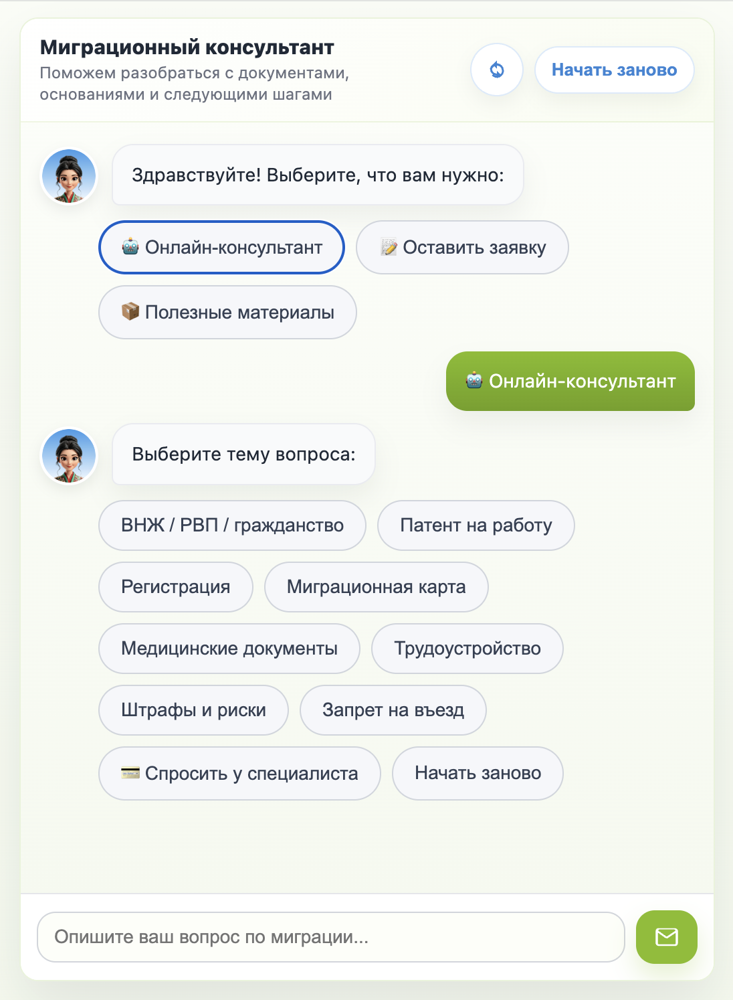
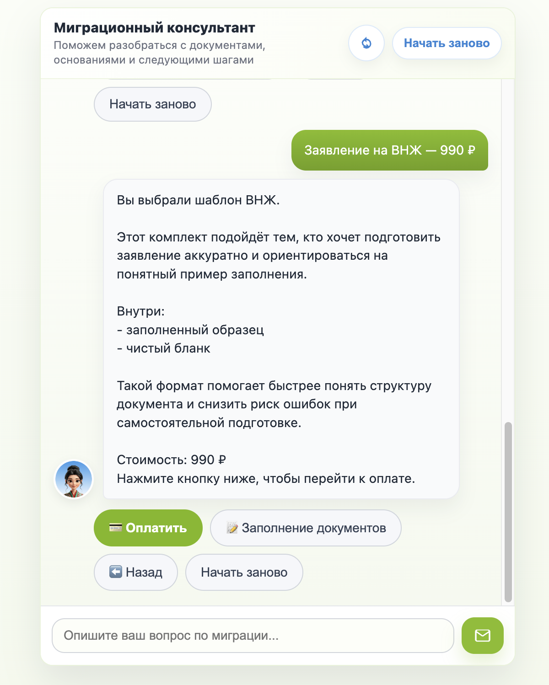
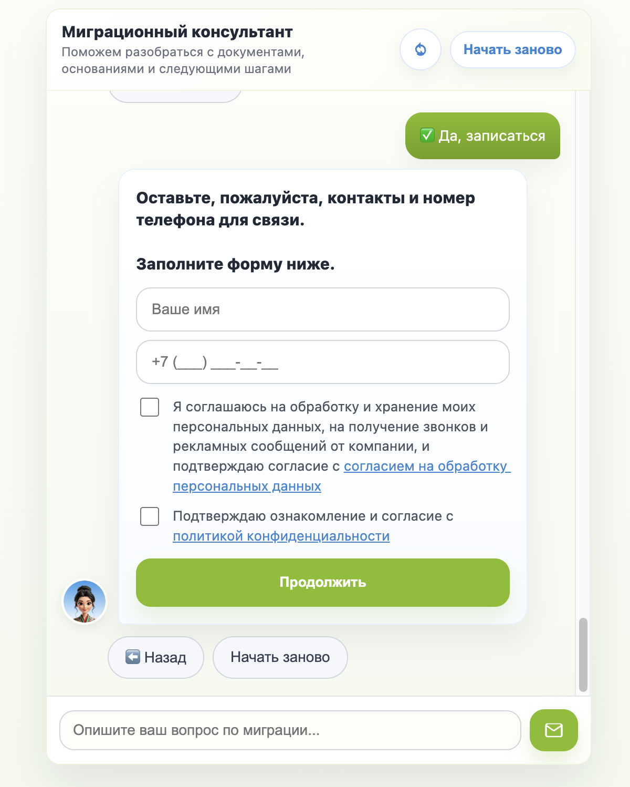

# System Analyst Portfolio — Юрий Алексеев

Системный аналитик с практическим опытом проектирования чат-ботов, интеграций и платёжных систем.

Специализируюсь на:
- моделировании бизнес-процессов (BPMN)
- проектировании API и интеграций
- декомпозиции пользовательских сценариев

## Чем я полезен

- упрощаю и структурирую бизнес-процессы
- превращаю бизнес-задачи в требования для разработки
- проектирую интеграции между системами
- помогаю снижать ручной труд через автоматизацию

## Навыки

- Анализ требований
- BPMN / UML / ERD
- API / REST / JSON
- SQL
- Интеграции (CRM, платежи)
- Прототипирование
- Тестирование

---

## Кейс: Migration Assistant Bot

### Контекст

Чат-бот для автоматизации взаимодействия с клиентами на сайте.

Позволяет:
- консультировать пользователей
- продавать цифровые продукты
- собирать заявки и передавать их в CRM

### Что реализовано

- сценарный чат с ветвлением
- продажа цифровых продуктов (PDF)
- воронка заявок с предоплатой
- интеграция с CRM (Bitrix24)
- интеграция с ЮKassa
- аналитика поведения пользователей

### Бизнес-ценность

- снижение нагрузки на менеджеров
- автоматизация обработки заявок
- сокращение времени до покупки
- централизованный сбор лидов в CRM

Подробнее о кейсе: [Migration Assistant Bot](./migration-assistant-bot/README.md)

---

## Артефакты

### BPMN (бизнес-процесс)

### Sequence Diagram (оплата)

### ERD (модель данных)

## Интерфейс чат-бота

#### Стартовый экран

Пользователь выбирает основной сценарий взаимодействия:
- онлайн-консультация
- покупка шаблонов
- оставление заявки

#### Выбор темы и навигация

Пользователь выбирает тему вопроса, после чего получает релевантный ответ.

Система:
- показывает список тем
- ведёт пользователя по сценарию
- предлагает следующий шаг

#### Покупка продукта

Пользователь выбирает шаблон документа и получает описание продукта перед оплатой.

Показано:
- ценность продукта
- состав (образец + бланк)
- переход к оплате

#### Форма заявки

Пользователь оставляет контактные данные для связи.

Система:
- валидирует ввод
- получает согласие на обработку данных
- передаёт данные в CRM

