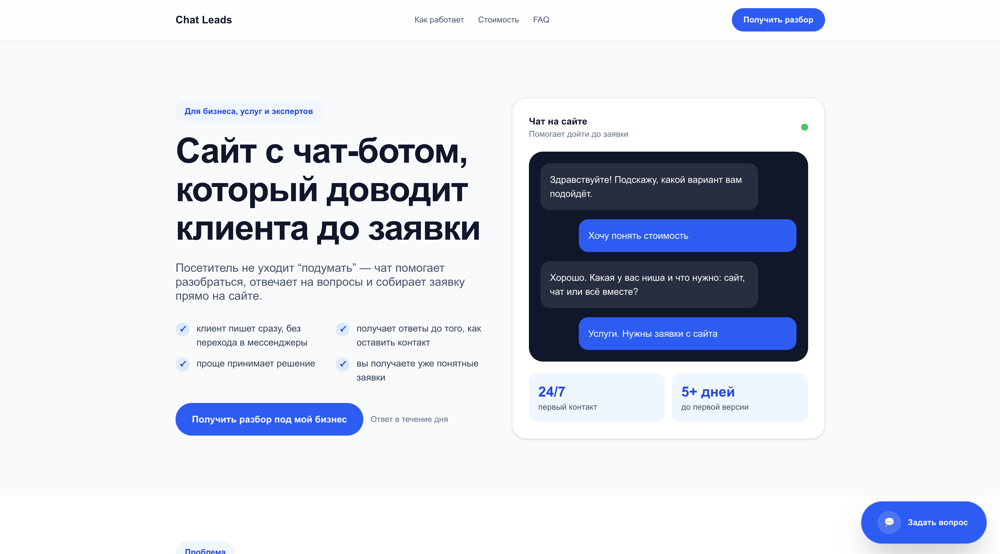
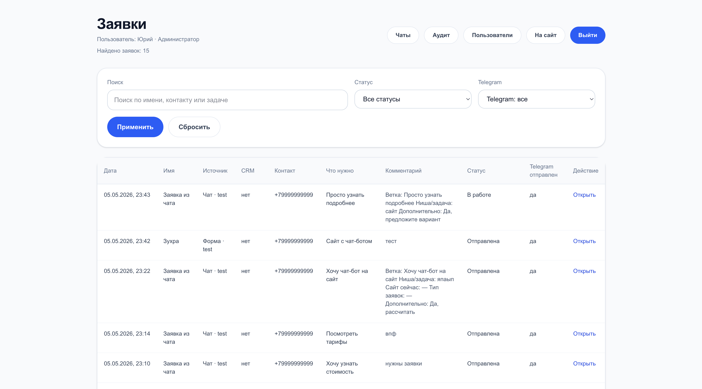
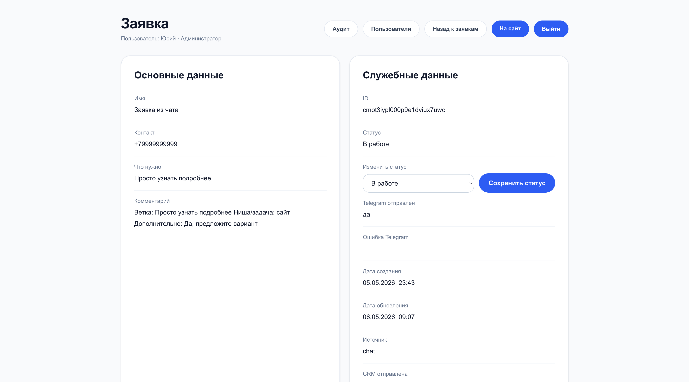
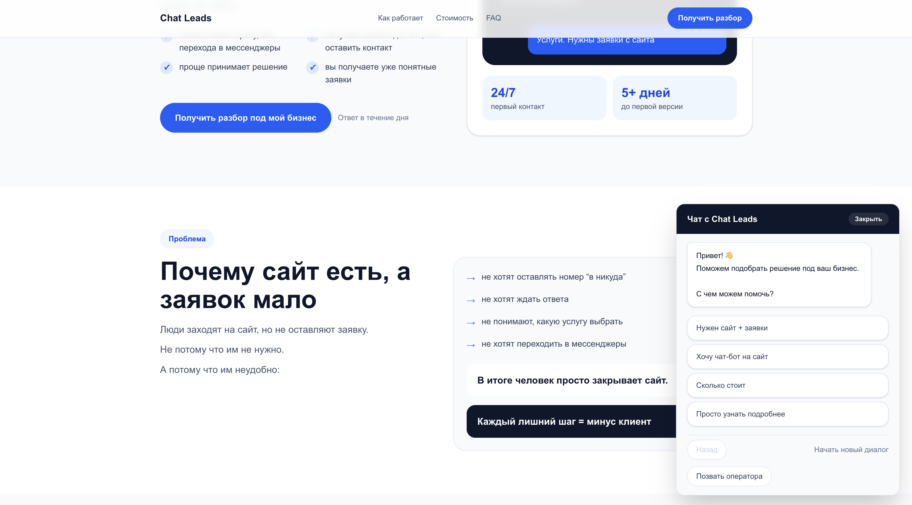
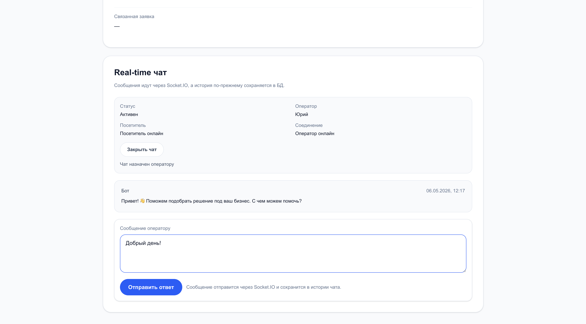
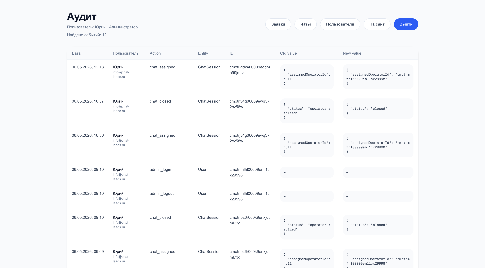
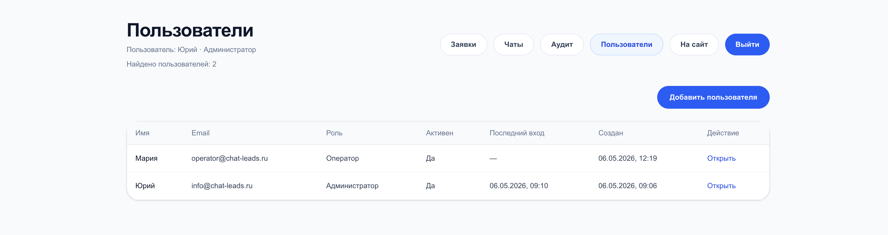

# Chat Leads

Lead management система с сайтом, формой заявки, чат-ботом, real-time чатом с оператором, админкой, ролями, аудитом, Telegram-интеграцией и аналитикой.

## Роль

Системный аналитик + разработчик/интегратор.

## Контекст

Изначальная идея: сделать сайт с умным чатом, который помогает посетителю разобраться в услуге и довести его до заявки.

Задача была шире обычной формы: нужно было спроектировать систему, где заявка создаётся из формы или чата, сохраняется в базе, передаётся в уведомления, обрабатывается в админке и сопровождается историей событий.

## Демо

Рабочий прототип: https://chat-leads.ru  
Публичный кейс: https://chat-leads.ru/case

## Вызов

Скоуп был хаотичным: лендинг, форма, чат-бот, real-time чат, CRM/Telegram-интеграции, аналитика, админка, роли и обработка заявок.

Нужно было выделить MVP, спроектировать модель данных, описать API/WebSocket-взаимодействие и реализовать production-прототип.

## Что реализовано

- публичный лендинг
- форма заявки
- серверная обработка `/api/lead`
- PostgreSQL + Prisma
- Telegram-уведомления
- IntegrationLog
- LeadEvent
- OperatorComment
- UTM tracking
- Яндекс Метрика и цели
- админка лидов
- карточка заявки
- смена статусов
- комментарии менеджера
- история событий
- фильтры заявок
- чат-виджет
- ChatSession и Message
- operator handoff
- real-time чат через Socket.IO
- User / роли admin, operator, viewer
- AuditLog
- User management UI
- production-деплой на VPS с HTTPS

## Архитектура

Для MVP выбран модульный монолит.

Основное приложение реализовано на Next.js. Внутри одной кодовой базы находятся публичный сайт, API, админка, чат, интеграции и аналитика.

Real-time часть вынесена в отдельный Socket.IO-процесс, который разворачивается рядом с Next.js-приложением и использует общую PostgreSQL-базу.

Пользователь
→ сайт / чат / форма
→ Next.js API
→ PostgreSQL
→ Telegram / CRM feature flag
→ админка

Оператор ↔ Socket.IO ↔ посетитель

## Модель данных

Фактически реализованные сущности:

- Lead
- User
- ChatSession
- Message
- LeadEvent
- OperatorComment
- IntegrationLog
- AuditLog

Целевая модель развития:

- LeadStatus
- IntegrationJob
- Visitor
- LeadSource / UTM
- AnalyticsEvent
- Settings

## API и WebSocket

REST API:

- `POST /api/lead`
- `POST /api/chat/session`
- `GET /api/chat/session/{id}`
- `POST /api/chat/session/{id}/handoff`
- `PATCH /api/admin/leads/{id}/status`
- `POST /api/admin/leads/{id}/comments`
- `POST /api/admin/chats/{id}/messages`
- `POST /api/admin/chats/{id}/assign`
- `POST /api/admin/chats/{id}/close`
- `POST /api/admin/users`
- `PATCH /api/admin/users/{id}`

Socket.IO events:

- `chat:join`
- `chat:message`
- `operator:message`
- `chat:typing`
- `message:new`
- `typing:update`
- `presence:update`
- `chat:closed`
- `chat:error`

## Скриншоты

### Лендинг

### Админка заявок

### Карточка заявки

### Чат-виджет

### Real-time чат оператора

### AuditLog

### Управление пользователями

## Кратко для резюме

**Пет-проект / lead management и real-time чат**  
**Роль:** системный аналитик + разработчик/интегратор  
**Стек:** Next.js, TypeScript, PostgreSQL, Prisma, Socket.IO, Telegram Bot API, Яндекс Метрика, Nginx, PM2, VPS

- Из идеи “сайт с умным чатом для заявок” сформировал концепцию lead management системы: лендинг, форма, чат-бот, real-time чат, админка, интеграции и аналитика.
- Спроектировал модель данных и реализовал ключевые сущности: Lead, User, ChatSession, Message, LeadEvent, OperatorComment, IntegrationLog, AuditLog.
- Описал и реализовал REST/WebSocket-взаимодействие: создание заявки, смена статуса, комментарии, события чата, operator handoff и real-time сообщения.
- Реализовал production-прототип: PostgreSQL/Prisma, Telegram-уведомления, админку лидов, роли, аудит, UTM-трекинг, Яндекс Метрику и SSL-деплой на VPS.

## Документация

Для проекта подготовлена аналитическая документация:

- [Architecture overview](./docs/architecture-overview.md)
- [ERD](./docs/erd.md)
- [Business process](./docs/business-process.md)
- [OpenAPI](./docs/openapi.yaml)
- [WebSocket contract](./docs/websocket-contract.md)
- [Functional requirements](./docs/functional-requirements.md)
- [Non-functional requirements](./docs/non-functional-requirements.md)
- [Test cases](./docs/test-cases.md)
- [User stories](./docs/user-stories.md)
- [Backlog MoSCoW](./docs/backlog-moscow.md)
- [Edge cases](./docs/edge-cases.md)
- [Backlog MoSCoW](./docs/backlog-moscow.md)
- [Edge cases](./docs/edge-cases.md)
