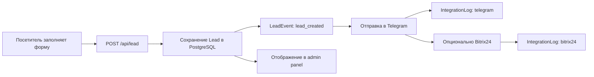
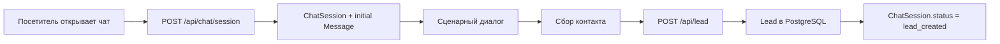
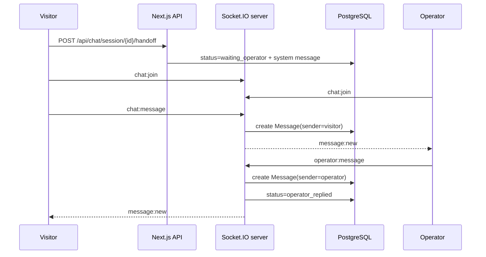
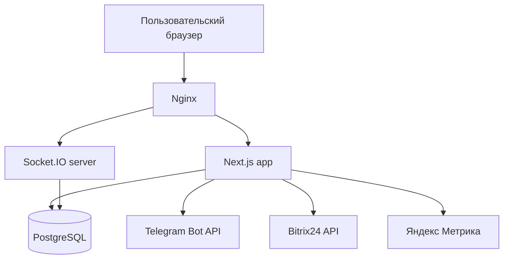

# Architecture Overview

## Назначение системы

`Chat Leads` — веб-система для привлечения, фиксации и первичной обработки лидов с лендинга и чат-виджета, включая real-time диалог с оператором, уведомление в Telegram, UTM-атрибуцию и административную обработку обращений.

## Архитектурный подход

В проекте применён подход `модульный монолит + отдельный Socket.IO процесс`.

- `Next.js` приложение объединяет публичный сайт, админку и основной HTTP API.
- `PostgreSQL + Prisma` используются как единый источник данных.
- `Socket.IO` вынесен в отдельный Node.js процесс для real-time обмена сообщениями.

Такой подход даёт:

- быстрый запуск MVP без распределённой сложности
- единый контекст доменной модели
- простое развёртывание на одном VPS
- возможность локально масштабировать real-time слой отдельно от основного web-процесса

## Основные модули

### Публичный сайт

- лендинг
- CTA-блоки
- форма заявки
- чат-виджет
- Яндекс Метрика

### Lead API

- приём заявок с формы и из чата
- валидация входных данных
- сохранение лида в PostgreSQL
- привязка `ChatSession` к `Lead`

### Admin panel

- список заявок
- карточка заявки
- статусы
- комментарии
- история событий
- список чат-сессий
- real-time операторская панель
- аудит
- управление пользователями

### Chat widget

- сценарная воронка вопросов
- сбор контакта
- создание `ChatSession`
- handoff к оператору
- восстановление истории после refresh

### Real-time chat

- обмен сообщениями visitor ↔ operator
- typing indicator
- presence online/offline
- закрытие чата
- статусная модель `ChatSession`

### Integrations

- Telegram Bot API
- Bitrix24 CRM API
- журнал интеграций `IntegrationLog`

### Analytics

- UTM tracking
- landing page / referrer capture
- Яндекс Метрика и достижение целей

### Auth / roles / audit

- cookie-based admin session
- роли `admin`, `operator`, `viewer`
- ограничение действий по роли
- аудит действий через `AuditLog`

## Основные потоки

### 1. Заявка через форму

### 2. Заявка через чат

### 3. Real-time диалог посетитель ↔ оператор

## Инфраструктура

### Основные компоненты

- `VPS` — единый runtime-контур MVP
- `Nginx` — reverse proxy, SSL termination, проксирование `/socket.io/`
- `PM2` — процессный менеджер для Next.js и Socket.IO
- `PostgreSQL` — основная БД
- `Certbot` — выпуск и продление SSL-сертификатов

### Логическая схема развёртывания

## Почему для MVP выбран модульный монолит

- доменная область ещё уточняется, поэтому раннее выделение микросервисов создало бы лишнюю операционную сложность
- web, admin и integrations используют общий набор сущностей: `Lead`, `ChatSession`, `Message`, `User`
- основная нагрузка MVP умеренная, её можно обслужить в рамках одного приложения и одной БД
- на этапе MVP важнее скорость изменений и прозрачность связей между модулями

## Направления развития

### Краткосрочно

- retry-механизм интеграций
- выделение `Visitor`
- отдельные доменные справочники и настройки
- расширение аналитических событий

### Среднесрочно

- очередь интеграций и фоновые job-процессы
- внутренние SLA и мониторинг операторских реакций
- richer RBAC и детальные permission checks

### Долгосрочно

- выделение integration layer в отдельный сервис
- горизонтальное масштабирование real-time контура
- отдельное хранилище аналитических событий
