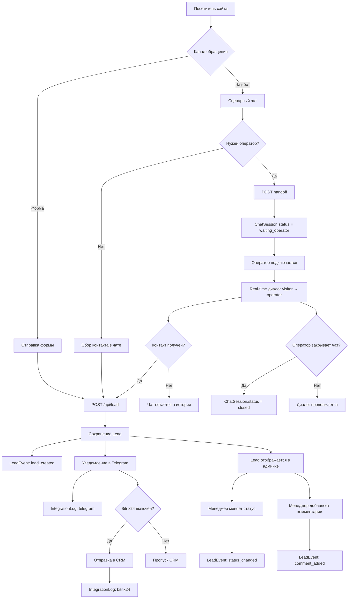

# Business Process

## Общая схема

Система обрабатывает обращения по двум основным каналам:

- форма на лендинге
- чат-виджет

Оба канала сходятся в единую доменную модель `Lead`, после чего информация поступает в Telegram, фиксируется в `IntegrationLog` и обрабатывается менеджером в админке.

## Сквозной бизнес-процесс

## Процесс: заявка через форму

1. Посетитель заполняет форму на лендинге.
2. Клиент отправляет `POST /api/lead`.
3. Система валидирует данные.
4. Система сохраняет `Lead` в PostgreSQL.
5. Система фиксирует `LeadEvent` типа `lead_created`.
6. Система отправляет уведомление в Telegram.
7. Результат интеграции фиксируется в `IntegrationLog`.
8. При включённой CRM-интеграции выполняется отправка в Bitrix24.
9. Лид становится доступен в админке для обработки.

## Процесс: заявка через чат-бот

1. Посетитель открывает чат-виджет.
2. Создаётся `ChatSession`.
3. Посетитель проходит сценарные шаги.
4. История сохраняется в `Message`.
5. После получения контакта вызывается `POST /api/lead`.
6. `ChatSession` связывается с `Lead`.
7. Статус `ChatSession` переводится в `lead_created`.

## Процесс: передача оператору

1. Посетитель нажимает кнопку вызова оператора.
2. Выполняется `POST /api/chat/session/{id}/handoff`.
3. В историю пишется системное сообщение.
4. `ChatSession.status` переводится в `waiting_operator`.
5. Оператор видит чат в админке и может назначить его на себя.

## Процесс: real-time диалог

1. Visitor и operator входят в комнату `chat:{sessionId}`.
2. Сообщения передаются через `Socket.IO`.
3. Каждое сообщение сохраняется в таблицу `Message`.
4. При первом ответе оператора статус меняется на `operator_replied`.
5. Если оператор закрывает чат, статус меняется на `closed`.

## Процесс: работа менеджера в админке

Менеджер или администратор может:

- просматривать список лидов
- открывать карточку лида
- менять статус
- оставлять комментарии
- просматривать историю событий
- просматривать связанные чат-сессии

Все значимые административные действия дополнительно фиксируются в `AuditLog`.

## Статусы Lead

### `new`

Лид создан в базе данных, начальная стадия обработки.

### `sent`

Уведомление по лиду успешно отправлено в Telegram.

### `failed`

Во внешней интеграции произошла ошибка, при этом лид сохранён в БД.

### `in_progress`

Лид принят в работу менеджером.

### `qualified`

Лид признан качественным и перспективным.

### `won`

Лид успешно конвертирован в сделку.

### `lost`

Лид закрыт без результата.

### `spam`

Лид признан нерелевантным или спамом.

## Статусы ChatSession

### `active`

Обычная активная чат-сессия без передачи оператору.

### `waiting_operator`

Посетитель запросил человека, но оператор ещё не ответил.

### `operator_replied`

Оператор подключился и отправил хотя бы одно сообщение.

### `lead_created`

Из чат-сессии был создан `Lead`.

### `closed`

Чат закрыт оператором и не должен принимать новые сообщения.
