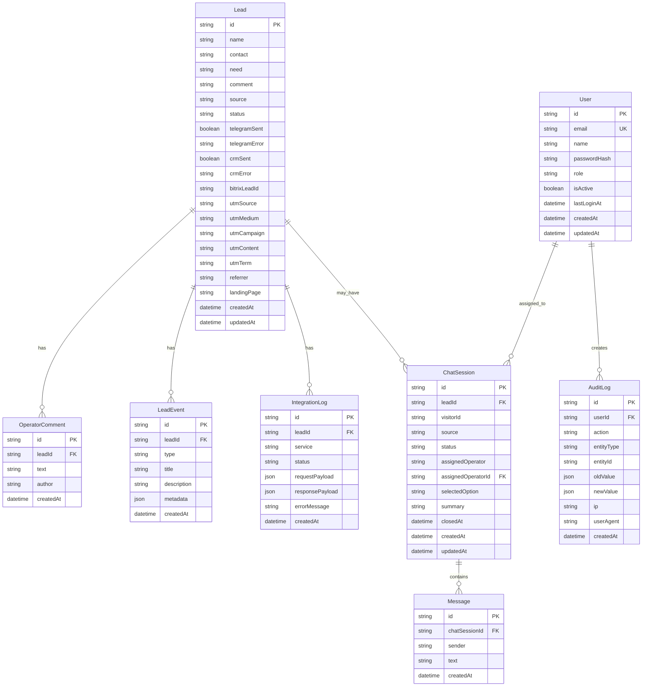
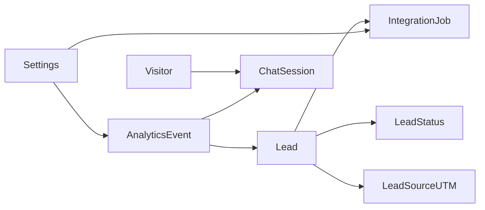

# ERD

## Назначение

Документ фиксирует:

- физическую модель данных, реализованную в текущем MVP
- целевую модель развития, которая была заложена концептуально

Важно: не все сущности из целевой модели реализованы физически в PostgreSQL на текущем этапе.

## Физическая модель данных

## Описание ключевых связей

- `Lead -> OperatorComment` — один лид может содержать несколько внутренних комментариев менеджера.
- `Lead -> LeadEvent` — один лид может иметь историю событий жизненного цикла.
- `Lead -> IntegrationLog` — один лид может иметь несколько записей по внешним интеграциям.
- `Lead -> ChatSession` — лид может быть создан из одной или нескольких связанных чат-сессий.
- `ChatSession -> Message` — одна чат-сессия содержит множество сообщений.
- `User -> AuditLog` — один пользователь может инициировать множество аудируемых действий.
- `User -> ChatSession.assignedOperatorId` — оператор может быть назначен на множество чат-сессий.

## Целевая модель развития

Следующие сущности были спроектированы концептуально, но в текущем MVP не реализованы физически как отдельные таблицы:

- `LeadStatus`
- `IntegrationJob`
- `Visitor`
- `LeadSource/UTM`
- `AnalyticsEvent`
- `Settings`

## Назначение целевых сущностей

### LeadStatus

Справочник статусов лида с возможностью:

- управлять статусами без правки кода
- хранить порядок, SLA и правила переходов

### IntegrationJob

Очередь задач интеграций для:

- retry
- фоновой отправки
- контроля числа попыток и причин ошибки

### Visitor

Отдельная сущность посетителя нужна для:

- повторных визитов
- склейки chat sessions
- накопления поведенческого контекста

### LeadSource / UTM

Нормализованная маркетинговая модель нужна для:

- чистой аналитики
- единых источников / кампаний
- построения отчётности без денормализации по полям `Lead`

### AnalyticsEvent

Внутренние события нужны для:

- продуктовой аналитики
- расчёта воронок
- анализа UX чата и конверсии

### Settings

Централизованные настройки нужны для:

- токглов функционала
- правил handoff
- параметров интеграций
- текстов и сценариев
