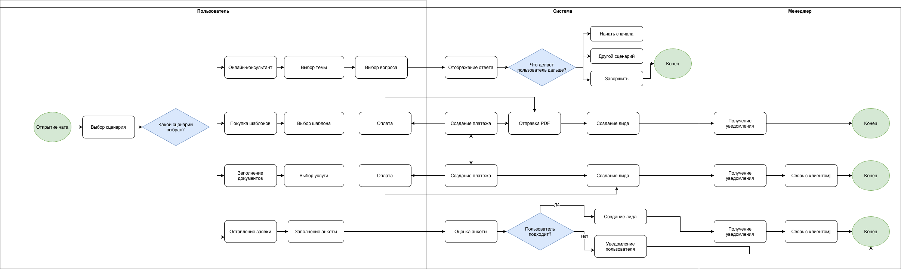
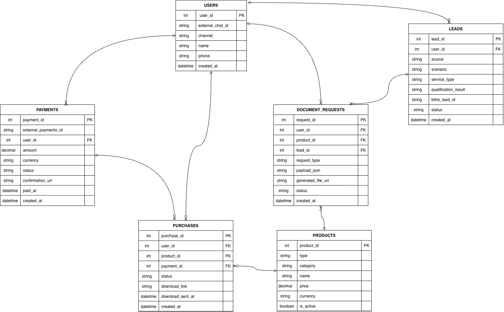
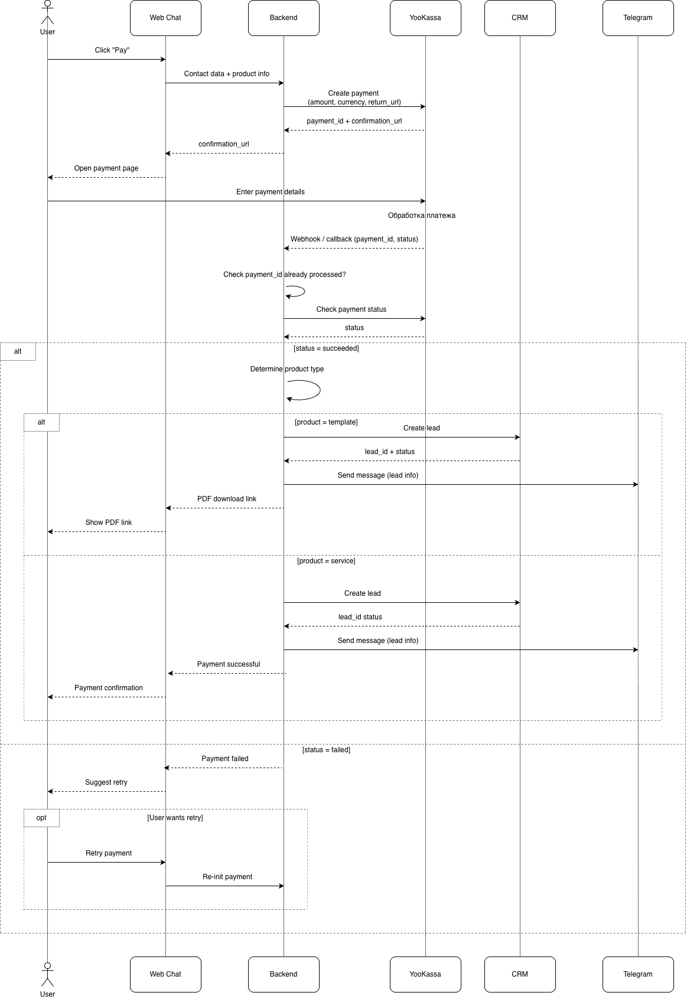
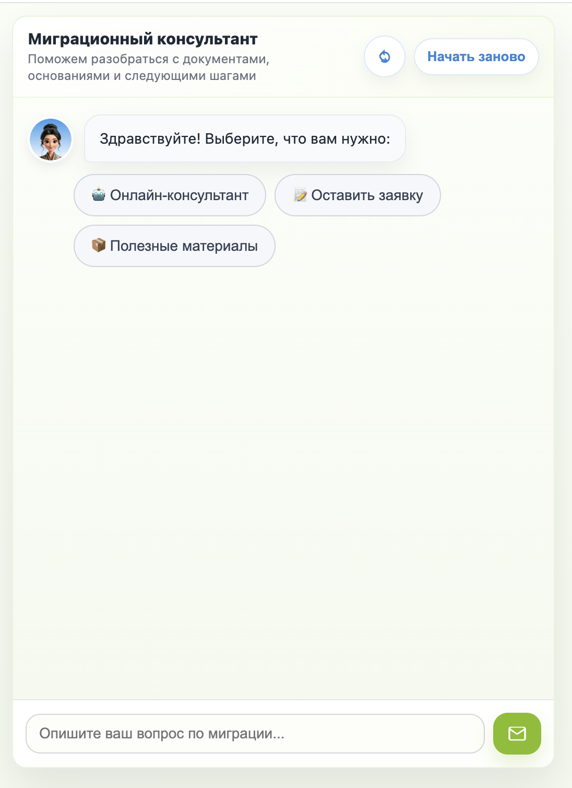
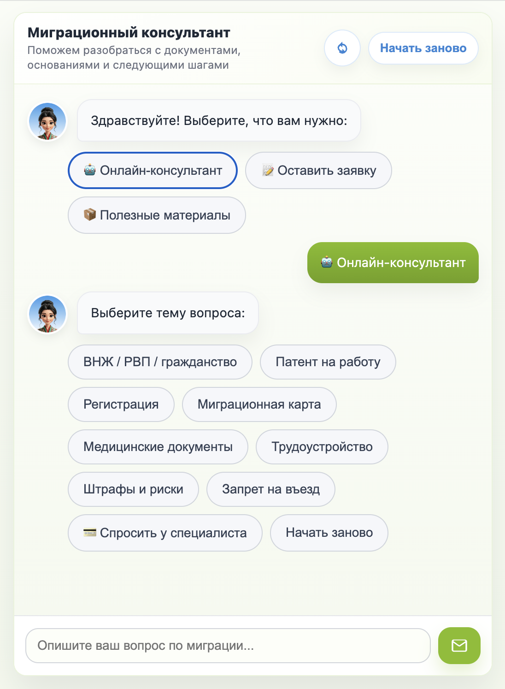
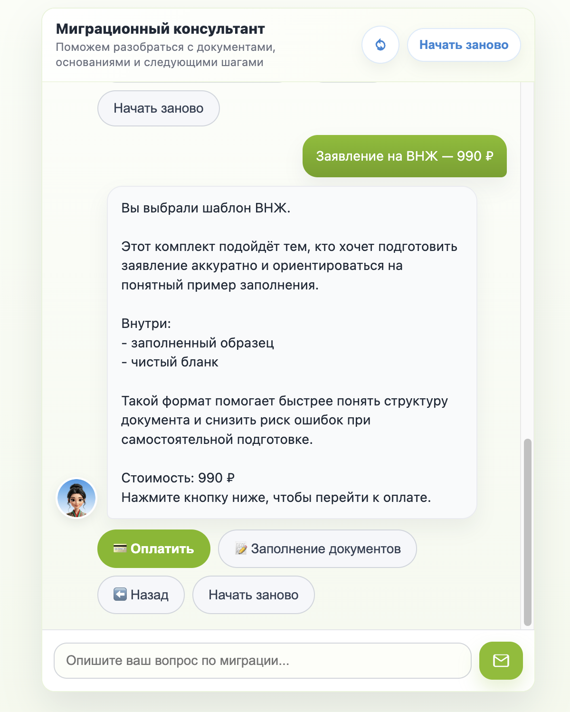
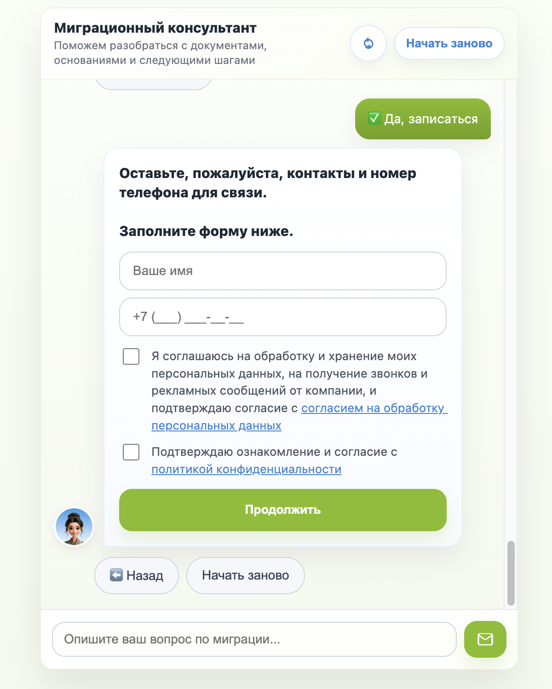

# Migration Assistant Bot

Краткое описание:  
Чат-бот для консультаций, продажи цифровых продуктов, приёма предоплаты и передачи заявок в CRM.

https://dp-bot.ru/migration-chat/chat

## Роль
Системный аналитик.

## Контекст
Бизнесу нужен был сценарный чат, который снижает нагрузку на менеджеров, помогает пользователю выбрать услугу или продукт, принимает оплату и передаёт целевые заявки в CRM.

## Вызов
Запрос был шире обычного чат-бота: нужно было объединить консультационные сценарии, оплату, выдачу PDF, CRM, Telegram-уведомления и обработку edge cases.

## Что спроектировано
- сценарная логика чат-бота
- BPMN бизнес-процесс
- ERD модель данных
- Sequence Diagram оплаты через YooKassa
- API-контракты
- webhook-логика оплаты
- CRM-интеграция
- Telegram-уведомления
- бизнес-правила
- edge cases
- тестовые сценарии

## Основные сценарии
- онлайн-консультация
- покупка шаблона
- заказ услуги
- оставление заявки

## Диаграммы
### BPMN

### ERD

### Sequence Diagram

## Интерфейс
### Стартовый экран

### Выбор темы и навигация

### Покупка продукта

### Форма заявки

## Интеграции
- YooKassa
- Bitrix24
- Telegram

## Документация
- [Требования](./docs/requirements.md)
- [Use Cases](./docs/use-cases.md)
- [Бизнес-правила](./docs/business-rules.md)
- [Интеграции](./docs/integrations.md)
- [Модель данных](./docs/data-model.md)
- [Тестовые сценарии](./docs/test-scenarios.md)
- [API](./api.md)

## Кратко для резюме
Юридические услуги / чат-боты и CRM-интеграции  
Системный аналитик | Python, Telegram Bot API, YooKassa, Bitrix24 CRM, REST/webhooks, JSON

- Собрал и формализовал требования к чат-боту для консультаций, предоплаты и продажи шаблонов документов.
- Спроектировал сценарии: консультация, выбор услуги, оплата, продажа документа, передача заявки менеджеру, ошибки оплаты/интеграций.
- Описал API/webhook-логику и JSON-структуры для YooKassa, Bitrix24 и Telegram.
- Подготовил BPMN, ERD, Sequence Diagram, бизнес-правила, edge cases и тестовые сценарии.
- Выделил MVP и второстепенные ветки для следующих этапов.
