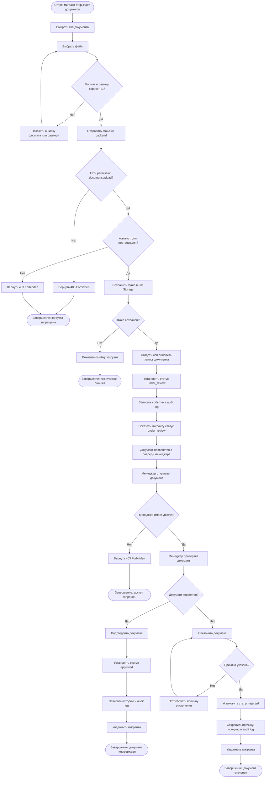

# BPMN — Загрузка и проверка документа мигранта

## 1. Назначение документа

Документ описывает бизнес-процесс загрузки, хранения и проверки документа мигранта в платформе MigrationOS.

Процесс нужен, чтобы:

- показать, как мигрант загружает документ через мобильное приложение;
- описать, как система валидирует файл и сохраняет его в защищенное хранилище;
- зафиксировать действия менеджера при проверке документа;
- описать статусы документа и причины отклонения;
- определить ошибки и исключения;
- подготовить основу для BPMN-диаграммы;
- связать процесс с требованиями, permissions и acceptance criteria.

---

## 2. Границы процесса

### 2.1. Старт процесса

Процесс начинается, когда мигрант открывает раздел документов в мобильном приложении и выбирает действие загрузки документа.

### 2.2. Завершение процесса

Процесс завершается одним из результатов:

- документ успешно загружен и ожидает проверки менеджером;
- документ проверен и подтвержден менеджером;
- документ отклонен менеджером с указанием причины;
- файл не загружен из-за ошибки формата, размера или сети;
- файл загружен, но не сохранен из-за технической ошибки;
- пользователь не имеет прав на загрузку документа.

### 2.3. Что входит в процесс

В процесс входит:

- выбор типа документа;
- выбор файла из камеры, галереи или файлового менеджера;
- проверка формата и размера файла;
- загрузка файла;
- сохранение файла в защищенное хранилище;
- создание или обновление записи документа;
- присвоение статуса `under_review`;
- отображение статуса мигранту;
- проверка документа менеджером;
- подтверждение или отклонение документа;
- фиксация истории изменений;
- создание уведомления мигранту при изменении статуса.

### 2.4. Что не входит в процесс

В процесс не входит:

- создание карточки мигранта;
- юридически значимая электронная подпись;
- автоматическая проверка подлинности документа;
- OCR-распознавание документа;
- ручной импорт документа из 1С;
- РКЛ-проверка;
- продление документа во внешних государственных системах.

---

## 3. Участники процесса / Swimlanes

| Дорожка | Участник | Ответственность |
|---|---|---|
| Мигрант | Пользователь мобильного приложения | Выбирает документ и загружает файл |
| Mobile App | Мобильное приложение | Показывает форму, ошибки, прогресс загрузки и статус |
| Document Service | Сервис документов | Валидирует данные, создает запись документа, меняет статусы |
| File Storage / S3 | Защищенное файловое хранилище | Хранит файл документа |
| Manager | Сотрудник агентства | Проверяет документ, подтверждает или отклоняет |
| Admin Panel | Интерфейс менеджера | Показывает очередь документов на проверку |
| Notification Service | Сервис уведомлений | Уведомляет мигранта об изменении статуса |
| Audit Log | Журнал аудита | Фиксирует загрузку, просмотр, подтверждение, отклонение и скачивание файла |

---

## 4. Предусловия

Перед стартом процесса должны выполняться условия:

- мигрант авторизован в мобильном приложении;
- у мигранта есть роль `migrant`;
- у пользователя есть permission `document.upload`;
- карточка мигранта существует и активна;
- тип документа доступен для загрузки;
- backend MigrationOS доступен;
- Document Service доступен;
- защищенное хранилище файлов доступно;
- для загрузки определены допустимые форматы и максимальный размер файла.

---

## 5. Основной сценарий — загрузка документа мигрантом

| Шаг | Дорожка | Действие | Результат |
|---|---|---|---|
| 1 | Мигрант | Открывает раздел "Документы" | Mobile App показывает список документов |
| 2 | Мигрант | Выбирает документ или действие "Загрузить" | Открывается форма загрузки |
| 3 | Мигрант | Выбирает тип документа | Тип документа передан в форму |
| 4 | Мигрант | Выбирает файл из камеры, галереи или файлов | Файл выбран |
| 5 | Mobile App | Проверяет базовые параметры файла | Если формат и размер корректны, доступна отправка |
| 6 | Мигрант | Нажимает "Загрузить" | Mobile App отправляет файл на backend |
| 7 | Document Service | Проверяет авторизацию и permission | Доступ разрешен |
| 8 | Document Service | Проверяет контекст доступа `own` | Файл загружается только в карточку текущего мигранта |
| 9 | Document Service | Валидирует формат и размер файла | Файл проходит проверку |
| 10 | Document Service | Передает файл в File Storage / S3 | Файл сохраняется в защищенном хранилище |
| 11 | File Storage / S3 | Возвращает `file_id` / `storage_key` | Система получает ссылку на файл |
| 12 | Document Service | Создает или обновляет запись документа | Документ связан с карточкой мигранта |
| 13 | Document Service | Присваивает документу статус `under_review` | Документ ожидает проверки |
| 14 | Audit Log | Фиксирует загрузку документа | Событие записано |
| 15 | Mobile App | Показывает успешную загрузку | Мигрант видит новый статус документа |
| 16 | Admin Panel | Показывает документ в очереди проверки | Менеджер может начать проверку |

---

## 6. Основной сценарий — проверка документа менеджером

| Шаг | Дорожка | Действие | Результат |
|---|---|---|---|
| 1 | Manager | Открывает админ-панель | Система показывает рабочую очередь |
| 2 | Manager | Открывает список документов на проверку | Видит документы со статусом `under_review` |
| 3 | Manager | Открывает документ | Admin Panel запрашивает файл и метаданные |
| 4 | Document Service | Проверяет permission `document.read` и контекст `assigned` | Доступ разрешен |
| 5 | File Storage / S3 | Предоставляет защищенный доступ к файлу | Файл доступен для просмотра |
| 6 | Audit Log | Фиксирует просмотр или скачивание файла, если применимо | Событие записано |
| 7 | Manager | Проверяет документ | Принимает решение |
| 8 | Manager | Подтверждает документ | Admin Panel отправляет действие approve |
| 9 | Document Service | Проверяет permission `document.approve` | Доступ разрешен |
| 10 | Document Service | Меняет статус документа на `approved` | Статус обновлен |
| 11 | Document Service | Сохраняет событие в истории документа | История обновлена |
| 12 | Audit Log | Фиксирует подтверждение документа | Событие записано |
| 13 | Notification Service | Создает уведомление мигранту | Мигрант получает сообщение об изменении статуса |

---

## 7. Альтернативный сценарий — отклонение документа

| Шаг | Дорожка | Условие | Поведение |
|---|---|---|---|
| A1 | Manager | Документ не соответствует требованиям | Менеджер выбирает действие "Отклонить" |
| A2 | Admin Panel | Требует указать причину | Без причины отклонить нельзя |
| A3 | Manager | Указывает причину отклонения | Причина передана на backend |
| A4 | Document Service | Проверяет permission `document.reject` | Доступ разрешен |
| A5 | Document Service | Меняет статус на `rejected` | Документ отклонен |
| A6 | Document Service | Сохраняет причину отклонения | Причина доступна мигранту |
| A7 | Audit Log | Фиксирует отклонение | Событие записано |
| A8 | Notification Service | Создает уведомление мигранту | Мигрант видит, что документ нужно исправить |

---

## 8. Ошибки и исключения

### 8.1. Недопустимый формат файла

| Шаг | Условие | Поведение |
|---|---|---|
| E1 | Пользователь выбрал файл недопустимого формата | Mobile App или backend отклоняет файл |
| E2 | Файл не отправляется или не сохраняется | Пользователь видит сообщение о допустимых форматах |
| E3 | Document Service не создает запись документа | История документа не меняется |

### 8.2. Превышен размер файла

| Шаг | Условие | Поведение |
|---|---|---|
| E1 | Пользователь выбрал файл больше максимального размера | Система отклоняет загрузку |
| E2 | Файл не сохраняется | Пользователь видит сообщение о максимальном размере |
| E3 | Audit log не фиксирует успешную загрузку | Может фиксироваться ошибка загрузки, если политика требует |

### 8.3. Ошибка загрузки в хранилище

| Шаг | Условие | Поведение |
|---|---|---|
| E1 | File Storage / S3 недоступен | Document Service не завершает загрузку |
| E2 | Запись документа не должна ссылаться на несуществующий файл | Система откатывает операцию или ставит технический статус ошибки |
| E3 | Пользователь видит сообщение "Не удалось загрузить файл" | Пользователь может повторить попытку |
| E4 | Ошибка фиксируется в логах | Команда может расследовать проблему |

### 8.4. Нет прав на загрузку документа

| Шаг | Условие | Поведение |
|---|---|---|
| E1 | Пользователь не имеет permission `document.upload` | Backend возвращает `403 Forbidden` |
| E2 | Файл не сохраняется | Данные документа не меняются |
| E3 | Mobile App показывает безопасное сообщение об отсутствии доступа | Пользователь не видит технические детали |

### 8.5. Менеджер пытается открыть недоступный документ

| Шаг | Условие | Поведение |
|---|---|---|
| E1 | Менеджер открывает документ вне своего контекста `assigned` | Backend возвращает `403 Forbidden` |
| E2 | Файл документа не выдается | Presigned URL не создается |
| E3 | Попытка доступа может фиксироваться в audit log | Compliance может расследовать событие |

### 8.6. Недопустимый статусный переход

| Шаг | Условие | Поведение |
|---|---|---|
| E1 | Пользователь пытается подтвердить документ не из статуса `under_review` | Backend отклоняет действие |
| E2 | Статус документа не меняется | История успешной смены статуса не создается |
| E3 | Пользователь видит сообщение о недопустимом статусном переходе | Ошибка может возвращаться как `409 Conflict` |

---

## 9. Бизнес-правила

| ID | Правило |
|---|---|
| BR-PROC-DOC-001 | Мигрант может загружать документы только в свою карточку |
| BR-PROC-DOC-002 | Документ после загрузки получает статус `under_review` |
| BR-PROC-DOC-003 | Подтвердить или отклонить документ может только пользователь с соответствующим permission |
| BR-PROC-DOC-004 | При отклонении документа причина обязательна |
| BR-PROC-DOC-005 | Файл документа должен храниться в защищенном хранилище |
| BR-PROC-DOC-006 | Доступ к файлу документа должен проверяться на backend |
| BR-PROC-DOC-007 | Скачивание или просмотр чувствительного файла должно логироваться согласно политике |
| BR-PROC-DOC-008 | История статусов документа должна сохраняться |
| BR-PROC-DOC-009 | Недопустимый статусный переход должен отклоняться |
| BR-PROC-DOC-010 | Мигрант должен получить уведомление после подтверждения или отклонения документа |
| BR-PROC-DOC-011 | Документы без срока действия не должны считаться просроченными |
| BR-PROC-DOC-012 | Просроченные документы должны отображаться как критичный риск |

---

## 10. Статусы документа

| Статус | Значение | Кто устанавливает |
|---|---|---|
| `draft` | Документ создан, но файл еще не загружен | Система / пользователь |
| `under_review` | Документ загружен и ожидает проверки | Система |
| `approved` | Документ подтвержден | Менеджер / Supervisor |
| `rejected` | Документ отклонен | Менеджер / Supervisor |
| `expired` | Срок действия документа истек | Система |
| `expires_soon` | Срок действия скоро истекает | Система |
| `archived` | Документ архивирован | Пользователь с правами |

---

## 11. Данные процесса

| Данные | Источник | Использование |
|---|---|---|
| `document_type` | Мигрант / справочник | Определяет тип документа |
| `file` | Мигрант | Файл для загрузки |
| `file_format` | Mobile App / backend | Проверка допустимости |
| `file_size` | Mobile App / backend | Проверка максимального размера |
| `migrant_id` | Сессия пользователя | Привязка документа к карточке |
| `document_id` | Document Service | Идентификатор записи документа |
| `file_id` / `storage_key` | File Storage | Ссылка на файл в хранилище |
| `status` | Document Service | Текущий статус документа |
| `rejection_reason` | Manager | Причина отклонения |
| `status_history` | Document Service | История изменений документа |
| `audit_event` | Audit Log | Фиксация критичных действий |

---

## 12. Интеграции и зависимости

| Интеграция / зависимость | Роль в процессе | Ошибка |
|---|---|---|
| File Storage / S3 | Хранение файла документа | Файл не сохранен |
| Document Service | Управление документами и статусами | Документ не создан или не обновлен |
| Auth / Permissions | Проверка роли и доступа | `401` / `403` |
| Notification Service | Уведомление мигранта | Уведомление не доставлено |
| Audit Log | Фиксация критичных действий | Потеря расследуемости |
| Admin Panel | Проверка документа менеджером | Менеджер не может обработать документ |
| Mobile App | Загрузка и отображение статуса | Мигрант не может завершить процесс |

---

## 13. Связанные требования

| Артефакт | Связанные элементы |
|---|---|
| Functional Requirements | FR-020, FR-021, FR-023, FR-024, FR-025, FR-026, FR-027, FR-028, FR-029, FR-030, FR-033 |
| Non-Functional Requirements | NFR-027, NFR-028, NFR-030, NFR-031, NFR-033 |
| User Stories | US-MIG-004, US-MIG-005, US-MIG-006, US-MIG-007, US-MAN-005 |
| Acceptance Criteria | AC-DOC-001, AC-DOC-002, AC-DOC-003, AC-DOC-004, AC-UPLOAD-001, AC-UPLOAD-002, AC-UPLOAD-003, AC-UPLOAD-004 |
| Role Model | `migrant`, `manager`, `supervisor` |
| Permissions | `document.read`, `document.upload`, `document.approve`, `document.reject`, `document.download_file`, `document.change_status` |

---

## 14. Mermaid-схема процесса

---

## 15. Открытые вопросы

| ID | Вопрос | Кому адресован |
|---|---|---|
| OQ-DOC-001 | Какие форматы файлов разрешены для загрузки? | Аналитик / разработка / безопасность |
| OQ-DOC-002 | Какой максимальный размер файла? | Разработка / инфраструктура |
| OQ-DOC-003 | Нужно ли антивирусное сканирование файлов? | Безопасность |
| OQ-DOC-004 | Какие причины отклонения должны быть справочником? | Бизнес / менеджеры |
| OQ-DOC-005 | Нужно ли хранить несколько версий одного документа? | Бизнес / аналитик |
| OQ-DOC-006 | Кто может архивировать документ? | Бизнес / compliance |
| OQ-DOC-007 | Нужно ли логировать каждый просмотр файла? | Безопасность / compliance |
| OQ-DOC-008 | Как долго хранить отклоненные документы? | Compliance / юристы |

---

## 16. Связанные артефакты

- [Functional Requirements](../01_requirements/functional-requirements.md)
- [Non-Functional Requirements](../01_requirements/non-functional-requirements.md)
- [User Stories](../01_requirements/user-stories.md)
- [Acceptance Criteria](../01_requirements/acceptance-criteria.md)
- [Role Model](../02_roles-and-access/role-model.md)
- [Access Matrix](../02_roles-and-access/access-matrix.md)
- [Permissions](../02_roles-and-access/permissions.md)
- [Status Models](../04_data-model/status-models.md)
