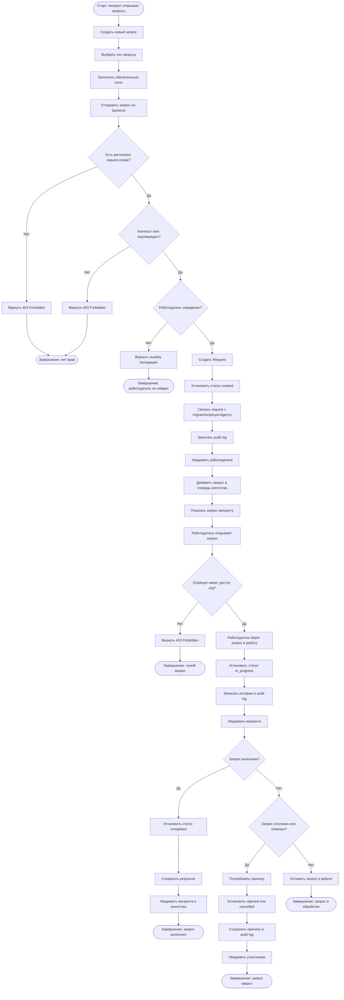

# BPMN — Запрос мигранта к работодателю

## 1. Назначение документа

Документ описывает бизнес-процесс создания и обработки запроса мигранта к работодателю через платформу MigrationOS.

Процесс нужен, чтобы:

- показать, как мигрант создает запрос документа или действия от работодателя;
- описать маршрутизацию запроса работодателю и агентству;
- зафиксировать правила видимости данных;
- описать смену статусов запроса;
- определить уведомления для участников процесса;
- описать ошибки и исключения;
- подготовить основу для BPMN-диаграммы;
- связать процесс с требованиями, ролями, permissions и acceptance criteria.

---

## 2. Границы процесса

### 2.1. Старт процесса

Процесс начинается, когда мигрант в мобильном приложении открывает раздел запросов и создает новый запрос к работодателю.

### 2.2. Завершение процесса

Процесс завершается одним из результатов:

- запрос успешно создан и направлен работодателю;
- запрос виден агентству для контроля;
- работодатель обработал запрос;
- менеджер агентства взял запрос в работу или проконтролировал обработку;
- запрос закрыт, отклонен или отменен;
- запрос не создан из-за ошибки валидации, отсутствия связи с работодателем, отсутствия прав или технической ошибки.

### 2.3. Что входит в процесс

В процесс входит:

- выбор типа запроса;
- заполнение формы запроса;
- проверка связи мигранта с работодателем;
- создание запроса;
- присвоение начального статуса;
- отображение запроса мигранту;
- отображение запроса работодателю;
- отображение копии или записи запроса в админ-панели агентства;
- обработка запроса работодателем;
- контроль запроса менеджером агентства;
- смена статуса;
- уведомления участников;
- запись истории изменений и audit log.

### 2.4. Что не входит в процесс

В процесс не входит:

- заказ услуги из маркетплейса;
- оплата услуг;
- РКЛ-проверка;
- автоматическое создание документа во внешних системах;
- юридически значимая электронная подпись;
- автоматическая интеграция с кадровой системой работодателя;
- ручное создание карточки мигранта.

---

## 3. Участники процесса / Swimlanes

| Дорожка | Участник | Ответственность |
|---|---|---|
| Мигрант | Пользователь мобильного приложения | Создает запрос и отслеживает статус |
| Mobile App | Мобильное приложение | Показывает форму запроса, список запросов и статусы |
| Request Service | Сервис запросов | Создает запрос, управляет статусами и историей |
| Employer Cabinet | Кабинет работодателя | Показывает запросы по мигрантам организации |
| Работодатель | Представитель организации | Обрабатывает запрос мигранта |
| Manager | Сотрудник агентства | Контролирует запрос и при необходимости берет его в работу |
| Admin Panel | Интерфейс агентства | Показывает запросы и историю обработки |
| Notification Service | Сервис уведомлений | Уведомляет мигранта, работодателя и менеджера |
| Audit Log | Журнал аудита | Фиксирует критичные действия и смену статусов |

---

## 4. Предусловия

Перед стартом процесса должны выполняться условия:

- мигрант авторизован в мобильном приложении;
- у мигранта есть роль `migrant`;
- у мигранта есть permission `request.create`;
- карточка мигранта активна;
- мигрант связан с работодателем, если запрос адресован работодателю;
- работодатель имеет активный кабинет или доступный канал обработки;
- Request Service доступен;
- Notification Service доступен;
- правила статусов запроса определены.

---

## 5. Основной сценарий — создание запроса мигрантом

| Шаг | Дорожка | Действие | Результат |
|---|---|---|---|
| 1 | Мигрант | Открывает раздел "Запросы" | Mobile App показывает список запросов |
| 2 | Мигрант | Нажимает "Создать запрос" | Открывается форма запроса |
| 3 | Mobile App | Показывает доступные типы запросов | Мигрант выбирает тип |
| 4 | Мигрант | Выбирает тип запроса, например "Запросить документ у работодателя" | Тип запроса выбран |
| 5 | Мигрант | Заполняет обязательные поля и комментарий | Данные переданы в форму |
| 6 | Mobile App | Отправляет запрос на backend | Request Service получает данные |
| 7 | Request Service | Проверяет permission `request.create` | Доступ разрешен |
| 8 | Request Service | Проверяет контекст `own` | Запрос создается только от текущего мигранта |
| 9 | Request Service | Проверяет связь мигранта с работодателем | Работодатель определен |
| 10 | Request Service | Валидирует обязательные поля | Данные корректны |
| 11 | Request Service | Создает запрос | Создана сущность `Request` |
| 12 | Request Service | Присваивает статус `created` | Запрос создан |
| 13 | Request Service | Связывает запрос с мигрантом, работодателем и агентством | Определены участники обработки |
| 14 | Audit Log | Фиксирует создание запроса | Событие записано |
| 15 | Notification Service | Уведомляет работодателя | Работодатель видит новый запрос |
| 16 | Notification Service | Уведомляет менеджера или добавляет запись в очередь агентства | Агентство может контролировать запрос |
| 17 | Mobile App | Показывает мигранту созданный запрос | Мигрант видит статус `created` |

---

## 6. Сценарий — обработка запроса работодателем

| Шаг | Дорожка | Условие | Поведение |
|---|---|---|---|
| A1 | Работодатель | Открывает ЛК работодателя | Видит список запросов только по своей организации |
| A2 | Employer Cabinet | Запрашивает список запросов | Backend фильтрует запросы по `employer_id` |
| A3 | Работодатель | Открывает карточку запроса | Видит данные запроса и связанного мигранта |
| A4 | Request Service | Проверяет permission `request.read` и контекст `org` | Доступ разрешен |
| A5 | Работодатель | Берет запрос в работу | Статус меняется на `in_progress` |
| A6 | Request Service | Проверяет допустимость перехода | Переход разрешен |
| A7 | Audit Log | Фиксирует смену статуса | Событие записано |
| A8 | Notification Service | Уведомляет мигранта | Мигрант видит новый статус |

---

## 7. Сценарий — выполнение запроса работодателем

| Шаг | Дорожка | Условие | Поведение |
|---|---|---|---|
| B1 | Работодатель | Подготовил ответ или документ | Выбирает действие "Выполнить" |
| B2 | Employer Cabinet | Требует результат или комментарий, если это нужно по типу запроса | Работодатель заполняет данные |
| B3 | Request Service | Проверяет permission `request.update_status` и контекст `org` | Доступ разрешен |
| B4 | Request Service | Меняет статус на `completed` | Запрос закрыт как выполненный |
| B5 | Request Service | Сохраняет результат и историю | История обновлена |
| B6 | Audit Log | Фиксирует выполнение запроса | Событие записано |
| B7 | Notification Service | Уведомляет мигранта и агентство | Участники видят результат |

---

## 8. Сценарий — контроль или обработка запроса агентством

| Шаг | Дорожка | Условие | Поведение |
|---|---|---|---|
| C1 | Manager | Открывает админ-панель | Видит запросы, доступные по правам |
| C2 | Admin Panel | Показывает запросы по правилам `assigned` или `agency` | Менеджер видит очередь |
| C3 | Manager | Открывает карточку запроса | Видит мигранта, работодателя, статус и историю |
| C4 | Request Service | Проверяет permission `request.read` и контекст `assigned` | Доступ разрешен |
| C5 | Manager | Комментирует запрос или берет в работу | Действие фиксируется в истории |
| C6 | Request Service | Проверяет permission `request.comment` или `request.update_status` | Действие разрешено |
| C7 | Audit Log | Фиксирует действие менеджера | Событие записано |
| C8 | Notification Service | Уведомляет нужных участников | Статус и комментарии доступны по правилам видимости |

---

## 9. Сценарий — запрос отклонен или отменен

| Шаг | Дорожка | Условие | Поведение |
|---|---|---|---|
| D1 | Работодатель / Manager / Мигрант | Есть причина отклонения или отмены | Пользователь инициирует действие |
| D2 | Request Service | Проверяет permission и текущий статус | Действие разрешено |
| D3 | Request Service | Требует причину для `rejected` или `cancelled` | Без причины действие не выполняется |
| D4 | Request Service | Меняет статус на `rejected` или `cancelled` | Запрос закрыт |
| D5 | Audit Log | Фиксирует смену статуса | Событие записано |
| D6 | Notification Service | Уведомляет участников | Пользователи видят новый статус и причину |

---

## 10. Ошибки и исключения

### 10.1. Мигрант не связан с работодателем

| Шаг | Условие | Поведение |
|---|---|---|
| E1 | Мигрант создает запрос к работодателю, но работодатель не определен | Backend возвращает ошибку валидации |
| E2 | Запрос не создается | Пользователь видит сообщение о невозможности создать запрос |
| E3 | Пользователь получает рекомендацию обратиться в агентство |

### 10.2. Работодатель пытается открыть чужой запрос

| Шаг | Условие | Поведение |
|---|---|---|
| E1 | Работодатель открывает запрос другой организации прямым URL | Backend возвращает `403 Forbidden` |
| E2 | Данные запроса и мигранта не возвращаются | Утечка ПДн предотвращена |
| E3 | Попытка может фиксироваться в audit log как access violation |

### 10.3. Мигрант пытается изменить чужой запрос

| Шаг | Условие | Поведение |
|---|---|---|
| E1 | Мигрант обращается к запросу другого мигранта через API | Backend возвращает `403 Forbidden` |
| E2 | Данные не возвращаются и статус не меняется | Запрос остается без изменений |

### 10.4. Не заполнены обязательные поля

| Шаг | Условие | Поведение |
|---|---|---|
| E1 | Форма запроса отправлена без обязательного поля | Backend возвращает `422 Unprocessable Entity` |
| E2 | Запрос не создается | Интерфейс показывает ошибки по полям |
| E3 | Пользователь может исправить данные и повторить отправку |

### 10.5. Недопустимый статусный переход

| Шаг | Условие | Поведение |
|---|---|---|
| E1 | Пользователь пытается перевести `completed` в `in_progress` | Backend возвращает `409 Conflict` |
| E2 | Статус не меняется | История успешного перехода не создается |
| E3 | Интерфейс показывает сообщение о недопустимом переходе |

### 10.6. Notification Service недоступен

| Шаг | Условие | Поведение |
|---|---|---|
| E1 | Запрос создан, но Notification Service недоступен | Запрос остается созданным |
| E2 | Уведомление ставится в очередь повторной отправки | Данные не теряются |
| E3 | Пользователь может увидеть запрос в интерфейсе при следующем открытии раздела |

---

## 11. Бизнес-правила

| ID | Правило |
|---|---|
| BR-PROC-REQ-001 | Мигрант может создавать запросы только от своего имени |
| BR-PROC-REQ-002 | Запрос к работодателю должен быть связан с работодателем мигранта |
| BR-PROC-REQ-003 | Работодатель видит только запросы по своей организации |
| BR-PROC-REQ-004 | Агентство видит копию или запись запроса для контроля |
| BR-PROC-REQ-005 | Статус запроса должен меняться только по допустимой статусной модели |
| BR-PROC-REQ-006 | Отклонение или отмена запроса требует причины |
| BR-PROC-REQ-007 | Внешние роли не должны видеть внутренние комментарии агентства |
| BR-PROC-REQ-008 | Критичные действия по запросу должны попадать в audit log |
| BR-PROC-REQ-009 | Пользователи должны получать уведомления о значимых изменениях статуса |
| BR-PROC-REQ-010 | Ошибка доступа не должна раскрывать данные чужого мигранта или работодателя |

---

## 12. Статусы запроса

| Статус | Значение | Кто устанавливает |
|---|---|---|
| `created` | Запрос создан и ожидает обработки | Система |
| `in_progress` | Запрос взят в работу | Работодатель / Manager |
| `need_info` | Требуется уточнение или дополнительные данные | Работодатель / Manager |
| `completed` | Запрос выполнен | Работодатель / Manager |
| `rejected` | Запрос отклонен | Работодатель / Manager |
| `cancelled` | Запрос отменен | Мигрант / Работодатель / Manager |

---

## 13. Данные процесса

| Данные | Источник | Использование |
|---|---|---|
| `request_id` | Request Service | Идентификатор запроса |
| `request_type` | Мигрант / справочник | Тип запроса |
| `migrant_id` | Сессия пользователя | Связь запроса с мигрантом |
| `employer_id` | Карточка мигранта | Маршрутизация запроса работодателю |
| `agency_id` | Системная настройка / карточка | Контроль запроса агентством |
| `created_by` | Auth Service | Автор запроса |
| `assignee_id` | Request Service / Manager | Ответственный за обработку |
| `status` | Request Service | Текущий статус запроса |
| `status_history` | Request Service | История изменений |
| `comment` | Пользователь / работодатель / менеджер | Комментарии к запросу |
| `internal_comment` | Manager | Внутренние комментарии агентства |
| `rejection_reason` | Работодатель / Manager | Причина отклонения |
| `cancellation_reason` | Пользователь | Причина отмены |
| `audit_event` | Audit Log | Фиксация критичных действий |

---

## 14. Интеграции и зависимости

| Интеграция / зависимость | Роль в процессе | Ошибка |
|---|---|---|
| Request Service | Создание и управление запросами | Запрос не создан или не обновлен |
| Migrant Service | Проверка связи мигранта с работодателем | Работодатель не найден |
| Employer Cabinet | Обработка запроса работодателем | Работодатель не видит запрос |
| Admin Panel | Контроль запроса агентством | Менеджер не видит запрос |
| Notification Service | Уведомления участникам | Уведомление не доставлено |
| Audit Log | Фиксация критичных действий | Нет расследуемости |
| Auth / Permissions | Проверка роли и контекста доступа | `401` / `403` |

---

## 15. Связанные требования

| Артефакт | Связанные элементы |
|---|---|
| Functional Requirements | FR-036, FR-038, FR-039, FR-040, FR-042, FR-043, FR-044, FR-046, FR-051, FR-057, FR-058, FR-123, FR-124 |
| Non-Functional Requirements | NFR-018, NFR-019, NFR-020, NFR-021, NFR-034, NFR-037 |
| User Stories | US-MIG-009, US-MIG-011, US-MIG-012, US-EMP-007, US-EMP-008, US-MAN-007, US-MAN-008 |
| Acceptance Criteria | AC-REQ-001, AC-REQ-002, AC-REQ-003, AC-REQ-004, AC-EMP-002, AC-EMP-003 |
| Role Model | `migrant`, `employer`, `manager`, `supervisor` |
| Permissions | `request.create`, `request.read`, `request.update`, `request.update_status`, `request.comment`, `request.assign` |

---

## 16. Mermaid-схема процесса

---

## 17. Открытые вопросы

| ID | Вопрос | Кому адресован |
|---|---|---|
| OQ-REQ-001 | Какие типы запросов доступны мигранту в MVP? | Бизнес / продукт |
| OQ-REQ-002 | Может ли работодатель прикреплять файл в ответ на запрос? | Бизнес / аналитик |
| OQ-REQ-003 | Должен ли менеджер агентства подтверждать выполнение запроса работодателем? | Бизнес |
| OQ-REQ-004 | Какие уведомления отправляются работодателю: email, in-app, push? | Продукт / интеграции |
| OQ-REQ-005 | Может ли мигрант отменить запрос после взятия в работу? | Бизнес |
| OQ-REQ-006 | Какие комментарии видит мигрант, а какие остаются внутренними? | Бизнес / compliance |
| OQ-REQ-007 | Нужен ли SLA обработки запросов работодателем? | Бизнес / employer success |
| OQ-REQ-008 | Как обрабатывать запрос, если работодатель еще не активировал кабинет? | Бизнес / аналитик |

---

## 18. Связанные артефакты

- [Functional Requirements](../01_requirements/functional-requirements.md)
- [Non-Functional Requirements](../01_requirements/non-functional-requirements.md)
- [User Stories](../01_requirements/user-stories.md)
- [Acceptance Criteria](../01_requirements/acceptance-criteria.md)
- [Role Model](../02_roles-and-access/role-model.md)
- [Access Matrix](../02_roles-and-access/access-matrix.md)
- [Permissions](../02_roles-and-access/permissions.md)
- [Employer Cabinet Scenarios](../07_ui-scenarios/employer-cabinet-scenarios.md)
