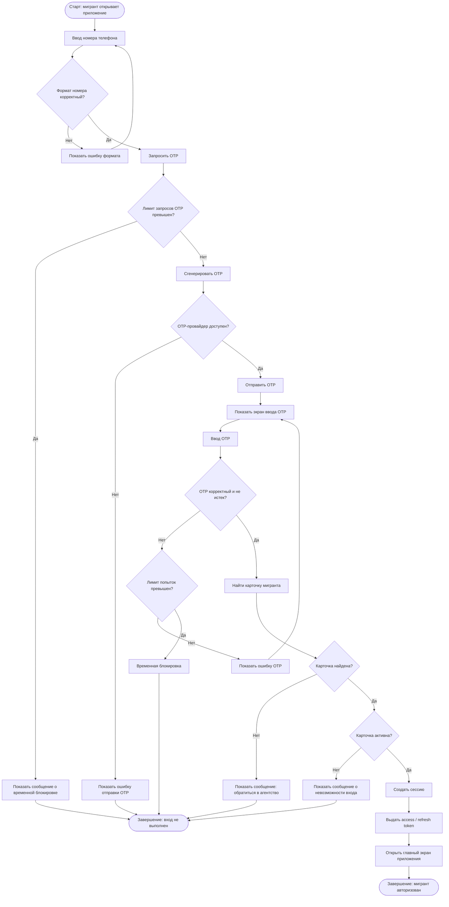

# BPMN — Регистрация и первичная авторизация мигранта

## 1. Назначение документа

Документ описывает бизнес-процесс регистрации и первичной авторизации мигранта в платформе MigrationOS.

Процесс нужен, чтобы:

- показать, как мигрант получает доступ к мобильному приложению;
- описать взаимодействие мобильного приложения, backend и карточки мигранта;
- зафиксировать основной и альтернативные сценарии;
- определить ошибки и исключения;
- подготовить основу для BPMN-диаграммы;
- связать процесс с требованиями, ролями, permissions и acceptance criteria.

---

## 2. Границы процесса

### 2.1. Старт процесса

Процесс начинается, когда мигрант открывает мобильное приложение MigrationOS и пытается войти по номеру телефона.

### 2.2. Завершение процесса

Процесс завершается одним из результатов:

- мигрант успешно авторизован и попадает на главный экран приложения;
- мигрант не найден в системе и получает сообщение о необходимости обратиться в агентство;
- авторизация не выполнена из-за ошибки OTP;
- авторизация временно заблокирована из-за превышения лимитов;
- система недоступна или произошла техническая ошибка.

### 2.3. Что входит в процесс

В процесс входит:

- ввод номера телефона;
- запрос OTP-кода;
- отправка OTP;
- ввод OTP-кода;
- проверка OTP;
- поиск карточки мигранта;
- проверка статуса карточки;
- создание пользовательской сессии;
- выдача access token;
- открытие главного экрана мобильного приложения;
- обработка ошибок.

### 2.4. Что не входит в процесс

В процесс не входит:

- создание новой карточки мигранта менеджером;
- импорт мигрантов из 1С;
- проверка документов мигранта;
- проверка РКЛ;
- подписание согласия на ПДн;
- восстановление доступа через менеджера;
- полноценная регистрация нового мигранта "с нуля" без карточки в системе.

---

## 3. Участники процесса / Swimlanes

| Дорожка | Участник | Ответственность |
|---|---|---|
| Мигрант | Пользователь мобильного приложения | Вводит номер телефона и OTP-код |
| Mobile App | Мобильное приложение | Отображает формы, ошибки и состояния процесса |
| Auth Service | Сервис авторизации | Генерирует и проверяет OTP, создает сессию |
| User / Migrant Service | Сервис пользователей и мигрантов | Ищет связанную карточку мигранта |
| Notification Provider | SMS / OTP-провайдер | Доставляет OTP-код |
| Audit / Security Log | Журнал безопасности | Фиксирует критичные события авторизации |

---

## 4. Предусловия

Перед стартом процесса должны выполняться условия:

- мобильное приложение установлено на устройстве мигранта;
- у мигранта есть номер телефона;
- backend MigrationOS доступен;
- Auth Service доступен;
- OTP-провайдер доступен или имеет fallback-сценарий;
- в системе уже существует карточка мигранта, связанная с номером телефона или другим согласованным идентификатором;
- роль мигранта в системе обозначается как `migrant`.

---

## 5. Основной сценарий

| Шаг | Дорожка | Действие | Результат |
|---|---|---|---|
| 1 | Мигрант | Открывает мобильное приложение | Приложение показывает экран входа |
| 2 | Мигрант | Вводит номер телефона | Номер передан в форму |
| 3 | Mobile App | Валидирует формат номера | Если формат корректный, доступна отправка OTP |
| 4 | Мигрант | Нажимает "Получить код" | Приложение отправляет запрос на backend |
| 5 | Auth Service | Проверяет лимиты запроса OTP | Если лимиты не превышены, генерирует OTP |
| 6 | Auth Service | Передает OTP в Notification Provider | OTP отправляется пользователю |
| 7 | Mobile App | Показывает экран ввода OTP | Пользователь может ввести код |
| 8 | Мигрант | Вводит OTP-код | Код передан в приложение |
| 9 | Mobile App | Отправляет OTP на проверку | Backend получает код |
| 10 | Auth Service | Проверяет корректность и срок действия OTP | Код подтвержден |
| 11 | User / Migrant Service | Ищет карточку мигранта по номеру телефона | Найдена связанная карточка мигранта |
| 12 | User / Migrant Service | Проверяет статус карточки мигранта | Карточка активна |
| 13 | Auth Service | Создает пользовательскую сессию | Сессия создана |
| 14 | Auth Service | Выдает access token / refresh token | Токены возвращены в приложение |
| 15 | Mobile App | Сохраняет сессию безопасным способом | Пользователь авторизован |
| 16 | Mobile App | Открывает главный экран | Процесс завершен успешно |

---

## 6. Альтернативные сценарии

### 6.1. Некорректный формат номера телефона

| Шаг | Дорожка | Условие | Поведение |
|---|---|---|---|
| A1 | Мигрант | Введен номер некорректного формата | Mobile App показывает ошибку формата |
| A2 | Mobile App | Номер некорректен | Кнопка запроса OTP недоступна или запрос не отправляется |
| A3 | Мигрант | Исправляет номер | Пользователь может повторить запрос |

---

### 6.2. OTP-провайдер недоступен

| Шаг | Дорожка | Условие | Поведение |
|---|---|---|---|
| B1 | Auth Service | OTP-провайдер недоступен | Система не подтверждает отправку OTP |
| B2 | Auth Service | Ошибка доставки | Событие фиксируется в technical / security log |
| B3 | Mobile App | Получает ошибку | Пользователь видит сообщение "Код не удалось отправить, попробуйте позже" |

---

### 6.3. Некорректный OTP

| Шаг | Дорожка | Условие | Поведение |
|---|---|---|---|
| C1 | Мигрант | Вводит неверный OTP | Auth Service отклоняет код |
| C2 | Auth Service | Код неверный | Увеличивает счетчик неуспешных попыток |
| C3 | Mobile App | Получает ошибку | Показывает сообщение "Неверный код" |
| C4 | Мигрант | Повторяет ввод | Может повторить до достижения лимита |

---

### 6.4. OTP истек

| Шаг | Дорожка | Условие | Поведение |
|---|---|---|---|
| D1 | Мигрант | Вводит OTP после истечения срока действия | Auth Service отклоняет код |
| D2 | Mobile App | Получает ошибку | Показывает сообщение "Срок действия кода истек" |
| D3 | Мигрант | Запрашивает новый OTP | Процесс возвращается к шагу запроса OTP |

---

### 6.5. Превышен лимит попыток OTP

| Шаг | Дорожка | Условие | Поведение |
|---|---|---|---|
| E1 | Мигрант | Несколько раз вводит неверный OTP | Auth Service фиксирует превышение лимита |
| E2 | Auth Service | Лимит превышен | Временно блокирует повторные попытки |
| E3 | Mobile App | Получает ошибку блокировки | Показывает сообщение о необходимости подождать |
| E4 | Audit / Security Log | Фиксирует событие | Событие записывается как security event |

---

### 6.6. Карточка мигранта не найдена

| Шаг | Дорожка | Условие | Поведение |
|---|---|---|---|
| F1 | Auth Service | OTP подтвержден | Запрашивает карточку мигранта |
| F2 | User / Migrant Service | Карточка не найдена | Возвращает результат `migrant_not_found` |
| F3 | Mobile App | Получает результат | Не открывает личный кабинет |
| F4 | Mobile App | Показывает сообщение | "Мы не нашли ваш профиль. Обратитесь в агентство" |
| F5 | Audit / Security Log | Фиксирует событие | Событие записывается для анализа |

---

### 6.7. Карточка мигранта заблокирована или архивирована

| Шаг | Дорожка | Условие | Поведение |
|---|---|---|---|
| G1 | User / Migrant Service | Карточка найдена, но имеет статус `blocked` / `archived` | Авторизация не завершается |
| G2 | Mobile App | Получает отказ | Показывает безопасное сообщение о невозможности входа |
| G3 | Audit / Security Log | Фиксирует попытку | Событие записывается |

---

## 7. Бизнес-правила

| ID | Правило |
|---|---|
| BR-PROC-REG-001 | Мигрант не создает новую карточку самостоятельно |
| BR-PROC-REG-002 | Вход мигранта выполняется по OTP |
| BR-PROC-REG-003 | OTP имеет ограниченный срок действия |
| BR-PROC-REG-004 | Количество попыток ввода OTP должно быть ограничено |
| BR-PROC-REG-005 | Карточка мигранта должна быть найдена до создания полноценной сессии |
| BR-PROC-REG-006 | Мигрант может быть связан только со своей карточкой |
| BR-PROC-REG-007 | Заблокированная или архивная карточка не должна давать доступ к приложению |
| BR-PROC-REG-008 | Ошибка авторизации не должна раскрывать лишние персональные данные |
| BR-PROC-REG-009 | События безопасности должны логироваться |
| BR-PROC-REG-010 | После успешной авторизации пользователь получает роль `migrant` |

---

## 8. Данные процесса

| Данные | Источник | Использование |
|---|---|---|
| Номер телефона | Мигрант | Поиск карточки и отправка OTP |
| OTP-код | Auth Service | Подтверждение входа |
| `migrant_id` | User / Migrant Service | Привязка сессии к карточке |
| `user_id` | User Service | Создание сессии |
| `access_token` | Auth Service | Доступ к защищенным API |
| `refresh_token` | Auth Service | Обновление сессии |
| Статус карточки мигранта | Migrant Service | Проверка возможности входа |
| Счетчик попыток OTP | Auth Service | Защита от перебора |
| Security event | Auth Service | Логирование подозрительных действий |

---

## 9. Интеграции и зависимости

| Интеграция / зависимость | Роль в процессе | Ошибка |
|---|---|---|
| OTP / SMS Provider | Доставка OTP-кода | Код не отправлен |
| Auth Service | Генерация OTP, проверка OTP, выдача токена | Невозможно авторизовать |
| User / Migrant Service | Поиск карточки мигранта | Карточка не найдена |
| Audit / Security Log | Фиксация событий безопасности | Потеря расследуемости событий |
| Mobile App | Пользовательский интерфейс процесса | Пользователь не может завершить вход |

---

## 10. Связанные требования

| Артефакт | Связанные элементы |
|---|---|
| Functional Requirements | FR-001, FR-002, FR-003, FR-004, FR-009, FR-010, FR-011, FR-012 |
| Non-Functional Requirements | NFR-018, NFR-019, NFR-021, NFR-024 |
| User Stories | US-MIG-001, US-MIG-017 |
| Acceptance Criteria | AC-AUTH-001, AC-AUTH-002, AC-AUTH-003, AC-AUTH-004 |
| Role Model | `migrant` |
| Permissions | `auth.otp_request`, `auth.otp_confirm`, `auth.login`, `auth.logout`, `migrant.read` |

---

## 11. Mermaid-схема процесса

---

## 12. Открытые вопросы

| ID | Вопрос | Кому адресован |
|---|---|---|
| OQ-REG-001 | Какой OTP-провайдер используется? | Техническая команда / бизнес |
| OQ-REG-002 | Какой срок действия OTP-кода? | Безопасность / продукт |
| OQ-REG-003 | Какой лимит попыток ввода OTP? | Безопасность / продукт |
| OQ-REG-004 | Что показываем пользователю, если карточка не найдена? | Продукт / агентство |
| OQ-REG-005 | Может ли менеджер вручную связать номер телефона с карточкой? | Бизнес / аналитик |
| OQ-REG-006 | Нужно ли логировать успешный вход мигранта? | Безопасность / compliance |
| OQ-REG-007 | Нужно ли поддерживать повторную отправку OTP через таймер? | Продукт / UX |

---

## 13. Связанные артефакты

- [Functional Requirements](../01_requirements/functional-requirements.md)
- [Non-Functional Requirements](../01_requirements/non-functional-requirements.md)
- [User Stories](../01_requirements/user-stories.md)
- [Acceptance Criteria](../01_requirements/acceptance-criteria.md)
- [Role Model](../02_roles-and-access/role-model.md)
- [Access Matrix](../02_roles-and-access/access-matrix.md)
- [Permissions](../02_roles-and-access/permissions.md)
- [Migrant App Scenarios](../07_ui-scenarios/migrant-app-scenarios.md)
