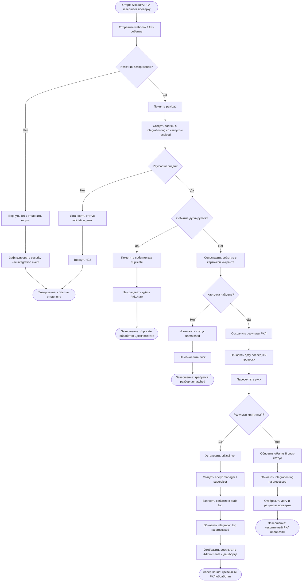

# BPMN — РКЛ-проверка и обновление риск-статуса

## 1. Назначение документа

Документ описывает бизнес-процесс получения результата РКЛ-проверки от внешней системы SHERPA RPA, сохранения результата в MigrationOS и обновления риск-статуса мигранта.

Процесс нужен, чтобы:

- зафиксировать границы ответственности MigrationOS и внешнего РКЛ-робота;
- описать прием входящего события от SHERPA RPA;
- определить правила валидации и идемпотентности webhook;
- показать, как результат РКЛ влияет на риск-статус мигранта;
- описать уведомления и алерты по критичным результатам;
- определить ошибки и исключения;
- подготовить основу для BPMN-диаграммы;
- связать процесс с требованиями, permissions, access matrix и acceptance criteria.

---

## 2. Границы процесса

### 2.1. Старт процесса

Процесс начинается, когда внешняя система SHERPA RPA завершает проверку мигранта по РКЛ и отправляет результат в MigrationOS через webhook/API.

### 2.2. Завершение процесса

Процесс завершается одним из результатов:

- РКЛ-событие успешно принято, сохранено и связано с карточкой мигранта;
- риск-статус мигранта пересчитан;
- если результат критичный, создан алерт для менеджера или руководителя;
- повторное событие обработано идемпотентно без дублей;
- событие отклонено из-за ошибки авторизации, валидации или отсутствия связанной карточки;
- ошибка зафиксирована в integration log.

### 2.3. Что входит в процесс

В процесс входит:

- прием webhook/API-события от SHERPA RPA;
- проверка API key / подписи / IP whitelist;
- валидация payload;
- проверка уникальности события;
- поиск карточки мигранта;
- сохранение результата РКЛ-проверки;
- обновление даты последней проверки;
- пересчет риск-статуса;
- создание алерта при критичном результате;
- запись события в integration log;
- запись критичных изменений в audit log;
- отображение результата в админ-панели и риск-дашбордах.

### 2.4. Что не входит в процесс

В процесс не входит:

- разработка SHERPA RPA;
- браузерная автоматизация проверки РКЛ;
- парсинг государственных сайтов;
- прямое API МВД;
- юридическое подтверждение результата вне данных, полученных от SHERPA RPA;
- ручное изменение результата РКЛ пользователем;
- построение ML-модели прогнозирования риска.

---

## 3. Участники процесса / Swimlanes

| Дорожка | Участник | Ответственность |
|---|---|---|
| SHERPA RPA | Внешняя RPA-система | Выполняет проверку и отправляет результат |
| API Gateway | Входная точка API | Проверяет источник, маршрутизирует запрос |
| RKL Service | Сервис РКЛ | Валидирует событие, сохраняет результат, обеспечивает идемпотентность |
| Migrant Service | Сервис мигрантов | Находит карточку мигранта и обновляет связанные данные |
| Risk / Analytics Service | Сервис рисков | Пересчитывает риск-статус |
| Notification Service | Сервис уведомлений | Создает алерты и уведомления |
| Admin Panel | Интерфейс агентства | Показывает результат проверки и риск-статус |
| Integration Log | Журнал интеграций | Фиксирует входящее событие и результат обработки |
| Audit Log | Журнал аудита | Фиксирует критичные изменения риска |

---

## 4. Предусловия

Перед стартом процесса должны выполняться условия:

- SHERPA RPA настроен как доверенный источник;
- у SHERPA RPA есть действующий API key или иной механизм авторизации;
- IP-адрес источника находится в whitelist, если используется IP filtering;
- endpoint приема РКЛ-событий доступен;
- структура payload согласована;
- в MigrationOS существует карточка мигранта или правила сопоставления результата с карточкой;
- RKL Service доступен;
- Migrant Service доступен;
- Risk / Analytics Service доступен;
- Integration Log доступен.

---

## 5. Ожидаемый payload РКЛ-события

Пример структуры входящего события:

```json
{
  "event_id": "rkl_evt_2026_000001",
  "external_check_id": "sherpa_check_987654",
  "checked_at": "2026-05-20T09:15:00Z",
  "source": "SHERPA_RPA",
  "migrant": {
    "full_name": "Иванов Али Алиевич",
    "birth_date": "1994-04-12",
    "passport_number": "AA1234567",
    "phone": "+79990000000"
  },
  "result": {
    "status": "found",
    "matched": true,
    "match_confidence": "high",
    "raw_status": "FOUND_IN_REGISTRY",
    "comment": "Совпадение найдено"
  }
}
```

---

## 6. Основной сценарий — успешная обработка РКЛ-события

| Шаг | Дорожка | Действие | Результат |
|---|---|---|---|
| 1 | SHERPA RPA | Завершает проверку мигранта | Сформирован результат РКЛ |
| 2 | SHERPA RPA | Отправляет webhook в MigrationOS | API Gateway получает запрос |
| 3 | API Gateway | Проверяет источник запроса | Запрос разрешен |
| 4 | API Gateway | Передает событие в RKL Service | Сервис получает payload |
| 5 | RKL Service | Создает запись в integration log со статусом `received` | Событие зафиксировано |
| 6 | RKL Service | Валидирует структуру payload | Payload корректен |
| 7 | RKL Service | Проверяет уникальность `event_id` / `external_check_id` | Событие не является дублем |
| 8 | RKL Service | Выполняет сопоставление с карточкой мигранта | Найден `migrant_id` |
| 9 | RKL Service | Сохраняет результат РКЛ-проверки | Создана запись `RklCheck` |
| 10 | Migrant Service | Обновляет дату последней РКЛ-проверки | Карточка мигранта обновлена |
| 11 | Risk / Analytics Service | Пересчитывает риск-статус | Risk score обновлен |
| 12 | RKL Service | Обновляет integration log на `processed` | Обработка завершена успешно |
| 13 | Admin Panel | Показывает дату и результат последней проверки | Менеджер видит результат |
| 14 | Admin Panel | Обновляет риск-дашборд | Руководитель видит актуальные риски |

---

## 7. Сценарий — мигрант найден в РКЛ

| Шаг | Дорожка | Условие | Поведение |
|---|---|---|---|
| A1 | RKL Service | Результат проверки `matched = true` или `status = found` | Результат считается критичным |
| A2 | Risk / Analytics Service | Получает критичный результат | Устанавливает риск-статус `critical` |
| A3 | Notification Service | Создает алерт | Алерт доступен менеджеру и supervisor |
| A4 | Admin Panel | Обновляет карточку мигранта | Отображает критичный РКЛ-статус |
| A5 | Audit Log | Фиксирует критичное изменение риска | Событие доступно для расследования |

---

## 8. Сценарий — мигрант не найден в РКЛ

| Шаг | Дорожка | Условие | Поведение |
|---|---|---|---|
| B1 | RKL Service | Результат проверки `matched = false` или `status = not_found` | Результат считается некритичным |
| B2 | Risk / Analytics Service | Пересчитывает риск с учетом остальных факторов | Риск-статус обновляется по формуле |
| B3 | Admin Panel | Показывает дату последней проверки | Пользователь с правами видит актуальную дату |
| B4 | Integration Log | Обновляет событие на `processed` | Обработка завершена |

---

## 9. Ошибки и исключения

### 9.1. Неавторизованный источник

| Шаг | Условие | Поведение |
|---|---|---|
| E1 | Запрос пришел без API key или с неверным API key | API Gateway возвращает `401 Unauthorized` |
| E2 | Событие не передается в RKL Service | Результат РКЛ не сохраняется |
| E3 | Попытка фиксируется в security / integration log | Команда может расследовать источник |

### 9.2. Источник не из whitelist

| Шаг | Условие | Поведение |
|---|---|---|
| E1 | IP-адрес источника не входит в whitelist | API Gateway отклоняет запрос |
| E2 | RKL Service не обрабатывает payload | Данные не сохраняются |
| E3 | Событие фиксируется как security event | Возможна проверка настройки интеграции |

### 9.3. Невалидный payload

| Шаг | Условие | Поведение |
|---|---|---|
| E1 | Payload не соответствует контракту | RKL Service возвращает `422 Unprocessable Entity` |
| E2 | Результат РКЛ не сохраняется как успешная проверка | Карточка мигранта не обновляется |
| E3 | Integration Log получает статус `validation_error` | Ошибка доступна внутренним пользователям с правами |

### 9.4. Повторное событие

| Шаг | Условие | Поведение |
|---|---|---|
| E1 | `event_id` или `external_check_id` уже обработан | RKL Service определяет дубль |
| E2 | Новая запись РКЛ не создается | Идемпотентность соблюдена |
| E3 | Повторный алерт не создается | Пользователи не получают дубли уведомлений |
| E4 | Integration Log фиксирует повторное событие как `duplicate` | Возвращается технически успешный ответ или согласованный duplicate response |

### 9.5. Карточка мигранта не найдена

| Шаг | Условие | Поведение |
|---|---|---|
| E1 | Не удалось сопоставить payload с карточкой мигранта | RKL Service не обновляет риск |
| E2 | Событие сохраняется в integration log со статусом `unmatched` | Менеджер или администратор может разобрать ошибку |
| E3 | РКЛ-результат не привязывается к случайной карточке | Исключается риск ошибочного совпадения |

### 9.6. Ошибка Risk / Analytics Service

| Шаг | Условие | Поведение |
|---|---|---|
| E1 | Результат РКЛ сохранен, но risk service недоступен | РКЛ-запись сохраняется |
| E2 | Risk recalculation ставится в очередь повторной обработки | Данные не теряются |
| E3 | Integration Log фиксирует частичную ошибку | Внутренний пользователь видит, что требуется retry |
| E4 | Notification Service не создает критичный алерт до подтвержденного пересчета риска | Исключаются ложные алерты |

### 9.7. Нет данных РКЛ к контрольному времени

| Шаг | Условие | Поведение |
|---|---|---|
| E1 | До 09:00 не поступили ожидаемые результаты РКЛ | Система создает технический алерт supervisor |
| E2 | Integration Log или monitoring фиксирует пропуск данных | Команда может проверить SHERPA RPA |
| E3 | Риск-статусы не обновляются без новых данных | Предыдущие значения остаются актуальными до новой проверки |

---

## 10. Бизнес-правила

| ID | Правило |
|---|---|
| BR-PROC-RKL-001 | MigrationOS не выполняет самостоятельную браузерную проверку РКЛ |
| BR-PROC-RKL-002 | Источником результата РКЛ является SHERPA RPA |
| BR-PROC-RKL-003 | Каждое входящее РКЛ-событие должно попадать в integration log |
| BR-PROC-RKL-004 | Повторное событие не должно создавать дубль РКЛ-проверки |
| BR-PROC-RKL-005 | Результат РКЛ должен быть связан с конкретной карточкой мигранта |
| BR-PROC-RKL-006 | Если мигрант найден в РКЛ, риск должен становиться критичным |
| BR-PROC-RKL-007 | Критичный РКЛ-результат должен создавать алерт для внутренних ролей |
| BR-PROC-RKL-008 | Результат РКЛ не может редактироваться работодателем или мигрантом |
| BR-PROC-RKL-009 | Ручная корректировка риска, если разрешена, должна логироваться |
| BR-PROC-RKL-010 | Ошибка интеграции не должна удалять предыдущий валидный РКЛ-результат |
| BR-PROC-RKL-011 | Система должна поддерживать идемпотентную обработку webhook |
| BR-PROC-RKL-012 | Отсутствие ожидаемых РКЛ-данных к контрольному времени должно создавать внутренний алерт |

---

## 11. Данные процесса

| Данные | Источник | Использование |
|---|---|---|
| `event_id` | SHERPA RPA | Идемпотентность webhook |
| `external_check_id` | SHERPA RPA | Связь с внешней проверкой |
| `checked_at` | SHERPA RPA | Дата выполнения проверки |
| `source` | SHERPA RPA | Идентификация источника |
| `full_name` | SHERPA RPA | Сопоставление с карточкой мигранта |
| `birth_date` | SHERPA RPA | Сопоставление с карточкой мигранта |
| `passport_number` | SHERPA RPA | Сопоставление с карточкой мигранта |
| `phone` | SHERPA RPA | Дополнительное сопоставление |
| `matched` | SHERPA RPA | Определение критичности результата |
| `raw_status` | SHERPA RPA | Хранение исходного статуса |
| `migrant_id` | Migrant Service | Связь результата с карточкой |
| `risk_score` | Risk / Analytics Service | Расчет итогового риска |
| `integration_event_id` | Integration Log | Трассировка обработки события |
| `audit_event_id` | Audit Log | Трассировка критичного изменения |

---

## 12. Интеграции и зависимости

| Интеграция / зависимость | Роль в процессе | Ошибка |
|---|---|---|
| SHERPA RPA | Внешний источник результата РКЛ | Результат не поступил |
| API Gateway | Защита и маршрутизация входящего webhook | Запрос отклонен |
| RKL Service | Прием, валидация и сохранение результата | РКЛ не сохранен |
| Migrant Service | Сопоставление результата с карточкой мигранта | Карточка не найдена |
| Risk / Analytics Service | Пересчет риск-статуса | Риск не обновлен |
| Notification Service | Создание алертов | Алерт не создан |
| Integration Log | Трассировка интеграции | Ошибка не расследуется |
| Audit Log | Фиксация критичного изменения риска | Нет истории критичного события |

---

## 13. Связанные требования

| Артефакт | Связанные элементы |
|---|---|
| Functional Requirements | FR-098, FR-099, FR-100, FR-101, FR-102, FR-103, FR-104, FR-105, FR-106 |
| Non-Functional Requirements | NFR-040, NFR-041, NFR-042, NFR-043, NFR-045, NFR-046, NFR-077, NFR-078 |
| User Stories | US-MAN-011, US-SUP-002, US-SUP-007, US-COMP-004 |
| Acceptance Criteria | AC-RKL-001, AC-RKL-002, AC-RKL-003, AC-RKL-004 |
| Role Model | `manager`, `supervisor`, `superadmin` |
| Permissions | `rkl_check.receive_webhook`, `rkl_check.read`, `rkl_check.view_history`, `risk_score.read`, `risk_score.recalculate` |

---

## 14. Mermaid-схема процесса



---

## 15. Открытые вопросы

| ID | Вопрос | Кому адресован |
|---|---|---|
| OQ-RKL-001 | Какой точный payload будет отправлять SHERPA RPA? | Интеграционная команда |
| OQ-RKL-002 | Используется API key, HMAC-подпись или оба механизма? | Backend / безопасность |
| OQ-RKL-003 | Какой алгоритм сопоставления РКЛ-события с карточкой мигранта? | Аналитик / backend |
| OQ-RKL-004 | Что делать с unmatched РКЛ-событиями? | Бизнес / supervisor |
| OQ-RKL-005 | Какой статус считать критичным: только `found` или несколько `raw_status`? | Бизнес / compliance |
| OQ-RKL-006 | Нужно ли уведомлять работодателя о критичном РКЛ-результате? | Бизнес / юристы |
| OQ-RKL-007 | Кто имеет право запускать retry обработки интеграционного события? | Бизнес / безопасность |
| OQ-RKL-008 | Нужно ли хранить raw payload РКЛ-события? | Безопасность / compliance |
| OQ-RKL-009 | Какой контрольный SLA для ежедневного поступления РКЛ-данных? | Бизнес / эксплуатация |

---

## 16. Связанные артефакты

- [Functional Requirements](../01_requirements/functional-requirements.md)
- [Non-Functional Requirements](../01_requirements/non-functional-requirements.md)
- [User Stories](../01_requirements/user-stories.md)
- [Acceptance Criteria](../01_requirements/acceptance-criteria.md)
- [Role Model](../02_roles-and-access/role-model.md)
- [Access Matrix](../02_roles-and-access/access-matrix.md)
- [Permissions](../02_roles-and-access/permissions.md)
- RKL Webhook
- Integrations Overview
