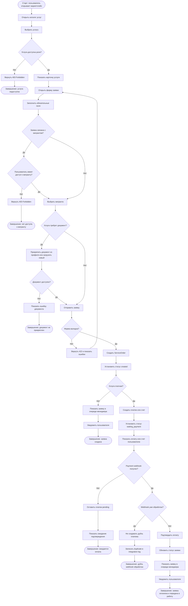

# BPMN — Заказ услуги через маркетплейс

## 1. Назначение документа

Документ описывает бизнес-процесс заказа услуги через маркетплейс MigrationOS.

Процесс нужен, чтобы:

- показать, как мигрант или работодатель выбирает услугу;
- описать создание заявки на услугу;
- зафиксировать связь заявки с пользователем, мигрантом, работодателем и документами;
- описать сценарий оплаты, если услуга платная;
- показать обработку заявки менеджером агентства;
- определить статусы заявки;
- описать ошибки и исключения;
- подготовить основу для BPMN-диаграммы;
- связать процесс с требованиями, ролями, permissions и acceptance criteria.

---

## 2. Границы процесса

### 2.1. Старт процесса

Процесс начинается, когда мигрант или работодатель открывает маркетплейс услуг и выбирает услугу.

### 2.2. Завершение процесса

Процесс завершается одним из результатов:

- заявка на услугу создана и передана в обработку агентству;
- заявка создана и ожидает оплаты;
- заявка оплачена и передана в обработку;
- заявка отклонена или отменена;
- пользователь не смог создать заявку из-за ошибки валидации, отсутствия прав, технической ошибки или недоступности платежного сервиса.

### 2.3. Что входит в процесс

В процесс входит:

- просмотр каталога услуг;
- открытие карточки услуги;
- заполнение формы заявки;
- выбор мигранта, если заявка создается работодателем;
- прикрепление документа из профиля или загрузка нового файла;
- создание заявки на услугу;
- определение необходимости оплаты;
- создание платежа или счета;
- обработка payment webhook;
- передача заявки менеджеру агентства;
- смена статусов заявки;
- уведомление пользователя о статусе.

### 2.4. Что не входит в процесс

В процесс не входит:

- полная автоматизация выполнения всех услуг;
- детальное workflow каждой отдельной миграционной услуги;
- юридически значимая электронная подпись;
- ручная бухгалтерская сверка вне MigrationOS;
- возвраты платежей;
- интеграция с государственными системами для выполнения услуги;
- SEO и продвижение маркетплейса.

---

## 3. Участники процесса / Swimlanes

| Дорожка | Участник | Ответственность |
|---|---|---|
| Пользователь | Мигрант или работодатель | Выбирает услугу, заполняет заявку, прикрепляет документы |
| Mobile App / Employer Cabinet | Клиентский интерфейс | Показывает каталог, карточку услуги, форму заявки и статусы |
| Marketplace Service | Сервис маркетплейса | Управляет каталогом услуг и созданием заявок |
| Document Service | Сервис документов | Предоставляет документы из профиля и принимает новые файлы |
| Payment Service | Сервис платежей | Создает платеж или счет, принимает webhook оплаты |
| Manager | Сотрудник агентства | Обрабатывает заявку на услугу |
| Admin Panel | Интерфейс агентства | Показывает очередь заявок и карточку заявки |
| Notification Service | Сервис уведомлений | Уведомляет пользователя о статусах |
| Audit Log | Журнал аудита | Фиксирует критичные действия |
| Integration Log | Журнал интеграций | Фиксирует платежные webhook и интеграционные события |

---

## 4. Предусловия

Перед стартом процесса должны выполняться условия:

- пользователь авторизован;
- у пользователя есть роль `migrant` или `employer`;
- у пользователя есть permission `service.read`;
- услуга опубликована и доступна для роли пользователя;
- если пользователь — работодатель, он может создавать заявки только в рамках своей организации;
- если заявка связана с мигрантом, пользователь должен иметь доступ к этому мигранту;
- Marketplace Service доступен;
- Document Service доступен, если услуга требует документы;
- Payment Service доступен, если услуга платная.

---

## 5. Основной сценарий — создание заявки на услугу

| Шаг | Дорожка | Действие | Результат |
|---|---|---|---|
| 1 | Пользователь | Открывает маркетплейс услуг | Интерфейс показывает каталог услуг |
| 2 | Пользователь | Выбирает услугу | Открывается карточка услуги |
| 3 | Marketplace Service | Проверяет доступность услуги для роли | Услуга доступна |
| 4 | Интерфейс | Показывает описание, цену, сроки и необходимые данные | Пользователь понимает условия |
| 5 | Пользователь | Нажимает "Оформить заявку" | Открывается форма заявки |
| 6 | Пользователь | Заполняет обязательные поля | Данные переданы в форму |
| 7 | Пользователь | Выбирает мигранта, если заявка создается работодателем | Система проверяет доступ к мигранту |
| 8 | Пользователь | Прикрепляет документы, если услуга требует документы | Документы добавлены к заявке |
| 9 | Интерфейс | Отправляет заявку на backend | Marketplace Service получает данные |
| 10 | Marketplace Service | Проверяет permission `service_order.create` | Доступ разрешен |
| 11 | Marketplace Service | Валидирует форму заявки | Данные корректны |
| 12 | Marketplace Service | Создает заявку на услугу | Создана сущность `ServiceOrder` |
| 13 | Marketplace Service | Присваивает начальный статус `created` | Заявка зафиксирована |
| 14 | Audit Log | Фиксирует создание заявки | Событие записано |
| 15 | Notification Service | Создает уведомление пользователю | Пользователь видит, что заявка создана |
| 16 | Admin Panel | Показывает заявку в очереди агентства | Менеджер может начать обработку |

---

## 6. Сценарий — услуга требует оплату

| Шаг | Дорожка | Условие | Поведение |
|---|---|---|---|
| A1 | Marketplace Service | Услуга платная | Система определяет необходимость оплаты |
| A2 | Payment Service | Создает платеж или счет | Платеж получает статус `pending` |
| A3 | Интерфейс | Показывает пользователю оплату или счет | Пользователь переходит к оплате или скачивает счет |
| A4 | Payment Service | Ожидает payment webhook | Заявка остается в статусе `waiting_payment` |
| A5 | Payment Service | Получает успешный payment webhook | Платеж переводится в статус `paid` |
| A6 | Marketplace Service | Обновляет статус заявки | Заявка переходит в `created` или `in_progress` согласно бизнес-правилу |
| A7 | Integration Log | Фиксирует payment webhook | Событие доступно для расследования |
| A8 | Notification Service | Уведомляет пользователя | Пользователь видит подтверждение оплаты |

---

## 7. Сценарий — менеджер берет заявку в работу

| Шаг | Дорожка | Условие | Поведение |
|---|---|---|---|
| B1 | Manager | Открывает очередь заявок | Видит заявки со статусом `created` или `paid` |
| B2 | Manager | Открывает карточку заявки | Видит данные пользователя, услугу, документы и историю |
| B3 | Marketplace Service | Проверяет permission `service_order.read` и контекст `assigned` | Доступ разрешен |
| B4 | Manager | Берет заявку в работу | Выбирает действие "В работу" |
| B5 | Marketplace Service | Проверяет permission `service_order.update_status` | Доступ разрешен |
| B6 | Marketplace Service | Меняет статус на `in_progress` | Заявка находится в обработке |
| B7 | Audit Log | Фиксирует смену статуса | Событие записано |
| B8 | Notification Service | Уведомляет пользователя | Пользователь видит новый статус |

---

## 8. Сценарий — заявка выполнена

| Шаг | Дорожка | Условие | Поведение |
|---|---|---|---|
| C1 | Manager | Услуга выполнена | Менеджер выбирает статус `completed` |
| C2 | Marketplace Service | Проверяет допустимость статусного перехода | Переход разрешен |
| C3 | Marketplace Service | Меняет статус заявки на `completed` | Заявка завершена |
| C4 | Audit Log | Фиксирует завершение заявки | Событие записано |
| C5 | Notification Service | Уведомляет пользователя | Пользователь видит, что услуга выполнена |

---

## 9. Сценарий — заявка отклонена или отменена

| Шаг | Дорожка | Условие | Поведение |
|---|---|---|---|
| D1 | Manager или пользователь | Возникла причина отмены | Инициируется отмена или отклонение |
| D2 | Marketplace Service | Проверяет permission и статус заявки | Действие разрешено |
| D3 | Marketplace Service | Требует указать причину | Без причины отмена или отклонение невозможны |
| D4 | Marketplace Service | Меняет статус на `cancelled` или `rejected` | Заявка больше не обрабатывается |
| D5 | Audit Log | Фиксирует действие | Событие записано |
| D6 | Notification Service | Уведомляет пользователя | Пользователь видит причину и новый статус |

---

## 10. Ошибки и исключения

### 10.1. Услуга недоступна пользователю

| Шаг | Условие | Поведение |
|---|---|---|
| E1 | Пользователь пытается открыть услугу, недоступную его роли | Backend возвращает `403 Forbidden` |
| E2 | Интерфейс не показывает детали услуги | Пользователь не может создать заявку |
| E3 | Событие может фиксироваться в audit log при необходимости |

### 10.2. Работодатель выбирает чужого мигранта

| Шаг | Условие | Поведение |
|---|---|---|
| E1 | Работодатель пытается создать заявку по мигранту другой организации | Backend возвращает `403 Forbidden` |
| E2 | Заявка не создается | Данные чужого мигранта не раскрываются |
| E3 | Попытка может фиксироваться как событие доступа |

### 10.3. Не заполнены обязательные поля

| Шаг | Условие | Поведение |
|---|---|---|
| E1 | Пользователь отправляет форму без обязательных данных | Backend возвращает `422 Unprocessable Entity` |
| E2 | Заявка не создается | Интерфейс показывает ошибки по полям |
| E3 | Пользователь может исправить форму и повторить отправку |

### 10.4. Требуемый документ не прикреплен

| Шаг | Условие | Поведение |
|---|---|---|
| E1 | Услуга требует документ, но пользователь не прикрепил его | Backend возвращает ошибку валидации |
| E2 | Заявка не создается или остается в черновике | Пользователь видит, какой документ нужен |
| E3 | Пользователь может выбрать документ из профиля или загрузить новый |

### 10.5. Payment webhook не пришел

| Шаг | Условие | Поведение |
|---|---|---|
| E1 | Пользователь вернулся со страницы оплаты, но webhook не поступил | Платеж остается в статусе `pending` |
| E2 | Заявка не считается оплаченной | Интерфейс показывает ожидание подтверждения оплаты |
| E3 | Payment Service ожидает webhook или запускает проверку статуса по регламенту |

### 10.6. Повторный payment webhook

| Шаг | Условие | Поведение |
|---|---|---|
| E1 | Payment webhook с тем же `event_id` уже обработан | Payment Service определяет дубль |
| E2 | Дубль платежа не создается | Статус заявки не меняется повторно |
| E3 | Integration Log фиксирует duplicate-событие | Идемпотентность соблюдена |

### 10.7. Недопустимый статусный переход

| Шаг | Условие | Поведение |
|---|---|---|
| E1 | Пользователь пытается перевести заявку из `completed` обратно в `in_progress` | Backend возвращает `409 Conflict` |
| E2 | Статус не меняется | История успешного изменения не создается |
| E3 | Интерфейс показывает сообщение о недопустимом переходе |

---

## 11. Бизнес-правила

| ID | Правило |
|---|---|
| BR-PROC-SERVICE-001 | Заявку на услугу может создать мигрант или работодатель с доступом к соответствующему контексту |
| BR-PROC-SERVICE-002 | Работодатель может создавать заявки только по мигрантам своей организации |
| BR-PROC-SERVICE-003 | Услуга должна быть опубликована и доступна роли пользователя |
| BR-PROC-SERVICE-004 | Обязательные поля формы должны быть заполнены |
| BR-PROC-SERVICE-005 | Если услуга требует документ, он должен быть прикреплен |
| BR-PROC-SERVICE-006 | Платная услуга не считается оплаченной без payment webhook |
| BR-PROC-SERVICE-007 | Frontend redirect после оплаты не подтверждает оплату |
| BR-PROC-SERVICE-008 | Payment webhook должен обрабатываться идемпотентно |
| BR-PROC-SERVICE-009 | Статус заявки должен меняться только по допустимой статусной модели |
| BR-PROC-SERVICE-010 | Все критичные изменения заявки должны попадать в audit log |
| BR-PROC-SERVICE-011 | Пользователь должен получать уведомления о значимых сменах статуса |
| BR-PROC-SERVICE-012 | Полная автоматизация всех услуг не входит в MVP |

---

## 12. Статусы заявки на услугу

| Статус | Значение | Кто устанавливает |
|---|---|---|
| `draft` | Заявка создана как черновик или не завершена | Система / пользователь |
| `created` | Заявка создана и ожидает обработки | Система |
| `waiting_payment` | Заявка ожидает оплаты | Payment Service |
| `paid` | Оплата подтверждена | Payment Service через webhook |
| `in_progress` | Заявка в работе у агентства | Manager |
| `need_info` | Требуется дополнительная информация | Manager |
| `completed` | Услуга выполнена | Manager |
| `rejected` | Заявка отклонена агентством | Manager |
| `cancelled` | Заявка отменена пользователем или агентством | Пользователь / Manager |

---

## 13. Данные процесса

| Данные | Источник | Использование |
|---|---|---|
| `service_id` | Marketplace Service | Идентификация услуги |
| `service_order_id` | Marketplace Service | Идентификация заявки |
| `user_id` | Auth Service | Автор заявки |
| `migrant_id` | Пользователь / работодатель | Связь заявки с мигрантом |
| `employer_id` | Профиль пользователя | Контекст работодателя |
| `document_id` | Document Service | Прикрепленный документ |
| `payment_id` | Payment Service | Связанный платеж |
| `invoice_id` | Payment Service | Связанный счет |
| `status` | Marketplace Service | Текущий статус заявки |
| `status_history` | Marketplace Service | История изменений |
| `rejection_reason` | Manager | Причина отклонения |
| `cancellation_reason` | Пользователь / Manager | Причина отмены |
| `audit_event` | Audit Log | Фиксация критичных действий |
| `integration_event_id` | Integration Log | Трассировка webhook |

---

## 14. Интеграции и зависимости

| Интеграция / зависимость | Роль в процессе | Ошибка |
|---|---|---|
| Marketplace Service | Каталог услуг и заявки | Заявка не создана |
| Document Service | Прикрепление документов | Документ не найден или недоступен |
| Payment Service | Платежи и счета | Платеж не создан или не подтвержден |
| Payment Provider / SBP | Внешняя оплата | Webhook не поступил |
| Notification Service | Уведомления по статусам | Пользователь не получил уведомление |
| Audit Log | Фиксация критичных изменений | Нет расследуемости изменений |
| Integration Log | Трассировка payment webhook | Сложно расследовать оплату |
| Admin Panel | Обработка заявки менеджером | Заявка не видна в очереди |
| Mobile App / Employer Cabinet | Клиентский интерфейс | Пользователь не может создать заявку |

---

## 15. Связанные требования

| Артефакт | Связанные элементы |
|---|---|
| Functional Requirements | FR-078, FR-079, FR-080, FR-081, FR-082, FR-083, FR-084, FR-085, FR-086, FR-087, FR-089, FR-090, FR-091, FR-092, FR-093 |
| Non-Functional Requirements | NFR-047, NFR-048, NFR-049, NFR-050, NFR-051, NFR-052, NFR-056 |
| User Stories | US-MIG-010, US-MIG-013, US-MIG-014, US-EMP-009, US-EMP-010, US-EMP-011, US-FIN-001, US-FIN-002 |
| Acceptance Criteria | AC-SERVICE-001, AC-SERVICE-002, AC-SERVICE-003, AC-PAY-001, AC-PAY-002, AC-PAY-003, AC-PAY-004, AC-PAY-005 |
| Role Model | `migrant`, `employer`, `manager`, `supervisor` |
| Permissions | `service.read`, `service_order.create`, `service_order.update_status`, `service_order.attach_document`, `payment.create`, `payment.read`, `invoice.create` |

---

## 16. Mermaid-схема процесса

---

## 17. Открытые вопросы

| ID | Вопрос | Кому адресован |
|---|---|---|
| OQ-SERVICE-001 | Какие услуги входят в MVP-каталог? | Бизнес / продукт |
| OQ-SERVICE-002 | Какие услуги требуют обязательных документов? | Бизнес / аналитик |
| OQ-SERVICE-003 | Какие услуги доступны мигранту, а какие работодателю? | Бизнес / продукт |
| OQ-SERVICE-004 | Какие статусы используются для разных типов услуг? | Аналитик / менеджеры |
| OQ-SERVICE-005 | Когда заявка считается готовой к обработке: после создания или после оплаты? | Бизнес / финансы |
| OQ-SERVICE-006 | Нужно ли разрешать отмену заявки после оплаты? | Бизнес / финансы |
| OQ-SERVICE-007 | Какие платежные сценарии используются: SBP, счет, оба варианта? | Финансы / интеграционная команда |
| OQ-SERVICE-008 | Какие события должны отправлять push/email-уведомления? | Продукт / UX |
| OQ-SERVICE-009 | Кто может менять стоимость услуги? | Бизнес / superadmin |
| OQ-SERVICE-010 | Какие действия должны попадать в audit log? | Безопасность / compliance |

---

## 18. Связанные артефакты

- [Functional Requirements](../01_requirements/functional-requirements.md)
- [Non-Functional Requirements](../01_requirements/non-functional-requirements.md)
- [User Stories](../01_requirements/user-stories.md)
- [Acceptance Criteria](../01_requirements/acceptance-criteria.md)
- [Role Model](../02_roles-and-access/role-model.md)
- [Access Matrix](../02_roles-and-access/access-matrix.md)
- [Permissions](../02_roles-and-access/permissions.md)
- [Payment Webhook](../05_api/payment-webhook.md)
- [Request Service API](../05_api/request-service-api.md)
