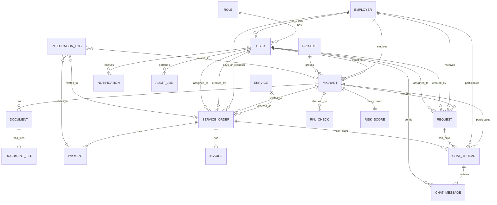

# ERD — MigrationOS

## 1. Назначение документа

Документ описывает логическую модель данных платформы MigrationOS.

ERD нужен, чтобы:

- зафиксировать ключевые бизнес-сущности системы;
- показать связи между мигрантами, работодателями, документами, заявками, платежами и РКЛ-проверками;
- определить основу для проектирования базы данных;
- согласовать модель данных между аналитиком, backend-разработчиком, QA и бизнесом;
- подготовить базу для data dictionary, SQL schema, API и тест-кейсов.

---

## 2. Область модели данных

Модель данных покрывает основные домены MigrationOS:

- пользователи и роли;
- мигранты;
- работодатели;
- проекты агентства;
- документы;
- запросы;
- маркетплейс услуг;
- заявки на услуги;
- платежи и счета;
- РКЛ-проверки;
- риск-статусы;
- уведомления;
- чаты;
- audit log;
- integration log.

---

## 3. Основные сущности

| Сущность | Назначение |
|---|---|
| `User` | Учетная запись пользователя системы |
| `Role` | Системная роль пользователя |
| `Migrant` | Карточка иностранного работника |
| `Employer` | Компания-работодатель |
| `Project` | Внутренняя группировка мигрантов в агентстве |
| `Document` | Документ мигранта |
| `DocumentFile` | Файл документа в защищенном хранилище |
| `Request` | Запрос мигранта, работодателя или агентства |
| `Service` | Услуга в маркетплейсе |
| `ServiceOrder` | Заявка на услугу |
| `Payment` | Платеж по заявке или услуге |
| `Invoice` | Счет на оплату |
| `RklCheck` | Результат РКЛ-проверки |
| `RiskScore` | Рассчитанный риск-статус мигранта |
| `Notification` | Уведомление пользователя |
| `ChatThread` | Диалог между участниками |
| `ChatMessage` | Сообщение в чате |
| `AuditLog` | Журнал действий пользователей |
| `IntegrationLog` | Журнал интеграционных событий |

---

## 4. Ключевые связи

| Связь | Кардинальность | Описание |
|---|---|---|
| `Role` → `User` | 1:N | Одна роль может быть назначена многим пользователям |
| `User` → `Migrant` | 1:0..1 | Пользователь может быть связан с карточкой мигранта |
| `Employer` → `User` | 1:N | Один работодатель может иметь несколько учетных записей представителей |
| `Employer` → `Migrant` | 1:N | Один работодатель может иметь много мигрантов |
| `Project` → `Migrant` | 1:N | Один проект может объединять много мигрантов |
| `Migrant` → `Document` | 1:N | У мигранта может быть много документов |
| `Document` → `DocumentFile` | 1:N | У документа может быть несколько файлов или версий |
| `Migrant` → `Request` | 1:N | Мигрант может создавать много запросов |
| `Employer` → `Request` | 1:N | Работодатель может быть адресатом запросов |
| `Service` → `ServiceOrder` | 1:N | Одна услуга может иметь много заявок |
| `Migrant` → `ServiceOrder` | 1:N | Заявки могут быть связаны с мигрантом |
| `Employer` → `ServiceOrder` | 1:N | Работодатель может создавать заявки по своим мигрантам |
| `ServiceOrder` → `Payment` | 1:0..N | У заявки может быть один или несколько платежей |
| `ServiceOrder` → `Invoice` | 1:0..N | По заявке могут формироваться счета |
| `Migrant` → `RklCheck` | 1:N | У мигранта может быть история РКЛ-проверок |
| `Migrant` → `RiskScore` | 1:1 | У мигранта есть текущий риск-статус |
| `User` → `Notification` | 1:N | Пользователь получает уведомления |
| `ChatThread` → `ChatMessage` | 1:N | В одном чате много сообщений |
| `User` → `AuditLog` | 1:N | Действия пользователя пишутся в audit log |
| `IntegrationLog` → бизнес-сущности | N:0..1 | Журнал интеграций может ссылаться на мигранта, заявку, платеж или другую сущность |

---

## 5. Описание сущностей

### 5.1. `User`

Учетная запись пользователя системы.

Используется для:

- авторизации;
- назначения роли;
- связи с мигрантом, работодателем или сотрудником агентства;
- проверки permissions;
- фиксации действий в audit log.

Ключевые поля:

| Поле | Описание |
|---|---|
| `id` | Уникальный идентификатор пользователя |
| `role_id` | Ссылка на роль |
| `email` | Email пользователя, если используется |
| `phone` | Телефон пользователя |
| `password_hash` | Хэш пароля для web-ролей |
| `status` | Статус пользователя |
| `created_at` | Дата создания |
| `updated_at` | Дата обновления |

### 5.2. `Role`

Системная роль пользователя.

Примеры ролей:

- `migrant`;
- `employer`;
- `manager`;
- `supervisor`;
- `superadmin`.

Ключевые поля:

| Поле | Описание |
|---|---|
| `id` | Уникальный идентификатор роли |
| `code` | Код роли |
| `name` | Название роли |
| `description` | Описание роли |

### 5.3. `Migrant`

Карточка иностранного работника.

Используется для хранения данных мигранта, связи с работодателем, проектом, документами, РКЛ-проверками, заявками и запросами.

Ключевые поля:

| Поле | Описание |
|---|---|
| `id` | Уникальный идентификатор мигранта |
| `user_id` | Связанный пользователь мобильного приложения |
| `employer_id` | Работодатель мигранта |
| `project_id` | Внутренний проект агентства |
| `full_name` | ФИО |
| `birth_date` | Дата рождения |
| `phone` | Телефон |
| `passport_number` | Номер паспорта |
| `status` | Статус карточки |
| `created_at` | Дата создания |
| `updated_at` | Дата обновления |

### 5.4. `Employer`

Компания-работодатель.

Используется для ограничения видимости данных, кабинета работодателя, запросов, заявок и платежей.

Ключевые поля:

| Поле | Описание |
|---|---|
| `id` | Уникальный идентификатор работодателя |
| `name` | Название организации |
| `inn` | ИНН |
| `verification_status` | Статус проверки работодателя |
| `contact_email` | Контактный email |
| `contact_phone` | Контактный телефон |
| `created_at` | Дата создания |

### 5.5. `Project`

Внутренняя группировка мигрантов в агентстве.

Project не является отдельной организацией или tenant. Он используется для фильтрации, аналитики и распределения ответственности внутри агентства.

Ключевые поля:

| Поле | Описание |
|---|---|
| `id` | Уникальный идентификатор проекта |
| `name` | Название проекта |
| `description` | Описание |
| `status` | Статус проекта |

### 5.6. `Document`

Документ мигранта.

Ключевые поля:

| Поле | Описание |
|---|---|
| `id` | Уникальный идентификатор документа |
| `migrant_id` | Владелец документа |
| `document_type` | Тип документа |
| `number` | Номер документа |
| `issue_date` | Дата выдачи |
| `expiration_date` | Дата окончания |
| `status` | Статус документа |
| `rejection_reason` | Причина отклонения |
| `created_at` | Дата создания |
| `updated_at` | Дата обновления |

### 5.7. `DocumentFile`

Файл документа.

Ключевые поля:

| Поле | Описание |
|---|---|
| `id` | Уникальный идентификатор файла |
| `document_id` | Ссылка на документ |
| `storage_key` | Ключ файла в S3 |
| `file_name` | Имя файла |
| `mime_type` | MIME-тип |
| `file_size` | Размер файла |
| `uploaded_by` | Кто загрузил файл |
| `created_at` | Дата загрузки |

### 5.8. `Request`

Запрос между мигрантом, работодателем и агентством.

Ключевые поля:

| Поле | Описание |
|---|---|
| `id` | Уникальный идентификатор запроса |
| `request_type` | Тип запроса |
| `migrant_id` | Связанный мигрант |
| `employer_id` | Связанный работодатель |
| `created_by` | Автор запроса |
| `assignee_id` | Ответственный |
| `status` | Статус |
| `comment` | Комментарий |
| `internal_comment` | Внутренний комментарий агентства |
| `created_at` | Дата создания |
| `updated_at` | Дата обновления |

### 5.9. `Service`

Услуга маркетплейса.

Ключевые поля:

| Поле | Описание |
|---|---|
| `id` | Уникальный идентификатор услуги |
| `name` | Название услуги |
| `description` | Описание |
| `price` | Цена |
| `is_paid` | Признак платной услуги |
| `is_active` | Активность услуги |
| `available_for_role` | Доступные роли |

### 5.10. `ServiceOrder`

Заявка на услугу.

Ключевые поля:

| Поле | Описание |
|---|---|
| `id` | Уникальный идентификатор заявки |
| `service_id` | Услуга |
| `migrant_id` | Связанный мигрант |
| `employer_id` | Работодатель |
| `created_by` | Автор заявки |
| `assignee_id` | Ответственный менеджер |
| `status` | Статус заявки |
| `total_amount` | Сумма |
| `created_at` | Дата создания |
| `updated_at` | Дата обновления |

### 5.11. `Payment`

Платеж.

Ключевые поля:

| Поле | Описание |
|---|---|
| `id` | Уникальный идентификатор платежа |
| `service_order_id` | Связанная заявка |
| `provider` | Платежный провайдер |
| `provider_payment_id` | Внешний ID платежа |
| `amount` | Сумма |
| `currency` | Валюта |
| `status` | Статус платежа |
| `created_at` | Дата создания |
| `paid_at` | Дата оплаты |

### 5.12. `Invoice`

Счет.

Ключевые поля:

| Поле | Описание |
|---|---|
| `id` | Уникальный идентификатор счета |
| `service_order_id` | Связанная заявка |
| `invoice_number` | Номер счета |
| `amount` | Сумма |
| `status` | Статус счета |
| `file_id` | Файл счета |
| `created_at` | Дата создания |

### 5.13. `RklCheck`

Результат РКЛ-проверки.

Ключевые поля:

| Поле | Описание |
|---|---|
| `id` | Уникальный идентификатор проверки |
| `migrant_id` | Связанный мигрант |
| `event_id` | ID входящего события |
| `external_check_id` | Внешний ID проверки |
| `source` | Источник проверки |
| `checked_at` | Дата проверки |
| `matched` | Найдено совпадение или нет |
| `raw_status` | Исходный статус от SHERPA RPA |
| `created_at` | Дата сохранения |

### 5.14. `RiskScore`

Текущий риск-статус мигранта.

Ключевые поля:

| Поле | Описание |
|---|---|
| `id` | Уникальный идентификатор |
| `migrant_id` | Связанный мигрант |
| `score` | Числовой риск |
| `level` | Уровень риска |
| `reason` | Причина или факторы риска |
| `calculated_at` | Дата расчета |

### 5.15. `Notification`

Уведомление пользователя.

Ключевые поля:

| Поле | Описание |
|---|---|
| `id` | Уникальный идентификатор уведомления |
| `user_id` | Получатель |
| `type` | Тип уведомления |
| `title` | Заголовок |
| `body` | Текст |
| `status` | Статус доставки или прочтения |
| `created_at` | Дата создания |

### 5.16. `ChatThread`

Диалог.

Ключевые поля:

| Поле | Описание |
|---|---|
| `id` | Уникальный идентификатор диалога |
| `migrant_id` | Связанный мигрант, если применимо |
| `employer_id` | Связанный работодатель, если применимо |
| `request_id` | Связанный запрос, если применимо |
| `service_order_id` | Связанная заявка, если применимо |
| `status` | Статус диалога |

### 5.17. `ChatMessage`

Сообщение в чате.

Ключевые поля:

| Поле | Описание |
|---|---|
| `id` | Уникальный идентификатор сообщения |
| `thread_id` | Диалог |
| `sender_id` | Отправитель |
| `message_text` | Текст сообщения |
| `created_at` | Дата отправки |

### 5.18. `AuditLog`

Журнал действий пользователей.

Ключевые поля:

| Поле | Описание |
|---|---|
| `id` | Уникальный идентификатор события |
| `actor_user_id` | Кто выполнил действие |
| `action` | Действие |
| `entity_type` | Тип сущности |
| `entity_id` | ID сущности |
| `created_at` | Дата события |

### 5.19. `IntegrationLog`

Журнал интеграционных событий.

Ключевые поля:

| Поле | Описание |
|---|---|
| `id` | Уникальный идентификатор события |
| `integration_name` | Название интеграции |
| `event_id` | ID внешнего события |
| `direction` | Направление события |
| `status` | Статус обработки |
| `entity_type` | Связанная сущность |
| `entity_id` | ID связанной сущности |
| `created_at` | Дата события |

---

## 6. Mermaid ER Diagram

---

## 7. Важные ограничения модели

| Ограничение | Описание |
|---|---|
| Employer не является tenant | Работодатель видит только своих мигрантов, но не владеет отдельным экземпляром системы |
| Project не является организацией | Project используется как внутренняя группировка в агентстве |
| Migrant может быть без employer | На некоторых этапах мигрант может быть связан только с агентством |
| RKL результат неизменяем | Результат внешней проверки должен храниться как факт интеграции |
| RiskScore пересчитываемый | Риск может пересчитываться на основе документов, РКЛ и истории нарушений |
| DocumentFile отделен от Document | Это позволяет хранить версии и метаданные файлов |
| AuditLog не должен редактироваться | Журнал действий должен быть append-only |
| IntegrationLog хранит трассировку | Используется для расследования ошибок интеграций и webhook |

---

## 8. Связь модели с доступом

Модель данных должна поддерживать контекстные правила доступа:

| Контекст | Как поддерживается моделью |
|---|---|
| `own` | Через связь `User` → `Migrant` |
| `org` | Через связи `Employer` → `Migrant`, `Employer` → `Request`, `Employer` → `ServiceOrder` |
| `assigned` | Через поля `assignee_id`, `manager_id` или проектную привязку |
| `agency` | Через глобальную видимость внутренних ролей агентства |
| `technical` | Через административные permissions и audit log |

---

## 9. Связь с процессами

| Процесс | Используемые сущности |
|---|---|
| Регистрация мигранта | `User`, `Migrant`, `Role`, `AuditLog` |
| Загрузка документа | `Migrant`, `Document`, `DocumentFile`, `Notification`, `AuditLog` |
| РКЛ-проверка | `Migrant`, `RklCheck`, `RiskScore`, `IntegrationLog`, `AuditLog` |
| Заказ услуги | `Service`, `ServiceOrder`, `Payment`, `Invoice`, `Document`, `Notification` |
| Запрос мигранта к работодателю | `Request`, `Migrant`, `Employer`, `User`, `Notification`, `AuditLog` |

---

## 10. Открытые вопросы

| ID | Вопрос | Кому адресован |
|---|---|---|
| OQ-ERD-001 | Нужно ли хранить несколько работодателей в истории мигранта? | Бизнес / аналитик |
| OQ-ERD-002 | Нужно ли выделять отдельную сущность `DocumentStatusHistory`? | Backend / аналитик |
| OQ-ERD-003 | Нужно ли выделять отдельную сущность `ServiceOrderStatusHistory`? | Backend / аналитик |
| OQ-ERD-004 | Нужна ли отдельная таблица `Permission` и связка `RolePermission`? | Backend / security |
| OQ-ERD-005 | Нужно ли хранить raw payload webhook в `IntegrationLog`? | Security / backend |
| OQ-ERD-006 | Как хранить внутренние и внешние комментарии в чатах и запросах? | Аналитик / backend |
| OQ-ERD-007 | Нужно ли выделять `Organization` выше `Employer`? | Архитектор / бизнес |

---

## 11. Связанные артефакты

- [Role Model](../02_roles-and-access/role-model.md)
- [Access Matrix](../02_roles-and-access/access-matrix.md)
- [Permissions](../02_roles-and-access/permissions.md)
- [Functional Requirements](../01_requirements/functional-requirements.md)
- [BPMN Document Upload](../03_processes/bpmn_document-upload.md)
- [BPMN RKL Check](../03_processes/bpmn_rkl-check.md)
- [BPMN Service Order](../03_processes/bpmn_service-order.md)
- [BPMN Employer Request](../03_processes/bpmn_employer-request.md)
