# Status Models — MigrationOS

## 1. Назначение документа

Документ описывает статусные модели ключевых сущностей платформы MigrationOS.

Status Models нужны, чтобы:

- зафиксировать жизненный цикл бизнес-сущностей;
- определить допустимые и запрещенные статусные переходы;
- согласовать правила смены статусов между аналитиком, backend, frontend и QA;
- подготовить основу для API, тест-кейсов и acceptance criteria;
- снизить риск некорректных состояний в системе.

Документ является продолжением:

- [ERD](./erd.md)
- [Entities](./entities.md)
- [Data Dictionary](./data-dictionary.md)

---

## 2. Сущности со статусными моделями

| Сущность | Назначение статусов |
|---|---|
| `User` | Управление доступом пользователя |
| `Employer` | Проверка и доступ работодателя |
| `Migrant` | Жизненный цикл карточки мигранта |
| `Document` | Проверка, подтверждение и истечение документов |
| `Request` | Обработка запросов между мигрантом, работодателем и агентством |
| `ServiceOrder` | Обработка заявок на услуги |
| `Payment` | Подтверждение оплаты |
| `Invoice` | Жизненный цикл счета |
| `Notification` | Доставка и прочтение уведомлений |
| `ChatThread` | Состояние диалога |
| `IntegrationLog` | Обработка интеграционных событий |
| `RiskScore` | Уровень риска мигранта |

---

## 3. Общие правила статусных моделей

| ID | Правило |
|---|---|
| SM-GEN-001 | Статус должен меняться только через backend |
| SM-GEN-002 | Frontend не должен самостоятельно определять финальный статус сущности |
| SM-GEN-003 | Недопустимый статусный переход должен возвращать ошибку `409 Conflict` |
| SM-GEN-004 | Критичные смены статусов должны попадать в audit log |
| SM-GEN-005 | Статусные переходы должны быть покрыты тест-кейсами |
| SM-GEN-006 | Статус нельзя менять, если пользователь не имеет нужного permission |
| SM-GEN-007 | Если смена статуса зависит от webhook, источником истины является webhook, а не redirect пользователя |

---

## 4. `User` status model

### 4.1. Статусы

| Статус | Значение |
|---|---|
| `pending` | Пользователь создан, но еще не активирован |
| `active` | Пользователь активен |
| `blocked` | Пользователь заблокирован |
| `archived` | Пользователь архивирован |

### 4.2. Допустимые переходы

| Из статуса | В статус | Кто выполняет | Условие |
|---|---|---|---|
| `pending` | `active` | Система / superadmin | Пользователь активирован |
| `active` | `blocked` | Superadmin | Нарушение, безопасность или бизнес-решение |
| `blocked` | `active` | Superadmin | Разблокировка |
| `active` | `archived` | Superadmin | Пользователь больше не используется |
| `blocked` | `archived` | Superadmin | Пользователь архивируется |

### 4.3. Запрещенные переходы

| Переход | Причина |
|---|---|
| `archived` → `active` | Архивный пользователь не должен восстанавливаться без отдельного процесса |
| `blocked` → `pending` | `pending` используется только до первой активации |

### 4.4. Mermaid

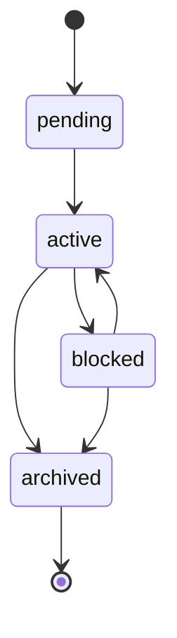

---

## 5. `Employer` verification status model

### 5.1. Статусы

| Статус | Значение |
|---|---|
| `pending_verification` | Работодатель ожидает проверки |
| `verified` | Работодатель подтвержден |
| `rejected` | Проверка работодателя отклонена |
| `blocked` | Работодатель заблокирован |

### 5.2. Допустимые переходы

| Из статуса | В статус | Кто выполняет | Условие |
|---|---|---|---|
| `pending_verification` | `verified` | Manager / Supervisor | Проверка работодателя успешна |
| `pending_verification` | `rejected` | Manager / Supervisor | Данные работодателя не подтверждены |
| `verified` | `blocked` | Supervisor / Superadmin | Нарушение или риск |
| `blocked` | `verified` | Supervisor / Superadmin | Работодатель разблокирован |
| `rejected` | `pending_verification` | Работодатель / Manager | Работодатель повторно отправил данные |

### 5.3. Бизнес-правила

| ID | Правило |
|---|---|
| SM-EMP-001 | Непроверенный работодатель не получает полный доступ |
| SM-EMP-002 | Заблокированный работодатель не должен видеть новые данные мигрантов |
| SM-EMP-003 | Изменение verification status должно логироваться |

### 5.4. Mermaid

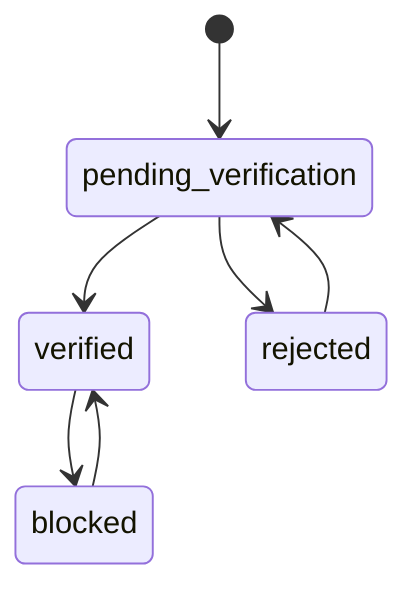

---

## 6. `Migrant` status model

### 6.1. Статусы

| Статус | Значение |
|---|---|
| `pending` | Карточка создана, данные неполные |
| `active` | Карточка активна |
| `blocked` | Доступ мигранта ограничен |
| `archived` | Карточка архивирована |

### 6.2. Допустимые переходы

| Из статуса | В статус | Кто выполняет | Условие |
|---|---|---|---|
| `pending` | `active` | Manager / System | Данные мигранта заполнены |
| `active` | `blocked` | Manager / Supervisor | Нарушение, риск или бизнес-ограничение |
| `blocked` | `active` | Manager / Supervisor | Ограничение снято |
| `active` | `archived` | Manager / Supervisor | Мигрант больше не обслуживается |
| `blocked` | `archived` | Manager / Supervisor | Карточка закрыта |

### 6.3. Бизнес-правила

| ID | Правило |
|---|---|
| SM-MIG-001 | Архивный мигрант не должен иметь активный доступ в мобильное приложение |
| SM-MIG-002 | Работодатель видит только активных или разрешенных к просмотру мигрантов своей организации |
| SM-MIG-003 | Блокировка карточки должна попадать в audit log |

### 6.4. Mermaid

---

## 7. `Document` status model

### 7.1. Статусы

| Статус | Значение |
|---|---|
| `draft` | Документ создан, но файл еще не загружен |
| `under_review` | Документ загружен и ожидает проверки |
| `approved` | Документ подтвержден |
| `rejected` | Документ отклонен |
| `expires_soon` | Документ скоро истекает |
| `expired` | Документ просрочен |
| `archived` | Документ архивирован |

### 7.2. Допустимые переходы

| Из статуса | В статус | Кто выполняет | Условие |
|---|---|---|---|
| `draft` | `under_review` | Migrant / Manager | Файл загружен |
| `under_review` | `approved` | Manager / Supervisor | Документ проверен |
| `under_review` | `rejected` | Manager / Supervisor | Документ некорректен, указана причина |
| `rejected` | `under_review` | Migrant / Manager | Загружена новая версия |
| `approved` | `expires_soon` | System | До окончания срока осталось заданное количество дней |
| `expires_soon` | `expired` | System | Срок действия истек |
| `approved` | `expired` | System | Срок действия истек без промежуточного статуса |
| `approved` | `archived` | Manager / Supervisor | Документ больше не актуален |
| `rejected` | `archived` | Manager / Supervisor | Документ закрыт |

### 7.3. Запрещенные переходы

| Переход | Причина |
|---|---|
| `draft` → `approved` | Нельзя подтвердить документ без проверки |
| `rejected` → `approved` | Нужна повторная загрузка или повторная проверка |
| `expired` → `approved` | Просроченный документ нельзя подтвердить без обновления |
| `archived` → любой активный статус | Архивный документ не возвращается в работу без отдельного процесса |

### 7.4. Бизнес-правила

| ID | Правило |
|---|---|
| SM-DOC-001 | При `rejected` обязательна причина отклонения |
| SM-DOC-002 | Просроченный документ влияет на risk score |
| SM-DOC-003 | Проверка документа доступна только внутренним ролям |
| SM-DOC-004 | Загрузка новой версии документа должна возвращать статус в `under_review` |

### 7.5. Mermaid

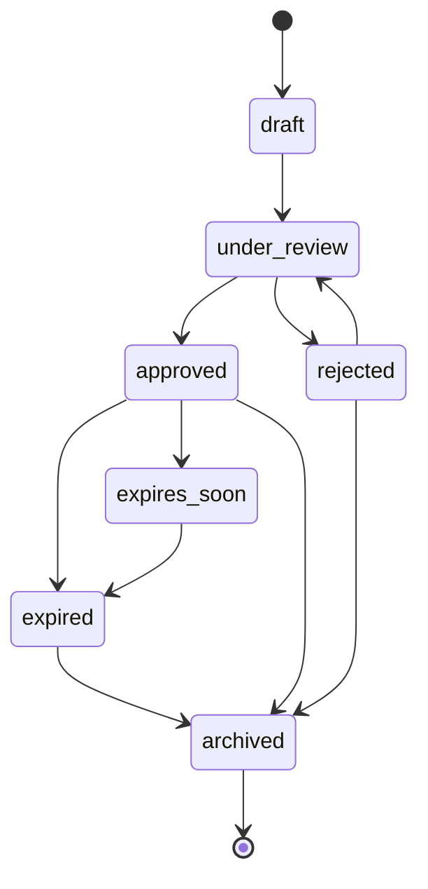

---

## 8. `Request` status model

### 8.1. Статусы

| Статус | Значение |
|---|---|
| `created` | Запрос создан |
| `in_progress` | Запрос в работе |
| `need_info` | Требуется дополнительная информация |
| `completed` | Запрос выполнен |
| `rejected` | Запрос отклонен |
| `cancelled` | Запрос отменен |

### 8.2. Допустимые переходы

| Из статуса | В статус | Кто выполняет | Условие |
|---|---|---|---|
| `created` | `in_progress` | Employer / Manager | Запрос взят в работу |
| `created` | `cancelled` | Migrant / Employer / Manager | Запрос отменен с причиной |
| `created` | `rejected` | Employer / Manager | Запрос отклонен с причиной |
| `in_progress` | `need_info` | Employer / Manager | Нужны уточнения |
| `need_info` | `in_progress` | Migrant / Employer / Manager | Уточнения предоставлены |
| `in_progress` | `completed` | Employer / Manager | Запрос выполнен |
| `in_progress` | `rejected` | Employer / Manager | Запрос не может быть выполнен |
| `need_info` | `cancelled` | Migrant / Employer / Manager | Запрос отменен |
| `need_info` | `rejected` | Employer / Manager | Запрос отклонен |

### 8.3. Запрещенные переходы

| Переход | Причина |
|---|---|
| `completed` → `in_progress` | Завершенный запрос нельзя вернуть без отдельного reopen-процесса |
| `rejected` → `completed` | Отклоненный запрос должен быть создан заново или переоткрыт отдельным правилом |
| `cancelled` → `in_progress` | Отмененный запрос не возвращается в работу |

### 8.4. Бизнес-правила

| ID | Правило |
|---|---|
| SM-REQ-001 | Работодатель видит только запросы своей организации |
| SM-REQ-002 | Отклонение и отмена требуют причины |
| SM-REQ-003 | Внешние роли не должны видеть внутренние комментарии агентства |
| SM-REQ-004 | Статусные изменения должны попадать в audit log |

### 8.5. Mermaid

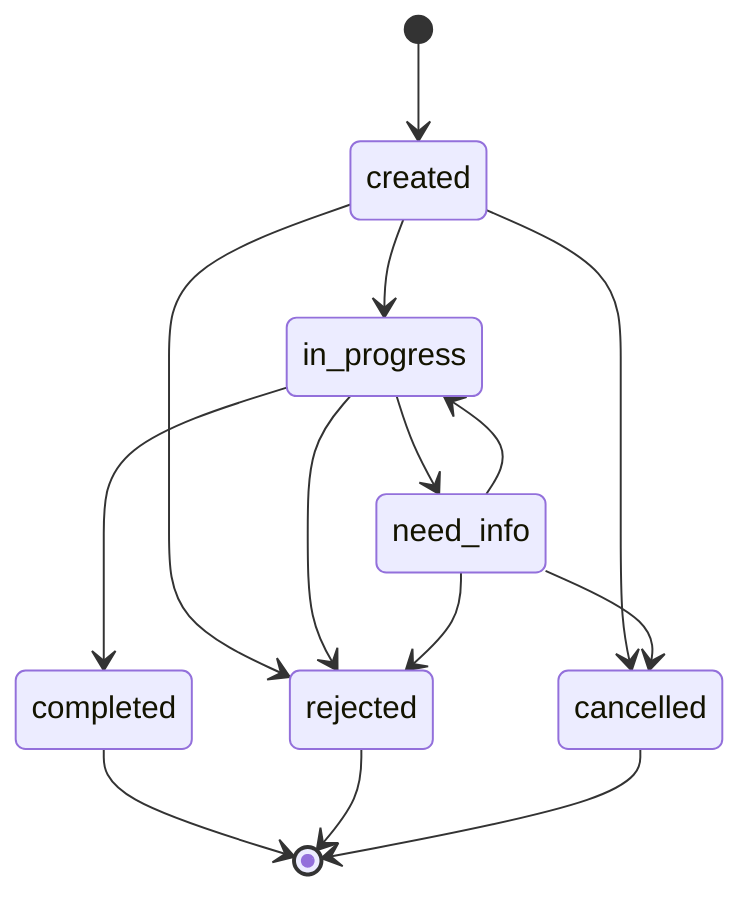

---

## 9. `ServiceOrder` status model

### 9.1. Статусы

| Статус | Значение |
|---|---|
| `draft` | Черновик заявки |
| `created` | Заявка создана |
| `waiting_payment` | Ожидается оплата |
| `paid` | Оплата подтверждена |
| `in_progress` | Заявка в работе |
| `need_info` | Требуется дополнительная информация |
| `completed` | Услуга выполнена |
| `rejected` | Заявка отклонена |
| `cancelled` | Заявка отменена |

### 9.2. Допустимые переходы

| Из статуса | В статус | Кто выполняет | Условие |
|---|---|---|---|
| `draft` | `created` | Migrant / Employer / Manager | Заявка заполнена |
| `created` | `waiting_payment` | System | Услуга платная |
| `created` | `in_progress` | Manager | Бесплатная или постоплатная услуга взята в работу |
| `waiting_payment` | `paid` | Payment Service | Получен успешный payment webhook |
| `paid` | `in_progress` | Manager / System | Оплаченная заявка передана в работу |
| `in_progress` | `need_info` | Manager | Нужны уточнения |
| `need_info` | `in_progress` | Migrant / Employer / Manager | Информация предоставлена |
| `in_progress` | `completed` | Manager | Услуга выполнена |
| `created` | `cancelled` | User / Manager | Заявка отменена |
| `waiting_payment` | `cancelled` | User / System / Manager | Оплата не выполнена или заявка отменена |
| `in_progress` | `rejected` | Manager | Услуга не может быть выполнена |

### 9.3. Запрещенные переходы

| Переход | Причина |
|---|---|
| `waiting_payment` → `in_progress` | Платная заявка не идет в работу без подтверждения оплаты |
| `completed` → `in_progress` | Завершенная заявка не возвращается в работу без отдельного процесса |
| `cancelled` → `paid` | Отмененная заявка не должна быть оплачена |
| `rejected` → `completed` | Отклоненная заявка не может стать выполненной |

### 9.4. Бизнес-правила

| ID | Правило |
|---|---|
| SM-SO-001 | Payment webhook является источником подтверждения оплаты |
| SM-SO-002 | Frontend redirect не переводит заявку в `paid` |
| SM-SO-003 | Все значимые смены статусов пишутся в audit log |
| SM-SO-004 | Недопустимый переход возвращает `409 Conflict` |

### 9.5. Mermaid

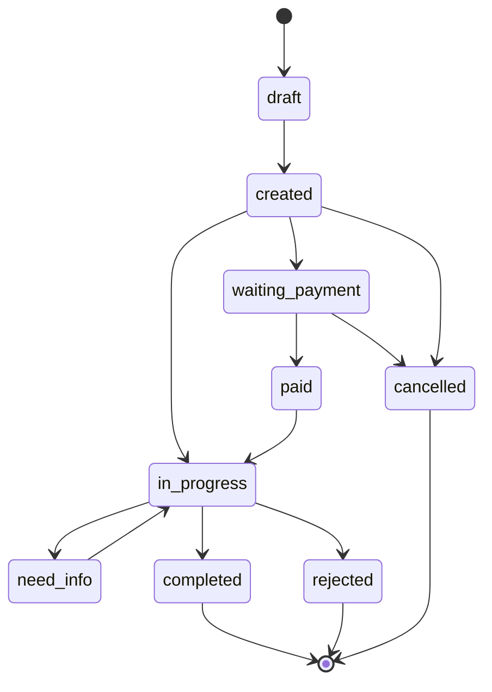

---

## 10. `Payment` status model

### 10.1. Статусы

| Статус | Значение |
|---|---|
| `pending` | Платеж создан и ожидает подтверждения |
| `paid` | Платеж успешно оплачен |
| `failed` | Ошибка оплаты |
| `cancelled` | Платеж отменен |
| `refunded` | Выполнен возврат |

### 10.2. Допустимые переходы

| Из статуса | В статус | Кто выполняет | Условие |
|---|---|---|---|
| `pending` | `paid` | Payment Service | Получен успешный webhook |
| `pending` | `failed` | Payment Service | Получен webhook ошибки |
| `pending` | `cancelled` | User / System / Payment Service | Платеж отменен или истек |
| `paid` | `refunded` | Finance / Payment Service | Возврат выполнен, если возвраты поддерживаются |

### 10.3. Запрещенные переходы

| Переход | Причина |
|---|---|
| `paid` → `pending` | Оплата не должна откатываться вручную |
| `failed` → `paid` | Нужен новый платеж или отдельная логика повторной оплаты |
| `cancelled` → `paid` | Отмененный платеж не должен стать оплаченным |
| `refunded` → `paid` | Возврат не откатывается без отдельного процесса |

### 10.4. Бизнес-правила

| ID | Правило |
|---|---|
| SM-PAY-001 | Подтверждение оплаты приходит только через webhook |
| SM-PAY-002 | Повторный webhook должен обрабатываться идемпотентно |
| SM-PAY-003 | Смена платежного статуса должна логироваться |
| SM-PAY-004 | При `paid` должно быть заполнено `paid_at` |

### 10.5. Mermaid

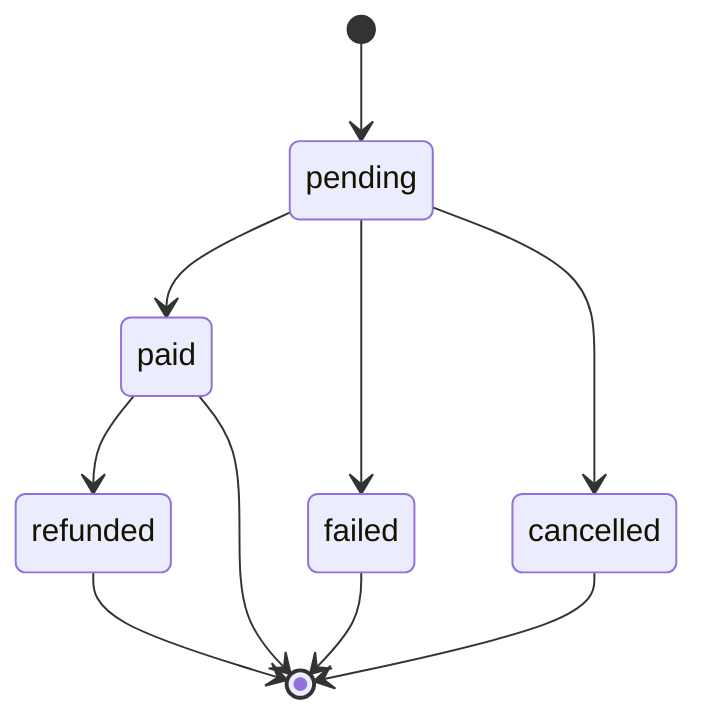

---

## 11. `Invoice` status model

### 11.1. Статусы

| Статус | Значение |
|---|---|
| `created` | Счет создан |
| `paid` | Счет оплачен |
| `cancelled` | Счет отменен |
| `expired` | Срок оплаты счета истек |

### 11.2. Допустимые переходы

| Из статуса | В статус | Кто выполняет | Условие |
|---|---|---|---|
| `created` | `paid` | Payment Service / Finance | Оплата подтверждена |
| `created` | `cancelled` | Manager / Finance | Счет отменен |
| `created` | `expired` | System | Срок оплаты истек |

### 11.3. Mermaid

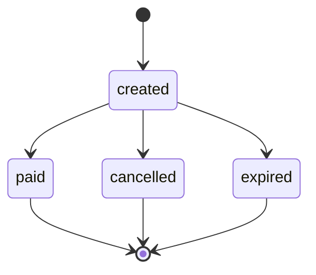

---

## 12. `Notification` status model

### 12.1. Статусы

| Статус | Значение |
|---|---|
| `created` | Уведомление создано |
| `sent` | Уведомление отправлено |
| `delivered` | Уведомление доставлено |
| `read` | Уведомление прочитано |
| `failed` | Ошибка отправки |

### 12.2. Допустимые переходы

| Из статуса | В статус | Кто выполняет | Условие |
|---|---|---|---|
| `created` | `sent` | Notification Service | Отправка инициирована |
| `sent` | `delivered` | Notification Provider | Получено подтверждение доставки |
| `sent` | `failed` | Notification Provider | Ошибка отправки |
| `delivered` | `read` | User / App | Пользователь прочитал уведомление |
| `failed` | `sent` | Notification Service | Повторная отправка |

### 12.3. Mermaid

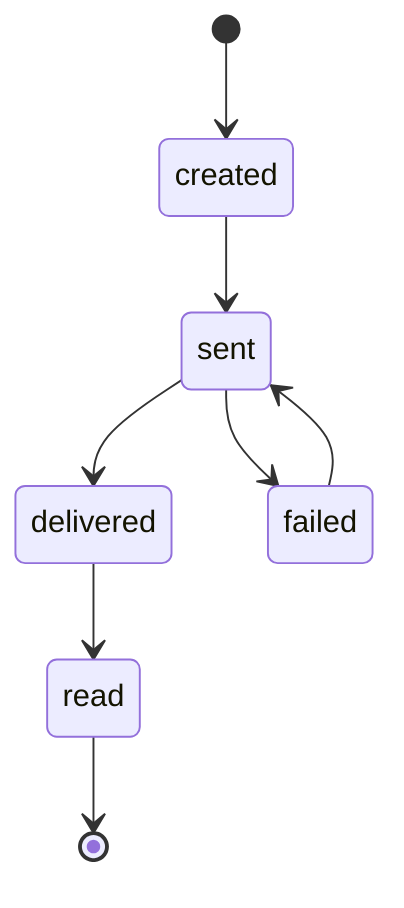

---

## 13. `ChatThread` status model

### 13.1. Статусы

| Статус | Значение |
|---|---|
| `active` | Диалог активен |
| `closed` | Диалог закрыт |
| `archived` | Диалог архивирован |

### 13.2. Допустимые переходы

| Из статуса | В статус | Кто выполняет | Условие |
|---|---|---|---|
| `active` | `closed` | Manager / System | Диалог завершен |
| `closed` | `active` | Manager | Диалог переоткрыт |
| `closed` | `archived` | System / Manager | Диалог архивирован |

### 13.3. Mermaid

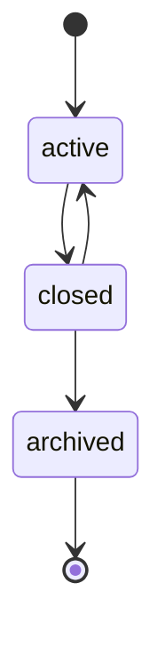

---

## 14. `IntegrationLog` status model

### 14.1. Статусы

| Статус | Значение |
|---|---|
| `received` | Событие получено |
| `processed` | Событие обработано |
| `validation_error` | Ошибка валидации |
| `duplicate` | Повторное событие |
| `unmatched` | Событие не сопоставлено |
| `failed` | Ошибка обработки |

### 14.2. Допустимые переходы

| Из статуса | В статус | Кто выполняет | Условие |
|---|---|---|---|
| `received` | `processed` | Integration / Backend Service | Событие успешно обработано |
| `received` | `validation_error` | Integration / Backend Service | Payload некорректен |
| `received` | `duplicate` | Integration / Backend Service | Событие уже обработано |
| `received` | `unmatched` | Integration / Backend Service | Не найдена связанная бизнес-сущность |
| `received` | `failed` | Integration / Backend Service | Ошибка обработки |
| `failed` | `processed` | Backend / Support | Повторная обработка успешна |
| `unmatched` | `processed` | Backend / Support | Событие сопоставлено вручную или повторной обработкой |

### 14.3. Бизнес-правила

| ID | Правило |
|---|---|
| SM-INT-001 | Все webhook-события должны попадать в `IntegrationLog` |
| SM-INT-002 | `duplicate`-события не должны повторно менять бизнес-сущности |
| SM-INT-003 | `failed` и `unmatched` события должны быть доступны для разбора внутренним ролям |
| SM-INT-004 | Повторная обработка должна логироваться |

### 14.4. Mermaid

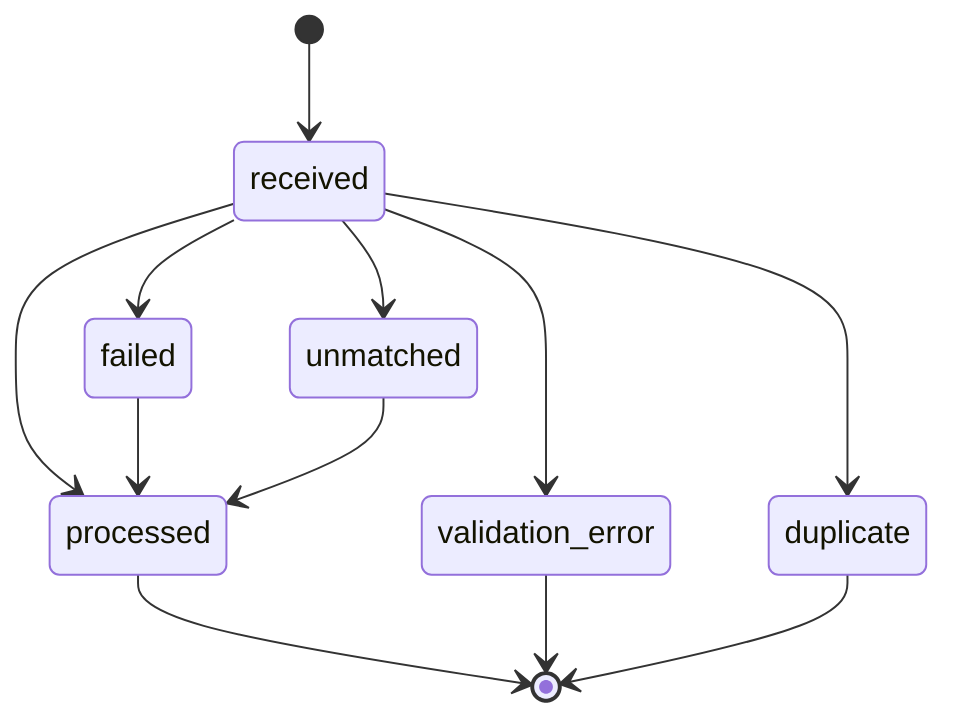

---

## 15. `RiskScore` level model

### 15.1. Уровни риска

| Уровень | Значение |
|---|---|
| `normal` | Нормальный риск |
| `attention` | Требуется внимание менеджера |
| `critical` | Критичный риск, требуется реакция |

### 15.2. Правила определения уровня

| Условие | Уровень |
|---|---|
| `score < 60` | `normal` |
| `60 <= score < 85` | `attention` |
| `score >= 85` | `critical` |
| `RklCheck.matched = true` | `critical` |

### 15.3. Факторы риска

| Фактор | Вес |
|---|---|
| Срок окончания патента | 35% |
| Срок окончания регистрации | 25% |
| РКЛ-статус | 30% |
| История нарушений | 10% |

### 15.4. Бизнес-правила

| ID | Правило |
|---|---|
| SM-RISK-001 | `RiskScore` пересчитывается при изменении документов, РКЛ или истории нарушений |
| SM-RISK-002 | Если мигрант найден в РКЛ, уровень риска должен стать `critical` |
| SM-RISK-003 | При `attention` создается уведомление менеджеру |
| SM-RISK-004 | При `critical` создается алерт supervisor |
| SM-RISK-005 | Ручная корректировка риска, если разрешена, должна логироваться |

### 15.5. Mermaid

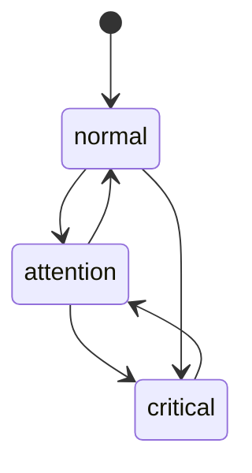

---

## 16. Связь статусных моделей с процессами

| Процесс | Статусные модели |
|---|---|
| Регистрация мигранта | `User`, `Migrant` |
| Загрузка документа | `Document`, `Notification`, `RiskScore` |
| РКЛ-проверка | `RklCheck`, `RiskScore`, `IntegrationLog` |
| Заказ услуги | `ServiceOrder`, `Payment`, `Invoice`, `Notification` |
| Запрос мигранта к работодателю | `Request`, `Notification`, `ChatThread` |

---

## 17. Проверки для QA

| ID | Проверка |
|---|---|
| QA-SM-001 | Проверить все допустимые переходы для каждой сущности |
| QA-SM-002 | Проверить, что запрещенные переходы возвращают `409 Conflict` |
| QA-SM-003 | Проверить, что смена статуса требует нужного permission |
| QA-SM-004 | Проверить, что критичные смены статусов попадают в audit log |
| QA-SM-005 | Проверить идемпотентность webhook-событий |
| QA-SM-006 | Проверить, что frontend redirect не меняет платежный статус |
| QA-SM-007 | Проверить, что внешние роли не видят внутренние статусы и комментарии |

---

## 18. Связанные артефакты

- [ERD](./erd.md)
- [Entities](./entities.md)
- [Data Dictionary](./data-dictionary.md)
- [Functional Requirements](../01_requirements/functional-requirements.md)
- [Acceptance Criteria](../01_requirements/acceptance-criteria.md)
- [Permissions](../02_roles-and-access/permissions.md)
- [BPMN Document Upload](../03_processes/bpmn_document-upload.md)
- [BPMN RKL Check](../03_processes/bpmn_rkl-check.md)
- [BPMN Service Order](../03_processes/bpmn_service-order.md)
- [BPMN Employer Request](../03_processes/bpmn_employer-request.md)
