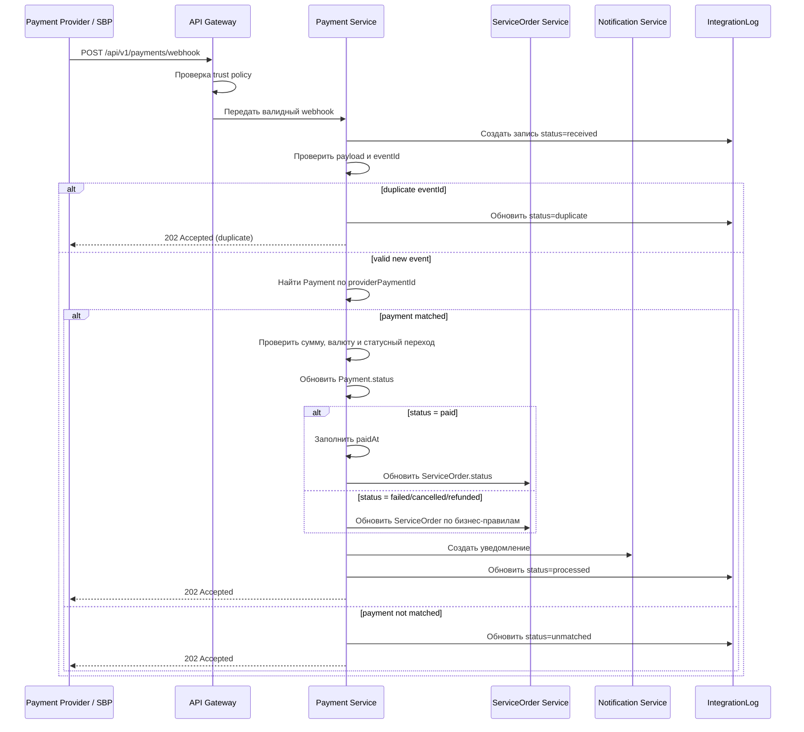

# Payment Webhook API — MigrationOS

## 1. Назначение документа

Документ описывает webhook-интерфейс, через который MigrationOS принимает подтверждение оплаты от платежного провайдера или СБП.

Payment webhook нужен, чтобы:

- получать финальный статус платежа от внешнего платежного провайдера;
- обновлять сущность `Payment`;
- переводить связанную заявку `ServiceOrder` в нужный статус;
- фиксировать событие в `IntegrationLog`;
- обеспечивать идемпотентную обработку повторных webhook-событий;
- исключить ситуацию, когда frontend redirect ошибочно считается подтверждением оплаты.

---

## 2. Контекст интеграции

Платежный провайдер или СБП является внешней системой, которая подтверждает факт оплаты.

MigrationOS:

- создает платежную запись;
- передает пользователю ссылку или платежный сценарий;
- принимает webhook от провайдера;
- валидирует payload и доверие к источнику;
- обновляет `Payment.status`;
- обновляет `ServiceOrder.status`;
- пишет событие в `IntegrationLog`;
- создает уведомления для пользователя или менеджера.

Важно:

> Frontend redirect после оплаты не является подтверждением оплаты.  
> Источником истины является только payment webhook.

Граница ответственности:

| Сторона | Ответственность |
|---|---|
| Платежный провайдер / СБП | Подтвердить или отклонить оплату и отправить webhook |
| MigrationOS | Проверить trust policy, валидировать payload, обновить бизнес-сущности и журналы |

---

## 3. Endpoint

```http
POST /api/v1/payments/webhook
```

### 3.1. Назначение endpoint

Endpoint принимает событие от платежного провайдера и инициирует обработку платежного статуса внутри MigrationOS.

### 3.2. Content-Type

```http
Content-Type: application/json
```

### 3.3. Auth / Trust policy

Для webhook не используется обычная пользовательская авторизация через `Bearer token`.

Доверие к источнику обеспечивается интеграционной политикой:

| Механизм | Назначение |
|---|---|
| Signature | Проверка целостности и подлинности payload |
| API key | Проверка доверенного клиента |
| IP whitelist | Ограничение источников запросов |
| HTTPS | Защита канала передачи |
| `eventId` | Идемпотентность события |
| `providerPaymentId` | Сопоставление с платежом |

Пример заголовков:

```http
X-Integration-Name: SBP
X-Api-Key: <integration_api_key>
X-Signature: sha256=<signature>
Content-Type: application/json
```

### 3.4. Принцип доверия

Webhook считается доверенным только при выполнении интеграционной политики. Если trust policy не пройдена, событие не должно менять `Payment`, `ServiceOrder` и другие бизнес-сущности.

---

## 4. Request payload

### 4.1. Успешная оплата

```json
{
  "eventId": "pay_evt_2026_000001",
  "provider": "sbp",
  "providerPaymentId": "sbp_pay_987654",
  "serviceOrderId": "7d5b18f5-6a72-41ce-9b6d-bad1a0b00001",
  "status": "paid",
  "amount": 3500.00,
  "currency": "RUB",
  "processedAt": "2026-05-12T09:15:00Z"
}
```

### 4.2. Ошибка оплаты

```json
{
  "eventId": "pay_evt_2026_000002",
  "provider": "sbp",
  "providerPaymentId": "sbp_pay_987655",
  "serviceOrderId": "7d5b18f5-6a72-41ce-9b6d-bad1a0b00002",
  "status": "failed",
  "amount": 3500.00,
  "currency": "RUB",
  "processedAt": "2026-05-12T09:20:00Z",
  "failureReason": "Payment declined"
}
```

---

## 5. Описание полей

| Поле | Тип | Обязательное | Описание |
|---|---|---:|---|
| `eventId` | string | Да | Уникальный ID webhook-события |
| `provider` | string | Да | Платежный провайдер, например `sbp` |
| `providerPaymentId` | string | Да | ID платежа на стороне провайдера |
| `serviceOrderId` | UUID | Нет | ID заявки на услугу, если передается провайдером |
| `status` | enum | Да | Новый статус платежа |
| `amount` | decimal | Да | Сумма платежа |
| `currency` | string | Да | Валюта платежа |
| `processedAt` | datetime | Да | Дата обработки события на стороне провайдера |
| `failureReason` | string | Нет | Причина ошибки оплаты |

---

## 6. Допустимые статусы платежа

| Статус | Значение |
|---|---|
| `pending` | Платеж ожидает подтверждения |
| `paid` | Платеж успешно подтвержден |
| `failed` | Платеж завершился ошибкой |
| `cancelled` | Платеж отменен |
| `refunded` | Выполнен возврат |

---

## 7. Валидация payload

| ID | Проверка | Ошибка |
|---|---|---|
| `PAY-VAL-001` | `eventId` заполнен | `VALIDATION_ERROR` |
| `PAY-VAL-002` | `provider` заполнен | `VALIDATION_ERROR` |
| `PAY-VAL-003` | `providerPaymentId` заполнен | `VALIDATION_ERROR` |
| `PAY-VAL-004` | `status` входит в допустимый enum | `VALIDATION_ERROR` |
| `PAY-VAL-005` | `amount > 0` | `VALIDATION_ERROR` |
| `PAY-VAL-006` | `currency = RUB` для MVP | `VALIDATION_ERROR` |
| `PAY-VAL-007` | `processedAt` является валидной датой | `VALIDATION_ERROR` |
| `PAY-VAL-008` | Подпись, API key или другой trust-механизм валидны | `UNAUTHORIZED_INTEGRATION` |
| `PAY-VAL-009` | Платеж найден по `providerPaymentId` или `serviceOrderId` | `PAYMENT_NOT_FOUND` |
| `PAY-VAL-010` | Сумма webhook совпадает с ожидаемой суммой платежа | `AMOUNT_MISMATCH` |

### 7.1. Порядок валидации

1. Проверить формат HTTP-запроса и JSON.
2. Проверить trust policy.
3. Проверить обязательные поля.
4. Проверить `eventId` на дубликат.
5. Найти `Payment` по `providerPaymentId`.
6. Проверить сумму и валюту.
7. Проверить допустимость статусного перехода.
8. Обновить `Payment` и связанные сущности.

---

## 8. Идемпотентность

Webhook может быть отправлен повторно, поэтому обработка должна быть идемпотентной.

Ключ идемпотентности:

```text
eventId
```

Дополнительный ключ сопоставления платежа:

```text
providerPaymentId
```

Правила:

| ID | Правило |
|---|---|
| `PAY-IDEMP-001` | Повторный `eventId` не должен повторно менять `Payment` |
| `PAY-IDEMP-002` | Повторное событие фиксируется в `IntegrationLog` со статусом `duplicate` |
| `PAY-IDEMP-003` | Повторное событие должно возвращать безопасный успешный ответ, если оригинал уже обработан |
| `PAY-IDEMP-004` | Повторный webhook не должен повторно создавать уведомления |
| `PAY-IDEMP-005` | Один `providerPaymentId` не должен создавать несколько разных успешных платежей |

---

## 9. Логика обработки

### 9.1. Основной flow

1. MigrationOS получает payment webhook.
2. Проверяет trust policy.
3. Валидирует payload.
4. Проверяет `eventId` на дубликат.
5. Создает запись в `IntegrationLog` со статусом `received`.
6. Находит `Payment` по `providerPaymentId`.
7. Проверяет сумму и валюту.
8. Проверяет допустимость перехода `Payment.status`.
9. Обновляет `Payment.status`.
10. Если `status = paid`, заполняет `Payment.paidAt`.
11. Обновляет связанный `ServiceOrder.status`.
12. Создает уведомление пользователю или менеджеру.
13. Обновляет `IntegrationLog.status`.
14. Возвращает ответ провайдеру.

### 9.2. Статусы обработки IntegrationLog

| Ситуация | Результат |
|---|---|
| Событие корректно обработано | `IntegrationLog.status = processed` |
| Событие дублируется | `IntegrationLog.status = duplicate` |
| Платеж не сопоставлен | `IntegrationLog.status = unmatched` |
| Payload невалиден | `IntegrationLog.status = validation_error` |
| Внутренняя ошибка обработки | `IntegrationLog.status = failed` |

---

## 10. Влияние на Payment и ServiceOrder

| Payment webhook status | Payment.status | ServiceOrder.status | Комментарий |
|---|---|---|---|
| `paid` | `paid` | `paid` | Оплата подтверждена, заявка может перейти в работу |
| `failed` | `failed` | `waiting_payment` | Заявка остается в ожидании оплаты или требует новой оплаты |
| `cancelled` | `cancelled` | `cancelled` или `waiting_payment` | Зависит от бизнес-правил отмены |
| `refunded` | `refunded` | `cancelled` или отдельный refund-flow | Для MVP может быть ограничено |
| `pending` | `pending` | `waiting_payment` | Промежуточный статус |

### 10.1. Бизнес-правила статусов

| ID | Правило |
|---|---|
| `PAY-STATE-001` | `Payment` меняется только по допустимой статусной модели |
| `PAY-STATE-002` | `ServiceOrder` не должен переходить в `paid` на основании frontend redirect |
| `PAY-STATE-003` | При `paid` поле `Payment.paidAt` должно быть заполнено |
| `PAY-STATE-004` | Повторное событие `paid` не должно повторно менять связанную заявку |

---

## 11. Недопустимые ситуации

| Ситуация | Поведение |
|---|---|
| Webhook пришел без доверенной подписи | Не менять бизнес-сущности, вернуть `401` или `403` |
| Платеж не найден | Записать `IntegrationLog.status = unmatched`, вернуть `202` или `422` по политике |
| Сумма не совпадает | Не подтверждать оплату, записать ошибку |
| Валюта не совпадает | Не подтверждать оплату, записать ошибку |
| Переход `paid -> pending` | Отклонить как недопустимый статусный переход |
| Повторный `paid` webhook | Вернуть `duplicate/accepted`, не менять данные повторно |
| Frontend redirect сообщил success | Не менять `Payment.status` без webhook |

---

## 12. Response

### 12.1. Успешная обработка

```http
202 Accepted
```

```json
{
  "accepted": true,
  "status": "accepted",
  "eventId": "pay_evt_2026_000001"
}
```

### 12.2. Дубликат события

```http
202 Accepted
```

```json
{
  "accepted": true,
  "status": "duplicate",
  "eventId": "pay_evt_2026_000001"
}
```

### 12.3. Ошибка валидации

```http
422 Unprocessable Entity
```

```json
{
  "error": {
    "code": "VALIDATION_ERROR",
    "message": "Payment webhook validation failed",
    "details": [
      {
        "field": "providerPaymentId",
        "message": "providerPaymentId is required"
      }
    ],
    "traceId": "req-223"
  }
}
```

### 12.4. Ошибка суммы

```http
422 Unprocessable Entity
```

```json
{
  "error": {
    "code": "AMOUNT_MISMATCH",
    "message": "Webhook amount does not match expected payment amount",
    "traceId": "req-224"
  }
}
```

### 12.5. Недоверенный источник

```http
401 Unauthorized
```

```json
{
  "error": {
    "code": "UNAUTHORIZED_INTEGRATION",
    "message": "Invalid payment webhook credentials",
    "traceId": "req-225"
  }
}
```

---

## 13. HTTP-коды

| Код | Ситуация |
|---|---|
| `202` | Событие принято в обработку |
| `400` | Некорректный JSON или формат запроса |
| `401` | Неверная интеграционная авторизация |
| `403` | Источник не разрешен trust policy |
| `409` | Конфликт идемпотентности или статуса |
| `422` | Payload не прошел бизнес-валидацию |
| `500` | Внутренняя ошибка |
| `503` | Сервис временно недоступен |

---

## 14. IntegrationLog

Каждый payment webhook должен создавать или обновлять запись в `IntegrationLog`.

| Поле | Значение |
|---|---|
| `integration_name` | `SBP` или другой payment provider |
| `event_id` | `eventId` из payload |
| `direction` | `inbound` |
| `status` | `received`, `processed`, `validation_error`, `duplicate`, `unmatched`, `failed` |
| `entity_type` | `Payment`, если событие сопоставлено |
| `entity_id` | ID найденного `Payment` |
| `payload_hash` | SHA-256 hash payload |

### 14.1. Рекомендации по журналированию

- Полный raw payload не должен храниться без необходимости.
- Для большинства сценариев достаточно хранить `payload_hash`, `event_id` и технический trace.
- Если raw payload хранится, он должен быть ограничен политикой безопасности и доступа.

---

## 15. Retry policy

| Ситуация | Поведение |
|---|---|
| MigrationOS вернул `202` | Повтор не требуется |
| MigrationOS вернул `400` | Повтор не нужен до исправления payload |
| MigrationOS вернул `401` или `403` | Повтор не нужен до исправления trust policy |
| MigrationOS вернул `422` | Повтор возможен после исправления данных |
| MigrationOS вернул `500` или `503` | Провайдер может повторить отправку |
| Timeout | Провайдер может повторить отправку с тем же `eventId` |

### 15.1. Правила повторной отправки

| ID | Правило |
|---|---|
| `PAY-RETRY-001` | Повторный запрос должен использовать тот же `eventId` |
| `PAY-RETRY-002` | Повторная доставка не должна создавать новый `Payment` |
| `PAY-RETRY-003` | Повторная доставка не должна повторно менять `ServiceOrder` и отправлять дубли уведомлений |

---

## 16. Sequence flow



---

## 17. Нефункциональные требования

| ID | Требование |
|---|---|
| `PAY-NFR-001` | Webhook должен обрабатываться идемпотентно |
| `PAY-NFR-002` | Подтверждение оплаты выполняется только на основании webhook |
| `PAY-NFR-003` | Payload должен валидироваться до изменения `Payment` и `ServiceOrder` |
| `PAY-NFR-004` | Все события должны фиксироваться в `IntegrationLog` |
| `PAY-NFR-005` | Ошибки должны иметь `traceId` |
| `PAY-NFR-006` | Raw payload не должен храниться без необходимости; предпочтительно хранить hash |
| `PAY-NFR-007` | Webhook должен быть защищен trust policy |
| `PAY-NFR-008` | Повторная доставка webhook не должна создавать дублей платежей и уведомлений |

---

## 18. Связь с другими артефактами

| Артефакт | Роль документа |
|---|---|
| `openapi.yaml` | Формальный контракт endpoint и схем payload/response |
| `API Overview` | Общие правила REST, webhook, ошибок и идемпотентности |
| `Status Models` | Логика статусов `Payment`, `ServiceOrder`, `IntegrationLog` |
| `Data Dictionary` | Поля `Payment`, `Invoice`, `ServiceOrder`, `IntegrationLog` |
| `ERD` | Связи между `Payment`, `ServiceOrder`, `Invoice`, `IntegrationLog` |
| `BPMN Service Order` | Сквозной процесс заказа и оплаты услуги |

---

## 19. Связанные артефакты

- [API Overview](./api-overview.md)
- [OpenAPI Specification](./openapi.yaml)
- [ERD](../04_data-model/erd.md)
- [Data Dictionary](../04_data-model/data-dictionary.md)
- [Status Models](../04_data-model/status-models.md)
- [SQL Schema](../04_data-model/sql/schema.sql)
- [BPMN Service Order](../03_processes/bpmn_service-order.md)
- [Permissions](../02_roles-and-access/permissions.md)
