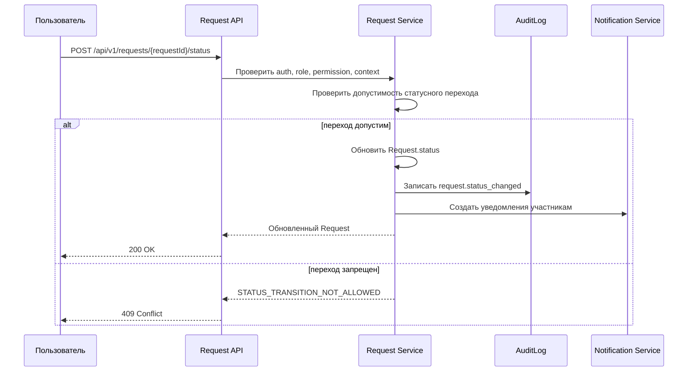

# Request Service API — MigrationOS

## 1. Назначение документа

Документ описывает API сервиса запросов в MigrationOS.

Request Service нужен, чтобы:

- создавать и обрабатывать запросы между мигрантом, работодателем и агентством;
- фиксировать жизненный цикл запроса;
- контролировать доступ к запросам по ролям и контексту;
- хранить публичные и внутренние комментарии;
- отправлять уведомления участникам процесса;
- логировать критичные действия в `AuditLog`.

---

## 2. Контекст

В MigrationOS запрос — это бизнес-сущность, через которую пользователь инициирует обращение к другой стороне.

Примеры запросов:

| Инициатор | Получатель | Пример |
|---|---|---|
| Мигрант | Работодатель | Запросить справку, документ или подтверждение |
| Мигрант | Агентство | Запросить консультацию или услугу |
| Работодатель | Агентство | Запросить проверку, документ или статус по мигранту |
| Агентство | Работодатель | Запросить недостающие данные |

Request Service не заменяет Marketplace. Если пользователь заказывает платную услугу, используется `ServiceOrder`.

Документ особенно связан с процессом [BPMN Employer Request](../03_processes/bpmn_employer-request.md), где запрос создается мигрантом, становится видимым работодателю и контролируется агентством.

---

## 3. Границы ответственности

Request Service отвечает за:

- создание запроса;
- хранение статуса;
- смену статуса по допустимой модели;
- назначение ответственного;
- хранение комментариев;
- разделение внешних и внутренних комментариев;
- уведомление участников;
- запись действий в `AuditLog`.

Request Service не отвечает за:

- оплату услуг;
- хранение файлов документов;
- расчет рисков;
- РКЛ-проверку;
- прямую интеграцию с SHERPA RPA.

---

## 4. Основные сущности

| Сущность | Назначение |
|---|---|
| `Request` | Основная бизнес-сущность запроса |
| `User` | Автор запроса или ответственный |
| `Migrant` | Мигрант, к которому относится запрос |
| `Employer` | Работодатель, к которому относится запрос |
| `Notification` | Уведомления участникам |
| `AuditLog` | Журнал критичных изменений |
| `ChatThread` | Диалог по запросу, если нужен |

---

## 5. Роли и доступ

| Роль | Доступ |
|---|---|
| `migrant` | Создает и видит свои запросы |
| `employer` | Видит запросы своей организации |
| `manager` | Видит запросы в своем scope |
| `supervisor` | Видит расширенный список и контролирует обработку |
| `superadmin` | Имеет административный доступ |

Важно:

- `migrant` не может видеть чужие запросы;
- `employer` видит только запросы по мигрантам своей организации;
- агентство видит запросы в рамках внутреннего операционного scope;
- `internalComment` не должен возвращаться внешним ролям.

---

## 6. Контексты доступа

| Контекст | Описание |
|---|---|
| `own` | Запрос создан текущим пользователем или связан с его профилем |
| `org` | Запрос связан с работодателем текущего пользователя |
| `assigned` | Запрос назначен на текущего менеджера |
| `agency` | Запрос доступен внутренним ролям агентства |
| `technical` | Доступ сервисов для внутренних операций |

### 6.1. Применение контекстов

| Роль | Базовый контекст |
|---|---|
| `migrant` | `own` |
| `employer` | `org` |
| `manager` | `assigned` |
| `supervisor` | `agency` |
| `superadmin` | `technical` |

---

## 7. Permissions

| Permission | Назначение |
|---|---|
| `request.read` | Читать запрос |
| `request.create` | Создать запрос |
| `request.update` | Изменить поля запроса |
| `request.update_status` | Изменить статус |
| `request.assign` | Назначить ответственного |
| `request.comment` | Добавить внешний комментарий |
| `request.internal_comment` | Добавить внутренний комментарий |
| `request.cancel` | Отменить запрос |
| `request.reject` | Отклонить запрос |

### 7.1. Принцип проверки доступа

Для любой операции сервис должен проверять:

1. наличие авторизованного пользователя;
2. роль пользователя;
3. наличие permission;
4. принадлежность сущности допустимому контексту;
5. дополнительные бизнес-правила статуса и процесса.

---

## 8. Status model

Request использует статусы:

| Статус | Значение |
|---|---|
| `created` | Запрос создан |
| `in_progress` | Запрос в работе |
| `need_info` | Требуется дополнительная информация |
| `completed` | Запрос выполнен |
| `rejected` | Запрос отклонен |
| `cancelled` | Запрос отменен |

Допустимые переходы должны соответствовать [Status Models](../04_data-model/status-models.md).

### 8.1. Ключевые правила статусов

| Правило | Описание |
|---|---|
| `created -> in_progress` | Запрос взят в работу |
| `in_progress -> need_info` | Требуются уточнения |
| `in_progress -> completed` | Запрос обработан |
| `created/in_progress/need_info -> rejected` | Запрос отклонен с причиной |
| `created/need_info -> cancelled` | Запрос отменен |

Недопустимый переход должен возвращать `409 Conflict`.

---

## 9. Endpoints

### 9.1. Получить список запросов

```http
GET /api/v1/requests
```

Query parameters:

| Параметр | Тип | Описание |
|---|---|---|
| `limit` | integer | Количество записей |
| `offset` | integer | Смещение |
| `status` | string | Фильтр по статусу |
| `migrantId` | UUID | Фильтр по мигранту |
| `employerId` | UUID | Фильтр по работодателю |
| `assigneeId` | UUID | Фильтр по ответственному |
| `createdBy` | UUID | Фильтр по автору |

Пример:

```http
GET /api/v1/requests?status=in_progress&employerId=7d5b18f5-6a72-41ce-9b6d-bad1a0b00001&limit=20&offset=0
```

Пример ответа:

```json
{
  "items": [
    {
      "id": "7d5b18f5-6a72-41ce-9b6d-bad1a0b10001",
      "requestType": "document_request",
      "migrantId": "7d5b18f5-6a72-41ce-9b6d-bad1a0b20001",
      "employerId": "7d5b18f5-6a72-41ce-9b6d-bad1a0b30001",
      "createdBy": "7d5b18f5-6a72-41ce-9b6d-bad1a0b40001",
      "assigneeId": "7d5b18f5-6a72-41ce-9b6d-bad1a0b50001",
      "status": "in_progress",
      "comment": "Нужно подтверждение от работодателя",
      "createdAt": "2026-05-12T10:00:00Z",
      "updatedAt": "2026-05-12T11:00:00Z"
    }
  ],
  "pagination": {
    "limit": 20,
    "offset": 0,
    "total": 1
  }
}
```

### 9.2. Получить запрос по ID

```http
GET /api/v1/requests/{requestId}
```

Response:

```json
{
  "id": "7d5b18f5-6a72-41ce-9b6d-bad1a0b10001",
  "requestType": "document_request",
  "migrantId": "7d5b18f5-6a72-41ce-9b6d-bad1a0b20001",
  "employerId": "7d5b18f5-6a72-41ce-9b6d-bad1a0b30001",
  "createdBy": "7d5b18f5-6a72-41ce-9b6d-bad1a0b40001",
  "assigneeId": "7d5b18f5-6a72-41ce-9b6d-bad1a0b50001",
  "status": "in_progress",
  "comment": "Нужно подтверждение от работодателя",
  "internalComment": "Проверить по регламенту агентства",
  "createdAt": "2026-05-12T10:00:00Z",
  "updatedAt": "2026-05-12T11:00:00Z"
}
```

Важно:

`internalComment` должен возвращаться только внутренним ролям агентства.

### 9.3. Создать запрос

```http
POST /api/v1/requests
```

Request:

```json
{
  "requestType": "document_request",
  "migrantId": "7d5b18f5-6a72-41ce-9b6d-bad1a0b20001",
  "employerId": "7d5b18f5-6a72-41ce-9b6d-bad1a0b30001",
  "comment": "Прошу предоставить подтверждение документа"
}
```

Response:

```http
201 Created
```

```json
{
  "id": "7d5b18f5-6a72-41ce-9b6d-bad1a0b10001",
  "requestType": "document_request",
  "migrantId": "7d5b18f5-6a72-41ce-9b6d-bad1a0b20001",
  "employerId": "7d5b18f5-6a72-41ce-9b6d-bad1a0b30001",
  "createdBy": "7d5b18f5-6a72-41ce-9b6d-bad1a0b40001",
  "assigneeId": null,
  "status": "created",
  "comment": "Прошу предоставить подтверждение документа",
  "createdAt": "2026-05-12T10:00:00Z"
}
```

### 9.4. Изменить статус запроса

```http
POST /api/v1/requests/{requestId}/status
```

Request:

```json
{
  "status": "need_info",
  "comment": "Нужно приложить скан документа",
  "internalComment": "Запрос неполный"
}
```

Response:

```json
{
  "id": "7d5b18f5-6a72-41ce-9b6d-bad1a0b10001",
  "status": "need_info",
  "comment": "Нужно приложить скан документа",
  "updatedAt": "2026-05-12T12:00:00Z"
}
```

Правила:

- статус меняется только backend;
- переход должен быть допустим по статусной модели;
- недопустимый переход возвращает `409 Conflict`;
- изменение статуса логируется в `AuditLog`.

### 9.5. Назначить ответственного

```http
POST /api/v1/requests/{requestId}/assign
```

Request:

```json
{
  "assigneeId": "7d5b18f5-6a72-41ce-9b6d-bad1a0b50001"
}
```

Response:

```json
{
  "id": "7d5b18f5-6a72-41ce-9b6d-bad1a0b10001",
  "assigneeId": "7d5b18f5-6a72-41ce-9b6d-bad1a0b50001",
  "updatedAt": "2026-05-12T12:30:00Z"
}
```

### 9.6. Добавить комментарий

```http
POST /api/v1/requests/{requestId}/comments
```

Request:

```json
{
  "comment": "Документ будет предоставлен завтра"
}
```

Response:

```json
{
  "id": "7d5b18f5-6a72-41ce-9b6d-bad1a0b10001",
  "comment": "Документ будет предоставлен завтра",
  "updatedAt": "2026-05-12T13:00:00Z"
}
```

---

## 10. Request / Response payload rules

### 10.1. Поля запроса на создание

| Поле | Обязательное | Комментарий |
|---|---:|---|
| `requestType` | Да | Тип запроса |
| `migrantId` | Нет | Обязателен для запросов, связанных с мигрантом |
| `employerId` | Нет | Обязателен для запросов работодателю |
| `comment` | Нет | Внешний комментарий инициатора |

### 10.2. Поля запроса на смену статуса

| Поле | Обязательное | Комментарий |
|---|---:|---|
| `status` | Да | Новый статус |
| `comment` | Нет | Внешний комментарий |
| `internalComment` | Нет | Только для внутренних ролей |
| `reason` | Условно | Обязателен при `rejected` или `cancelled` |

### 10.3. Поля ответа

Сервис должен возвращать:

- идентификаторы сущности;
- текущий статус;
- автора, ответственного и бизнес-контекст;
- внешний комментарий;
- внутренний комментарий только внутренним ролям;
- `createdAt`, `updatedAt`.

---

## 11. Валидации

| ID | Проверка | Ошибка |
|---|---|---|
| `REQ-VAL-001` | `requestType` заполнен | `VALIDATION_ERROR` |
| `REQ-VAL-002` | Запрос связан хотя бы с `migrantId`, `employerId` или другим бизнес-контекстом | `VALIDATION_ERROR` |
| `REQ-VAL-003` | Пользователь имеет permission `request.create` | `FORBIDDEN` |
| `REQ-VAL-004` | Пользователь имеет доступ к указанному `migrantId` или `employerId` | `FORBIDDEN` |
| `REQ-VAL-005` | Новый статус входит в enum `RequestStatus` | `VALIDATION_ERROR` |
| `REQ-VAL-006` | Статусный переход допустим | `STATUS_TRANSITION_NOT_ALLOWED` |
| `REQ-VAL-007` | При `rejected` или `cancelled` передана причина | `VALIDATION_ERROR` |
| `REQ-VAL-008` | `internalComment` доступен только внутренним ролям | `FORBIDDEN` |
| `REQ-VAL-009` | Назначаемый `assigneeId` существует и допустим для внутреннего scope | `VALIDATION_ERROR` |

---

## 12. Ошибки

### 12.1. Недопустимый статусный переход

```http
409 Conflict
```

```json
{
  "error": {
    "code": "STATUS_TRANSITION_NOT_ALLOWED",
    "message": "Transition from completed to in_progress is not allowed",
    "traceId": "req-330"
  }
}
```

### 12.2. Нет доступа

```http
403 Forbidden
```

```json
{
  "error": {
    "code": "FORBIDDEN",
    "message": "User has no access to this request",
    "traceId": "req-331"
  }
}
```

### 12.3. Ошибка валидации

```http
422 Unprocessable Entity
```

```json
{
  "error": {
    "code": "VALIDATION_ERROR",
    "message": "Request validation failed",
    "details": [
      {
        "field": "requestType",
        "message": "requestType is required"
      }
    ],
    "traceId": "req-332"
  }
}
```

### 12.4. Ресурс не найден

```http
404 Not Found
```

```json
{
  "error": {
    "code": "NOT_FOUND",
    "message": "Request not found",
    "traceId": "req-333"
  }
}
```

---

## 13. AuditLog

В `AuditLog` должны попадать:

| Действие | Когда логировать |
|---|---|
| `request.created` | При создании запроса |
| `request.status_changed` | При изменении статуса |
| `request.assigned` | При назначении ответственного |
| `request.rejected` | При отклонении |
| `request.cancelled` | При отмене |
| `request.internal_comment_added` | При добавлении внутреннего комментария |

Пример audit-события:

```json
{
  "actorUserId": "7d5b18f5-6a72-41ce-9b6d-bad1a0b40001",
  "action": "request.status_changed",
  "entityType": "Request",
  "entityId": "7d5b18f5-6a72-41ce-9b6d-bad1a0b10001",
  "beforeState": {
    "status": "in_progress"
  },
  "afterState": {
    "status": "need_info"
  },
  "createdAt": "2026-05-12T12:00:00Z"
}
```

### 13.1. Принципы логирования

- логируются только значимые изменения состояния и доступа;
- `internalComment` не должен утекать во внешние каналы;
- состав `beforeState` и `afterState` должен быть достаточным для расследования, но не содержать лишних чувствительных данных.

---

## 14. Уведомления

Request Service может создавать уведомления:

| Событие | Кому | Пример |
|---|---|---|
| Запрос создан | Получатель запроса | Новый запрос требует обработки |
| Запрос взят в работу | Автор запроса | Запрос принят в работу |
| Нужна информация | Автор запроса | Требуются дополнительные данные |
| Запрос выполнен | Автор запроса | Запрос выполнен |
| Запрос отклонен | Автор запроса | Запрос отклонен |
| Запрос отменен | Участники | Запрос отменен |

Ошибка `Notification Service` не должна откатывать основную операцию со статусом запроса.

---

## 15. Sequence flow

### 15.1. Смена статуса



---

## 16. Edge cases

| Ситуация | Поведение |
|---|---|
| Пользователь открывает чужой запрос | `403 Forbidden` или безопасный `404` |
| Внешняя роль передает `internalComment` | `403 Forbidden` |
| Запрос уже `completed`, но его пытаются вернуть в работу | `409 Conflict` |
| Запрос отменен, но приходит новый комментарий | Запретить или разрешить только внутренний комментарий по бизнес-правилу |
| `Notification Service` недоступен | Основная операция выполняется, уведомление уходит в retry |
| Ответственный удален или заблокирован | Запрос требует переназначения |
| Запрос без бизнес-контекста | `422 Validation Error` |

---

## 17. Нефункциональные требования

| ID | Требование |
|---|---|
| `REQ-NFR-001` | Все endpoints Request Service должны проверять роль, permission и контекст |
| `REQ-NFR-002` | Смена статуса должна соответствовать Status Models |
| `REQ-NFR-003` | Критичные действия должны попадать в `AuditLog` |
| `REQ-NFR-004` | Внешние роли не должны видеть `internalComment` |
| `REQ-NFR-005` | Ошибка уведомления не должна откатывать основную операцию |
| `REQ-NFR-006` | List endpoints должны поддерживать пагинацию и фильтры |
| `REQ-NFR-007` | Ошибки должны возвращаться в едином формате `ErrorResponse` |

---

## 18. Связь с другими артефактами

| Артефакт | Роль документа |
|---|---|
| `openapi.yaml` | Формальный API-контракт |
| `API Overview` | Общие правила REST, ошибок, access control |
| `Permissions` | Permission-level модель доступа |
| `Status Models` | Допустимые статусы и переходы `Request` |
| `Data Dictionary` | Поля сущности `Request` |
| `BPMN Employer Request` | Сквозной бизнес-процесс запроса работодателя |

---

## 19. Связанные артефакты

- [API Overview](./api-overview.md)
- [OpenAPI Specification](./openapi.yaml)
- [Data Dictionary](../04_data-model/data-dictionary.md)
- [Status Models](../04_data-model/status-models.md)
- [Permissions](../02_roles-and-access/permissions.md)
- [BPMN Employer Request](../03_processes/bpmn_employer-request.md)
- [ERD](../04_data-model/erd.md)
