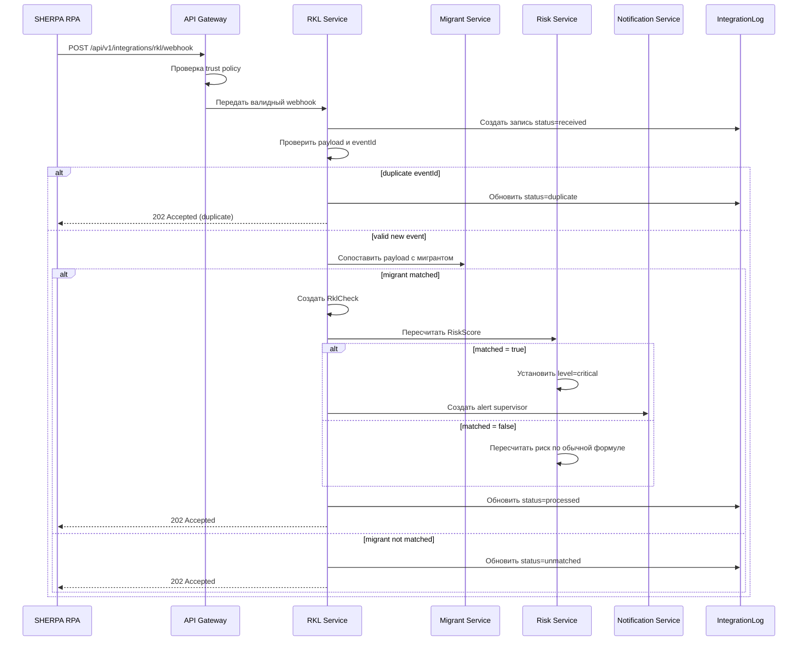

# RKL Webhook API — MigrationOS

## 1. Назначение документа

Документ описывает webhook-интерфейс, через который MigrationOS принимает результаты РКЛ-проверок от SHERPA RPA.

RKL webhook нужен, чтобы:

- получать результаты проверки мигрантов по РКЛ;
- сохранять историю проверок в `RklCheck`;
- фиксировать интеграционные события в `IntegrationLog`;
- обновлять `RiskScore`;
- создавать уведомления или алерты при критичном результате;
- обеспечивать идемпотентную обработку повторных webhook-событий.

Документ описывает именно контракт и логику приема результата в MigrationOS. Он не описывает внутреннюю реализацию SHERPA RPA и не предполагает, что MigrationOS управляет RPA-роботом.

---

## 2. Контекст интеграции

SHERPA RPA — внешняя система, которая выполняет проверку по РКЛ.

MigrationOS:

- не реализует RPA-робота;
- не управляет процессом проверки на стороне РКЛ;
- принимает результат проверки;
- валидирует payload;
- сопоставляет результат с мигрантом;
- сохраняет результат;
- обновляет риск-статус;
- пишет событие в `IntegrationLog`.

Граница ответственности:

| Сторона | Ответственность |
|---|---|
| SHERPA RPA | Выполнить проверку и отправить результат webhook-запросом |
| MigrationOS | Проверить доверие к источнику, валидировать payload, обработать событие, записать журнал и обновить риск |

---

## 3. Endpoint

```http
POST /api/v1/integrations/rkl/webhook
```

### 3.1. Назначение endpoint

Endpoint принимает результат РКЛ-проверки от доверенной внешней интеграции и инициирует обработку результата внутри MigrationOS.

### 3.2. Content-Type

```http
Content-Type: application/json
```

### 3.3. Auth / Trust policy

Для webhook не используется обычная пользовательская авторизация через `Bearer token`.

Доверие к источнику обеспечивается интеграционной политикой:

| Механизм | Назначение |
|---|---|
| API key | Проверка доверенного клиента |
| IP whitelist | Ограничение источников запросов |
| Signature | Проверка целостности payload |
| HTTPS | Защита канала передачи |
| `eventId` | Идемпотентность события |

Пример заголовков:

```http
X-Integration-Name: SHERPA_RPA
X-Api-Key: <integration_api_key>
X-Signature: sha256=<signature>
Content-Type: application/json
```

### 3.4. Принцип доверия

Webhook считается доверенным только при выполнении интеграционной политики. Если политика нарушена, событие не должно менять бизнес-сущности.

---

## 4. Request payload

### 4.1. Пример успешного payload

```json
{
  "eventId": "rkl_evt_2026_000001",
  "externalCheckId": "sherpa_check_987654",
  "source": "SHERPA_RPA",
  "checkedAt": "2026-05-12T08:30:00Z",
  "migrant": {
    "externalMigrantId": "1c_12345",
    "fullName": "Иванов Али",
    "birthDate": "1995-04-12",
    "passportNumber": "AA1234567",
    "phone": "+79990000000"
  },
  "result": {
    "matched": false,
    "status": "not_found",
    "rawStatus": "not_found",
    "matchConfidence": "high",
    "comment": "Совпадений не найдено"
  }
}
```

### 4.2. Пример payload с совпадением

```json
{
  "eventId": "rkl_evt_2026_000002",
  "externalCheckId": "sherpa_check_987655",
  "source": "SHERPA_RPA",
  "checkedAt": "2026-05-12T08:35:00Z",
  "migrant": {
    "externalMigrantId": "1c_12346",
    "fullName": "Петров Бахром",
    "birthDate": "1992-02-20",
    "passportNumber": "BB7654321",
    "phone": "+79991112233"
  },
  "result": {
    "matched": true,
    "status": "found",
    "rawStatus": "found_in_rkl",
    "matchConfidence": "high",
    "comment": "Обнаружено совпадение в РКЛ"
  }
}
```

---

## 5. Описание полей

| Поле | Тип | Обязательное | Описание |
|---|---|---:|---|
| `eventId` | string | Да | Уникальный ID webhook-события |
| `externalCheckId` | string | Да | ID проверки на стороне SHERPA RPA |
| `source` | string | Да | Источник события, ожидается `SHERPA_RPA` |
| `checkedAt` | datetime | Да | Дата и время выполнения проверки |
| `migrant.externalMigrantId` | string | Нет | ID мигранта во внешней системе, например 1С |
| `migrant.fullName` | string | Да | ФИО мигранта |
| `migrant.birthDate` | date | Нет | Дата рождения |
| `migrant.passportNumber` | string | Нет | Номер паспорта |
| `migrant.phone` | string | Нет | Телефон |
| `result.matched` | boolean | Да | Найдено совпадение в РКЛ |
| `result.status` | string | Да | Нормализованный статус результата |
| `result.rawStatus` | string | Да | Исходный статус от SHERPA RPA |
| `result.matchConfidence` | string | Нет | Уровень уверенности сопоставления |
| `result.comment` | string | Нет | Комментарий внешней системы |

---

## 6. Валидация payload

| ID | Проверка | Ошибка |
|---|---|---|
| `RKL-VAL-001` | `eventId` заполнен | `VALIDATION_ERROR` |
| `RKL-VAL-002` | `externalCheckId` заполнен | `VALIDATION_ERROR` |
| `RKL-VAL-003` | `source = SHERPA_RPA` | `INVALID_SOURCE` |
| `RKL-VAL-004` | `checkedAt` является валидной датой | `VALIDATION_ERROR` |
| `RKL-VAL-005` | `checkedAt` не позже текущего времени по backend-валидации | `VALIDATION_ERROR` |
| `RKL-VAL-006` | `result.matched` заполнен | `VALIDATION_ERROR` |
| `RKL-VAL-007` | `result.rawStatus` заполнен | `VALIDATION_ERROR` |
| `RKL-VAL-008` | Подпись, API key или другой trust-механизм валидны | `UNAUTHORIZED_INTEGRATION` |
| `RKL-VAL-009` | Событие не нарушает idempotency rules | `DUPLICATE_EVENT` |

### 6.1. Порядок валидации

Рекомендуемый порядок обработки:

1. Проверить формат HTTP-запроса и JSON.
2. Проверить trust policy.
3. Проверить обязательные поля payload.
4. Проверить `source`.
5. Проверить `eventId` на дубликат.
6. Только после этого выполнять сопоставление с мигрантом и обновление бизнес-сущностей.

---

## 7. Идемпотентность

Webhook может быть отправлен повторно, поэтому обработка должна быть идемпотентной.

Ключ идемпотентности:

```text
eventId
```

Правила:

| ID | Правило |
|---|---|
| `RKL-IDEMP-001` | Если `eventId` уже обработан, повторное событие не создает новый `RklCheck` |
| `RKL-IDEMP-002` | Повторное событие фиксируется в `IntegrationLog` со статусом `duplicate` |
| `RKL-IDEMP-003` | Повторное событие возвращает успешный ответ, если оригинальное событие было обработано |
| `RKL-IDEMP-004` | Повторное событие не должно повторно пересчитывать риск |

---

## 8. Логика обработки

### 8.1. Основной flow

1. MigrationOS получает webhook.
2. Проверяет trust policy: API key, IP whitelist, signature или иной согласованный механизм.
3. Валидирует payload.
4. Проверяет `eventId` на дубликат.
5. Создает запись в `IntegrationLog` со статусом `received`.
6. Сопоставляет payload с мигрантом.
7. Если мигрант найден, создает запись `RklCheck`.
8. Пересчитывает `RiskScore`.
9. Если `matched = true`, устанавливает `RiskScore.level = critical`.
10. Создает уведомление менеджеру или alert supervisor по внутренним правилам.
11. Обновляет статус обработки в `IntegrationLog`.
12. Возвращает ответ внешней системе.

### 8.2. Результаты обработки

| Ситуация | Результат |
|---|---|
| Событие корректно обработано | `IntegrationLog.status = processed` |
| Событие дублируется | `IntegrationLog.status = duplicate` |
| Мигрант не сопоставлен | `IntegrationLog.status = unmatched` |
| Payload невалиден | `IntegrationLog.status = validation_error` |
| Внутренняя ошибка обработки | `IntegrationLog.status = failed` |

---

## 9. Сопоставление с мигрантом

Сопоставление может выполняться по нескольким ключам.

| Приоритет | Поля | Комментарий |
|---|---|---|
| 1 | `externalMigrantId` | Лучший вариант, если есть ID из 1С или другой внешней системы |
| 2 | `passportNumber + birthDate` | Надежное сопоставление по документу |
| 3 | `phone` | Используется как дополнительный ключ |
| 4 | `fullName + birthDate` | Требует осторожности из-за возможных совпадений |

Если мигрант не найден:

- `RklCheck` может не создаваться;
- событие пишется в `IntegrationLog` со статусом `unmatched`;
- создается задача или алерт для ручного разбора;
- webhook может возвращать `202 Accepted`, если событие принято и зафиксировано.

### 9.1. Ограничения сопоставления

MigrationOS не должен:

- привязывать результат к случайной карточке при слабом совпадении;
- автоматически менять `RiskScore`, если сопоставление не подтверждено;
- создавать дубль мигранта из webhook payload.

---

## 10. Влияние на RiskScore

| Условие | Действие |
|---|---|
| `matched = false` | Риск пересчитывается по обычной формуле |
| `matched = true` | `RiskScore.level = critical` |
| `matched = true` | Создается alert для supervisor |
| Ошибка сопоставления | `RiskScore` не меняется до ручного разбора |
| Дубликат webhook | `RiskScore` не пересчитывается повторно |

Факторы риска:

| Фактор | Вес |
|---|---|
| Срок окончания патента | 35% |
| Срок окончания регистрации | 25% |
| РКЛ-статус | 30% |
| История нарушений | 10% |

### 10.1. Бизнес-правила влияния на риск

| ID | Правило |
|---|---|
| `RKL-RISK-001` | РКЛ-результат с `matched = true` должен переводить риск в `critical` |
| `RKL-RISK-002` | Повторный webhook не должен повторно создавать критичный алерт |
| `RKL-RISK-003` | При `unmatched` риск не должен изменяться автоматически |
| `RKL-RISK-004` | Изменение риска должно соответствовать `Status Models` и логироваться по политике аудита |

---

## 11. Response

### 11.1. Успешная обработка

```http
202 Accepted
```

```json
{
  "accepted": true,
  "status": "accepted",
  "eventId": "rkl_evt_2026_000001"
}
```

### 11.2. Дубликат события

```http
202 Accepted
```

```json
{
  "accepted": true,
  "status": "duplicate",
  "eventId": "rkl_evt_2026_000001"
}
```

### 11.3. Ошибка валидации

```http
422 Unprocessable Entity
```

```json
{
  "error": {
    "code": "VALIDATION_ERROR",
    "message": "Webhook payload validation failed",
    "details": [
      {
        "field": "eventId",
        "message": "eventId is required"
      }
    ],
    "traceId": "req-123"
  }
}
```

### 11.4. Недоверенный источник

```http
401 Unauthorized
```

```json
{
  "error": {
    "code": "UNAUTHORIZED_INTEGRATION",
    "message": "Invalid integration credentials",
    "traceId": "req-124"
  }
}
```

### 11.5. Невалидный формат JSON

```http
400 Bad Request
```

```json
{
  "error": {
    "code": "BAD_REQUEST",
    "message": "Request body is not valid JSON",
    "traceId": "req-125"
  }
}
```

---

## 12. HTTP-коды

| Код | Ситуация |
|---|---|
| `202` | Событие принято в обработку |
| `400` | Некорректный JSON или формат запроса |
| `401` | Неверная интеграционная авторизация |
| `403` | Источник не разрешен trust policy |
| `409` | Конфликт идемпотентности или состояния |
| `422` | Payload не прошел бизнес-валидацию |
| `500` | Внутренняя ошибка |
| `503` | Сервис временно недоступен |

---

## 13. IntegrationLog

Каждый webhook должен создавать или обновлять запись в `IntegrationLog`.

| Поле | Значение |
|---|---|
| `integration_name` | `SHERPA_RPA` |
| `event_id` | `eventId` из payload |
| `direction` | `inbound` |
| `status` | `received`, `processed`, `validation_error`, `duplicate`, `unmatched`, `failed` |
| `entity_type` | `RklCheck`, если событие сопоставлено |
| `entity_id` | ID созданной записи `RklCheck` |
| `payload_hash` | SHA-256 hash payload |

### 13.1. Рекомендации по журналированию

- Полный raw payload не должен храниться без необходимости.
- Для большинства случаев достаточно хранить hash payload и технический trace.
- Если raw payload хранится, он должен быть ограничен политикой безопасности и доступа.

---

## 14. Retry policy

| Ситуация | Поведение |
|---|---|
| MigrationOS вернул `202` | Повтор не требуется |
| MigrationOS вернул `400` | Повтор не нужен до исправления payload |
| MigrationOS вернул `401` или `403` | Повтор не нужен до исправления trust policy |
| MigrationOS вернул `422` | Повтор возможен после исправления данных |
| MigrationOS вернул `500` или `503` | SHERPA RPA может повторить отправку |
| Timeout | SHERPA RPA может повторить отправку с тем же `eventId` |

### 14.1. Правила повторной отправки

| ID | Правило |
|---|---|
| `RKL-RETRY-001` | Повторный запрос должен использовать тот же `eventId` |
| `RKL-RETRY-002` | Повторная отправка не должна приводить к дублю `RklCheck` |
| `RKL-RETRY-003` | При временной ошибке система должна опираться на идемпотентность, а не на генерацию нового события |

---

## 15. Sequence flow



---

## 16. Нефункциональные требования

| ID | Требование |
|---|---|
| `RKL-NFR-001` | Webhook должен обрабатываться идемпотентно |
| `RKL-NFR-002` | Payload должен валидироваться до изменения бизнес-сущностей |
| `RKL-NFR-003` | Все события должны фиксироваться в `IntegrationLog` |
| `RKL-NFR-004` | Обработка webhook не должна блокировать систему при недоступности `Notification Service` |
| `RKL-NFR-005` | Ошибки должны иметь `traceId` |
| `RKL-NFR-006` | Raw payload не должен храниться без необходимости; предпочтительно хранить hash |
| `RKL-NFR-007` | Webhook должен быть защищен trust policy |

---

## 17. Связь с другими артефактами

| Артефакт | Роль документа |
|---|---|
| `openapi.yaml` | Формальный контракт endpoint и схем payload/response |
| `API Overview` | Общие правила REST, авторизации, webhook и ошибок |
| `Status Models` | Логика статусов `IntegrationLog` и влияние на `RiskScore` |
| `Data Dictionary` | Поля `RklCheck`, `RiskScore`, `IntegrationLog` |
| `ERD` | Связи между `Migrant`, `RklCheck`, `RiskScore`, `IntegrationLog` |
| `BPMN RKL Check` | Сквозной процесс приема и обработки результата |

---

## 18. Связанные артефакты

- [API Overview](./api-overview.md)
- [OpenAPI Specification](./openapi.yaml)
- [ERD](../04_data-model/erd.md)
- [Data Dictionary](../04_data-model/data-dictionary.md)
- [Status Models](../04_data-model/status-models.md)
- [SQL Schema](../04_data-model/sql/schema.sql)
- [BPMN RKL Check](../03_processes/bpmn_rkl-check.md)
- [Permissions](../02_roles-and-access/permissions.md)
