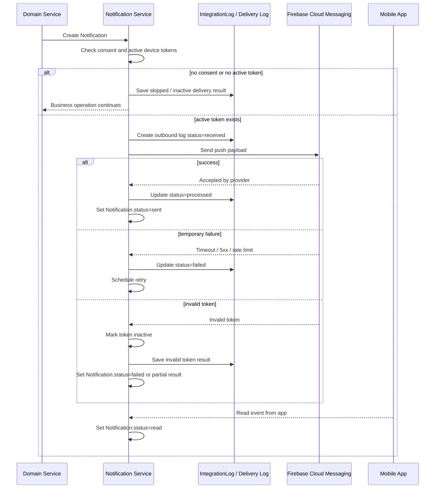

# FCM Push Integration — MigrationOS

## 1. Назначение документа

Документ описывает интеграцию MigrationOS с Firebase Cloud Messaging для отправки push-уведомлений в мобильное приложение мигранта.

FCM Push Integration нужен, чтобы:

- описать сценарии отправки push-уведомлений;
- определить события, по которым создаются уведомления;
- описать структуру push payload;
- зафиксировать правила работы с device tokens;
- описать consent, retry и обработку ошибок доставки;
- определить подход к delivery status и журналированию;
- зафиксировать требования к безопасности и ПДн;
- описать мониторинг и алерты по push-каналу.

---

## 2. Контекст интеграции

Мобильное приложение MigrationOS используется мигрантом для:

- просмотра статуса документов;
- загрузки документов;
- получения напоминаний о сроках;
- работы с запросами;
- получения уведомлений по услугам;
- получения критичных уведомлений по рискам;
- получения системных сообщений.

Push-уведомления нужны, чтобы своевременно информировать пользователя о важных событиях, даже если приложение не открыто.

Примеры:

- документ скоро истекает;
- документ отклонен;
- по запросу нужна дополнительная информация;
- заявка на услугу выполнена;
- платеж подтвержден;
- появился критичный риск;
- требуется обновить данные профиля.

---

## 3. Границы ответственности

| Сторона | Ответственность |
|---|---|
| MigrationOS | Определить бизнес-событие для уведомления |
| MigrationOS | Создать запись `Notification` |
| MigrationOS | Подготовить безопасный push payload |
| MigrationOS | Вызвать FCM API |
| MigrationOS | Зафиксировать результат отправки |
| MigrationOS | Выполнить retry при временной ошибке |
| FCM | Доставить push на устройство пользователя |
| Mobile App | Получить push и открыть нужный экран по deep link |
| Mobile App | Обновить device token при изменении |

Ключевое правило:

> Ошибка FCM не должна откатывать основную бизнес-операцию.

Например, если документ переведен в статус `rejected`, ошибка отправки push не должна отменять отклонение документа.

---

## 4. Тип интеграции

| Параметр | Значение |
|---|---|
| Направление | Outbound |
| Тип | API call |
| Протокол | HTTPS REST |
| Формат | JSON |
| Критичность | Medium |
| Идемпотентность | По `notificationId` / `eventId` |
| Основные сущности | `Notification`, `User`, `Migrant`, `DeviceToken`, `IntegrationLog` |

---

## 5. Основные push-события

| Событие | Получатель | Триггер |
|---|---|---|
| `document.expires_soon` | Мигрант | Документ истекает через 30/14/7/3/1 день |
| `document.rejected` | Мигрант | Документ отклонен менеджером |
| `document.approved` | Мигрант | Документ подтвержден |
| `request.need_info` | Автор запроса | Запрос переведен в `need_info` |
| `request.completed` | Автор запроса | Запрос выполнен |
| `service_order.paid` | Автор заявки | Оплата подтверждена webhook |
| `service_order.completed` | Автор заявки | Услуга выполнена |
| `risk.critical` | Менеджер / supervisor | Риск стал критичным |
| `profile.update_required` | Мигрант | Требуется обновить данные профиля |
| `system.announcement` | Пользователь | Системное объявление |

### Связь событий с процессами

- `document.*` связаны с процессом [BPMN Document Upload](../03_processes/bpmn_document-upload.md);
- `service_order.*` связаны с процессом [BPMN Service Order](../03_processes/bpmn_service-order.md);
- `request.*` связаны с [Request Service API](../05_api/request-service-api.md).

---

## 6. Device tokens

Для отправки push MigrationOS должна знать актуальный device token пользователя.

### 6.1. Регистрация device token

Мобильное приложение передает device token после авторизации пользователя.

Пример:

```json
{
  "userId": "7d5b18f5-6a72-41ce-9b6d-bad1a0b40001",
  "deviceToken": "fcm_token_example",
  "platform": "ios",
  "appVersion": "1.0.0",
  "locale": "ru",
  "createdAt": "2026-05-12T10:00:00Z"
}
```

### 6.2. Правила работы с токенами

| ID | Правило |
|---|---|
| `FCM-TOKEN-001` | Device token должен быть связан с пользователем |
| `FCM-TOKEN-002` | Один пользователь может иметь несколько device tokens |
| `FCM-TOKEN-003` | Невалидный token должен помечаться как `inactive` |
| `FCM-TOKEN-004` | При logout token может быть удален или деактивирован |
| `FCM-TOKEN-005` | Device token не должен использоваться как идентификатор пользователя |

### 6.3. Жизненный цикл token

MigrationOS должна учитывать, что device token:

- может измениться после переустановки приложения;
- может стать невалидным после logout;
- может существовать для нескольких устройств одного пользователя;
- должен храниться отдельно от бизнес-идентификаторов уведомления.

---

## 7. Consent и настройки уведомлений

Пользователь может управлять настройками уведомлений в приложении.

| Тип уведомления | Можно отключить | Комментарий |
|---|---|---|
| Сроки документов | Нет / частично | Критично для миграционного учета |
| Отклонение документа | Нет | Критичное операционное уведомление |
| Запросы | Да / частично | Зависит от политики продукта |
| Услуги | Да / частично | Может быть настраиваемым каналом |
| Маркетинговые уведомления | Да | Только при отдельном согласии |
| Системные критичные уведомления | Нет | Нужны для безопасности и комплаенса |

### Правила consent

| ID | Правило |
|---|---|
| `FCM-CONSENT-001` | Настройки пользователя должны учитываться до отправки push |
| `FCM-CONSENT-002` | Маркетинговые push требуют отдельного согласия |
| `FCM-CONSENT-003` | Критичные сервисные уведомления могут быть обязательными |
| `FCM-CONSENT-004` | Отказ от push не отменяет создание in-app `Notification`, если она нужна бизнес-процессу |

---

## 8. `Notification` entity

Перед отправкой push MigrationOS создает запись `Notification`.

### Основные поля

| Поле | Назначение |
|---|---|
| `id` | ID уведомления |
| `user_id` | Получатель |
| `type` | Тип уведомления |
| `title` | Заголовок |
| `body` | Текст |
| `status` | `created`, `sent`, `delivered`, `read`, `failed` |
| `channel` | `push` |
| `deep_link` | Ссылка на экран приложения |
| `created_at` | Дата создания |
| `sent_at` | Дата отправки |
| `read_at` | Дата прочтения |

`Notification` является бизнес-сущностью уведомления, а FCM — внешним каналом доставки.

---

## 9. Push payload

### 9.1. Пример payload в FCM

```json
{
  "message": {
    "token": "fcm_token_example",
    "notification": {
      "title": "Документ скоро истекает",
      "body": "Патент истекает через 7 дней"
    },
    "data": {
      "notificationId": "7d5b18f5-6a72-41ce-9b6d-bad1a0b70001",
      "type": "document.expires_soon",
      "entityType": "Document",
      "entityId": "7d5b18f5-6a72-41ce-9b6d-bad1a0b60001",
      "deepLink": "migrationos://documents/7d5b18f5-6a72-41ce-9b6d-bad1a0b60001"
    }
  }
}
```

### 9.2. Пример безопасного payload по запросу

```json
{
  "message": {
    "token": "fcm_token_example",
    "notification": {
      "title": "Нужна дополнительная информация",
      "body": "По вашему запросу требуется уточнение"
    },
    "data": {
      "notificationId": "7d5b18f5-6a72-41ce-9b6d-bad1a0b70002",
      "type": "request.need_info",
      "entityType": "Request",
      "entityId": "7d5b18f5-6a72-41ce-9b6d-bad1a0b10001",
      "deepLink": "migrationos://requests/7d5b18f5-6a72-41ce-9b6d-bad1a0b10001"
    }
  }
}
```

### 9.3. Пример payload по услуге

```json
{
  "message": {
    "token": "fcm_token_example",
    "notification": {
      "title": "Оплата подтверждена",
      "body": "Заявка на услугу принята в обработку"
    },
    "data": {
      "notificationId": "7d5b18f5-6a72-41ce-9b6d-bad1a0b70003",
      "type": "service_order.paid",
      "entityType": "ServiceOrder",
      "entityId": "7d5b18f5-6a72-41ce-9b6d-bad1a0b80001",
      "deepLink": "migrationos://service-orders/7d5b18f5-6a72-41ce-9b6d-bad1a0b80001"
    }
  }
}
```

---

## 10. Privacy rules для push payload

Push payload не должен содержать лишние ПДн.

| Нельзя передавать в push | Почему |
|---|---|
| Полные паспортные данные | Риск раскрытия ПДн на экране блокировки |
| Полные ФИО в чувствительных уведомлениях | Может раскрыть ПДн |
| Детальные причины риска | Чувствительная информация |
| Ссылки без проверки авторизации | Риск обхода доступа |
| Токены авторизации | Критический security-риск |

Разрешено:

- короткий безопасный текст;
- тип события;
- ID уведомления;
- ID сущности;
- deep link, который открывается только после авторизации.

---

## 11. Идемпотентность

Идемпотентность нужна, чтобы повторная отправка не создавала дубли уведомлений.

### Ключи

| Сценарий | Ключ |
|---|---|
| Создание `Notification` | `eventType + entityId + userId` |
| Отправка push | `notificationId + deviceToken` |
| Retry отправки | `notificationId + attemptNumber` |

### Правила

| ID | Правило |
|---|---|
| `FCM-IDEMP-001` | Одно бизнес-событие не должно создавать много одинаковых уведомлений |
| `FCM-IDEMP-002` | Повторная отправка не должна создавать новый `Notification` |
| `FCM-IDEMP-003` | Retry должен использовать существующий `notificationId` |
| `FCM-IDEMP-004` | Дубликаты отправки должны фиксироваться в delivery log |

---

## 12. Retry policy

| Ошибка FCM | Retry |
|---|---|
| Timeout | Да |
| `5xx` от FCM | Да |
| Rate limit | Да, с backoff |
| Invalid token | Нет, token помечается `inactive` |
| Unauthorized | Нет, нужно исправить credentials |
| Payload invalid | Нет, нужно исправить payload |
| User disabled push | Нет |

### Правила retry

| ID | Правило |
|---|---|
| `FCM-RETRY-001` | Retry не должен создавать дубль `Notification` |
| `FCM-RETRY-002` | Количество попыток должно быть ограничено |
| `FCM-RETRY-003` | После исчерпания retry уведомление получает `failed` |
| `FCM-RETRY-004` | Ошибка FCM не откатывает основную бизнес-операцию |
| `FCM-RETRY-005` | Для rate limit используется `exponential backoff` |

---

## 13. Delivery status

FCM не всегда гарантирует точный бизнес-статус доставки до пользователя.

MigrationOS может хранить следующие статусы:

| Статус | Значение |
|---|---|
| `created` | Уведомление создано |
| `sent` | Запрос к FCM успешно отправлен |
| `delivered` | Доставка подтверждена, если такой сигнал доступен |
| `read` | Пользователь открыл уведомление в приложении |
| `failed` | Отправка не удалась |

Важно:

- `sent` не всегда означает, что пользователь увидел уведомление;
- `read` должен фиксироваться приложением после открытия;
- delivery metrics используются для мониторинга, но не должны быть единственным источником бизнес-истины.

---

## 14. `IntegrationLog` / delivery log

Для push можно использовать:

- `IntegrationLog` для критичных outbound-вызовов;
- отдельный delivery log для каждой попытки отправки.

### 14.1. Что логировать

| Событие | Где фиксировать |
|---|---|
| Создание уведомления | `Notification` |
| Вызов FCM API | `IntegrationLog` или delivery log |
| Retry попытка | delivery log |
| Invalid token | registry device tokens |
| Failed after retries | `Notification.status = failed` |
| User opened notification | `Notification.status = read` |

### 14.2. Поля delivery log

| Поле | Назначение |
|---|---|
| `notification_id` | ID уведомления |
| `device_token_hash` | Hash токена, не сам токен |
| `attempt_number` | Номер попытки |
| `status` | Результат попытки |
| `provider_response_code` | Код ответа FCM |
| `error_code` | Код ошибки, если есть |
| `created_at` | Время попытки |

---

## 15. Error handling

Ошибки должны соответствовать [Error Model](../05_api/error-model.md).

| Ошибка | Поведение |
|---|---|
| Invalid device token | Token помечается `inactive` |
| FCM timeout | Retry |
| FCM `5xx` | Retry |
| Rate limit | Retry с backoff |
| Invalid payload | `validation_error`, retry не нужен |
| Unauthorized credentials | `failed`, alert backend/support |
| User disabled push | Push не отправляется, можно сохранить in-app `Notification` |

### Важное правило

Ошибка FCM не должна откатывать:

- смену статуса документа;
- смену статуса запроса;
- подтверждение оплаты;
- завершение услуги;
- обновление риска.

---

## 16. Security and privacy

| ID | Требование |
|---|---|
| `FCM-SEC-001` | Device token не должен логироваться в открытом виде |
| `FCM-SEC-002` | Push payload не должен содержать лишние ПДн |
| `FCM-SEC-003` | Deep link должен открываться только после проверки авторизации |
| `FCM-SEC-004` | FCM credentials не должны храниться в коде |
| `FCM-SEC-005` | Пользовательские настройки уведомлений должны учитываться |
| `FCM-SEC-006` | Маркетинговые push требуют отдельного согласия |

Дополнительно:

- в логах должен использоваться hash токена, а не полный token;
- критичные уведомления не должны раскрывать чувствительную информацию на lock screen;
- deep link не должен давать доступ к сущности без backend-проверки прав.

---

## 17. Monitoring and alerts

### Основные метрики

| Метрика | Назначение |
|---|---|
| Количество созданных уведомлений | Контроль объема |
| Количество отправленных push | Контроль отправки |
| Доля failed push | Контроль качества доставки |
| Количество invalid tokens | Контроль актуальности token registry |
| Retry queue size | Контроль накопления ошибок |
| Среднее время отправки | Контроль производительности |
| Количество read events | Оценка вовлеченности |

### Алерты

| Условие | Кому |
|---|---|
| Резкий рост failed push | Backend / Support |
| FCM credentials invalid | Backend / DevOps |
| Retry queue растет | Backend / Support |
| Много invalid tokens | Mobile / Backend |
| Критичные уведомления не отправляются | Support / Supervisor |

---

## 18. Sequence flow



---

## 19. Ограничения и открытые вопросы

| Вопрос | Комментарий |
|---|---|
| Хранится ли delivery log отдельно от `IntegrationLog` | Требует архитектурного решения |
| Нужны ли in-app notifications отдельно от push | Вероятно да |
| Какие уведомления нельзя отключить | Требует продуктового решения |
| Нужна ли локализация push на `RU/UZ/EN` | Да, для мобильного приложения |
| Нужен ли quiet hours / режим тишины | Может потребоваться |
| Как долго хранить device tokens | Требует security policy |

---

## 20. Связанные артефакты

- [Integrations Overview](./integrations-overview.md)
- [Data Dictionary](../04_data-model/data-dictionary.md)
- [Status Models](../04_data-model/status-models.md)
- [Error Model](../05_api/error-model.md)
- [Request Service API](../05_api/request-service-api.md)
- [BPMN Document Upload](../03_processes/bpmn_document-upload.md)
- [BPMN Service Order](../03_processes/bpmn_service-order.md)
