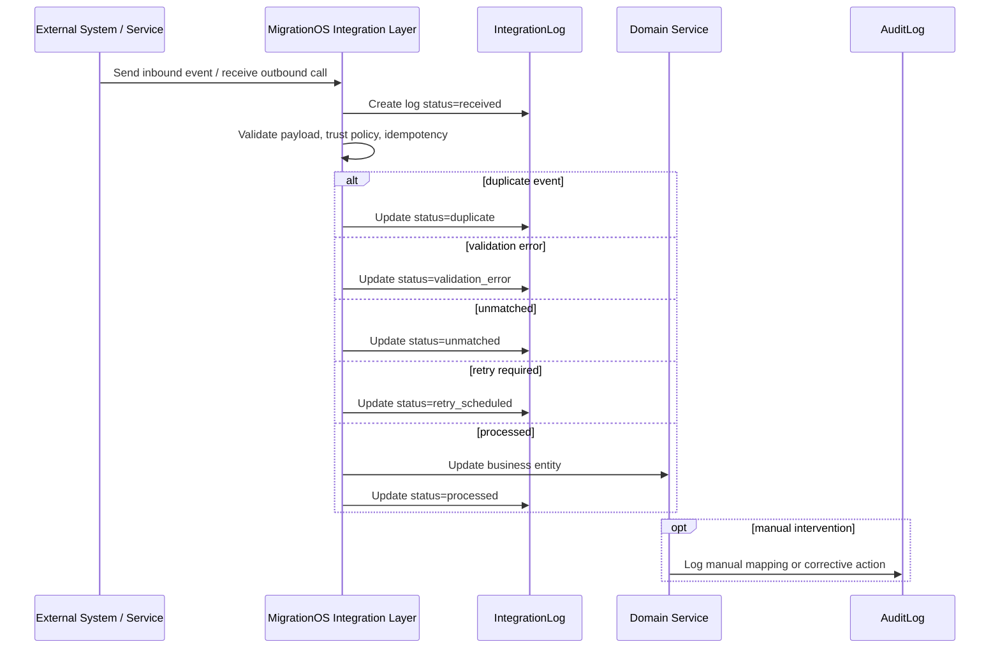

# Integration Logs — MigrationOS

## 1. Назначение документа

Документ описывает единую модель журналирования интеграционных событий в MigrationOS.

Integration Logs нужны, чтобы:

- фиксировать входящие и исходящие интеграционные события;
- обеспечивать трассируемость обмена с внешними системами;
- поддерживать расследование ошибок;
- контролировать `retry`, `duplicate` и `unmatched`-сценарии;
- связывать внешние события с внутренними бизнес-сущностями;
- помогать support, аналитикам, backend и DevOps разбирать инциденты;
- обеспечивать наблюдаемость интеграционного слоя.

---

## 2. Контекст

MigrationOS интегрируется с несколькими внешними системами:

- SHERPA RPA;
- 1С;
- СБП / payment provider;
- FCM;
- S3-compatible storage;
- email provider, если будет подключен;
- потенциально Госуслуги / ЕПГУ.

Каждая интеграция может создавать события:

- inbound webhook;
- inbound batch;
- outbound API call;
- retry;
- duplicate event;
- unmatched event;
- validation error;
- partial success;
- failed event.

Для всех таких сценариев нужна единая модель `IntegrationLog`.

---

## 3. Что такое `IntegrationLog`

`IntegrationLog` — это техническо-бизнесовый журнал интеграционного обмена.

Он отвечает на вопросы:

- какая интеграция участвовала;
- в каком направлении шел обмен;
- какое внешнее событие пришло или было отправлено;
- с какой внутренней сущностью оно связано;
- какой статус обработки получило событие;
- был ли retry;
- был ли duplicate;
- был ли unmatched;
- какой `traceId` использовать для поиска в логах;
- какой `payloadHash` соответствует событию.

`IntegrationLog` не является заменой прикладных логов, audit-журнала или систем мониторинга. Его задача — дать единый уровень трассируемости для всех интеграционных сценариев платформы.

---

## 4. `IntegrationLog` и `AuditLog`

`IntegrationLog` и `AuditLog` не заменяют друг друга.

| Журнал | Назначение |
|---|---|
| `IntegrationLog` | Фиксирует обмен с внешними системами |
| `AuditLog` | Фиксирует значимые действия пользователей и изменение бизнес-сущностей |

### 4.1. Когда использовать `IntegrationLog`

| Событие | Пример |
|---|---|
| Входящий webhook | RKL result, payment result |
| Исходящий API call | Создание платежа, отправка push |
| Batch import | Загрузка файла из 1С |
| Retry | Повторная отправка события |
| Duplicate | Повтор webhook с тем же `eventId` |
| Unmatched | Событие не сопоставлено с бизнес-сущностью |
| Failed | Ошибка интеграционной обработки |

### 4.2. Когда использовать `AuditLog`

| Событие | Пример |
|---|---|
| Пользователь изменил статус | Менеджер отклонил документ |
| Пользователь получил доступ к файлу | Создан `downloadUrl` |
| Назначен ответственный | `Request assigned` |
| Ручное сопоставление | Оператор связал unmatched event с мигрантом |
| Изменение прав | Обновлена роль пользователя |

### 4.3. Совместное использование

Одно событие может попадать в оба журнала.

Пример:

1. SHERPA RPA прислал webhook.
2. MigrationOS записала `IntegrationLog`.
3. Событие не сопоставилось с мигрантом.
4. Оператор вручную сопоставил его с карточкой.
5. Ручное действие оператора попало в `AuditLog`.

---

## 5. Направления событий

| Direction | Описание | Пример |
|---|---|---|
| `inbound` | Внешняя система отправляет данные в MigrationOS | RKL webhook, payment webhook, 1C batch |
| `outbound` | MigrationOS отправляет данные во внешнюю систему | Создание платежа, push в FCM, upload в S3 |
| `internal` | Внутреннее техническое событие интеграционного слоя | `retry_scheduled`, manual reprocess |

---

## 6. Статусы `IntegrationLog`

| Статус | Значение |
|---|---|
| `received` | Событие получено или создана запись outbound-вызова |
| `processing` | Событие находится в обработке |
| `processed` | Событие успешно обработано |
| `partial_success` | Событие обработано частично |
| `validation_error` | Payload или данные не прошли валидацию |
| `duplicate` | Событие является повтором уже обработанного события |
| `unmatched` | Событие не сопоставлено с внутренней сущностью |
| `retry_scheduled` | Запланирована повторная попытка |
| `failed` | Обработка завершилась ошибкой |
| `cancelled` | Обработка отменена по регламенту или вручную |

### Правила использования статусов

| ID | Правило |
|---|---|
| `LOG-STATUS-001` | Для inbound webhook сначала фиксируется `received`, затем финальный статус |
| `LOG-STATUS-002` | Для batch-обработки допускается `partial_success` |
| `LOG-STATUS-003` | `duplicate` не должен повторно менять бизнес-сущности |
| `LOG-STATUS-004` | `unmatched` не должен автоматически создавать рискованные связи |
| `LOG-STATUS-005` | `retry_scheduled` используется только если попытка действительно поставлена в retry |

---

## 7. Основные поля `IntegrationLog`

| Поле | Тип | Обязательное | Описание |
|---|---|---:|---|
| `id` | UUID | Да | ID записи журнала |
| `integration_name` | string | Да | Имя интеграции |
| `event_id` | string | Нет | Внешний ID события, `eventId`, `batchId` или `idempotencyKey` |
| `direction` | enum | Да | `inbound`, `outbound`, `internal` |
| `status` | enum | Да | Статус обработки |
| `entity_type` | string | Нет | Связанная внутренняя сущность |
| `entity_id` | UUID | Нет | ID связанной сущности |
| `trace_id` | string | Да | ID запроса или обработки |
| `correlation_id` | string | Нет | ID сквозного бизнес-процесса |
| `idempotency_key` | string | Нет | Ключ идемпотентности |
| `payload_hash` | string | Нет | Hash payload |
| `error_code` | string | Нет | Код ошибки |
| `error_message` | string | Нет | Краткое безопасное описание ошибки |
| `attempt_number` | integer | Нет | Номер попытки |
| `created_at` | datetime | Да | Дата создания записи |
| `updated_at` | datetime | Да | Дата обновления записи |

### Дополнительные поля для batch / summary

| Поле | Назначение |
|---|---|
| `summary.total_count` | Количество элементов в batch |
| `summary.processed_count` | Успешно обработано |
| `summary.validation_error_count` | Ошибок валидации |
| `summary.unmatched_count` | Не сопоставлено |
| `summary.failed_count` | Ошибок обработки |

---

## 8. Обязательность полей по сценариям

| Сценарий | Обязательные поля |
|---|---|
| Inbound webhook | `integration_name`, `direction`, `status`, `trace_id`, `event_id` или `idempotency_key` |
| Outbound API call | `integration_name`, `direction`, `status`, `trace_id`, `entity_type`, `entity_id` |
| Batch import | `integration_name`, `direction`, `status`, `trace_id`, `event_id`, `payload_hash` |
| Retry attempt | `integration_name`, `direction`, `status`, `trace_id`, `attempt_number` |
| Error case | `integration_name`, `direction`, `status`, `trace_id`, `error_code` |

---

## 9. Имена интеграций

| `integration_name` | Интеграция |
|---|---|
| `SHERPA_RPA` | Проверка РКЛ |
| `1C` | Обмен с учетной системой |
| `SBP` | Платежная интеграция |
| `PAYMENT_PROVIDER` | Универсальный платежный провайдер |
| `FCM` | Push-уведомления |
| `S3_STORAGE` | Объектное хранилище |
| `EMAIL_PROVIDER` | Email-уведомления |
| `EPGU` | Госуслуги / ЕПГУ, если будет подключено |

---

## 10. Связь с бизнес-сущностями

| Интеграция | `entity_type` | Пример `entity_id` |
|---|---|---|
| SHERPA RPA | `RklCheck` | ID созданной проверки |
| SHERPA RPA | `Migrant` | ID мигранта при manual review |
| SBP | `Payment` | ID платежа |
| SBP | `ServiceOrder` | ID заявки на услугу |
| 1C | `Migrant`, `Employer`, `Project`, `Payment`, `Request` | ID обновленной сущности |
| FCM | `Notification` | ID уведомления |
| S3 | `DocumentFile` | ID файла документа |

---

## 11. `payload_hash`

`payload_hash` нужен, чтобы:

- сопоставлять событие с исходным payload без хранения raw payload;
- расследовать duplicate-события;
- проверять, что повторное событие совпадает с оригиналом;
- уменьшить объем чувствительных данных в логах.

### Правила

| ID | Правило |
|---|---|
| `LOG-HASH-001` | Для критичных webhook желательно хранить `payload_hash` |
| `LOG-HASH-002` | Hash должен строиться по нормализованному payload |
| `LOG-HASH-003` | Raw payload не хранится без необходимости |
| `LOG-HASH-004` | Если raw payload хранится, доступ должен быть строго ограничен |
| `LOG-HASH-005` | `payload_hash` не должен заменять проверку подписи webhook |

---

## 12. `traceId`, `correlationId` и `idempotencyKey`

### 12.1. `traceId`

`traceId` нужен для связи записи `IntegrationLog` с backend-логами, error responses и системой мониторинга.

### 12.2. `correlationId`

`correlationId` используется для сквозной трассировки одного бизнес-процесса через несколько интеграций.

Примеры:

- один `ServiceOrder` порождает создание `Payment`, payment webhook и push-уведомление;
- один batch из 1С влияет на несколько сущностей.

### 12.3. `idempotencyKey`

`idempotencyKey` помогает безопасно повторять операции без создания дублей.

### Правила

| ID | Правило |
|---|---|
| `LOG-TRACE-001` | Ошибочные события всегда должны иметь `traceId` |
| `LOG-TRACE-002` | Связанные события одного процесса по возможности должны иметь общий `correlationId` |
| `LOG-TRACE-003` | `idempotencyKey` должен храниться для операций, где повторная доставка ожидаема |
| `LOG-TRACE-004` | `traceId` и `correlationId` не должны содержать ПДн |

---

## 13. Идемпотентность

`IntegrationLog` помогает контролировать идемпотентность.

| Сценарий | Ключ |
|---|---|
| RKL webhook | `eventId` |
| Payment webhook | `eventId`, `providerPaymentId` |
| 1C batch | `batchId + entityType` |
| 1C item | `externalId + entityType` |
| Создание платежа | `idempotencyKey` |
| FCM push | `notificationId + deviceToken` |
| S3 upload session | `uploadId` |

### Правила

| ID | Правило |
|---|---|
| `LOG-IDEMP-001` | При повторном событии должна находиться существующая запись или связанный обработанный event |
| `LOG-IDEMP-002` | `duplicate` не должен повторно менять бизнес-сущности |
| `LOG-IDEMP-003` | `duplicate` должен фиксироваться явно |
| `LOG-IDEMP-004` | Повтор с тем же ключом, но другим `payload_hash` требует отдельного разбора |

---

## 14. Retry

`IntegrationLog` должен отражать retry-поведение.

| Поле | Назначение |
|---|---|
| `attempt_number` | Номер попытки |
| `status` | `retry_scheduled`, `processed`, `failed` |
| `error_code` | Причина неуспеха |
| `trace_id` | Техническая трассировка попытки |
| `correlation_id` | Связь с исходным бизнес-процессом |

### Правила retry

| ID | Правило |
|---|---|
| `LOG-RETRY-001` | Retry не должен создавать дубли бизнес-сущностей |
| `LOG-RETRY-002` | Каждая попытка должна быть трассируема |
| `LOG-RETRY-003` | После исчерпания попыток событие получает `failed` |
| `LOG-RETRY-004` | Для batch можно хранить summary по строкам отдельно |

---

## 15. Duplicate-сценарии

Duplicate возникает, когда внешняя система повторно отправляет уже обработанное событие.

| Интеграция | Пример |
|---|---|
| SHERPA RPA | Повторный `eventId` |
| SBP | Повторный payment webhook |
| 1C | Повторный `batchId` |
| FCM | Повторная отправка того же `notificationId` на тот же token |

### Правила

| ID | Правило |
|---|---|
| `LOG-DUP-001` | Duplicate должен иметь статус `duplicate` |
| `LOG-DUP-002` | Duplicate не должен повторно менять бизнес-сущности |
| `LOG-DUP-003` | Для webhook duplicate можно возвращать безопасный `202` |
| `LOG-DUP-004` | Если duplicate отличается по `payload_hash`, требуется manual review |

---

## 16. Unmatched-сценарии

Unmatched возникает, когда событие принято, но не может быть сопоставлено с внутренней сущностью.

| Интеграция | Пример |
|---|---|
| SHERPA RPA | Мигрант не найден |
| SBP | `providerPaymentId` неизвестен |
| 1C | Работодатель для мигранта не найден |
| S3 | Metadata файла отсутствует |
| FCM | Пользователь или token не найден |

### Правила

| ID | Правило |
|---|---|
| `LOG-UNMATCH-001` | Unmatched должен фиксироваться отдельным статусом |
| `LOG-UNMATCH-002` | Unmatched не должен автоматически создавать рискованные связи |
| `LOG-UNMATCH-003` | Для важных unmatched-событий создается задача на ручной разбор |
| `LOG-UNMATCH-004` | Ручное сопоставление должно попадать в `AuditLog` |

---

## 17. Partial success

`partial_success` используется, когда событие обработано не полностью.

Типичный пример — batch из 1С:

- 100 строк получено;
- 90 строк обработано;
- 7 строк не прошли валидацию;
- 3 строки ушли в manual review.

### Поля summary для batch

| Поле | Описание |
|---|---|
| `total_count` | Количество элементов |
| `processed_count` | Успешно обработано |
| `validation_error_count` | Ошибок валидации |
| `unmatched_count` | Не сопоставлено |
| `failed_count` | Ошибок обработки |

---

## 18. Примеры записей `IntegrationLog`

### 18.1. RKL webhook

```json
{
  "id": "7d5b18f5-6a72-41ce-9b6d-log00001",
  "integrationName": "SHERPA_RPA",
  "eventId": "rkl_evt_2026_000001",
  "direction": "inbound",
  "status": "processed",
  "entityType": "RklCheck",
  "entityId": "7d5b18f5-6a72-41ce-9b6d-rkl00001",
  "traceId": "req-701",
  "idempotencyKey": "rkl_evt_2026_000001",
  "payloadHash": "sha256:abc123",
  "createdAt": "2026-05-12T08:30:00Z",
  "updatedAt": "2026-05-12T08:30:02Z"
}
```

### 18.2. Payment webhook

```json
{
  "id": "7d5b18f5-6a72-41ce-9b6d-log00002",
  "integrationName": "SBP",
  "eventId": "pay_evt_2026_000001",
  "direction": "inbound",
  "status": "processed",
  "entityType": "Payment",
  "entityId": "7d5b18f5-6a72-41ce-9b6d-pay00001",
  "traceId": "req-224",
  "correlationId": "service_order_7d5b18f5",
  "idempotencyKey": "pay_evt_2026_000001",
  "payloadHash": "sha256:def456",
  "createdAt": "2026-05-12T09:15:00Z",
  "updatedAt": "2026-05-12T09:15:01Z"
}
```

### 18.3. 1C batch partial success

```json
{
  "id": "7d5b18f5-6a72-41ce-9b6d-log00003",
  "integrationName": "1C",
  "eventId": "1c_migrants_2026_05_12_001",
  "direction": "inbound",
  "status": "partial_success",
  "entityType": "Migrant",
  "entityId": null,
  "traceId": "batch-20260512-001",
  "idempotencyKey": "1c_migrants_2026_05_12_001:migrant",
  "payloadHash": "sha256:ghi789",
  "summary": {
    "totalCount": 100,
    "processedCount": 90,
    "validationErrorCount": 7,
    "unmatchedCount": 3,
    "failedCount": 0
  },
  "createdAt": "2026-05-12T06:00:00Z",
  "updatedAt": "2026-05-12T06:05:00Z"
}
```

### 18.4. FCM push failed

```json
{
  "id": "7d5b18f5-6a72-41ce-9b6d-log00004",
  "integrationName": "FCM",
  "eventId": "notification_7d5b18f5_001",
  "direction": "outbound",
  "status": "failed",
  "entityType": "Notification",
  "entityId": "7d5b18f5-6a72-41ce-9b6d-not00001",
  "traceId": "push-20260512-001",
  "idempotencyKey": "notification_7d5b18f5_001:device_hash_abc",
  "errorCode": "FCM_INVALID_TOKEN",
  "errorMessage": "Device token is invalid",
  "attemptNumber": 1,
  "createdAt": "2026-05-12T10:10:00Z",
  "updatedAt": "2026-05-12T10:10:01Z"
}
```

### 18.5. S3 upload failed

```json
{
  "id": "7d5b18f5-6a72-41ce-9b6d-log00005",
  "integrationName": "S3_STORAGE",
  "eventId": "upl_2026_000001",
  "direction": "outbound",
  "status": "failed",
  "entityType": "DocumentFile",
  "entityId": "7d5b18f5-6a72-41ce-9b6d-file00001",
  "traceId": "upload-20260512-001",
  "idempotencyKey": "upl_2026_000001",
  "errorCode": "S3_TIMEOUT",
  "errorMessage": "S3 request timeout",
  "attemptNumber": 1,
  "createdAt": "2026-05-12T10:20:00Z",
  "updatedAt": "2026-05-12T10:20:10Z"
}
```

---

## 19. Ошибки и их отражение в `IntegrationLog`

| Ошибка | Статус журнала | Дополнительные поля |
|---|---|---|
| Невалидный payload | `validation_error` | `error_code`, `error_message` |
| Ошибка trust policy | `failed` | `error_code`, `trace_id` |
| Duplicate event | `duplicate` | `idempotency_key`, `payload_hash` |
| Unmatched entity | `unmatched` | `entity_type` может быть пустым |
| Частичная batch-обработка | `partial_success` | `summary` |
| Исчерпан retry | `failed` | `attempt_number`, `error_code` |

---

## 20. Security and privacy

| ID | Требование |
|---|---|
| `LOG-SEC-001` | Raw payload не должен храниться без необходимости |
| `LOG-SEC-002` | ПДн не должны попадать в открытые технические логи |
| `LOG-SEC-003` | Secrets, API keys, signatures и tokens не логируются |
| `LOG-SEC-004` | Presigned URL не должен логироваться целиком |
| `LOG-SEC-005` | Доступ к `IntegrationLog` ограничен внутренними ролями |
| `LOG-SEC-006` | `error_message` должен быть безопасным для отображения support |
| `LOG-SEC-007` | Для расследований используется `traceId`, а не раскрытие payload |

### Практические ограничения

- `payloadHash` предпочтительнее хранения raw payload;
- если raw payload все же хранится временно, нужен отдельный защищенный контур доступа;
- support и аналитики не должны видеть секреты интеграций;
- presigned URL, webhook signatures и device tokens нельзя писать в открытые логи.

---

## 21. Правила хранения и retention

| Тип данных | Рекомендация |
|---|---|
| `IntegrationLog` metadata | Хранить по регламенту эксплуатации |
| Raw payload | Не хранить или хранить ограниченное время |
| `payloadHash` | Можно хранить дольше raw payload |
| Error summary | Хранить для аналитики и support |
| Batch processing summary | Хранить для сверки |
| Sensitive technical secrets | Не хранить |

### Правила хранения

| ID | Правило |
|---|---|
| `LOG-RET-001` | Логи должны храниться достаточно долго для расследования интеграционных инцидентов |
| `LOG-RET-002` | Raw payload должен иметь более короткий retention, чем metadata |
| `LOG-RET-003` | Секреты не должны попадать в хранение вообще |

---

## 22. Monitoring and alerts

| Метрика | Назначение |
|---|---|
| Количество событий по интеграциям | Контроль нагрузки |
| Доля `failed` | Контроль стабильности |
| Доля `unmatched` | Контроль качества данных |
| Доля `duplicate` | Контроль повторной доставки |
| Доля `partial_success` | Контроль качества batch |
| Среднее время обработки события | Контроль производительности |
| Retry queue size | Контроль накопления ошибок |

Алерты:

| Условие | Кому |
|---|---|
| Резкий рост `failed` | Backend / Support |
| Много `unmatched` по SHERPA RPA | Supervisor / Support |
| Много `amount mismatch` по payment | Finance / Security |
| Batch из 1С не пришел | Support / Supervisor |
| Retry queue растет | Backend / DevOps |
| Ошибки trust policy | Security / Backend |

---

## 23. Sequence flow: generic integration logging



---

## 24. QA checklist

| ID | Проверка |
|---|---|
| `QA-LOG-001` | Inbound webhook создает `IntegrationLog` |
| `QA-LOG-002` | Duplicate webhook получает статус `duplicate` |
| `QA-LOG-003` | Unmatched event получает статус `unmatched` |
| `QA-LOG-004` | Ошибка валидации получает статус `validation_error` |
| `QA-LOG-005` | `payloadHash` сохраняется для критичных событий |
| `QA-LOG-006` | Raw payload не содержит лишние ПДн в логах |
| `QA-LOG-007` | Secrets и API keys не попадают в логи |
| `QA-LOG-008` | Retry увеличивает `attempt_number` |
| `QA-LOG-009` | `trace_id` есть у ошибочных событий |
| `QA-LOG-010` | Ручное сопоставление unmatched-события логируется в `AuditLog` |

---

## 25. Ограничения и открытые вопросы

| Вопрос | Комментарий |
|---|---|
| Хранить ли raw payload | Лучше не хранить без необходимости |
| Нужна ли отдельная таблица для retry attempts | Может потребоваться при сложной очереди |
| Нужен ли отдельный batch item log | Желательно для 1С batch |
| Кто видит `IntegrationLog` в админке | Только внутренние роли |
| Сколько хранить логи | Требует политики retention |
| Какие статусы показывать support | Нужно согласовать UX админки |

---

## 26. Связанные артефакты

- [Integrations Overview](./integrations-overview.md)
- [Error Model](../05_api/error-model.md)
- [Data Dictionary](../04_data-model/data-dictionary.md)
- [Status Models](../04_data-model/status-models.md)
- [SHERPA RPA Integration](./sherpa-rpa.md)
- [1C Integration](./one-c.md)
- [SBP Payment Integration](./sbp-payment.md)
- [FCM Push Integration](./fcm-push.md)
- [S3 Storage Integration](./s3-storage.md)
