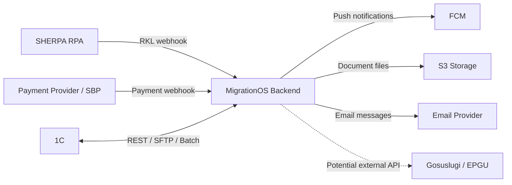
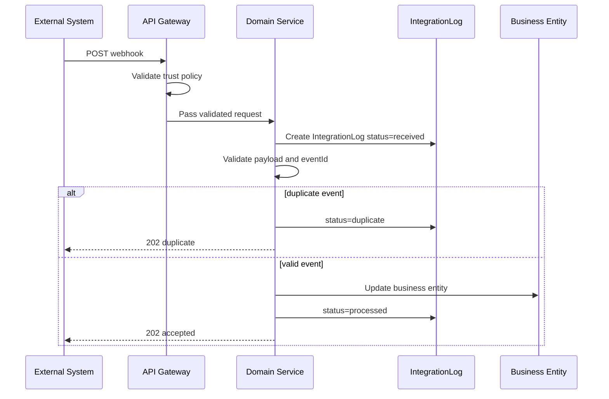

# Integrations Overview — MigrationOS

## 1. Назначение документа

Документ описывает общую интеграционную архитектуру платформы MigrationOS.

Integrations Overview нужен, чтобы:

- зафиксировать список внешних систем;
- определить направления обмена данными;
- разделить inbound и outbound интеграции;
- описать протоколы и форматы обмена;
- определить подход к webhook, retry, idempotency и журналированию;
- зафиксировать требования к безопасности интеграций;
- подготовить основу для детальных документов по каждой интеграции.

Документ является обзорным и не заменяет детальные контракты по отдельным интеграциям.

---

## 2. Контекст

MigrationOS взаимодействует с несколькими внешними системами:

- `SHERPA RPA` — получение результатов РКЛ-проверок;
- `1C` — обмен данными по мигрантам, работодателям, платежам или операционным данным;
- `СБП / payment provider` — прием подтверждений оплаты и создание платежных сценариев;
- `FCM` — отправка push-уведомлений;
- `S3-compatible storage` — хранение файлов документов;
- `Email provider` — отправка email-уведомлений;
- `Госуслуги / ЕПГУ` — потенциальная интеграция для внешних государственных сценариев.

MigrationOS не является системой, которая сама выполняет все внешние операции. Платформа:

- принимает входящие события;
- вызывает внешние API;
- нормализует и валидирует данные;
- применяет бизнес-правила во внутренних сервисах;
- фиксирует обмен в `IntegrationLog`.

---

## 3. Основные принципы интеграций

| ID | Принцип |
|---|---|
| `INT-GEN-001` | Любая интеграция должна иметь владельца, назначение и понятный контракт |
| `INT-GEN-002` | Входящие события должны фиксироваться в `IntegrationLog` |
| `INT-GEN-003` | Webhook-операции должны быть идемпотентными |
| `INT-GEN-004` | Повторная доставка события не должна создавать дубли бизнес-сущностей |
| `INT-GEN-005` | Ошибки интеграций должны иметь `traceId` |
| `INT-GEN-006` | Интеграции не должны раскрывать лишние ПДн |
| `INT-GEN-007` | Внешняя система не должна напрямую менять данные в БД MigrationOS |
| `INT-GEN-008` | Все изменения бизнес-сущностей выполняются через backend-сервисы MigrationOS |

---

## 4. Карта интеграций

| Интеграция | Направление | Тип | Протокол | Формат | Критичность |
|---|---|---|---|---|---|
| `SHERPA RPA` | Inbound | Webhook | HTTPS REST | JSON | High |
| `1C` | Inbound / Outbound | Sync / Batch | REST или SFTP | JSON / CSV | High |
| `СБП / Payment provider` | Inbound / Outbound | API + Webhook | HTTPS REST | JSON | High |
| `FCM` | Outbound | API call | HTTPS REST | JSON | Medium |
| `S3-compatible storage` | Outbound | Object storage | S3 API | Binary / metadata | High |
| `Email provider` | Outbound | API / SMTP | HTTPS REST / SMTP | JSON / MIME | Low / Medium |
| `Госуслуги / ЕПГУ` | Outbound / Inbound | External API | HTTPS REST | JSON / XML | Medium / High |

### 4.1. Типы интеграционных данных

| Интеграция | Тип данных |
|---|---|
| `SHERPA RPA` | Результаты РКЛ-проверок |
| `1C` | Работодатели, мигранты, статусы, платежи, справочники |
| `Payment provider` | Создание платежа, подтверждение оплаты, статусы платежа |
| `FCM` | Push payload и delivery status, если поддерживается |
| `S3` | Файлы документов и metadata |
| `Email provider` | Email payload, delivery status |
| `Госуслуги / ЕПГУ` | Государственные статусы, запросы, подтверждения |

---

## 5. Inbound integrations

Inbound integrations — это сценарии, где внешняя система отправляет данные в MigrationOS.

| Интеграция | Endpoint | Назначение |
|---|---|---|
| `SHERPA RPA` | `POST /api/v1/integrations/rkl/webhook` | Передача результата РКЛ-проверки |
| `Payment provider` | `POST /api/v1/payments/webhook` | Подтверждение оплаты |
| `1C` | `TBD` | Импорт мигрантов, работодателей или операционных данных |
| `Госуслуги / ЕПГУ` | `TBD` | Получение внешних статусов, если интеграция будет реализована |

### 5.1. Общие правила inbound

| ID | Правило |
|---|---|
| `INT-IN-001` | Каждый inbound endpoint должен иметь trust policy |
| `INT-IN-002` | Payload должен валидироваться до изменения бизнес-сущностей |
| `INT-IN-003` | Для webhook обязателен `eventId` или эквивалентный idempotency key |
| `INT-IN-004` | Ошибки inbound-обработки должны фиксироваться в `IntegrationLog` |

---

## 6. Outbound integrations

Outbound integrations — это сценарии, где MigrationOS отправляет запрос во внешнюю систему.

| Интеграция | Назначение |
|---|---|
| `FCM` | Отправка push-уведомлений в мобильное приложение |
| `Email provider` | Отправка email-уведомлений |
| `S3 storage` | Загрузка и получение файлов документов |
| `Payment provider` | Создание платежа или счета |
| `1C` | Передача данных по заявкам, оплатам или статусам |
| `Госуслуги / ЕПГУ` | Потенциальная отправка запросов во внешние государственные сервисы |

### 6.1. Общие правила outbound

| ID | Правило |
|---|---|
| `INT-OUT-001` | Внешний вызов не должен обходить внутреннюю бизнес-логику |
| `INT-OUT-002` | Для outbound-вызовов должен быть correlation id или эквивалентный trace |
| `INT-OUT-003` | Критичные outbound-вызовы должны логироваться в `IntegrationLog` |
| `INT-OUT-004` | Ошибка внешнего канала не всегда должна откатывать основную бизнес-операцию |

---

## 7. Sync и async подходы

### 7.1. Синхронные интеграции

Синхронный подход используется, когда ответ нужен в рамках текущего пользовательского или системного сценария.

Примеры:

- создание платежа у платежного провайдера;
- получение временной ссылки на объект в `S3`;
- отправка push или email через API-провайдер.

### 7.2. Асинхронные интеграции

Асинхронный подход используется, когда внешняя система присылает результат позже или когда операция должна переживать временные сбои.

Примеры:

- `RKL webhook` от `SHERPA RPA`;
- `payment webhook` от СБП или payment provider;
- batch-обмен с `1C`;
- retry уведомлений.

### 7.3. Выбор подхода

| Сценарий | Подход | Причина |
|---|---|---|
| Создание платежа | Sync | Нужен immediate response с payment scenario |
| Подтверждение оплаты | Async | Источник истины — внешний webhook |
| РКЛ-проверка | Async | Проверка выполняется вне MigrationOS |
| Загрузка файла в S3 | Sync | Пользователь ожидает immediate result |
| Массовый обмен с 1C | Batch / Async | Большой объем и операционная природа обмена |

---

## 8. SHERPA RPA integration

### 8.1. Назначение

`SHERPA RPA` выполняет проверку мигрантов по РКЛ и отправляет результат в MigrationOS.

MigrationOS принимает результат через webhook, сохраняет `RklCheck`, обновляет `RiskScore` и пишет событие в `IntegrationLog`.

### 8.2. Основной сценарий

1. 1С или другой источник передает данные для проверки.
2. `SHERPA RPA` выполняет проверку.
3. `SHERPA RPA` отправляет webhook в MigrationOS.
4. MigrationOS валидирует payload и trust policy.
5. MigrationOS сопоставляет результат с мигрантом.
6. MigrationOS обновляет риск.

### 8.3. Подход к интеграции

| Аспект | Подход |
|---|---|
| Направление | Inbound |
| Протокол | HTTPS REST webhook |
| Формат | JSON |
| Идемпотентность | `eventId` |
| Журналирование | `IntegrationLog` |
| Бизнес-эффект | `RklCheck`, `RiskScore`, внутренние алерты |

### 8.4. Связанные документы

- [RKL Webhook API](../05_api/rkl-webhook.md)
- [BPMN RKL Check](../03_processes/bpmn_rkl-check.md)

---

## 9. 1C integration

### 9.1. Назначение

Интеграция с `1C` нужна для обмена операционными данными между MigrationOS и учетной системой.

Возможные данные обмена:

| Данные | Направление | Комментарий |
|---|---|---|
| Работодатели | `1C -> MigrationOS` | Импорт организаций и реквизитов |
| Мигранты | `1C -> MigrationOS` | Импорт или сверка карточек |
| Заявки | `MigrationOS -> 1C` | Передача данных для учета |
| Оплаты | `MigrationOS -> 1C` | Передача статуса оплаты |
| Акты / счета | `1C <-> MigrationOS` | В зависимости от бизнес-процесса |

### 9.2. Возможные протоколы

| Протокол | Когда использовать |
|---|---|
| REST API | Если `1C` предоставляет HTTP API |
| SFTP | Если обмен идет файлами по расписанию |
| CSV / XLSX | Для batch-обмена или MVP |
| JSON | Для структурированного API-обмена |

### 9.3. Особенности

| Особенность | Описание |
|---|---|
| Сверка справочников | Требуется нормализация кодов и идентификаторов |
| Batch-обработка | Вероятна для крупных выгрузок |
| Повторная загрузка | Должна быть идемпотентной по внешним идентификаторам |
| Операционный контроль | Ошибки обмена должны быть доступны support и внутренним ролям |

---

## 10. Payment integration

### 10.1. Назначение

Payment integration используется для создания платежа и получения подтверждения оплаты.

Ключевое правило:

> Подтверждением оплаты является только webhook от платежного провайдера.  
> Frontend redirect не подтверждает оплату.

### 10.2. Основной flow

1. Пользователь создает заявку на услугу.
2. MigrationOS создает `Payment`.
3. Payment provider возвращает payment link или payment scenario.
4. Пользователь оплачивает.
5. Payment provider отправляет webhook.
6. MigrationOS обновляет `Payment` и `ServiceOrder`.

### 10.3. Подход к интеграции

| Аспект | Подход |
|---|---|
| Направление | Inbound + Outbound |
| Outbound | Создание платежа |
| Inbound | Подтверждение оплаты webhook-событием |
| Идемпотентность | `eventId`, `providerPaymentId` |
| Журналирование | `IntegrationLog` |
| Бизнес-эффект | `Payment`, `ServiceOrder`, уведомления |

### 10.4. Связанные документы

- [Payment Webhook API](../05_api/payment-webhook.md)
- [BPMN Service Order](../03_processes/bpmn_service-order.md)

---

## 11. FCM Push integration

### 11.1. Назначение

`FCM` используется для отправки push-уведомлений в мобильное приложение мигранта.

Примеры событий:

- документ скоро истекает;
- документ отклонен;
- запрос требует уточнений;
- услуга выполнена;
- риск стал критичным.

### 11.2. Особенности

| Правило | Описание |
|---|---|
| Ошибка `FCM` не откатывает основную операцию | Бизнес-сущность уже изменена |
| Неуспешная отправка должна логироваться | Через `IntegrationLog` или delivery log |
| Для повторной отправки нужен retry | С ограничением количества попыток |
| Push payload не должен содержать лишние ПДн | Только безопасные данные и deep link |

---

## 12. S3 storage integration

### 12.1. Назначение

`S3-compatible storage` используется для хранения файлов документов.

MigrationOS хранит в БД не сам файл, а metadata и `storageKey`.

### 12.2. Правила

| ID | Правило |
|---|---|
| `INT-S3-001` | Файлы документов не должны иметь публичных URL |
| `INT-S3-002` | Доступ к файлу выдается через временную ссылку |
| `INT-S3-003` | Временная ссылка создается только после проверки permissions |
| `INT-S3-004` | Ссылка должна иметь ограниченный TTL |
| `INT-S3-005` | Файлы должны храниться с учетом требований к ПДн |

### 12.3. Тип обмена

| Операция | Направление | Комментарий |
|---|---|---|
| Upload file | `MigrationOS -> S3` | Синхронная операция |
| Get presigned URL | `MigrationOS -> S3` | Генерация временной ссылки |
| Download by URL | `Client -> S3` | Только после получения разрешенной ссылки |

---

## 13. Email integration

### 13.1. Назначение

`Email provider` используется для системных и операционных уведомлений.

Примеры:

- приглашение работодателя;
- восстановление доступа;
- уведомление о заявке;
- технические алерты для внутренних ролей.

### 13.2. Правила

| ID | Правило |
|---|---|
| `INT-EMAIL-001` | Ошибка отправки email не должна откатывать бизнес-операцию |
| `INT-EMAIL-002` | Email payload не должен содержать лишние ПДн |
| `INT-EMAIL-003` | Для важных email нужен retry |
| `INT-EMAIL-004` | Статус отправки должен логироваться |

---

## 14. Госуслуги / ЕПГУ integration

### 14.1. Назначение

Интеграция с `Госуслуги / ЕПГУ` рассматривается как потенциальная внешняя интеграция для государственных сценариев.

В MVP она может быть ограничена или вынесена за рамки.

### 14.2. Ограничения

| Ограничение | Описание |
|---|---|
| Требования доступа | Нужны официальные контракты и доступы |
| Форматы | Возможны REST, SOAP, XML или ведомственные форматы |
| Регламенты | Обработка зависит от государственных регламентов |
| SLA | Может отличаться от внутренних SLA MigrationOS |

---

## 15. IntegrationLog

`IntegrationLog` — единая точка фиксации интеграционных событий.

### 15.1. Что логировать

| Тип события | Пример |
|---|---|
| Inbound webhook | RKL result, payment result |
| Outbound request | Отправка push, создание платежа |
| Retry | Повторная обработка события |
| Validation error | Невалидный payload |
| Duplicate | Повторное событие |
| Unmatched | Событие не сопоставлено с бизнес-сущностью |
| Failed | Ошибка обработки |

### 15.2. Основные поля

| Поле | Назначение |
|---|---|
| `integration_name` | Название интеграции |
| `event_id` | Внешний ID события |
| `direction` | `inbound` или `outbound` |
| `status` | Статус обработки |
| `entity_type` | Связанная сущность |
| `entity_id` | ID связанной сущности |
| `payload_hash` | Hash payload |

### 15.3. Правила

| ID | Правило |
|---|---|
| `INT-LOG-001` | Каждый inbound webhook должен иметь запись в `IntegrationLog` |
| `INT-LOG-002` | Дубликаты должны фиксироваться со статусом `duplicate` |
| `INT-LOG-003` | Несопоставленные события должны фиксироваться со статусом `unmatched` |
| `INT-LOG-004` | Доступ к integration logs должен быть ограничен внутренними ролями |

---

## 16. Retry policy

| Ситуация | Retry |
|---|---|
| `400 Bad Request` | Нет, нужно исправить payload |
| `401 / 403` | Нет, нужно исправить trust policy |
| `422 Validation Error` | Обычно нет, кроме исправимых данных |
| `429 Too Many Requests` | Да, с backoff |
| `500 Internal Error` | Да |
| `503 Service Unavailable` | Да |
| Timeout | Да |

### 16.1. Общие правила retry

| ID | Правило |
|---|---|
| `INT-RETRY-001` | Retry не должен создавать дубли бизнес-сущностей |
| `INT-RETRY-002` | Для webhook используется тот же `eventId` |
| `INT-RETRY-003` | Для outbound-вызовов нужен correlation id |
| `INT-RETRY-004` | Количество попыток должно быть ограничено |
| `INT-RETRY-005` | После исчерпания retry событие должно стать `failed` |

---

## 17. Idempotency

Идемпотентность обязательна для:

- `payment webhook`;
- `RKL webhook`;
- retry интеграционных событий;
- повторной отправки push/email;
- повторного создания платежа при сетевой ошибке.

Правила:

| ID | Правило |
|---|---|
| `INT-IDEMP-001` | Повторная операция с тем же ключом не должна создавать дубль |
| `INT-IDEMP-002` | Для inbound webhook ключом является `eventId` |
| `INT-IDEMP-003` | Для payment операций дополнительно используется `providerPaymentId` |
| `INT-IDEMP-004` | Дубликаты фиксируются в `IntegrationLog` |
| `INT-IDEMP-005` | Повторное событие не должно повторно отправлять критичные уведомления |

---

## 18. Error handling

Ошибки интеграций должны соответствовать [Error Model](../05_api/error-model.md).

| Ошибка | Поведение |
|---|---|
| Невалидный JSON | `400 BAD_REQUEST` |
| Не пройдена trust policy | `401 UNAUTHORIZED_INTEGRATION` или `403` |
| Ошибка бизнес-валидации | `422 VALIDATION_ERROR` |
| Дубликат webhook | `202 duplicate` или безопасный ответ |
| Событие не сопоставлено | `202 unmatched` + `IntegrationLog.status = unmatched` |
| Внутренняя ошибка | `500 INTERNAL_ERROR` |
| Внешний сервис недоступен | `503 SERVICE_UNAVAILABLE` |

### 18.1. Принципы обработки ошибок

| ID | Правило |
|---|---|
| `INT-ERR-001` | Ошибка интеграции не должна напрямую раскрывать секреты или детали trust policy |
| `INT-ERR-002` | Для webhook предпочтителен безопасный и предсказуемый ответ |
| `INT-ERR-003` | Внутренние детали ошибки должны оставаться в логах, а не в публичном response |

---

## 19. Security

| ID | Требование |
|---|---|
| `INT-SEC-001` | Все интеграции должны работать через HTTPS или защищенный канал |
| `INT-SEC-002` | Для inbound webhook должна использоваться trust policy |
| `INT-SEC-003` | Webhook secrets и API keys не хранятся в коде |
| `INT-SEC-004` | Payload не должен содержать лишние ПДн |
| `INT-SEC-005` | Raw payload не должен храниться без необходимости |
| `INT-SEC-006` | Доступ к integration logs должен быть ограничен внутренними ролями |
| `INT-SEC-007` | Файлы документов не должны быть публично доступны |

---

## 20. Monitoring and alerts

| Метрика | Зачем нужна |
|---|---|
| Количество webhook-событий | Контроль нагрузки |
| Доля `failed` событий | Контроль ошибок интеграций |
| Количество `duplicate` событий | Контроль повторной доставки |
| Количество `unmatched` событий | Контроль качества сопоставления |
| Время обработки webhook | Контроль performance |
| Ошибки внешних сервисов | Контроль доступности интеграций |
| Retry queue size | Контроль накопления необработанных событий |

Алерты:

| Условие | Кому |
|---|---|
| Много `failed` событий | Backend / Support |
| Много `unmatched` RKL-событий | Supervisor / Support |
| Payment webhook не приходит дольше заданного SLA | Support / Finance |
| FCM или email недоступны | Support |
| S3 storage недоступен | Backend / DevOps |

---

## 21. Integration context diagram

---

## 22. Typical webhook sequence

---

## 23. Связанные артефакты

- [API Overview](../05_api/api-overview.md)
- [OpenAPI Specification](../05_api/openapi.yaml)
- [Error Model](../05_api/error-model.md)
- [RKL Webhook API](../05_api/rkl-webhook.md)
- [Payment Webhook API](../05_api/payment-webhook.md)
- [Data Dictionary](../04_data-model/data-dictionary.md)
- [Status Models](../04_data-model/status-models.md)
- [SQL Schema](../04_data-model/sql/schema.sql)
- [Architecture Overview](../09_architecture/architecture-overview.md)
