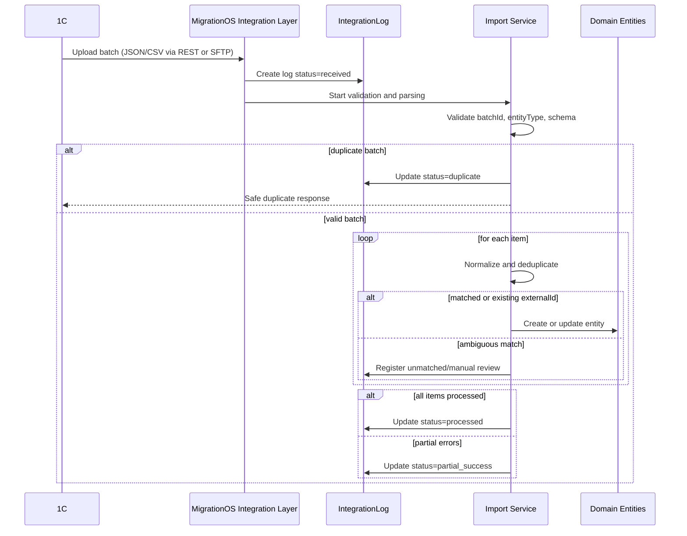
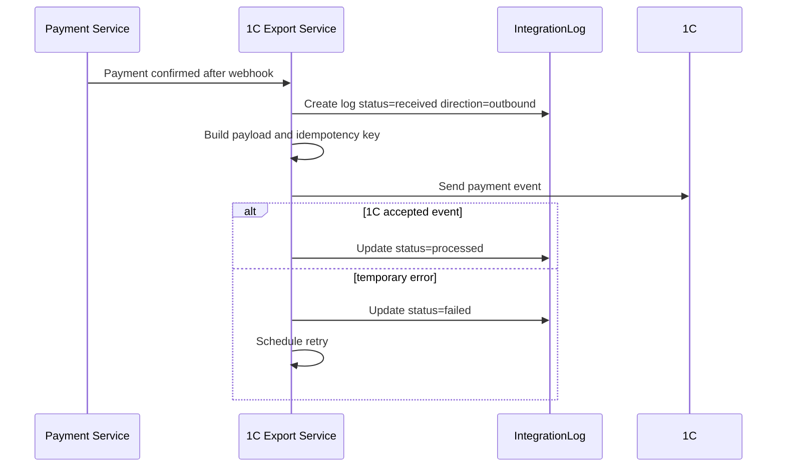

# 1C Integration — MigrationOS

## 1. Назначение документа

Документ описывает интеграцию MigrationOS с 1С для обмена операционными и учетными данными.

1C Integration нужен, чтобы:

- зафиксировать основные сценарии обмена между MigrationOS и 1С;
- разделить inbound- и outbound-потоки;
- описать допустимые протоколы и форматы обмена;
- определить правила сопоставления сущностей через external IDs;
- зафиксировать подход к mapping, дедупликации, идемпотентности и retry;
- определить правила журналирования через `IntegrationLog`;
- связать интеграцию с доменными сущностями MigrationOS и смежными API-документами.

---

## 2. Контекст интеграции

1С рассматривается как внешняя учетная или операционная система, в которой могут храниться:

- работодатели;
- мигранты;
- проекты;
- заявки;
- оплаты;
- счета, акты и операционные статусы;
- справочники и классификаторы.

MigrationOS использует эти данные для:

- формирования и актуализации карточек в своем контуре;
- поддержки бизнес-процессов миграционного сопровождения;
- синхронизации статусов заявок и оплат;
- построения аналитики и журналов интеграций.

Интеграция с 1С не предполагает прямого доступа 1С к базе данных MigrationOS. Все изменения проходят через backend-сервисы MigrationOS и подчиняются внутренним бизнес-правилам.

---

## 3. Границы ответственности

| Сторона | Ответственность |
|---|---|
| 1С | Хранить учетные данные в своем контуре |
| 1С | Предоставлять выгрузки, batch-файлы или API по согласованному контракту |
| 1С | Принимать данные от MigrationOS по согласованному контракту |
| MigrationOS | Валидировать входящие данные |
| MigrationOS | Сопоставлять внешние идентификаторы с внутренними сущностями |
| MigrationOS | Не создавать дубли при повторной доставке |
| MigrationOS | Нормализовать форматы и статусы |
| MigrationOS | Логировать критичный обмен в `IntegrationLog` |
| MigrationOS | Применять свои бизнес-правила к `Employer`, `Migrant`, `Project`, `Request`, `ServiceOrder`, `Payment` |

### Ключевой принцип

1С может быть источником master data и операционных событий, но MigrationOS остается владельцем своей предметной модели, своих статусов и своих правил доступа.

---

## 4. Варианты интеграции

Интеграция с 1С может быть реализована несколькими способами в зависимости от зрелости внешнего контура.

| Вариант | Когда подходит | Сильные стороны | Ограничения |
|---|---|---|---|
| `REST API` | Если 1С предоставляет HTTP API | Более быстрый обмен, удобная трассировка | Требует стабильного API со стороны 1С |
| `SFTP batch` | Если обмен идет файлами по расписанию | Хорошо подходит для bulk-обмена | Высокая задержка, сложнее разбирать частичные ошибки |
| `CSV` | Для MVP или регламентных выгрузок | Простота запуска | Слабая типизация, выше риск ошибок формата |
| `JSON batch` | Для структурированного пакетного обмена | Лучше для валидации и версии контракта | Нужна договоренность о схеме |
| `Hybrid` | Если часть данных идет online, часть batch | Гибкость | Более сложная поддержка и мониторинг |

---

## 5. Тип интеграции

| Параметр | Значение |
|---|---|
| Направление | `Inbound` / `Outbound` |
| Тип | `Sync` / `Batch` |
| Протокол | `REST API`, `SFTP` |
| Формат | `JSON`, `CSV`, `XLSX` |
| Критичность | High |
| Идемпотентность | По `externalId`, `batchId`, `eventId` |
| Основные сущности | `Employer`, `Migrant`, `Project`, `Request`, `ServiceOrder`, `Payment`, `IntegrationLog` |

---

## 6. Основные сценарии обмена

| Сценарий | Направление | Назначение |
|---|---|---|
| Импорт работодателей | `1С → MigrationOS` | Создать или обновить карточки работодателей |
| Импорт мигрантов | `1С → MigrationOS` | Создать или обновить карточки мигрантов |
| Импорт проектов | `1С → MigrationOS` | Сопоставить мигрантов с проектами |
| Импорт справочников | `1С → MigrationOS` | Синхронизировать статусы, классификаторы и типы |
| Передача заявок | `MigrationOS → 1С` | Передать заявки для учета или дальнейшей обработки |
| Передача оплат | `MigrationOS → 1С` | Передать подтвержденные оплаты после payment webhook |
| Передача статусов | `1С ↔ MigrationOS` | Согласовать операционные статусы и результаты обработки |

---

## 7. Inbound-сценарии

Inbound-сценарии описывают случаи, когда 1С передает данные в MigrationOS.

### 7.1. Импорт работодателей

| Поле 1С | Поле MigrationOS | Комментарий |
|---|---|---|
| `external_employer_id` | `Employer.externalId` | Внешний идентификатор |
| `name` | `Employer.name` | Наименование работодателя |
| `inn` | `Employer.inn` | ИНН |
| `kpp` | `Employer.kpp` | Используется, если предусмотрен в модели обмена |
| `contact_email` | `Employer.contactEmail` | Контактный email |
| `contact_phone` | `Employer.contactPhone` | Контактный телефон |
| `status` | `Employer.verificationStatus` или нормализованный статус | Требует mapping |

### 7.2. Импорт мигрантов

| Поле 1С | Поле MigrationOS | Комментарий |
|---|---|---|
| `external_migrant_id` | `Migrant.externalId` | Внешний идентификатор |
| `full_name` | `Migrant.fullName` | ФИО |
| `birth_date` | `Migrant.birthDate` | Дата рождения |
| `phone` | `Migrant.phone` | Телефон |
| `passport_number` | `Migrant.passportNumber` | Идентификационный документ |
| `citizenship` | `Migrant.citizenship` | Гражданство |
| `external_employer_id` | `Migrant.employerId` | Связь через mapping работодателя |
| `external_project_id` | `Migrant.projectId` | Связь через mapping проекта |
| `status` | `Migrant.status` | Требует нормализации |

### 7.3. Импорт проектов

| Поле 1С | Поле MigrationOS | Комментарий |
|---|---|---|
| `external_project_id` | `Project.externalId` | Внешний идентификатор проекта |
| `name` | `Project.name` | Название проекта |
| `description` | `Project.description` | Описание |
| `status` | `Project.status` | Нормализуется по правилам MigrationOS |

### 7.4. Импорт справочников

Справочники могут включать:

- типы документов;
- статусы внешней обработки;
- классификаторы услуг;
- справочники причин отклонения или блокировки.

Для MVP допустим частичный импорт справочников или ручное начальное заполнение с дальнейшей сверкой.

### 7.5. Пример JSON batch

```json
{
  "batchId": "1c_migrants_2026_05_12_001",
  "source": "1C",
  "entityType": "migrant",
  "createdAt": "2026-05-12T06:00:00Z",
  "items": [
    {
      "external_migrant_id": "1c_mig_10001",
      "full_name": "Иванов Али",
      "birth_date": "1995-04-12",
      "phone": "+79990000000",
      "passport_number": "AA1234567",
      "citizenship": "UZ",
      "external_employer_id": "1c_emp_50001",
      "external_project_id": "1c_prj_30001",
      "status": "active"
    }
  ]
}
```

### 7.6. Пример CSV

```csv
external_migrant_id,full_name,birth_date,phone,passport_number,citizenship,external_employer_id,external_project_id,status
1c_mig_10001,Иванов Али,1995-04-12,+79990000000,AA1234567,UZ,1c_emp_50001,1c_prj_30001,active
```

---

## 8. Outbound-сценарии

Outbound-сценарии описывают случаи, когда MigrationOS передает данные в 1С.

### 8.1. Передача заявок

MigrationOS может передавать в 1С заявки, которые требуют учета, выставления счета, операционной обработки или отчетности.

Пример payload:

```json
{
  "eventId": "mos_req_2026_000001",
  "entityType": "request",
  "request": {
    "id": "7d5b18f5-6a72-41ce-9b6d-bad1a0b10001",
    "requestType": "document_request",
    "status": "created",
    "migrantExternalId": "1c_mig_10001",
    "employerExternalId": "1c_emp_50001",
    "createdAt": "2026-05-12T10:00:00Z"
  }
}
```

### 8.2. Передача оплат

После подтверждения оплаты через payment webhook MigrationOS может передать статус платежа в 1С.

Пример payload:

```json
{
  "eventId": "mos_pay_2026_000001",
  "entityType": "payment",
  "payment": {
    "id": "7d5b18f5-6a72-41ce-9b6d-bad1a0b90001",
    "providerPaymentId": "sbp_pay_987654",
    "serviceOrderId": "7d5b18f5-6a72-41ce-9b6d-bad1a0b80001",
    "amount": 3500.00,
    "currency": "RUB",
    "status": "paid",
    "paidAt": "2026-05-12T09:15:00Z"
  }
}
```

### 8.3. Передача статусов обработки

В некоторых вариантах интеграции MigrationOS может отправлять в 1С:

- статус `Request`;
- статус `ServiceOrder`;
- финальный статус оплаты;
- внутренний идентификатор связанной сущности для обратной трассировки.

---

## 9. Master data и external IDs

Для надежной интеграции каждая сущность, пришедшая из 1С, должна иметь внешний идентификатор.

| Сущность | Внешний ID | Внутренний ID |
|---|---|---|
| `Employer` | `external_employer_id` | `employer_id` |
| `Migrant` | `external_migrant_id` | `migrant_id` |
| `Project` | `external_project_id` | `project_id` |
| `Request` | `external_request_id`, если используется | `request_id` |
| `Payment` | `external_payment_id` или `provider_payment_id` | `payment_id` |
| `ServiceOrder` | `external_service_order_id`, если используется | `service_order_id` |

### Правила external ID

| ID | Правило |
|---|---|
| `1C-ID-001` | External ID должен быть уникален в рамках типа сущности |
| `1C-ID-002` | Повторная загрузка с тем же external ID обновляет существующую запись, а не создает дубль |
| `1C-ID-003` | Если external ID отсутствует, используется fallback matching |
| `1C-ID-004` | Fallback matching не должен автоматически создавать связи при низкой уверенности |
| `1C-ID-005` | Все связи `external ID ↔ internal ID` должны быть трассируемыми |

---

## 10. Mapping и нормализация

### 10.1. Mapping основных сущностей

| Объект 1С | Объект MigrationOS | Комментарий |
|---|---|---|
| Организация / контрагент | `Employer` | Требует нормализации реквизитов |
| Физлицо / сотрудник / иностранный работник | `Migrant` | Требует осторожной дедупликации |
| Проект / объект / договор | `Project` | Может быть аналитическим проектом агентства |
| Обращение / задача / заявка | `Request` или `ServiceOrder` | Выбор зависит от бизнес-смысла |
| Оплата / платежное поручение | `Payment` | Финальный статус подтверждается по правилам MigrationOS |
| Справочник статусов | Enum / справочник MigrationOS | Требует явного mapping |

### 10.2. Нормализация статусов

| Статус 1С | Статус MigrationOS | Комментарий |
|---|---|---|
| `Активен` | `active` | Активная запись |
| `Новый` | `pending` | Требует обработки |
| `Заблокирован` | `blocked` | Ограниченный доступ |
| `Удален` | `archived` | Архивная запись |

### 10.3. Нормализация данных

| ID | Правило |
|---|---|
| `1C-NORM-001` | Телефон должен приводиться к единому формату |
| `1C-NORM-002` | Пустые и технические значения должны очищаться |
| `1C-NORM-003` | Дубли пробелов в ФИО должны удаляться |
| `1C-NORM-004` | Даты должны приводиться к ISO-формату `YYYY-MM-DD` |
| `1C-NORM-005` | Технические статусы 1С не должны напрямую попадать в API без mapping |

---

## 11. Deduplication

Дедупликация нужна, чтобы при повторных выгрузках не создавались повторные карточки.

### Приоритеты поиска мигранта

| Приоритет | Поля |
|---|---|
| 1 | `external_migrant_id` |
| 2 | `passport_number + birth_date` |
| 3 | `phone` |
| 4 | `full_name + birth_date` |

### Правила дедупликации

| ID | Правило |
|---|---|
| `1C-DEDUP-001` | Если найден `external ID`, выполняется update |
| `1C-DEDUP-002` | Если найден надежный fallback match, запись связывается с `external ID` |
| `1C-DEDUP-003` | Если найдено несколько кандидатов, запись уходит в `manual_review` |
| `1C-DEDUP-004` | Нельзя автоматически объединять карточки при слабом совпадении |
| `1C-DEDUP-005` | Результат дедупликации должен логироваться |

### Поведение при неоднозначности

При нескольких кандидатах MigrationOS должна:

- не обновлять карточки автоматически;
- зафиксировать событие как `unmatched` или `partial_success`;
- сформировать отчет для ручного разбора.

---

## 12. Идемпотентность

Идемпотентность нужна для повторной доставки batch-файлов или повторных REST-вызовов.

### Ключи идемпотентности

| Сценарий | Ключ |
|---|---|
| Batch import | `batchId + entityType` |
| Import item | `externalId + entityType` |
| Outbound event | `eventId` |
| Payment export | `providerPaymentId` или `payment.id` |

### Правила

| ID | Правило |
|---|---|
| `1C-IDEMP-001` | Повторный batch не должен создавать дубли |
| `1C-IDEMP-002` | Повторный item обновляет существующую запись |
| `1C-IDEMP-003` | Повторный outbound event не должен повторно менять состояние 1С |
| `1C-IDEMP-004` | Дубликаты фиксируются в `IntegrationLog` |

---

## 13. `IntegrationLog`

Каждый критичный обмен с 1С должен фиксироваться в `IntegrationLog`.

| Поле | Значение |
|---|---|
| `integration_name` | `1C` |
| `event_id` | `batchId`, `eventId` или внешний ID события |
| `direction` | `inbound` / `outbound` |
| `status` | `received`, `processed`, `partial_success`, `validation_error`, `duplicate`, `unmatched`, `failed` |
| `entity_type` | `Employer`, `Migrant`, `Project`, `Request`, `ServiceOrder`, `Payment` |
| `entity_id` | ID связанной сущности, если применимо |
| `payload_hash` | Hash payload или файла |

### Что логировать обязательно

- получение inbound batch;
- отправку outbound event;
- частично успешную обработку;
- duplicate- и unmatched-сценарии;
- валидационные ошибки;
- финальный статус обработки.

---

## 14. Error handling

Ошибки должны соответствовать [Error Model](../05_api/error-model.md).

| Ошибка | Поведение |
|---|---|
| Невалидный файл или JSON | `400 BAD_REQUEST` |
| Ошибка trust policy | `401 UNAUTHORIZED_INTEGRATION` или `403 FORBIDDEN` |
| Неверный формат даты | `422 VALIDATION_ERROR` |
| Не найден `Employer` для `Migrant` | `unmatched` или `validation_error` |
| Найдено несколько кандидатов | `manual_review` или `unmatched` |
| 1С недоступна | `503 SERVICE_UNAVAILABLE` |
| Частично успешная загрузка | `partial_success` + отчет по ошибкам |

### Важные принципы

| ID | Правило |
|---|---|
| `1C-ERR-001` | Ошибка одной строки batch не должна обязательно отменять весь batch |
| `1C-ERR-002` | При `partial_success` должен формироваться отчет по строкам |
| `1C-ERR-003` | Ошибки не должны раскрывать лишние ПДн |
| `1C-ERR-004` | Технические детали сохраняются в логах, а не в пользовательском ответе |

---

## 15. Retry policy

| Ситуация | Retry |
|---|---|
| Некорректный файл | Нет, нужен новый файл |
| Ошибка авторизации | Нет, нужно исправить доступы |
| Ошибка валидации отдельных строк | Нет для строк, да для всего batch только после исправления |
| Timeout при outbound REST | Да |
| 1С вернула `5xx` | Да |
| SFTP временно недоступен | Да |
| Duplicate batch | Нет, безопасная обработка как `duplicate` |

### Правила retry

| ID | Правило |
|---|---|
| `1C-RETRY-001` | Retry не должен создавать дубли |
| `1C-RETRY-002` | Batch retry должен использовать тот же `batchId` |
| `1C-RETRY-003` | После исчерпания retry событие получает статус `failed` |
| `1C-RETRY-004` | Ошибки отдельных строк должны попадать в отчет обработки |

---

## 16. Security and privacy

| ID | Требование |
|---|---|
| `1C-SEC-001` | Обмен должен идти через защищенный канал |
| `1C-SEC-002` | Доступы, токены и ключи не хранятся в коде |
| `1C-SEC-003` | Файлы обмена содержат ПДн и требуют ограниченного доступа |
| `1C-SEC-004` | Raw payload не должен храниться без необходимости |
| `1C-SEC-005` | Доступ к отчетам интеграции должен быть ограничен внутренними ролями |
| `1C-SEC-006` | Логи не должны содержать лишние ПДн |

Дополнительно:

- SFTP-каталоги должны быть разделены по окружениям;
- CSV/XLSX-файлы не должны храниться бессрочно без операционной причины;
- при REST-обмене желательно использовать взаимную аутентификацию, подпись или IP whitelist.

---

## 17. Monitoring and alerts

### Основные метрики

| Метрика | Назначение |
|---|---|
| Количество batch-загрузок | Контроль регулярности обмена |
| Количество обработанных строк | Контроль объема |
| Доля `validation_error` | Контроль качества данных |
| Количество `unmatched` записей | Контроль качества сопоставления |
| Количество дублей | Контроль качества external IDs |
| Время обработки batch | Контроль производительности |
| Ошибки outbound-вызовов | Контроль доступности 1С |

### Алерты

| Условие | Кому |
|---|---|
| Batch не пришел к контрольному времени | Support / Supervisor |
| Много validation errors | Support / Analyst |
| Много unmatched мигрантов | Support / Supervisor |
| 1С недоступна | Backend / Support |
| Повторяющиеся `partial_success` | Analyst / Support |

---

## 18. Sequence flow: batch import



---

## 19. Sequence flow: outbound payment export



---

## 20. Ограничения и открытые вопросы

| Вопрос | Комментарий |
|---|---|
| Доступен ли полноценный REST API 1С | Влияет на выбор протокола |
| Нужен ли двусторонний обмен по всем сущностям | Зависит от учетного процесса |
| Какие сущности считаются master data | Требует уточнения с бизнесом и архитектором |
| Какие справочники ведутся в 1С | Требует отдельного mapping |
| Как часто выполняется batch | Требует согласования SLA |
| Кто разбирает `unmatched` records | Требует операционного регламента |
| Нужна ли отдельная таблица mapping external IDs | Может потребоваться на физическом уровне |

---

## 21. Связанные артефакты

- [Integrations Overview](./integrations-overview.md)
- [Data Dictionary](../04_data-model/data-dictionary.md)
- [ERD](../04_data-model/erd.md)
- [Status Models](../04_data-model/status-models.md)
- [Error Model](../05_api/error-model.md)
- [Payment Webhook API](../05_api/payment-webhook.md)
- [Request Service API](../05_api/request-service-api.md)
