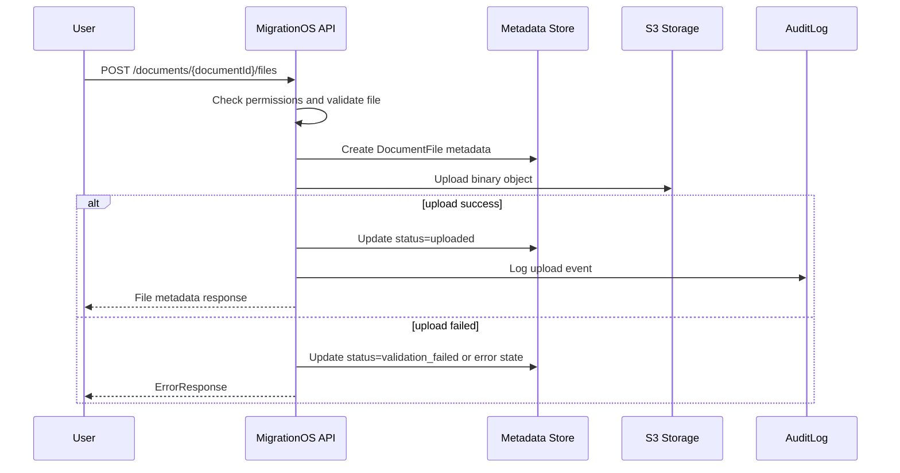
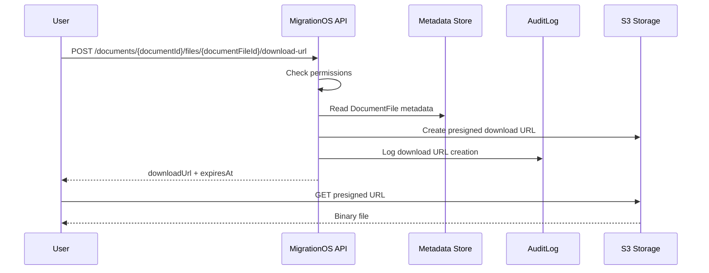

# S3 Storage Integration — MigrationOS

## 1. Назначение документа

Документ описывает интеграцию MigrationOS с S3-compatible storage для хранения файлов документов мигрантов и связанных сущностей.

S3 Storage Integration нужен, чтобы:

- описать правила загрузки и получения файлов;
- зафиксировать, что файлы не хранятся напрямую в базе данных;
- определить подход к `storageKey` и metadata;
- описать использование временных ссылок;
- определить требования к permissions и audit;
- описать валидацию файлов;
- зафиксировать требования к безопасности, ПДн и шифрованию;
- описать retry, ошибки, monitoring и ограничения.

---

## 2. Контекст интеграции

В MigrationOS пользователи загружают документы:

- паспорт;
- патент;
- миграционную карту;
- регистрацию;
- чеки оплаты;
- документы по заявкам;
- файлы, связанные с услугами.

Файлы могут содержать ПДн и чувствительные данные, поэтому должны храниться в защищенном объектном хранилище.

MigrationOS хранит в PostgreSQL не сам файл, а metadata:

- `document_id`;
- `file_name`;
- `mime_type`;
- `file_size`;
- `storage_key`;
- `uploaded_by`;
- `created_at`;
- статус файла или документа;
- audit-события доступа.

Ключевой принцип:

> Файлы документов не должны быть публичными.  
> MigrationOS хранит в БД только metadata и `storageKey`, а не binary content.

---

## 3. Границы ответственности

| Сторона | Ответственность |
|---|---|
| MigrationOS | Проверить пользователя, роль и permissions |
| MigrationOS | Провалидировать тип, размер и назначение файла |
| MigrationOS | Создать metadata-запись файла |
| MigrationOS | Сформировать `storageKey` |
| MigrationOS | Загрузить файл или выдать presigned URL |
| MigrationOS | Ограничить доступ к файлу через backend-проверку |
| MigrationOS | Логировать критичные действия |
| S3-compatible storage | Хранить binary object |
| S3-compatible storage | Обеспечивать доступ по подписанным URL |
| S3-compatible storage | Поддерживать server-side encryption, если настроено |
| S3-compatible storage | Возвращать технический результат операций upload/download |

### Ключевое правило

> Файлы документов не должны быть публично доступны.  
> Доступ к файлу выдается только после проверки permissions в MigrationOS.

---

## 4. Тип интеграции

| Параметр | Значение |
|---|---|
| Направление | Outbound |
| Тип | Object storage |
| Протокол | S3 API / HTTPS |
| Формат | Binary + metadata |
| Критичность | High |
| Идемпотентность | По `documentId + fileHash` или `uploadId` |
| Основные сущности | `Document`, `DocumentFile`, `User`, `AuditLog`, `IntegrationLog` |

---

## 5. Основные сценарии

| Сценарий | Описание |
|---|---|
| Upload document file | Пользователь загружает файл документа |
| Replace document file | Пользователь заменяет файл до проверки |
| Download document file | Пользователь или менеджер получает файл |
| Generate presigned URL | Backend выдает временную ссылку после проверки доступа |
| Delete / archive file | Файл помечается как архивный или удаляется по регламенту |
| Virus scan / validation | Файл проходит техническую проверку, если предусмотрено |
| Audit file access | Доступ к файлу фиксируется в логах |

---

## 6. Storage model

MigrationOS не хранит файлы в БД.

### 6.1. Что хранится в БД

| Поле | Описание |
|---|---|
| `id` | ID записи файла |
| `document_id` | Связанный документ |
| `storage_key` | Ключ объекта в S3 |
| `file_name` | Исходное имя файла |
| `mime_type` | MIME type |
| `file_size` | Размер файла |
| `file_hash` | Hash файла, если используется |
| `uploaded_by` | Пользователь, загрузивший файл |
| `status` | Статус файла |
| `created_at` | Дата загрузки |

### 6.2. Что хранится в S3

| Объект | Описание |
|---|---|
| Binary file | Сам файл документа |
| Object metadata | Технические metadata, если используются |
| Encryption metadata | Параметры шифрования, если доступны |

### 6.3. Принцип разделения

База данных отвечает за:

- связи между сущностями;
- проверку доступа;
- жизненный цикл документа;
- аудит.

S3-compatible storage отвечает за:

- хранение binary content;
- выдачу доступа по подписанным ссылкам;
- технические операции object storage.

---

## 7. `storageKey`

`storageKey` — это внутренний ключ файла в объектном хранилище.

Пример структуры:

```text
documents/{migrantId}/{documentId}/{fileId}.pdf
```

### Правила

| ID | Правило |
|---|---|
| `S3-KEY-001` | `storageKey` не должен содержать исходное ФИО или паспортные данные |
| `S3-KEY-002` | `storageKey` должен быть уникальным |
| `S3-KEY-003` | `storageKey` должен позволять логически группировать файлы |
| `S3-KEY-004` | Клиент не должен сам формировать `storageKey` |
| `S3-KEY-005` | `storageKey` не должен использоваться как permission mechanism |

---

## 8. Upload flow

### 8.1. Вариант A: upload через backend

Frontend отправляет файл в MigrationOS API, backend валидирует и загружает файл в S3.

Плюсы:

- проще контролировать валидацию;
- backend полностью контролирует процесс;
- удобнее для MVP.

Минусы:

- backend принимает тяжелый трафик;
- требуется контроль лимитов и таймаутов.

### 8.2. Вариант B: upload через presigned URL

Backend проверяет permissions, создает upload session и выдает временный URL для загрузки напрямую в S3.

Плюсы:

- меньше нагрузка на backend;
- лучше для больших файлов;
- проще масштабировать загрузки.

Минусы:

- сложнее flow;
- нужна финализация upload;
- нужно дополнительно проверять результат загрузки.

---

## 9. Upload через backend

### 9.1. Endpoint

```http
POST /api/v1/documents/{documentId}/files
```

### 9.2. Пример request metadata

```json
{
  "fileName": "patent.pdf",
  "mimeType": "application/pdf",
  "fileSize": 1245000
}
```

### 9.3. Пример response

```json
{
  "id": "7d5b18f5-6a72-41ce-9b6d-bad1a0b70001",
  "documentId": "7d5b18f5-6a72-41ce-9b6d-bad1a0b60001",
  "storageKey": "documents/7d5b18f5-6a72-41ce-9b6d-bad1a0b20001/7d5b18f5-6a72-41ce-9b6d-bad1a0b60001/7d5b18f5-6a72-41ce-9b6d-bad1a0b70001.pdf",
  "fileName": "patent.pdf",
  "mimeType": "application/pdf",
  "fileSize": 1245000,
  "status": "uploaded",
  "createdAt": "2026-05-12T10:00:00Z"
}
```

### 9.4. Рекомендуемый порядок действий

1. Проверить роль, permission и контекст доступа.
2. Проверить, что `documentId` существует и доступен пользователю.
3. Провалидировать имя файла, MIME type, размер и лимиты.
4. Создать metadata-запись файла.
5. Сформировать `storageKey`.
6. Загрузить binary content в S3.
7. Обновить статус файла и связанные audit/integration записи.

---

## 10. Presigned URL flow

### 10.1. Создание upload session

```http
POST /api/v1/documents/{documentId}/files/upload-session
```

Request:

```json
{
  "fileName": "patent.pdf",
  "mimeType": "application/pdf",
  "fileSize": 1245000
}
```

Response:

```json
{
  "uploadId": "upl_2026_000001",
  "documentFileId": "7d5b18f5-6a72-41ce-9b6d-bad1a0b70001",
  "uploadUrl": "https://s3.example.com/presigned-upload-url",
  "storageKey": "documents/7d5b18f5-6a72-41ce-9b6d-bad1a0b20001/7d5b18f5-6a72-41ce-9b6d-bad1a0b60001/7d5b18f5-6a72-41ce-9b6d-bad1a0b70001.pdf",
  "expiresAt": "2026-05-12T10:15:00Z"
}
```

### 10.2. Финализация upload

```http
POST /api/v1/documents/{documentId}/files/{documentFileId}/complete
```

Request:

```json
{
  "uploadId": "upl_2026_000001",
  "fileHash": "sha256:abc123"
}
```

Response:

```json
{
  "documentFileId": "7d5b18f5-6a72-41ce-9b6d-bad1a0b70001",
  "status": "uploaded",
  "completedAt": "2026-05-12T10:05:00Z"
}
```

### 10.3. TTL для upload session

Presigned URL и upload session должны иметь короткий TTL.

Рекомендуемый ориентир для MVP:

- `10–15 минут` для upload URL;
- повторное получение новой session после истечения TTL.

---

## 11. Download flow

Клиент не должен получать постоянный публичный URL файла.

### 11.1. Endpoint для получения временной ссылки

```http
POST /api/v1/documents/{documentId}/files/{documentFileId}/download-url
```

Response:

```json
{
  "downloadUrl": "https://s3.example.com/presigned-download-url",
  "expiresAt": "2026-05-12T10:20:00Z"
}
```

### 11.2. Правила download

| ID | Правило |
|---|---|
| `S3-DOWN-001` | Перед выдачей ссылки backend проверяет permissions |
| `S3-DOWN-002` | Presigned URL имеет короткий TTL |
| `S3-DOWN-003` | URL не должен сохраняться как постоянная ссылка |
| `S3-DOWN-004` | Доступ к чувствительным файлам должен логироваться |
| `S3-DOWN-005` | Пользователь не должен получать файл, если потерял доступ к сущности |

### 11.3. TTL для download URL

Для download URL рекомендуется:

- короткий TTL, например `5–15 минут`;
- отсутствие кеширования URL как постоянной ссылки;
- повторная генерация через backend при необходимости.

---

## 12. Permissions

Доступ к файлам зависит от роли и контекста.

| Роль | Доступ |
|---|---|
| `migrant` | Может загружать и смотреть свои документы |
| `employer` | Видит документы мигрантов своей организации в рамках permissions |
| `manager` | Видит документы в своем scope |
| `supervisor` | Видит документы в расширенном операционном scope |
| `superadmin` | Административный доступ |

### Правила

| ID | Правило |
|---|---|
| `S3-PERM-001` | Проверка доступа выполняется до upload/download |
| `S3-PERM-002` | `storageKey` не является доказательством доступа |
| `S3-PERM-003` | Presigned URL создается только backend-сервисом |
| `S3-PERM-004` | Внешние роли не должны получать файлы вне своего контекста |

---

## 13. File validation

| Проверка | Ошибка |
|---|---|
| MIME type разрешен | `VALIDATION_ERROR` |
| Размер файла в допустимом лимите | `VALIDATION_ERROR` |
| Файл не пустой | `VALIDATION_ERROR` |
| Расширение соответствует типу | `VALIDATION_ERROR` |
| Количество файлов не превышает лимит | `VALIDATION_ERROR` |
| Файл относится к доступному `documentId` | `FORBIDDEN` или `NOT_FOUND` |

### Допустимые типы для MVP

| MIME type | Комментарий |
|---|---|
| `application/pdf` | PDF-документы |
| `image/jpeg` | Фото документа |
| `image/png` | Фото документа |

### Дополнительные проверки

При необходимости можно предусмотреть:

- антивирусную проверку;
- контроль сигнатуры файла;
- проверку content-type по содержимому, а не только по имени;
- ограничение по количеству одновременных upload.

---

## 14. Metadata и object metadata

Metadata файла на стороне MigrationOS может включать:

- business metadata в БД;
- технические object metadata в S3, если это нужно для эксплуатации.

### Пример технической metadata

```json
{
  "storageKey": "documents/7d5b18f5-6a72-41ce-9b6d-bad1a0b20001/7d5b18f5-6a72-41ce-9b6d-bad1a0b60001/7d5b18f5-6a72-41ce-9b6d-bad1a0b70001.pdf",
  "contentType": "application/pdf",
  "contentLength": 1245000,
  "checksum": "sha256:abc123",
  "documentId": "7d5b18f5-6a72-41ce-9b6d-bad1a0b60001"
}
```

MigrationOS должна считать главным источником истины свою metadata-модель в БД, а не object metadata в S3.

---

## 15. Status model

Файл может иметь статусы:

| Статус | Значение |
|---|---|
| `created` | Metadata создана |
| `uploading` | Идет загрузка |
| `uploaded` | Файл загружен |
| `validation_failed` | Файл не прошел проверку |
| `archived` | Файл архивирован |
| `deleted` | Файл удален по регламенту |

Статусная модель файла должна быть согласована с общей моделью документа и жизненным циклом `Document`.

---

## 16. Encryption

Для файлов с ПДн необходимо использовать шифрование на стороне хранилища.

### Правила

| ID | Правило |
|---|---|
| `S3-ENC-001` | Bucket или объект должен использовать server-side encryption |
| `S3-ENC-002` | Ключи шифрования не должны храниться в коде приложения |
| `S3-ENC-003` | При необходимости должен поддерживаться KMS или аналогичный managed key service |
| `S3-ENC-004` | Незашифрованные файлы не должны использоваться в production-контуре |

---

## 17. Audit and logging

Критичные действия с файлами должны логироваться.

| Действие | Где логировать |
|---|---|
| Загрузка файла | `AuditLog` / `IntegrationLog` |
| Получение `downloadUrl` | `AuditLog` |
| Замена файла | `AuditLog` |
| Архивация файла | `AuditLog` |
| Ошибка S3 | `IntegrationLog` |
| Ошибка доступа | Security log |

Пример audit-события:

```json
{
  "actorUserId": "7d5b18f5-6a72-41ce-9b6d-bad1a0b40001",
  "action": "document_file.download_url_created",
  "entityType": "DocumentFile",
  "entityId": "7d5b18f5-6a72-41ce-9b6d-bad1a0b70001",
  "createdAt": "2026-05-12T10:10:00Z"
}
```

---

## 18. Retention and deletion

| Сценарий | Правило |
|---|---|
| Документ заменен | Старый файл архивируется или помечается как неактуальный |
| Документ удален пользователем | Файл может быть soft-deleted по регламенту |
| Истек срок хранения | Файл удаляется или архивируется по retention policy |
| Юридическое хранение обязательно | Файл сохраняется до окончания срока хранения |
| Пользователь потерял доступ | Файл не удаляется, но доступ запрещается |

### Правила retention

| ID | Правило |
|---|---|
| `S3-RET-001` | Удаление файла должно учитывать юридические и операционные сроки хранения |
| `S3-RET-002` | Архивирование предпочтительнее немедленного физического удаления, если документ связан с аудитом |
| `S3-RET-003` | Политика retention должна быть согласована с безопасностью и комплаенсом |

---

## 19. Error handling

Ошибки должны соответствовать [Error Model](../05_api/error-model.md).

| Ошибка | Поведение |
|---|---|
| Файл слишком большой | `422 VALIDATION_ERROR` |
| MIME type запрещен | `422 VALIDATION_ERROR` |
| Нет доступа к документу | `403 FORBIDDEN` или безопасный `404` |
| Документ не найден | `404 NOT_FOUND` |
| S3 timeout | Retry или `503 SERVICE_UNAVAILABLE` |
| S3 недоступен | `503 SERVICE_UNAVAILABLE` |
| Upload session истекла | `409 CONFLICT` или `422 VALIDATION_ERROR` |
| File hash mismatch | `422 VALIDATION_ERROR` |

---

## 20. Retry policy

| Ситуация | Retry |
|---|---|
| S3 timeout | Да |
| S3 `5xx` | Да |
| Network error | Да |
| Invalid credentials | Нет, нужен alert backend/devops |
| Access denied from S3 | Нет, проверить bucket policy |
| File validation failed | Нет |
| Presigned URL expired | Нет, нужно создать новую upload/download session |

### Правила retry

| ID | Правило |
|---|---|
| `S3-RETRY-001` | Retry upload не должен создавать дубль metadata без необходимости |
| `S3-RETRY-002` | Повтор должен использовать существующий `uploadId`, если session активна |
| `S3-RETRY-003` | После неуспешной загрузки metadata должна получить корректный статус |
| `S3-RETRY-004` | Ошибка S3 не должна оставлять документ в противоречивом состоянии |

---

## 21. Security and privacy

| ID | Требование |
|---|---|
| `S3-SEC-001` | Bucket не должен быть публичным |
| `S3-SEC-002` | Все файлы передаются по HTTPS |
| `S3-SEC-003` | Файлы должны храниться с server-side encryption |
| `S3-SEC-004` | Presigned URL должен иметь короткий TTL |
| `S3-SEC-005` | Файлы с ПДн доступны только после backend-проверки permissions |
| `S3-SEC-006` | `storageKey` не должен содержать ПДн |
| `S3-SEC-007` | Доступы к S3 не хранятся в коде |
| `S3-SEC-008` | Логи не должны содержать presigned URL целиком |

### Дополнительные принципы

- presigned URL не должен использоваться как постоянный идентификатор файла;
- прямой листинг bucket со стороны клиента недопустим;
- object storage должен использоваться только через контролируемые backend-сценарии.

---

## 22. Monitoring and alerts

| Метрика | Назначение |
|---|---|
| Количество upload-операций | Контроль нагрузки |
| Доля failed upload | Контроль качества канала |
| Средний размер файла | Контроль storage capacity |
| Количество download URL | Контроль доступа |
| Ошибки S3 `5xx` | Контроль доступности хранилища |
| Access denied errors | Контроль security |
| Количество expired upload sessions | Контроль UX |

Алерты:

| Условие | Кому |
|---|---|
| S3 недоступен | Backend / DevOps |
| Резкий рост failed upload | Backend / Support |
| Много access denied | Security / Backend |
| Bucket policy изменилась | DevOps / Security |
| Storage quota почти исчерпана | DevOps |

---

## 23. Sequence flow: upload через backend



---

## 24. Sequence flow: download через presigned URL



---

## 25. Ограничения и открытые вопросы

| Вопрос | Комментарий |
|---|---|
| Используется ли upload через backend или presigned URL | Может зависеть от MVP и нагрузки |
| Нужен ли antivirus scan | Желательно для production |
| Какой максимальный размер файла | Требует продуктового и технического решения |
| Какой TTL у presigned URL | В ТЗ указан ориентир `15 минут` |
| Какой retention policy | Требует юридического согласования |
| Нужна ли версионность файлов | Полезно при замене документов |

---

## 26. Связанные артефакты

- [Integrations Overview](./integrations-overview.md)
- [Data Dictionary](../04_data-model/data-dictionary.md)
- [ERD](../04_data-model/erd.md)
- [Status Models](../04_data-model/status-models.md)
- [Error Model](../05_api/error-model.md)
- [BPMN Document Upload](../03_processes/bpmn_document-upload.md)
- [Permissions](../02_roles-and-access/permissions.md)
