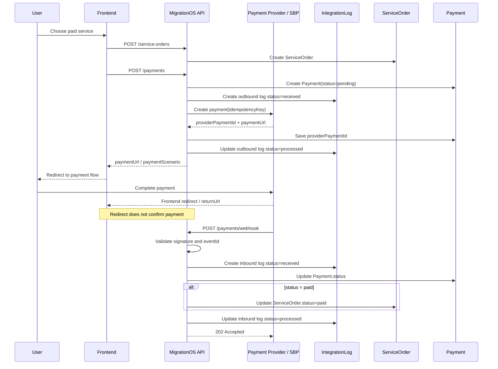

# SBP Payment Integration — MigrationOS

## 1. Назначение документа

Документ описывает интеграцию MigrationOS с СБП или платежным провайдером для создания платежей и получения подтверждений оплаты.

SBP Payment Integration нужен, чтобы:

- описать полный платежный flow;
- зафиксировать границы ответственности MigrationOS и платежного провайдера;
- определить правила создания платежа;
- описать получение подтверждения оплаты через webhook;
- исключить ошибочное подтверждение оплаты через frontend redirect;
- определить правила идемпотентности;
- описать обновление `Payment` и `ServiceOrder`;
- зафиксировать журналирование через `IntegrationLog`;
- описать ошибки, retry, security и monitoring.

---

## 2. Контекст интеграции

В MigrationOS пользователь может заказать платную услугу через marketplace.

После создания заявки на услугу система должна:

1. создать `ServiceOrder`;
2. создать запись `Payment`;
3. запросить у платежного провайдера платежный сценарий или ссылку;
4. передать пользователю возможность оплатить;
5. получить финальное подтверждение оплаты через webhook;
6. обновить `Payment.status`;
7. обновить `ServiceOrder.status`;
8. отправить уведомления участникам процесса.

Ключевое правило:

> Frontend redirect после оплаты не является подтверждением оплаты.  
> Источником истины является только payment webhook от платежного провайдера.

Это правило должно соблюдаться во всех сценариях: web, mobile, deep link, callback URL и пользовательский возврат после оплаты.

---

## 3. Границы ответственности

| Сторона | Ответственность |
|---|---|
| MigrationOS | Создать заявку на услугу |
| MigrationOS | Создать платежную запись |
| MigrationOS | Передать запрос на создание платежа провайдеру |
| MigrationOS | Сохранить `providerPaymentId` и платежный сценарий |
| MigrationOS | Принять payment webhook |
| MigrationOS | Проверить trust policy и подпись |
| MigrationOS | Обновить `Payment` и `ServiceOrder` |
| MigrationOS | Записать событие в `IntegrationLog` |
| Платежный провайдер / СБП | Создать платежный сценарий |
| Платежный провайдер / СБП | Обработать оплату пользователя |
| Платежный провайдер / СБП | Отправить webhook с финальным статусом платежа |

### Ключевой вывод

Провайдер подтверждает факт оплаты. MigrationOS интерпретирует результат, применяет свои статусные модели и изменяет внутренние сущности только после доверенного webhook.

---

## 4. Тип интеграции

| Параметр | Значение |
|---|---|
| Направление | Outbound + Inbound |
| Тип | Sync API + Webhook |
| Протокол | HTTPS REST |
| Формат | JSON |
| Критичность | High |
| Идемпотентность | `eventId`, `providerPaymentId`, `idempotencyKey` |
| Основные сущности | `Payment`, `ServiceOrder`, `IntegrationLog`, `Notification` |

---

## 5. Основной платежный flow

1. Пользователь выбирает услугу в marketplace.
2. MigrationOS создает `ServiceOrder` со статусом `waiting_payment`.
3. MigrationOS создает `Payment` со статусом `pending`.
4. MigrationOS вызывает API платежного провайдера для создания платежа.
5. Провайдер возвращает `providerPaymentId` и платежную ссылку или сценарий.
6. Пользователь переходит к оплате.
7. После оплаты пользователь может вернуться во frontend по redirect URL.
8. MigrationOS не меняет статус оплаты на основании redirect.
9. Провайдер отправляет payment webhook.
10. MigrationOS проверяет webhook.
11. MigrationOS обновляет `Payment.status`.
12. Если статус `paid`, MigrationOS обновляет `ServiceOrder.status = paid`.
13. MigrationOS создает уведомление пользователю или менеджеру.
14. MigrationOS фиксирует событие в `IntegrationLog`.

---

## 6. Создание платежа

### 6.1. Endpoint MigrationOS

```http
POST /api/v1/payments
```

### 6.2. Пример request от frontend в MigrationOS

```json
{
  "serviceOrderId": "7d5b18f5-6a72-41ce-9b6d-bad1a0b80001",
  "provider": "sbp",
  "amount": 3500.00,
  "currency": "RUB"
}
```

### 6.3. Пример outbound request в платежный провайдер

```json
{
  "idempotencyKey": "pay_create_7d5b18f5_001",
  "amount": 3500.00,
  "currency": "RUB",
  "description": "Оплата услуги MigrationOS",
  "returnUrl": "https://migrationos.example.com/payments/result",
  "webhookUrl": "https://api.migrationos.example.com/api/v1/payments/webhook",
  "metadata": {
    "paymentId": "7d5b18f5-6a72-41ce-9b6d-bad1a0b90001",
    "serviceOrderId": "7d5b18f5-6a72-41ce-9b6d-bad1a0b80001"
  }
}
```

### 6.4. Пример ответа провайдера

```json
{
  "providerPaymentId": "sbp_pay_987654",
  "status": "pending",
  "paymentUrl": "https://pay.example.com/sbp/sbp_pay_987654",
  "expiresAt": "2026-05-12T10:15:00Z"
}
```

### 6.5. Что сохраняет MigrationOS

После успешного ответа провайдера MigrationOS должна сохранить:

- `providerPaymentId`;
- текущий внешний статус платежа, если он нужен для трассировки;
- `paymentUrl` или иной признак сценария оплаты;
- время истечения ссылки, если провайдер его возвращает;
- outbound-событие в `IntegrationLog`.

---

## 7. Payment link / payment scenario

Платежный провайдер может возвращать:

- `paymentUrl` для web-сценария;
- QR/СБП-сценарий;
- deep link для мобильного банка;
- иной токенизированный сценарий оплаты.

### Правила

| ID | Правило |
|---|---|
| `SBP-FLOW-001` | Frontend получает только платежный сценарий, но не подтверждает факт оплаты |
| `SBP-FLOW-002` | Истечение `paymentUrl` не означает автоматически `paid` или `failed` |
| `SBP-FLOW-003` | Повторное создание платежа должно учитывать существующий `pending`-платеж |
| `SBP-FLOW-004` | Redirect-страница используется только для UX, а не как источник истины |

---

## 8. Payment webhook

Финальный статус оплаты приходит через webhook:

```http
POST /api/v1/payments/webhook
```

Детальный контракт endpoint описан в документе [Payment Webhook API](../05_api/payment-webhook.md).

### 8.1. Пример webhook об успешной оплате

```json
{
  "eventId": "pay_evt_2026_000001",
  "provider": "sbp",
  "providerPaymentId": "sbp_pay_987654",
  "serviceOrderId": "7d5b18f5-6a72-41ce-9b6d-bad1a0b80001",
  "status": "paid",
  "amount": 3500.00,
  "currency": "RUB",
  "processedAt": "2026-05-12T09:15:00Z"
}
```

### 8.2. Пример webhook об ошибке оплаты

```json
{
  "eventId": "pay_evt_2026_000002",
  "provider": "sbp",
  "providerPaymentId": "sbp_pay_987655",
  "serviceOrderId": "7d5b18f5-6a72-41ce-9b6d-bad1a0b80002",
  "status": "failed",
  "amount": 3500.00,
  "currency": "RUB",
  "processedAt": "2026-05-12T09:20:00Z",
  "failureReason": "Payment declined"
}
```

---

## 9. Trust policy webhook

Для payment webhook не используется пользовательский `Bearer` token.

Доверие к источнику обеспечивается интеграционной политикой.

| Механизм | Назначение |
|---|---|
| `Signature` | Проверка подлинности и целостности payload |
| `API key` | Проверка доверенного клиента |
| `IP whitelist` | Ограничение допустимых источников |
| `HTTPS` | Защита канала |
| `eventId` | Идемпотентность события |
| `providerPaymentId` | Сопоставление с платежом |

Пример заголовков:

```http
X-Integration-Name: SBP
X-Api-Key: <integration_api_key>
X-Signature: sha256=<signature>
Content-Type: application/json
```

### Правила trust policy

| ID | Правило |
|---|---|
| `SBP-SEC-001` | Webhook принимается только от доверенного источника |
| `SBP-SEC-002` | Если trust policy не пройдена, `Payment` и `ServiceOrder` не меняются |
| `SBP-SEC-003` | Детали проверки подписи не раскрываются во внешнем ответе |
| `SBP-SEC-004` | Секреты интеграции не хранятся в коде |
| `SBP-SEC-005` | Все webhook-вызовы выполняются только по HTTPS |

---

## 10. Статусы платежей

### 10.1. Mapping статусов провайдера

| Статус провайдера | `Payment.status` | Описание |
|---|---|---|
| `pending` | `pending` | Платеж ожидает подтверждения |
| `paid` | `paid` | Платеж успешно подтвержден |
| `failed` | `failed` | Оплата завершилась ошибкой |
| `cancelled` | `cancelled` | Платеж отменен |
| `refunded` | `refunded` | Выполнен возврат |

### 10.2. Влияние на `ServiceOrder`

| `Payment.status` | `ServiceOrder.status` | Поведение |
|---|---|---|
| `pending` | `waiting_payment` | Заявка ожидает оплаты |
| `paid` | `paid` | Заявка может перейти в обработку |
| `failed` | `waiting_payment` | Пользователь может попробовать оплатить заново |
| `cancelled` | `cancelled` или `waiting_payment` | Зависит от бизнес-правил |
| `refunded` | `cancelled` или отдельный refund-flow | Для MVP может быть ограничено |

### 10.3. Правила статусов

| ID | Правило |
|---|---|
| `SBP-STATE-001` | `paid` устанавливается только по webhook |
| `SBP-STATE-002` | Redirect пользователя не переводит `Payment` в `paid` |
| `SBP-STATE-003` | Недопустимый статусный переход возвращает `409 Conflict` |
| `SBP-STATE-004` | Повторный `paid` webhook не должен повторно менять `ServiceOrder` |

---

## 11. Идемпотентность

Идемпотентность нужна в двух местах:

- создание платежа во внешнем провайдере;
- обработка payment webhook.

### 11.1. Ключи идемпотентности

| Сценарий | Ключ |
|---|---|
| Создание платежа | `idempotencyKey` |
| Webhook event | `eventId` |
| Сопоставление платежа | `providerPaymentId` |
| Повторный `paid` webhook | `providerPaymentId + status` |

### 11.2. Правила

| ID | Правило |
|---|---|
| `SBP-IDEMP-001` | Повторное создание платежа с тем же ключом не должно создавать новый платеж |
| `SBP-IDEMP-002` | Повторный webhook с тем же `eventId` не должен повторно менять `Payment` |
| `SBP-IDEMP-003` | Повторный `paid` webhook не должен повторно менять `ServiceOrder` |
| `SBP-IDEMP-004` | Повторный webhook не должен повторно отправлять уведомления |
| `SBP-IDEMP-005` | Дубликаты фиксируются в `IntegrationLog` |

---

## 12. `providerPaymentId`

`providerPaymentId` является ключевым внешним идентификатором платежа на стороне провайдера.

### Назначение

- однозначное сопоставление webhook с `Payment`;
- трассировка обмена в `IntegrationLog`;
- поддержка идемпотентной повторной доставки событий;
- сверка с 1С или финансовыми отчетами при необходимости.

### Правила

| ID | Правило |
|---|---|
| `SBP-PROVIDER-001` | `providerPaymentId` должен сохраняться сразу после успешного создания платежа |
| `SBP-PROVIDER-002` | Один `providerPaymentId` не должен быть связан с несколькими `Payment` |
| `SBP-PROVIDER-003` | Если webhook пришел с неизвестным `providerPaymentId`, событие должно быть помечено как `unmatched` или `PAYMENT_NOT_FOUND` |
| `SBP-PROVIDER-004` | `providerPaymentId` используется как ключ финансовой трассировки |

---

## 13. Валидации

| ID | Проверка | Ошибка |
|---|---|---|
| `SBP-VAL-001` | `eventId` заполнен | `VALIDATION_ERROR` |
| `SBP-VAL-002` | `providerPaymentId` заполнен | `VALIDATION_ERROR` |
| `SBP-VAL-003` | `status` входит в допустимый enum | `VALIDATION_ERROR` |
| `SBP-VAL-004` | `amount > 0` | `VALIDATION_ERROR` |
| `SBP-VAL-005` | `currency = RUB` для MVP | `VALIDATION_ERROR` |
| `SBP-VAL-006` | Сумма webhook совпадает с ожидаемой суммой платежа | `AMOUNT_MISMATCH` |
| `SBP-VAL-007` | Валюта webhook совпадает с валютой платежа | `CURRENCY_MISMATCH` |
| `SBP-VAL-008` | Платеж найден по `providerPaymentId` | `PAYMENT_NOT_FOUND` |
| `SBP-VAL-009` | Статусный переход допустим | `PAYMENT_STATUS_NOT_ALLOWED` |
| `SBP-VAL-010` | Trust policy пройдена | `UNAUTHORIZED_INTEGRATION` |

---

## 14. `IntegrationLog`

Каждый критичный вызов платежной интеграции должен фиксироваться в `IntegrationLog`.

### 14.1. Типовые события

| Событие | Direction | Status |
|---|---|---|
| Создание платежа у провайдера | `outbound` | `received`, `processed`, `failed` |
| Получение payment webhook | `inbound` | `received`, `processed`, `duplicate`, `validation_error`, `failed`, `unmatched` |
| Ошибка подписи | `inbound` | `failed` или security-specific internal status |
| Дубликат webhook | `inbound` | `duplicate` |
| Платеж не найден | `inbound` | `unmatched` |
| Успешное подтверждение оплаты | `inbound` | `processed` |

### 14.2. Основные поля

| Поле | Значение |
|---|---|
| `integration_name` | `SBP` или конкретное имя провайдера |
| `event_id` | `eventId` или `idempotencyKey` |
| `direction` | `inbound` / `outbound` |
| `status` | Статус обработки |
| `entity_type` | `Payment` |
| `entity_id` | ID платежа |
| `payload_hash` | SHA-256 hash payload |

---

## 15. Error handling

Ошибки должны соответствовать [Error Model](../05_api/error-model.md).

| Ошибка | Поведение |
|---|---|
| Невалидный JSON | `400 BAD_REQUEST` |
| Не пройдена trust policy | `401 UNAUTHORIZED_INTEGRATION` или `403 FORBIDDEN` |
| Платеж не найден | `202 unmatched` или `422 PAYMENT_NOT_FOUND` |
| Сумма не совпадает | `422 AMOUNT_MISMATCH` |
| Валюта не совпадает | `422 CURRENCY_MISMATCH` |
| Недопустимый статусный переход | `409 PAYMENT_STATUS_NOT_ALLOWED` |
| Дубликат webhook | `202 duplicate` |
| Провайдер недоступен | `503 PAYMENT_PROVIDER_UNAVAILABLE` |
| Внутренняя ошибка | `500 INTERNAL_ERROR` |

### Пример ошибки несоответствия суммы

```json
{
  "error": {
    "code": "AMOUNT_MISMATCH",
    "message": "Webhook amount does not match expected payment amount",
    "traceId": "req-224"
  }
}
```

### Пример accepted-ответа для duplicate webhook

```json
{
  "accepted": true,
  "status": "duplicate",
  "eventId": "pay_evt_2026_000001"
}
```

---

## 16. Retry policy

| Ситуация | Retry |
|---|---|
| Создание платежа: timeout | Да, с тем же `idempotencyKey` |
| Создание платежа: `5xx` от провайдера | Да |
| Создание платежа: `4xx` | Нет, требуется исправление запроса |
| Webhook: `202` | Повтор не требуется |
| Webhook: `400` | Повтор не нужен до исправления payload |
| Webhook: `401/403` | Повтор не нужен до исправления trust policy |
| Webhook: `500/503` | Провайдер может повторить отправку |
| Timeout webhook | Провайдер может повторить с тем же `eventId` |

### Правила retry

| ID | Правило |
|---|---|
| `SBP-RETRY-001` | Retry создания платежа использует тот же `idempotencyKey` |
| `SBP-RETRY-002` | Retry webhook использует тот же `eventId` |
| `SBP-RETRY-003` | Повтор не должен создавать дубли `Payment` |
| `SBP-RETRY-004` | Повтор не должен повторно переводить `ServiceOrder` в `paid` |
| `SBP-RETRY-005` | После исчерпания retry событие получает статус `failed` |

---

## 17. Security and privacy

| ID | Требование |
|---|---|
| `SBP-SEC-001` | Все вызовы должны выполняться по HTTPS |
| `SBP-SEC-002` | Секреты, API keys и signing keys не хранятся в коде |
| `SBP-SEC-003` | Подпись webhook проверяется до обработки payload |
| `SBP-SEC-004` | Ошибка подписи не должна раскрывать внутренние детали |
| `SBP-SEC-005` | В логах не должны храниться платежные секреты |
| `SBP-SEC-006` | Доступ к платежным данным ограничен ролями и permissions |
| `SBP-SEC-007` | Полные платежные реквизиты не должны храниться в MigrationOS, если они не нужны |

Дополнительно:

- callback и webhook URL должны быть разделены по окружениям;
- frontend не должен получать чувствительные внутренние поля платежной интеграции;
- поддержка возвратов, если появится, должна проектироваться как отдельный контролируемый flow.

---

## 18. Monitoring and alerts

### Основные метрики

| Метрика | Назначение |
|---|---|
| Количество созданных платежей | Контроль платежного потока |
| Доля успешных оплат | Бизнес-метрика |
| Доля `failed` / `cancelled` | Контроль проблем оплаты |
| Среднее время от создания платежа до webhook | Контроль SLA провайдера |
| Количество duplicate webhook | Контроль повторной доставки |
| Количество unmatched webhook | Контроль качества сопоставления |
| Количество `amount mismatch` | Контроль финансовых расхождений |
| Ошибки провайдера `5xx` | Контроль доступности провайдера |

### Алерты

| Условие | Кому |
|---|---|
| Payment webhook не приходит дольше SLA | Support / Finance |
| Резкий рост failed-платежей | Support / Product |
| `Amount mismatch` | Finance / Security |
| Много unmatched webhook | Support / Backend |
| Провайдер недоступен | Backend / Support |
| Ошибка подписи webhook | Security / Backend |

---

## 19. Sequence flow



---

## 20. Ограничения и открытые вопросы

| Вопрос | Комментарий |
|---|---|
| Какой конкретный платежный провайдер используется | Влияет на поля payload и механизм подписи |
| Есть ли invoice-flow | Может потребовать отдельный сценарий |
| Нужны ли возвраты | Refund-flow может быть отдельным этапом |
| Какой SLA доставки webhook | Нужен для monitoring и alerts |
| Какой механизм подписи используется | Требует спецификации провайдера |
| Как обрабатывать частичную оплату | Для MVP лучше исключить |

---

## 21. Связанные артефакты

- [Integrations Overview](./integrations-overview.md)
- [Payment Webhook API](../05_api/payment-webhook.md)
- [OpenAPI Specification](../05_api/openapi.yaml)
- [Error Model](../05_api/error-model.md)
- [Status Models](../04_data-model/status-models.md)
- [Data Dictionary](../04_data-model/data-dictionary.md)
- [BPMN Service Order](../03_processes/bpmn_service-order.md)
