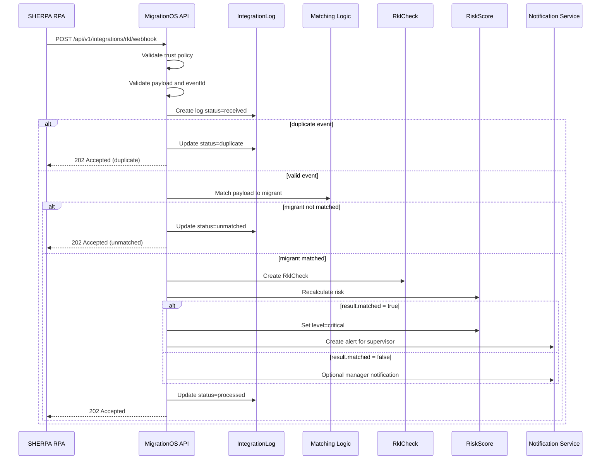

# SHERPA RPA Integration — MigrationOS

## 1. Назначение документа

Документ описывает интеграцию MigrationOS с внешней системой SHERPA RPA для получения результатов РКЛ-проверок.

SHERPA RPA Integration нужен, чтобы:

- зафиксировать границы ответственности между MigrationOS и SHERPA RPA;
- описать поток получения результатов РКЛ-проверки;
- определить формат и смысл входящих данных;
- зафиксировать правила trust policy и идемпотентности;
- описать обработку ошибок, duplicate- и unmatched-сценариев;
- определить правила записи событий в `IntegrationLog`;
- связать интеграцию с `RklCheck`, `RiskScore`, уведомлениями и процессом проверки.

---

## 2. Контекст интеграции

SHERPA RPA — внешняя система, которая выполняет проверку мигрантов по РКЛ и передает результат в MigrationOS.

Принципиально важно:

- MigrationOS не разрабатывает и не сопровождает RPA-робота;
- MigrationOS не инициирует внутренние шаги роботизации на стороне SHERPA RPA;
- MigrationOS не обращается напрямую к механизмам РКЛ;
- MigrationOS принимает уже сформированный результат проверки;
- MigrationOS валидирует webhook, сопоставляет результат с карточкой мигранта и обновляет свои бизнес-сущности.

Интеграция относится к классу inbound webhook и является критичной для домена комплаенса и управления рисками.

---

## 3. Границы ответственности

| Сторона | Ответственность |
|---|---|
| SHERPA RPA | Получить исходные данные для проверки из внешнего контура |
| SHERPA RPA | Выполнить проверку по РКЛ |
| SHERPA RPA | Сформировать итог проверки и внешний идентификатор события |
| SHERPA RPA | Отправить webhook в MigrationOS |
| MigrationOS | Проверить trust policy и формат webhook |
| MigrationOS | Провалидировать payload по бизнес-правилам |
| MigrationOS | Проверить `eventId` на дубликат |
| MigrationOS | Зафиксировать событие в `IntegrationLog` |
| MigrationOS | Сопоставить результат с карточкой мигранта |
| MigrationOS | Создать запись `RklCheck` |
| MigrationOS | Пересчитать `RiskScore` |
| MigrationOS | Создать уведомление менеджеру или alert для supervisor при критичном результате |

### Ключевой вывод

SHERPA RPA отвечает за выполнение проверки и доставку результата.  
MigrationOS отвечает за безопасное принятие результата, его нормализацию и влияние на внутренние бизнес-сущности.

---

## 4. Тип интеграции

| Параметр | Значение |
|---|---|
| Направление | Inbound |
| Тип | Webhook |
| Протокол | HTTPS REST |
| Формат | JSON |
| Источник | SHERPA RPA |
| Получатель | MigrationOS |
| Критичность | High |
| Идемпотентность | По `eventId` |
| Основные сущности | `RklCheck`, `RiskScore`, `IntegrationLog`, `Migrant` |

---

## 5. Общий flow

1. SHERPA RPA получает данные для проверки мигранта из внешнего операционного процесса.
2. SHERPA RPA выполняет проверку по РКЛ.
3. SHERPA RPA формирует результат проверки.
4. SHERPA RPA отправляет webhook в MigrationOS.
5. MigrationOS проверяет trust policy.
6. MigrationOS валидирует payload.
7. MigrationOS проверяет `eventId` на дубликат.
8. MigrationOS создает или обновляет запись в `IntegrationLog`.
9. MigrationOS сопоставляет результат с карточкой мигранта.
10. Если мигрант найден, MigrationOS создает `RklCheck`.
11. MigrationOS пересчитывает `RiskScore`.
12. Если `matched = true`, уровень риска становится `critical`.
13. MigrationOS создает уведомление или alert по внутренним правилам.
14. MigrationOS возвращает безопасный ответ SHERPA RPA.

---

## 6. Endpoint

```http
POST /api/v1/integrations/rkl/webhook
```

Детальный контракт endpoint, примеры ответов и поведение по HTTP-кодам описаны в документе [RKL Webhook API](../05_api/rkl-webhook.md).

---

## 7. Trust policy

Для интеграции с SHERPA RPA не используется пользовательская авторизация через `Bearer` token.

Доверие к источнику обеспечивается интеграционной политикой.

| Механизм | Назначение |
|---|---|
| `API key` | Проверка доверенного клиента |
| `IP whitelist` | Ограничение допустимых IP-источников |
| `Signature` | Проверка целостности payload |
| `HTTPS` | Защита канала передачи |
| `eventId` | Идемпотентность события |

Пример заголовков:

```http
X-Integration-Name: SHERPA_RPA
X-Api-Key: <integration_api_key>
X-Signature: sha256=<signature>
Content-Type: application/json
```

### Правила trust policy

| ID | Правило |
|---|---|
| `SHERPA-SEC-001` | Webhook должен приниматься только от доверенного источника |
| `SHERPA-SEC-002` | При нарушении trust policy бизнес-сущности не изменяются |
| `SHERPA-SEC-003` | Интеграционные секреты не должны храниться в коде |
| `SHERPA-SEC-004` | Ошибка авторизации не должна раскрывать детали trust-проверки |

---

## 8. Payload

### 8.1. Пример payload без совпадения

```json
{
  "eventId": "rkl_evt_2026_000001",
  "externalCheckId": "sherpa_check_987654",
  "source": "SHERPA_RPA",
  "checkedAt": "2026-05-12T08:30:00Z",
  "migrant": {
    "externalMigrantId": "1c_12345",
    "fullName": "Иванов Али",
    "birthDate": "1995-04-12",
    "passportNumber": "AA1234567",
    "phone": "+79990000000"
  },
  "result": {
    "matched": false,
    "status": "not_found",
    "rawStatus": "not_found",
    "matchConfidence": "high",
    "comment": "Совпадений не найдено"
  }
}
```

### 8.2. Пример payload с совпадением

```json
{
  "eventId": "rkl_evt_2026_000002",
  "externalCheckId": "sherpa_check_987655",
  "source": "SHERPA_RPA",
  "checkedAt": "2026-05-12T08:35:00Z",
  "migrant": {
    "externalMigrantId": "1c_12346",
    "fullName": "Петров Бахром",
    "birthDate": "1992-02-20",
    "passportNumber": "BB7654321",
    "phone": "+79991112233"
  },
  "result": {
    "matched": true,
    "status": "found",
    "rawStatus": "found_in_rkl",
    "matchConfidence": "high",
    "comment": "Обнаружено совпадение в РКЛ"
  }
}
```

---

## 9. Описание полей

| Поле | Тип | Обязательное | Описание |
|---|---|---:|---|
| `eventId` | string | Да | Уникальный ID webhook-события |
| `externalCheckId` | string | Да | ID проверки на стороне SHERPA RPA |
| `source` | string | Да | Источник события, ожидается `SHERPA_RPA` |
| `checkedAt` | datetime | Да | Дата и время выполнения проверки |
| `migrant.externalMigrantId` | string | Нет | ID мигранта во внешней системе, например в 1С |
| `migrant.fullName` | string | Да | ФИО мигранта |
| `migrant.birthDate` | date | Нет | Дата рождения |
| `migrant.passportNumber` | string | Нет | Номер паспорта |
| `migrant.phone` | string | Нет | Телефон |
| `result.matched` | boolean | Да | Найдено совпадение в РКЛ или нет |
| `result.status` | string | Да | Нормализованный статус результата |
| `result.rawStatus` | string | Да | Исходный статус от SHERPA RPA |
| `result.matchConfidence` | string | Нет | Уровень уверенности внешнего сопоставления |
| `result.comment` | string | Нет | Комментарий внешней системы |

---

## 10. Валидации

| ID | Проверка | Ошибка |
|---|---|---|
| `SHERPA-VAL-001` | Payload является валидным JSON | `BAD_REQUEST` |
| `SHERPA-VAL-002` | Trust policy пройдена | `UNAUTHORIZED_INTEGRATION` |
| `SHERPA-VAL-003` | `eventId` заполнен | `VALIDATION_ERROR` |
| `SHERPA-VAL-004` | `externalCheckId` заполнен | `VALIDATION_ERROR` |
| `SHERPA-VAL-005` | `source = SHERPA_RPA` | `INVALID_SOURCE` |
| `SHERPA-VAL-006` | `checkedAt` является валидной датой | `VALIDATION_ERROR` |
| `SHERPA-VAL-007` | `result.matched` заполнен | `VALIDATION_ERROR` |
| `SHERPA-VAL-008` | `result.rawStatus` заполнен | `VALIDATION_ERROR` |
| `SHERPA-VAL-009` | Событие не нарушает правила идемпотентности | `DUPLICATE_EVENT` |

### Порядок обработки

1. Проверить формат HTTP-запроса и JSON.
2. Проверить trust policy.
3. Проверить обязательные поля.
4. Проверить `eventId` на дубликат.
5. Зафиксировать событие в `IntegrationLog`.
6. Выполнить сопоставление с мигрантом.
7. Обновить бизнес-сущности только после успешной валидации.

---

## 11. Идемпотентность

Webhook от SHERPA RPA может быть доставлен повторно, поэтому обработка должна быть идемпотентной.

Ключ идемпотентности:

`eventId`

### Правила

| ID | Правило |
|---|---|
| `SHERPA-IDEMP-001` | Повторный `eventId` не создает новый `RklCheck` |
| `SHERPA-IDEMP-002` | Повторное событие фиксируется в `IntegrationLog` со статусом `duplicate` |
| `SHERPA-IDEMP-003` | Повторное событие не должно повторно менять `RiskScore` |
| `SHERPA-IDEMP-004` | Повторное событие не должно повторно отправлять critical alert |
| `SHERPA-IDEMP-005` | Повторное событие возвращает безопасный успешный ответ |

---

## 12. Сопоставление с мигрантом

MigrationOS должна сопоставить входящий payload с существующей карточкой мигранта.

| Приоритет | Поля | Комментарий |
|---|---|---|
| 1 | `externalMigrantId` | Предпочтительный вариант при наличии связки с 1С или другой внешней системой |
| 2 | `passportNumber + birthDate` | Более надежное сопоставление по идентификационным данным |
| 3 | `phone` | Дополнительный ключ |
| 4 | `fullName + birthDate` | Используется с осторожностью из-за риска ложных совпадений |

### Поведение в unmatched-сценарии

Если мигрант не найден:

- `RklCheck` не создается автоматически;
- `RiskScore` не меняется;
- `IntegrationLog.status` получает значение `unmatched`;
- создается задача, алерт или запись для ручного разбора.

### Правила сопоставления

| ID | Правило |
|---|---|
| `SHERPA-MATCH-001` | Нельзя автоматически привязывать событие к мигранту при слабом совпадении |
| `SHERPA-MATCH-002` | При `unmatched` риск не меняется автоматически |
| `SHERPA-MATCH-003` | Webhook не должен автоматически создавать нового мигранта |
| `SHERPA-MATCH-004` | Ручное сопоставление должно логироваться |

---

## 13. Создание `RklCheck`

Если мигрант найден, MigrationOS создает запись `RklCheck`.

### Основные поля `RklCheck`

| Поле | Источник |
|---|---|
| `migrant_id` | Найденная карточка мигранта |
| `event_id` | `eventId` |
| `external_check_id` | `externalCheckId` |
| `source` | `SHERPA_RPA` |
| `checked_at` | `checkedAt` |
| `matched` | `result.matched` |
| `raw_status` | `result.rawStatus` |

Результат РКЛ хранится как факт интеграционного события и не редактируется пользователями вручную.

---

## 14. Влияние на `RiskScore`

| Условие | Действие |
|---|---|
| `matched = false` | Риск пересчитывается по общей формуле |
| `matched = true` | `RiskScore.level = critical` |
| `matched = true` | Создается alert для supervisor |
| `unmatched` | Риск не меняется до ручного разбора |
| `duplicate` | Риск не пересчитывается повторно |

### Факторы риска

| Фактор | Вес |
|---|---|
| Срок окончания патента | 35% |
| Срок окончания регистрации | 25% |
| РКЛ-статус | 30% |
| История нарушений | 10% |

Интеграция с SHERPA RPA влияет не только на факт наличия записи `RklCheck`, но и на витрины аналитики, dashboard риска и внутренние уведомления.

---

## 15. `IntegrationLog`

Каждое событие от SHERPA RPA должно фиксироваться в `IntegrationLog`.

| Поле | Значение |
|---|---|
| `integration_name` | `SHERPA_RPA` |
| `event_id` | `eventId` |
| `direction` | `inbound` |
| `status` | `received`, `processed`, `validation_error`, `duplicate`, `unmatched`, `failed` |
| `entity_type` | `RklCheck`, если событие сопоставлено |
| `entity_id` | ID созданной записи `RklCheck` |
| `payload_hash` | SHA-256 hash payload |

### Правила журналирования

| ID | Правило |
|---|---|
| `SHERPA-LOG-001` | Событие должно быть зафиксировано до изменения бизнес-сущностей |
| `SHERPA-LOG-002` | Дубликаты должны иметь статус `duplicate` |
| `SHERPA-LOG-003` | Несопоставленные события должны иметь статус `unmatched` |
| `SHERPA-LOG-004` | Raw payload не должен храниться без необходимости |

---

## 16. Retry policy

| Ситуация | Поведение |
|---|---|
| MigrationOS вернул `202` | Повтор не требуется |
| MigrationOS вернул `400` | Повтор не нужен до исправления payload |
| MigrationOS вернул `401` / `403` | Повтор не нужен до исправления trust policy |
| MigrationOS вернул `422` | Повтор возможен только после исправления данных |
| MigrationOS вернул `500` / `503` | SHERPA RPA может повторить отправку |
| Timeout | SHERPA RPA может повторить отправку с тем же `eventId` |

### Правила retry

| ID | Правило |
|---|---|
| `SHERPA-RETRY-001` | Повторная доставка использует тот же `eventId` |
| `SHERPA-RETRY-002` | Retry не должен создавать дубль `RklCheck` |
| `SHERPA-RETRY-003` | Retry не должен повторно менять `RiskScore` |
| `SHERPA-RETRY-004` | Retry должен быть ограничен по количеству попыток |

---

## 17. Response

### 17.1. Accepted

```json
{
  "accepted": true,
  "status": "accepted",
  "eventId": "rkl_evt_2026_000001"
}
```

### 17.2. Duplicate

```json
{
  "accepted": true,
  "status": "duplicate",
  "eventId": "rkl_evt_2026_000001"
}
```

### 17.3. Unmatched

```json
{
  "accepted": true,
  "status": "unmatched",
  "eventId": "rkl_evt_2026_000003"
}
```

### 17.4. Validation error

```json
{
  "error": {
    "code": "VALIDATION_ERROR",
    "message": "Webhook payload validation failed",
    "traceId": "req-701"
  }
}
```

---

## 18. Error handling

Ошибки должны соответствовать [Error Model](../05_api/error-model.md).

| Ошибка | Поведение |
|---|---|
| Невалидный JSON | `400 BAD_REQUEST` |
| Не пройдена trust policy | `401 UNAUTHORIZED_INTEGRATION` или `403 FORBIDDEN` |
| Неверный источник | `422 INVALID_SOURCE` |
| Дубликат события | `202 duplicate` |
| Мигрант не найден | `202 unmatched` + `IntegrationLog.status = unmatched` |
| Внутренняя ошибка | `500 INTERNAL_ERROR` |
| Временная недоступность зависимого компонента | `503 SERVICE_UNAVAILABLE` |

Приоритет обработки ошибок:

1. Не менять бизнес-сущности, если не пройдена trust policy.
2. Не подтверждать бизнес-обработку при невалидном payload.
3. Безопасно завершать duplicate-сценарии.
4. Сохранять трассируемость через `traceId` и `IntegrationLog`.

---

## 19. Monitoring and alerts

### Основные метрики

| Метрика | Назначение |
|---|---|
| Количество RKL webhook-событий | Контроль объема интеграции |
| Доля `matched = true` | Контроль критичных совпадений |
| Количество `unmatched` событий | Контроль качества сопоставления |
| Количество `duplicate` событий | Контроль повторной доставки |
| Количество `failed` событий | Контроль ошибок обработки |
| Среднее время обработки webhook | Контроль производительности |

### Алерты

| Условие | Кому |
|---|---|
| `matched = true` | Supervisor |
| Много `unmatched` событий | Support / Supervisor |
| Много `failed` событий | Backend / Support |
| Нет RKL-данных к контрольному времени | Supervisor |
| Резкий рост duplicate-событий | Backend / Support |

---

## 20. Security and privacy

| ID | Требование |
|---|---|
| `SHERPA-PRIV-001` | Payload содержит ПДн и должен передаваться только по защищенному каналу |
| `SHERPA-PRIV-002` | Raw payload не должен храниться без необходимости |
| `SHERPA-PRIV-003` | Доступ к RKL-результатам ограничен внутренними ролями |
| `SHERPA-PRIV-004` | Логи не должны содержать лишние ПДн |
| `SHERPA-PRIV-005` | `payload_hash` предпочтительнее хранения полного payload |

Дополнительно:

- детали trust policy не должны возвращаться во внешнем ответе;
- интеграционные секреты должны храниться во внешнем vault или в защищенной конфигурации;
- доступ к `IntegrationLog` должен быть ограничен внутренними ролями и support-функциями.

---

## 21. Sequence flow



---

## 22. Связанные артефакты

- [Integrations Overview](./integrations-overview.md)
- [RKL Webhook API](../05_api/rkl-webhook.md)
- [BPMN RKL Check](../03_processes/bpmn_rkl-check.md)
- [Data Dictionary](../04_data-model/data-dictionary.md)
- [Status Models](../04_data-model/status-models.md)
- [Error Model](../05_api/error-model.md)
- [Architecture Overview](../09_architecture/architecture-overview.md)
