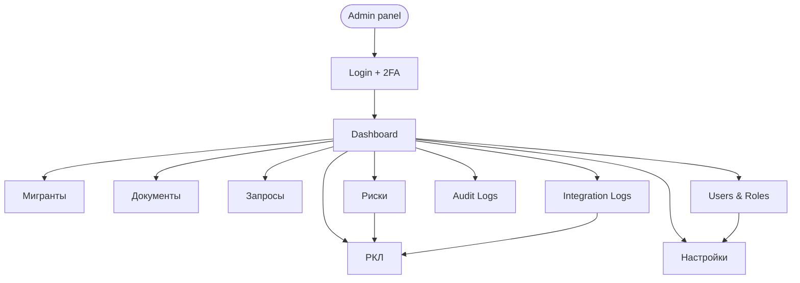

# Admin Panel Scenarios — MigrationOS

## 1. Назначение документа

Документ описывает основные пользовательские сценарии административной панели MigrationOS.

Admin Panel Scenarios нужен, чтобы:

- зафиксировать задачи внутренних ролей агентства;
- описать ключевые сценарии `manager`, `supervisor` и `superadmin`;
- связать UI-сценарии с backend API и бизнес-сущностями;
- определить состояния экранов, ошибки и edge cases;
- описать работу с рисками, документами, запросами, интеграциями и аудитом;
- подготовить основу для проектирования интерфейсов, тест-кейсов и acceptance testing.

---

## 2. Контекст

Административная панель используется внутренними сотрудниками агентства.

Через admin panel внутренние роли могут:

- входить с усиленной авторизацией;
- просматривать и обрабатывать мигрантов;
- проверять документы;
- работать с работодателями;
- обрабатывать запросы;
- контролировать заявки на услуги;
- видеть платежи;
- отслеживать риски;
- разбирать РКЛ-события;
- смотреть integration logs;
- смотреть audit logs;
- управлять пользователями и ролями в рамках своих permissions.

### Технологический контекст

| Параметр | Значение |
|---|---|
| Тип приложения | Admin web panel |
| Frontend | React |
| Основные роли | `manager`, `supervisor`, `superadmin` |
| Доступ | Только внутренние пользователи |
| Безопасность | `2FA`, `RBAC`, `audit logging` |

---

## 3. Цели панели

| Цель | Что получает внутренняя роль |
|---|---|
| Операционная обработка | Быстрый доступ к мигрантам, документам и запросам |
| Контроль рисков | Видимость `critical` кейсов и escalation-сценариев |
| Прозрачность интеграций | Доступ к `IntegrationLog`, unmatched- и failed-событиям |
| Администрирование | Управление пользователями, ролями и настройками |
| Трассируемость | Аудит критичных действий и расследование инцидентов |

---

## 4. Роли административной панели

| Роль | Назначение |
|---|---|
| `manager` | Операционная обработка документов, мигрантов, запросов и услуг |
| `supervisor` | Контроль рисков, контроль менеджеров, `critical cases`, отчеты |
| `superadmin` | Управление пользователями, ролями, настройками и административными справочниками |

### Ролевой фокус

| Роль | Основной фокус |
|---|---|
| `manager` | Очереди документов, запросы, карточки мигрантов, операции по scope |
| `supervisor` | Эскалации, риски, matched/unmatched РКЛ, проблемные интеграции |
| `superadmin` | Доступы, роли, справочники, системные параметры и аудит |

---

## 5. Общие ограничения доступа

| Роль | Что доступно |
|---|---|
| `manager` | Операционные сущности в своем scope |
| `supervisor` | Расширенный доступ к рискам, отчетам и escalation cases |
| `superadmin` | Административные функции, роли, permissions, системные настройки |

Внутренний пользователь не должен получать доступ к функциям вне своей роли.

Все критичные действия должны фиксироваться в `AuditLog`.

---

## 6. Основные разделы admin panel

| Раздел | Назначение |
|---|---|
| Login / 2FA | Безопасный вход |
| Dashboard | Операционная сводка |
| Мигранты | Поиск, просмотр, обработка карточек |
| Документы | Проверка и изменение статусов |
| Работодатели | Просмотр и верификация организаций |
| Запросы | Обработка обращений |
| Услуги | Контроль `service orders` |
| Платежи | Просмотр статусов и расхождений |
| Риски | Контроль `risk score` и critical cases |
| РКЛ | Результаты проверок и `unmatched events` |
| Integration Logs | Журнал интеграционных событий |
| Audit Logs | Журнал действий пользователей |
| Пользователи и роли | Управление доступами |
| Настройки | Справочники и системные параметры |

---

## 7. Общие UX-принципы

| ID | Правило |
|---|---|
| `ADM-GEN-001` | Все действия должны учитывать роль и permissions |
| `ADM-GEN-002` | Критичные действия требуют подтверждения |
| `ADM-GEN-003` | Изменение статуса бизнес-сущности должно быть трассируемым |
| `ADM-GEN-004` | Внутренние комментарии доступны только внутренним ролям |
| `ADM-GEN-005` | Ошибки доступа не должны раскрывать лишние данные |
| `ADM-GEN-006` | Все списки должны поддерживать фильтры, сортировку, pagination и states |

---

## 8. Сценарий: вход во внутреннюю панель

### 8.1. Цель

Внутренний пользователь должен безопасно войти в admin panel.

### 8.2. Предусловия

| Условие | Описание |
|---|---|
| Пользователь создан | Есть учетная запись внутреннего пользователя |
| Роль назначена | `manager`, `supervisor` или `superadmin` |
| 2FA включена | Для внутренних ролей |
| Backend доступен | `Auth Service` работает |

### 8.3. Happy path

| Шаг | Действие пользователя | Поведение системы |
|---|---|---|
| 1 | Открывает admin panel | Видит `login screen` |
| 2 | Вводит логин и пароль | Система проверяет credentials |
| 3 | Проходит 2FA | Система проверяет второй фактор |
| 4 | Авторизация успешна | Пользователь попадает на dashboard |
| 5 | Система применяет `role permissions` | Меню и действия ограничиваются ролью |

### 8.4. Alternative flows

| Ситуация | Поведение |
|---|---|
| Неверный пароль | Показать ошибку без раскрытия деталей |
| 2FA неверный | Дать ограниченное число попыток |
| Роль не назначена | Запретить вход |
| Пользователь заблокирован | Показать сообщение об ограничении доступа |
| Сессия истекла | Перелогинить пользователя |

### 8.5. Связанные API и сущности

| Элемент | Связь |
|---|---|
| `Auth API` | Login, refresh, `me` |
| `User` | Внутренний пользователь |
| `Role` | Роль пользователя |

---

## 9. Сценарий: dashboard внутренних ролей

### 9.1. Цель

Пользователь должен видеть операционную сводку по своему уровню доступа.

### 9.2. Виджеты dashboard

| Виджет | Роль | Назначение |
|---|---|---|
| Документы на проверке | `manager`, `supervisor` | Контроль очереди |
| Запросы в работе | `manager`, `supervisor` | Контроль SLA |
| `Critical risks` | `supervisor` | Контроль критичных кейсов |
| `RKL matched` | `supervisor` | События с совпадением по РКЛ |
| `RKL unmatched` | `manager`, `supervisor` | Ручной разбор |
| `Failed integrations` | `supervisor`, `superadmin` | Контроль интеграционного слоя |
| Пользователи и роли | `superadmin` | Администрирование |

### 9.3. UI-состояния

| Состояние | Поведение |
|---|---|
| `loading` | Показать skeleton |
| `empty` | Нет задач |
| `partial_data` | Часть сервисов недоступна |
| `error` | Показать retry |
| `forbidden` | Скрыть недоступный виджет |

### 9.4. Связанные API и сущности

| Элемент | Связь |
|---|---|
| `Analytics API` | Dashboard-агрегация |
| `RiskScore` | Риски |
| `IntegrationLog` | Интеграционные ошибки |
| `Request` | Запросы в работе |

---

## 10. Сценарий: поиск и просмотр мигранта

### 10.1. Цель

`Manager` или `supervisor` должен найти мигранта и открыть его карточку.

### 10.2. Фильтры

| Фильтр | Назначение |
|---|---|
| ФИО | Поиск по имени |
| Телефон | Поиск по телефону |
| Документ | Поиск по номеру документа |
| Работодатель | Фильтр по организации |
| Проект | Фильтр по группе |
| Risk level | `normal / attention / critical` |
| Статус документа | `missing / under_review / rejected / expired` |
| RKL status | `matched / not_found / unmatched` |

### 10.3. Happy path

| Шаг | Действие пользователя | Поведение системы |
|---|---|---|
| 1 | Открывает раздел «Мигранты» | Видит список |
| 2 | Вводит фильтр | Список обновляется |
| 3 | Открывает карточку | Видит доступные блоки |
| 4 | Просматривает документы, риски, запросы | Система применяет permissions |

### 10.4. Edge cases

| Ситуация | Поведение |
|---|---|
| Ничего не найдено | Показать `empty search` |
| Нет доступа к мигранту | `403` или безопасный `404` |
| Карточка архивирована | Показать `read-only` |
| Risk service недоступен | Показать `partial data` |

### 10.5. Связанные API и сущности

| Элемент | Связь |
|---|---|
| `GET /migrants` | Поиск мигрантов |
| `GET /migrants/{migrantId}` | Карточка мигранта |
| `Migrant` | Сущность мигранта |

---

## 11. Сценарий: проверка документа

### 11.1. Цель

`Manager` должен проверить загруженный документ и принять решение.

### 11.2. Happy path approval

| Шаг | Действие пользователя | Поведение системы |
|---|---|---|
| 1 | Открывает очередь документов | Видит документы `under_review` |
| 2 | Открывает документ | Видит metadata и файл |
| 3 | Проверяет файл | Может открыть presigned URL |
| 4 | Нажимает «Одобрить» | Система требует подтверждение |
| 5 | Подтверждает | Документ получает статус `approved` |
| 6 | Пользователь получает уведомление | Создается `Notification` |

### 11.3. Happy path rejection

| Шаг | Действие пользователя | Поведение системы |
|---|---|---|
| 1 | Открывает документ | Видит файл и данные |
| 2 | Нажимает «Отклонить» | Система требует причину |
| 3 | Указывает причину | Система валидирует |
| 4 | Подтверждает | Документ получает статус `rejected` |
| 5 | Мигрант получает уведомление | Может загрузить новый файл |

### 11.4. Alternative flows

| Ситуация | Поведение |
|---|---|
| Файл недоступен | Показать ошибку загрузки файла и retry |
| Документ уже изменил статус | Показать `409 conflict` |
| URL файла истек | Получить новый presigned URL |

### 11.5. Правила

| ID | Правило |
|---|---|
| `ADM-DOC-001` | Нельзя одобрить документ без доступа к карточке мигранта |
| `ADM-DOC-002` | При отклонении причина обязательна |
| `ADM-DOC-003` | Изменение статуса документа попадает в `AuditLog` |
| `ADM-DOC-004` | Presigned URL выдается только после проверки permissions |
| `ADM-DOC-005` | Нельзя изменить статус архивного документа без отдельного permission |

### 11.6. Связанные API и сущности

| Элемент | Связь |
|---|---|
| `Documents API` | Approve / reject документа |
| `Document` | Сущность документа |
| `DocumentFile` | Файл документа |
| `AuditLog` | Логирование действий |

---

## 12. Сценарий: обработка запроса

### 12.1. Цель

`Manager` должен взять запрос в работу, ответить пользователю или закрыть запрос.

### 12.2. Happy path

| Шаг | Действие пользователя | Поведение системы |
|---|---|---|
| 1 | Открывает очередь запросов | Видит запросы `created` и `in_progress` |
| 2 | Открывает запрос | Видит публичный и внутренний контекст |
| 3 | Берет в работу | Статус становится `in_progress` |
| 4 | Добавляет внутренний комментарий | Видит только внутренняя роль |
| 5 | Отправляет публичный ответ | Пользователь видит ответ |
| 6 | Закрывает запрос | Статус становится `completed` |

### 12.3. Alternative flows

| Ситуация | Поведение |
|---|---|
| Нужно уточнение | Перевести в `need_info` |
| Запрос невалиден | Перевести в `rejected` с публичной причиной |
| Запрос уже закрыт | `read-only` |
| Ответственный недоступен | `supervisor` может переназначить |

### 12.4. Правила

| ID | Правило |
|---|---|
| `ADM-REQ-001` | `internalComment` не показывается работодателю или мигранту |
| `ADM-REQ-002` | Статусные переходы проверяются backend |
| `ADM-REQ-003` | Смена `assignee` логируется |
| `ADM-REQ-004` | Закрытие запроса требует результата или комментария |

### 12.5. Связанные API и сущности

| Элемент | Связь |
|---|---|
| `Request Service API` | Работа с запросами |
| `Request` | Сущность запроса |
| `Notification` | Уведомления участникам |

---

## 13. Сценарий: работа с critical risk

### 13.1. Цель

`Supervisor` должен видеть мигрантов с критическим риском и контролировать обработку.

### 13.2. Источники critical risk

| Источник | Пример |
|---|---|
| РКЛ совпадение | `matched = true` |
| Истекший документ | `expired` |
| Близкий срок документа | `expires_soon` |
| История нарушений | Накопленный фактор риска |
| Ручная escalation | `manager` поднял кейс |

### 13.3. Happy path

| Шаг | Действие пользователя | Поведение системы |
|---|---|---|
| 1 | `Supervisor` открывает раздел «Риски» | Видит список `critical cases` |
| 2 | Открывает карточку риска | Видит факторы риска |
| 3 | Назначает ответственного | `Manager` получает задачу |
| 4 | Добавляет внутренний комментарий | Комментарий доступен внутренним ролям |
| 5 | Контролирует статус обработки | Видит прогресс |

### 13.4. Alternative flows

| Ситуация | Поведение |
|---|---|
| Кейсов нет | Показать `empty state` |
| Risk service временно недоступен | Показать `partial_data` |
| Ответственный уже неактивен | Потребовать переназначение |

### 13.5. Правила

| ID | Правило |
|---|---|
| `ADM-RISK-001` | `Critical risk` должен быть видим `supervisor` |
| `ADM-RISK-002` | Назначение ответственного логируется |
| `ADM-RISK-003` | `RKL matched` не должен быть скрыт обычным изменением UI |
| `ADM-RISK-004` | Снижение риска требует оснований и audit trail |

### 13.6. Связанные API и сущности

| Элемент | Связь |
|---|---|
| `RiskScore` | Риск мигранта |
| `RklCheck` | Основание для critical risk |
| `AuditLog` | Ручные действия |

---

## 14. Сценарий: разбор RKL matched / unmatched

### 14.1. Цель

Внутренние роли должны разбирать результаты РКЛ-проверок от SHERPA RPA.

### 14.2. Matched

| Ситуация | Поведение |
|---|---|
| `matched = true` | Риск становится `critical` |
| Мигрант сопоставлен | Создается `RklCheck` |
| `Supervisor` уведомлен | Создается alert |
| Карточка доступна | `Supervisor` видит детали события |

### 14.3. Unmatched

| Ситуация | Поведение |
|---|---|
| Мигрант не найден | Событие получает `IntegrationLog.status = unmatched` |
| Есть кандидаты | Оператор выбирает кандидата вручную |
| Нет кандидатов | Событие остается в очереди разбора |
| Ручное сопоставление выполнено | Действие попадает в `AuditLog` |

### 14.4. Happy path manual review

| Шаг | Действие пользователя | Поведение системы |
|---|---|---|
| 1 | Открывает раздел «РКЛ» | Видит `matched` и `unmatched` события |
| 2 | Фильтрует `unmatched` | Получает очередь разбора |
| 3 | Открывает событие | Видит безопасные детали |
| 4 | Выбирает кандидата или подтверждает отсутствие совпадения | Система требует подтверждение |
| 5 | Сохраняет решение | Обновляются связи и логи |

### 14.5. Правила

| ID | Правило |
|---|---|
| `ADM-RKL-001` | Нельзя автоматически сопоставлять слабое совпадение |
| `ADM-RKL-002` | Ручное сопоставление требует подтверждения |
| `ADM-RKL-003` | Ручное сопоставление логируется в `AuditLog` |
| `ADM-RKL-004` | Повторный webhook не должен создавать дубль проверки |

### 14.6. Связанные API и сущности

| Элемент | Связь |
|---|---|
| `RKL Webhook / SHERPA RPA` | Источник событий |
| `IntegrationLog` | Статус `matched/unmatched/duplicate` |
| `RklCheck` | Результат проверки |
| `Migrant` | Карточка мигранта |

---

## 15. Сценарий: просмотр `IntegrationLog`

### 15.1. Цель

Внутренние роли должны видеть интеграционные события для расследования ошибок.

### 15.2. Доступ

| Роль | Доступ |
|---|---|
| `manager` | Ограниченный доступ к событиям своих операций |
| `supervisor` | Доступ к операционным integration events |
| `superadmin` | Расширенный доступ к системным integration events |

### 15.3. Фильтры

| Фильтр | Назначение |
|---|---|
| `integrationName` | `SHERPA_RPA`, `SBP`, `1C`, `FCM`, `S3` |
| `status` | `processed`, `failed`, `unmatched`, `duplicate` |
| `direction` | `inbound / outbound` |
| `entityType` | `Payment`, `RklCheck`, `DocumentFile` |
| `dateRange` | Период |
| `traceId` | Поиск инцидента |
| `eventId` | Поиск внешнего события |

### 15.4. Happy path

| Шаг | Действие пользователя | Поведение системы |
|---|---|---|
| 1 | Открывает раздел логов | Видит список событий |
| 2 | Применяет фильтр `failed` | Список обновляется |
| 3 | Открывает запись | Видит безопасные технические детали |
| 4 | Переходит к связанной сущности | Например, к `Payment` или `RklCheck` |

### 15.5. Правила

| ID | Правило |
|---|---|
| `ADM-LOG-001` | Raw payload не показывается без отдельного permission |
| `ADM-LOG-002` | Secrets, signatures и tokens не показываются никогда |
| `ADM-LOG-003` | `Support-safe error message` можно показывать |
| `ADM-LOG-004` | Доступ к логам должен быть ограничен внутренними ролями |

---

## 16. Сценарий: просмотр `AuditLog`

### 16.1. Цель

`Supervisor` и `superadmin` должны расследовать, кто и когда изменил критичные сущности.

### 16.2. Типовые сценарии

| Сценарий | Пример |
|---|---|
| Смена статуса документа | Кто отклонил файл |
| Ручное сопоставление `unmatched` | Кто связал РКЛ-событие с мигрантом |
| Изменение роли пользователя | Кто назначил `superadmin` |
| Bulk action | Кто выполнил массовое изменение |

### 16.3. Правила

| ID | Правило |
|---|---|
| `ADM-AUDIT-001` | Audit log доступен только внутренним ролям с нужным permission |
| `ADM-AUDIT-002` | До и после изменения должны быть трассируемы для критичных действий |
| `ADM-AUDIT-003` | Audit log не заменяет `IntegrationLog`, а дополняет его |

---

## 17. Сценарий: управление пользователями и ролями

### 17.1. Цель

`Superadmin` должен управлять внутренними пользователями, ролями и permissions.

### 17.2. Happy path

| Шаг | Действие пользователя | Поведение системы |
|---|---|---|
| 1 | `Superadmin` открывает раздел пользователей | Видит список |
| 2 | Создает пользователя | Указывает email, имя, роль |
| 3 | Назначает роль | Система применяет `permission set` |
| 4 | Пользователь получает приглашение | Может войти после активации |
| 5 | Действие фиксируется | Запись попадает в `AuditLog` |

### 17.3. Edge cases

| Ситуация | Поведение |
|---|---|
| Пользователь уже существует | Показать validation error |
| Попытка выдать роль выше своей | Запретить |
| Удаление последнего `superadmin` | Запретить |
| Пользователь заблокирован | Запретить вход |

### 17.4. Связанные API и сущности

| Элемент | Связь |
|---|---|
| `User` | Учетная запись |
| `Role` | Роль |
| `Permissions` | Права доступа |
| `AuditLog` | Логирование действий |

---

## 18. Сценарий: работодатели и верификация

### 18.1. Цель

`Manager` или `supervisor` должен видеть карточки работодателей и контролировать статусы верификации.

### 18.2. Happy path

| Шаг | Действие пользователя | Поведение системы |
|---|---|---|
| 1 | Открывает раздел «Работодатели» | Видит список организаций |
| 2 | Фильтрует `pending_verification` | Получает очередь проверки |
| 3 | Открывает карточку организации | Видит реквизиты и статус |
| 4 | Подтверждает или отклоняет | Статус изменяется по модели |

### 18.3. Edge cases

| Ситуация | Поведение |
|---|---|
| ИНН уже используется | Показать конфликт |
| Внешняя проверка временно недоступна | Показать `partial_data` |
| Организация заблокирована | Ограничить операции |

---

## 19. Bulk actions

### 19.1. Возможные bulk actions

| Действие | Роль | Ограничение |
|---|---|---|
| Назначить ответственного | `supervisor` | Только в доступном scope |
| Изменить статус запросов | `manager`, `supervisor` | Только допустимые transitions |
| Отправить уведомление | `supervisor` | Только разрешенным группам |
| Экспортировать список | `supervisor`, `superadmin` | Без лишних ПДн |
| Архивировать записи | `superadmin` | Только с подтверждением |

### 19.2. Правила

| ID | Правило |
|---|---|
| `ADM-BULK-001` | Bulk action требует preview перед выполнением |
| `ADM-BULK-002` | Bulk action должна показывать количество затронутых записей |
| `ADM-BULK-003` | Частично успешное выполнение должно показывать отчет |
| `ADM-BULK-004` | Критичные bulk actions логируются в `AuditLog` |

---

## 20. Состояния экранов

| Состояние | Описание |
|---|---|
| `loading` | Данные загружаются |
| `empty` | Нет данных |
| `empty_search` | По фильтрам ничего не найдено |
| `error` | Ошибка загрузки |
| `forbidden` | Нет доступа |
| `partial_data` | Часть данных недоступна |
| `validation_error` | Ошибка в форме |
| `read_only` | Сущность недоступна для редактирования |
| `confirm_required` | Требуется подтверждение действия |

### Примеры состояний по разделам

| Раздел | Возможные состояния |
|---|---|
| Документы | `queue`, `empty`, `validation_error`, `confirm_required` |
| Запросы | `list`, `need_info`, `read_only`, `error` |
| Риски | `critical_list`, `empty`, `partial_data` |
| РКЛ | `matched`, `unmatched`, `manual_review`, `duplicate` |
| Логи | `list`, `forbidden`, `filtered_empty`, `partial_data` |

---

## 21. Error handling

Ошибки должны соответствовать общей модели `ErrorResponse`.

| Ошибка | Поведение в admin panel |
|---|---|
| `401 Unauthorized` | Перелогинить пользователя |
| `403 Forbidden` | Показать «Нет доступа» |
| `404 Not Found` | Показать безопасный `not found` |
| `409 Conflict` | Показать конфликт статуса |
| `422 Validation Error` | Подсветить поля формы |
| `500/503` | Показать retry позже |
| `partial_success` | Показать отчет по успешным и неуспешным операциям |

### Дополнительные правила

| ID | Правило |
|---|---|
| `ADM-ERR-001` | Технические детали интеграций не должны раскрываться широкой аудитории |
| `ADM-ERR-002` | Критичные ошибки должны быть коррелируемы по `traceId` |
| `ADM-ERR-003` | Ошибки bulk actions должны показывать summary |

---

## 22. Сводная таблица сценариев

| Сценарий | Роль | Предусловия | Результат | Связанные API / сущности |
|---|---|---|---|---|
| Вход с 2FA | `manager/supervisor/superadmin` | Аккаунт активен, 2FA включена | Успешный вход | `Auth API`, `User`, `Role` |
| Поиск мигранта | `manager/supervisor` | Есть доступ к разделу | Открыта карточка мигранта | `Migrant`, `RiskScore` |
| Проверка документа | `manager` | Документ `under_review` | `approved` или `rejected` | `Document`, `DocumentFile` |
| Обработка запроса | `manager/supervisor` | Есть запрос в очереди | Запрос обновлен | `Request`, `Request Service API` |
| Critical risk control | `supervisor` | Есть critical case | Назначен ответственный / добавлен комментарий | `RiskScore`, `RklCheck` |
| Ручной разбор РКЛ | `manager/supervisor` | Есть `unmatched` event | Выполнено ручное решение | `IntegrationLog`, `AuditLog` |
| Просмотр integration logs | `manager/supervisor/superadmin` | Есть permission | Найдено и проанализировано событие | `IntegrationLog` |
| Управление ролями | `superadmin` | Есть permission `user.manage` | Пользователь создан / роль изменена | `User`, `Role`, `Permissions` |

---

## 23. Mermaid user flow

---

## 24. Acceptance criteria

| ID | Критерий |
|---|---|
| `ADM-AC-001` | Внутренний пользователь входит через `login + 2FA` |
| `ADM-AC-002` | Меню и действия соответствуют роли |
| `ADM-AC-003` | `Manager` может проверять документы в своем scope |
| `ADM-AC-004` | При отклонении документа причина обязательна |
| `ADM-AC-005` | `Supervisor` видит `critical risk cases` |
| `ADM-AC-006` | `RKL unmatched` события доступны для ручного разбора |
| `ADM-AC-007` | Ручное сопоставление RKL события логируется в `AuditLog` |
| `ADM-AC-008` | `IntegrationLog` скрывает secrets и raw sensitive payload |
| `ADM-AC-009` | `Superadmin` может управлять пользователями и ролями |
| `ADM-AC-010` | Критичные действия требуют подтверждения |
| `ADM-AC-011` | Bulk actions показывают preview и результат |
| `ADM-AC-012` | Admin panel корректно обрабатывает `loading`, `empty`, `error` и `forbidden states` |

---

## 25. Edge cases summary

| Сценарий | Edge case |
|---|---|
| Login | Неверный 2FA или заблокированный пользователь |
| Dashboard | Часть сервисов недоступна |
| Мигранты | Нет доступа к карточке |
| Документы | Presigned URL истек |
| Запросы | Недопустимый статусный переход |
| Риски | Risk service недоступен |
| РКЛ | `Unmatched` событие с несколькими кандидатами |
| IntegrationLog | Payload скрыт из-за permissions |
| Users & Roles | Попытка удалить последнего `superadmin` |
| Bulk actions | Частично успешное выполнение |

---

## 26. Связанные артефакты

- [Functional Requirements](../01_requirements/functional-requirements.md)
- [User Stories](../01_requirements/user-stories.md)
- [Acceptance Criteria](../01_requirements/acceptance-criteria.md)
- [Role Model](../02_roles-and-access/role-model.md)
- [Permissions](../02_roles-and-access/permissions.md)
- [Access Matrix](../02_roles-and-access/access-matrix.md)
- [BPMN RKL Check](../03_processes/bpmn_rkl-check.md)
- [BPMN Document Upload](../03_processes/bpmn_document-upload.md)
- [BPMN Employer Request](../03_processes/bpmn_employer-request.md)
- [Request Service API](../05_api/request-service-api.md)
- [Integration Logs](../06_integrations/integration-logs.md)
- [SHERPA RPA Integration](../06_integrations/sherpa-rpa.md)
- [Status Models](../04_data-model/status-models.md)
- [Data Dictionary](../04_data-model/data-dictionary.md)
