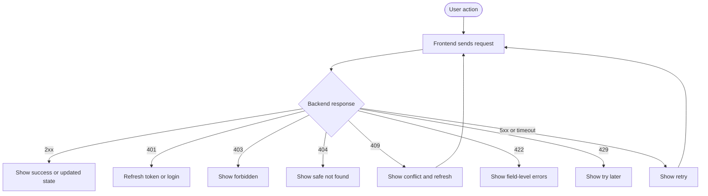

# UI Edge Cases — MigrationOS

## 1. Назначение документа

Документ описывает ключевые edge cases для пользовательских интерфейсов MigrationOS.

UI Edge Cases нужен, чтобы:

- зафиксировать нестандартные и проблемные сценарии;
- унифицировать поведение разных интерфейсов;
- связать UI-состояния с backend-ошибками и статусными моделями;
- подготовить основу для тест-кейсов и acceptance testing;
- снизить риск противоречивого поведения в mobile app, employer cabinet, admin panel и landing.

---

## 2. Область покрытия

Документ покрывает edge cases для следующих UI-приложений:

| Приложение | Пользователи |
|---|---|
| Migrant App | `migrant` |
| Employer Cabinet | `employer` |
| Admin Panel | `manager`, `supervisor`, `superadmin` |
| Landing | Публичные пользователи |

---

## 3. Общие принципы обработки edge cases

| ID | Правило |
|---|---|
| `EDGE-GEN-001` | UI не должен показывать пользователю внутренние технические детали |
| `EDGE-GEN-002` | Ошибка доступа не должна раскрывать существование чужих данных |
| `EDGE-GEN-003` | При временной ошибке должен быть понятный retry |
| `EDGE-GEN-004` | При валидационных ошибках нужно показывать field-level сообщения |
| `EDGE-GEN-005` | Критичные действия требуют подтверждения |
| `EDGE-GEN-006` | UI должен учитывать статусные переходы backend |
| `EDGE-GEN-007` | Если данные частично недоступны, UI должен показывать partial state |
| `EDGE-GEN-008` | Offline/network состояния должны быть явно обработаны |

---

## 4. Общие UI states

| State | Когда используется |
|---|---|
| `loading` | Данные загружаются |
| `empty` | Данных нет |
| `empty_search` | По фильтрам ничего не найдено |
| `error` | Общая ошибка загрузки |
| `network_error` | Нет сети или timeout |
| `forbidden` | Нет доступа |
| `not_found` | Сущность не найдена или скрыта безопасным `404` |
| `validation_error` | Ошибка заполнения формы |
| `conflict` | Статус изменился или операция недопустима |
| `partial_data` | Часть данных недоступна |
| `read_only` | Сущность нельзя редактировать |
| `retry_available` | Пользователь может повторить действие |
| `success` | Действие выполнено |

### Правила отображения ошибок

| ID | Правило |
|---|---|
| `EDGE-STATE-001` | `validation_error` должен быть привязан к конкретному полю или блоку |
| `EDGE-STATE-002` | `forbidden` и `not_found` должны различаться только если это безопасно |
| `EDGE-STATE-003` | `partial_data` должен содержать видимый признак, что часть данных неактуальна или недоступна |
| `EDGE-STATE-004` | `network_error` должен отличаться от общей server error |

---

## 5. Mapping backend errors to UI behavior

| Backend error | UI behavior |
|---|---|
| `400 BAD_REQUEST` | Показать безопасную общую ошибку |
| `401 UNAUTHORIZED` | Перелогинить пользователя или обновить сессию |
| `403 FORBIDDEN` | Показать «Нет доступа» |
| `404 NOT_FOUND` | Показать безопасный `not found` |
| `409 CONFLICT` | Показать конфликт состояния и предложить обновить экран |
| `422 VALIDATION_ERROR` | Подсветить поля формы |
| `429 RATE_LIMITED` | Показать сообщение «Попробуйте позже» |
| `500 INTERNAL_ERROR` | Показать retry позже |
| `503 SERVICE_UNAVAILABLE` | Показать временную недоступность |
| `partial_success` | Показать отчет по успешным и ошибочным элементам |

---

## 6. Авторизация и сессия

| Приложение | Сценарий | Edge case | Ожидаемое поведение | Связанная ошибка / API / entity | Приоритет |
|---|---|---|---|---|---|
| Migrant App | OTP login | OTP истек | Предложить запросить новый код | `Auth API`, `401/422` | High |
| Migrant App | OTP login | Неверный OTP несколько раз | Ограничить попытки и показать безопасную ошибку | `Auth API`, rate limiting | High |
| Employer Cabinet | Login | Сессия истекла | Перенаправить на login | `401`, `refresh token` | High |
| Admin Panel | Login + 2FA | 2FA неверный | Дать ограниченное число попыток | `Auth API`, `401` | High |
| Admin Panel | Login + 2FA | Пользователь заблокирован | Запретить вход | `User.status = blocked` | High |
| Все private UI | Любой приватный экран | Token expired | Попробовать refresh, затем login | `401 UNAUTHORIZED` | High |

---

## 7. Роли и доступы

| Приложение | Сценарий | Edge case | Ожидаемое поведение | Связанная модель / API / entity | Приоритет |
|---|---|---|---|---|---|
| Migrant App | Deep link | Мигрант открывает чужой deep link | Безопасный `404` или `forbidden` | `own` access, deep links | High |
| Employer Cabinet | Карточка мигранта | Работодатель открывает чужого мигранта | Безопасный `404` или `403` | `org` context, `Migrant` | High |
| Employer Cabinet | Карточка мигранта | Мигрант больше не связан с организацией | Прекратить доступ к карточке | permissions, `Employer/Migrant` | High |
| Admin Panel | Навигация | `Manager` открывает раздел `superadmin` | Скрыть раздел или показать `forbidden` | RBAC | High |
| Admin Panel | Действия | Пользователь пытается выполнить action вне роли | Заблокировать action backend и UI | RBAC, permissions | High |

---

## 8. Документы и файлы

| Приложение | Сценарий | Edge case | Ожидаемое поведение | Связанная интеграция / API / entity | Приоритет |
|---|---|---|---|---|---|
| Migrant App | Upload document | Файл слишком большой | Field-level ошибка | `Document API`, `S3`, `422` | High |
| Migrant App | Upload document | Неверный MIME type | Запретить upload | `S3 Storage`, validation | High |
| Migrant App | Upload document | Upload session истекла | Создать новую session | `S3 Storage`, upload session | Medium |
| Migrant App | Upload document | Потеря сети во время upload | Показать retry | `S3 Storage`, `network_error` | High |
| Employer Cabinet | Просмотр документов | Нет permission на файл | Показать статус без ссылки | permissions, `DocumentFile` | High |
| Admin Panel | Проверка документа | Presigned URL истек | Получить новый URL | `S3 Storage` | Medium |
| Admin Panel | Проверка документа | Документ уже обработан другим `manager` | Показать `409 conflict` | `Status Models`, `Document` | High |

---

## 9. Статусы документов

| Приложение | Сценарий | Edge case | Ожидаемое поведение | Связанная ошибка / API / entity | Приоритет |
|---|---|---|---|---|---|
| Migrant App | Загрузка новой версии | Документ `under_review`, пользователь пытается заменить файл | Разрешить или запретить по бизнес-правилу, показать объяснение | `Document`, status model | Medium |
| Migrant App | Повторная загрузка | Документ `approved`, пользователь загружает новый файл | Создать новую версию или отправить на повторную проверку | `Document`, `DocumentFile` | Medium |
| Migrant App | Просмотр статуса | Документ `rejected`, нет причины отклонения | Показать общий текст и предложить обратиться в поддержку | `Document.status`, `422/data gap` | Medium |
| Все private UI | Список документов | Документ `expired`, но уже загружен новый | Показывать актуальный статус новой версии | `Document`, versioning | High |
| Все UI | Просмотр документа | Статус документа изменился во время просмотра | Обновить экран или показать conflict state | `409 CONFLICT` | Medium |

---

## 10. Запросы

| Приложение | Сценарий | Edge case | Ожидаемое поведение | Связанная ошибка / API / entity | Приоритет |
|---|---|---|---|---|---|
| Migrant App | Создание запроса | Пользователь отправляет пустой запрос | `Validation error` | `POST /requests`, `422` | Medium |
| Employer Cabinet | Создание запроса | Работодатель выбирает чужого мигранта | `403` или безопасный `404` | `Request API`, org access | High |
| Admin Panel | Обработка запроса | `Manager` закрывает уже закрытый запрос | `409 conflict` и обновить данные | `Request`, status model | Medium |
| Admin Panel | Обработка запроса | Нужно уточнение, но публичный комментарий пустой | `Validation error` | `Request API`, `422` | Medium |
| Все private UI | Список или карточка запроса | `Request service` недоступен | `Error state + retry` | `Request Service API`, `503` | High |

---

## 11. Услуги и marketplace

| Приложение | Сценарий | Edge case | Ожидаемое поведение | Связанная ошибка / API / entity | Приоритет |
|---|---|---|---|---|---|
| Migrant App | Каталог услуг | Услуга недоступна | Показать `unavailable state` | `Service`, `GET /services` | Medium |
| Employer Cabinet | Заказ услуги | Не хватает обязательных данных для услуги | `Validation error` и список недостающих данных | `ServiceOrder`, `422` | High |
| Все private UI | Каталог услуг | Каталог не загрузился | `Error state + retry` | `GET /services`, `503` | Medium |
| Все private UI | Создание заявки | Цена изменилась перед оплатой | Показать подтверждение актуальной цены | `Service`, `Payment`, `409/422` | High |
| Admin Panel | Работа с заявкой | `ServiceOrder` уже изменил статус | `409 conflict` | `ServiceOrder`, status model | Medium |

---

## 12. Оплаты

| Приложение | Сценарий | Edge case | Ожидаемое поведение | Связанная интеграция / API / entity | Приоритет |
|---|---|---|---|---|---|
| Migrant App | Возврат из оплаты | Пользователь вернулся по redirect, webhook еще не пришел | Показать «Ожидаем подтверждение оплаты» | `SBP Payment`, `Payment.status=pending` | High |
| Employer Cabinet | Оплата услуги | Оплата `failed` | Дать повторить оплату, если разрешено | `SBP Payment`, `Payment` | Medium |
| Все private UI | Просмотр платежа | Payment webhook задерживается | Статус остается `pending` | `Payment Webhook`, `Payment` | High |
| Все private UI | Финансовый контроль | `Amount mismatch` | Показать безопасный статус и передать в support | `SBP Payment`, `PAYMENT_NOT_FOUND/AMOUNT_MISMATCH` | Critical |
| Все private UI | Webhook duplicate | Повторный `paid` webhook | Не менять статус повторно | `Payment Webhook`, `IntegrationLog` | High |
| Все private UI | Платежный сценарий | Провайдер недоступен | Retry позже | `SBP Payment`, `503` | High |

---

## 13. Push, уведомления и deep links

| Приложение | Сценарий | Edge case | Ожидаемое поведение | Связанная ошибка / API / entity | Приоритет |
|---|---|---|---|---|---|
| Migrant App | Уведомления | Push не доставлен | In-app notification остается доступной | `FCM`, `Notification` | Medium |
| Migrant App | Deep link | Deep link открыт без сессии | Сначала login, потом исходный экран | `Auth`, deep link flow | High |
| Migrant App | Deep link | Deep link ведет на недоступную сущность | Безопасный `not found / forbidden` | permissions, `404/403` | High |
| Employer Cabinet | Уведомления | Уведомление ведет к чужой сущности | Заблокировать доступ | `org` context, notifications | High |
| Все UI | Старое уведомление | Уведомление устарело | Показать актуальный статус после загрузки сущности | `Notification`, related entity | Medium |

---

## 14. Риски и РКЛ

| Приложение | Сценарий | Edge case | Ожидаемое поведение | Связанная ошибка / API / entity | Приоритет |
|---|---|---|---|---|---|
| Admin Panel | РКЛ manual review | `RKL unmatched` с несколькими кандидатами | Ручной разбор, без автоматической связи | `IntegrationLog`, `RklCheck` | Critical |
| Admin Panel | Повтор webhook | `RKL duplicate webhook` | Не создавать дубль проверки | `SHERPA RPA`, idempotency | High |
| Admin Panel | Critical risk | `RKL matched` пришел по мигранту | Установить `critical risk` и alert supervisor | `RiskScore`, `RklCheck` | Critical |
| Employer Cabinet | Dashboard риска | Risk service временно недоступен | Показать `partial_data` | `RiskScore`, analytics | Medium |
| Admin Panel | Risk handling | `Supervisor` снижает риск без основания | Запретить или потребовать комментарий | `AuditLog`, status/risk rules | High |

---

## 15. `IntegrationLog` и `AuditLog`

| Приложение | Сценарий | Edge case | Ожидаемое поведение | Связанная ошибка / API / entity | Приоритет |
|---|---|---|---|---|---|
| Admin Panel | Просмотр логов | Support открывает `IntegrationLog` без permission | Показать `forbidden` | permissions, `IntegrationLog` | High |
| Admin Panel | Просмотр payload | Raw payload содержит ПДн | Скрыть raw payload по умолчанию | `IntegrationLog`, privacy rules | Critical |
| Admin Panel | Security review | Secret попал в payload | Не отображать, зафиксировать security issue | `IntegrationLog`, security | Critical |
| Admin Panel | Manual review | Ручное сопоставление `unmatched` | Записать действие в `AuditLog` | `AuditLog`, `IntegrationLog` | High |
| Admin Panel | Bulk result | Bulk action выполнен частично | Показать `partial success report` | `AuditLog`, batch/reporting | High |

---

## 16. Landing

| Приложение | Сценарий | Edge case | Ожидаемое поведение | Связанная ошибка / API / entity | Приоритет |
|---|---|---|---|---|---|
| Landing | Demo form | Demo form отправлена без согласия | Заблокировать отправку | consent, `422` | High |
| Landing | Demo / contact form | Неверный email | Field-level ошибка | validation | Medium |
| Landing | Demo / contact form | Backend формы недоступен | Показать `fallback contact` | `500/503` | Medium |
| Landing | Public forms | Rate limit | Показать «Попробуйте позже» | `429 RATE_LIMITED` | Medium |
| Landing | i18n | Language switch во время заполнения формы | Не терять данные без предупреждения | i18n state | Medium |
| Landing | Legal links | Юридический документ недоступен на `EN` | Показать fallback `RU` или сообщение | static content | Medium |

---

## 17. Offline и network states

| Приложение | Сценарий | Edge case | Ожидаемое поведение | Связанная ошибка / API / entity | Приоритет |
|---|---|---|---|---|---|
| Migrant App | Документы | Нет сети при открытии документов | Показать `offline state` | network / `GET documents` | High |
| Migrant App | Чат | Нет сети при отправке чата | Сообщение `not_sent`, retry | chat transport | Medium |
| Migrant App | Upload | Нет сети при upload | Приостановить или предложить retry | `S3 Storage`, upload | High |
| Employer Cabinet | Список мигрантов | Timeout списка мигрантов | `Error state + retry` | `GET /migrants`, timeout | Medium |
| Admin Panel | Bulk actions | Timeout bulk action | Не выполнять повтор без проверки результата | batch action / `IntegrationLog` | High |
| Landing | Public forms | Network error формы | Retry + `fallback contact` | form backend | Medium |

---

## 18. Статусные конфликты

| Приложение | Сценарий | Edge case | Ожидаемое поведение | Связанная ошибка / API / entity | Приоритет |
|---|---|---|---|---|---|
| Migrant App | Просмотр документа | Статус изменился во время просмотра | Показать `conflict` или auto-refresh | `409`, `Document` | Medium |
| Employer Cabinet | Запросы | Запрос уже закрыт при попытке ответа | Перевести экран в `read_only` | `409`, `Request` | Medium |
| Admin Panel | Документы | Документ уже обработан другим пользователем | Показать `conflict` и обновить данные | `409`, `Document` | High |
| Admin Panel | Service orders | Статус заявки изменился до bulk action | Отклонить недопустимые элементы и показать summary | `409`, `ServiceOrder` | High |

---

## 19. Пустые состояния и partial data

| Приложение | Сценарий | Edge case | Ожидаемое поведение | Связанная ошибка / API / entity | Приоритет |
|---|---|---|---|---|---|
| Migrant App | Документы | Нет документов | Показать `empty state` с CTA на upload | `Document` | Medium |
| Employer Cabinet | Мигранты | По фильтру ничего не найдено | Показать `empty_search` | `GET /migrants` | Medium |
| Admin Panel | Dashboard | Часть сервисов недоступна | Показать `partial_data` + warning | analytics / integrations | High |
| Landing | FAQ | Нет данных FAQ | Показать fallback contact или базовый блок | static content | Low |

---

## 20. Backend и интеграционные сбои

| Приложение | Сценарий | Edge case | Ожидаемое поведение | Связанная ошибка / API / entity | Приоритет |
|---|---|---|---|---|---|
| Migrant App | Уведомления | Push не доставлен, но in-app есть | Не терять бизнес-уведомление | `FCM`, `Notification` | Medium |
| Employer Cabinet | Платежи | Payment webhook задерживается | Не считать оплату подтвержденной без webhook | `SBP Payment`, `Payment` | High |
| Admin Panel | РКЛ | SHERPA RPA event не сопоставился | Оставить `unmatched`, отправить в manual review | `IntegrationLog`, `RklCheck` | Critical |
| Admin Panel | Файлы | S3 недоступен | Показать controlled error и не ломать карточку полностью | `S3 Storage`, `503` | High |
| Все private UI | Списки | Backend `503` | Показать retry позже | backend services | High |

---

## 21. Bulk actions

| Приложение | Сценарий | Edge case | Ожидаемое поведение | Связанная ошибка / API / entity | Приоритет |
|---|---|---|---|---|---|
| Admin Panel | Массовое изменение | Пользователь не подтвердил preview | Bulk action не выполняется | bulk workflow | High |
| Admin Panel | Массовое изменение | Часть записей недоступна | Показать `partial success report` | permissions / partial_success | High |
| Admin Panel | Массовая смена статуса | Нарушены transitions | Отклонить недопустимые элементы | `Status Models`, `409` | High |
| Admin Panel | Экспорт | Пользователь пытается экспортировать лишние ПДн | Заблокировать или обрезать экспорт | permissions, privacy | Critical |
| Admin Panel | Повторное выполнение | Повторная отправка bulk action | Проверить idempotency или запросить подтверждение | `AuditLog`, idempotency | Medium |

---

## 22. Security and privacy edge cases

| Приложение | Сценарий | Edge case | Ожидаемое поведение | Связанная ошибка / API / entity | Приоритет |
|---|---|---|---|---|---|
| Все UI | Доступ по URL | Пользователь пытается открыть чужой объект по URL | `403` или безопасный `404` | access control | Critical |
| Все UI | Ошибки | Ошибка содержит stack trace | Не показывать пользователю | `Error Model` | Critical |
| Migrant App | Push | Push содержит ПДн | Запретить такой payload на уровне правил | `FCM Push`, privacy | Critical |
| Admin Panel | Logs | Presigned URL попал в лог | Считать `security issue` | `S3 Storage`, `IntegrationLog` | Critical |
| Landing | Analytics | Analytics собирает ПДн | Запретить событие или очистить payload | analytics/privacy | Critical |
| Admin Panel | Logs | Raw `IntegrationLog` виден без permission | Заблокировать доступ | permissions, `IntegrationLog` | Critical |

---

## 23. Приоритеты edge cases

| Приоритет | Описание |
|---|---|
| `Critical` | Может привести к утечке данных, финансовой ошибке, неверному риску или нарушению доступа |
| `High` | Ломает ключевой бизнес-сценарий |
| `Medium` | Ухудшает UX или требует ручного обхода |
| `Low` | Косметическая или редкая проблема без серьезного влияния |

---

## 24. Mermaid flow: обработка UI edge/error

---

## 25. QA checklist

| ID | Проверка |
|---|---|
| `QA-EDGE-001` | UI корректно обрабатывает `401/403/404/409/422/500/503` |
| `QA-EDGE-002` | Ошибки доступа не раскрывают чужие данные |
| `QA-EDGE-003` | Field-level ошибки отображаются рядом с полями |
| `QA-EDGE-004` | Payment redirect не подтверждает оплату |
| `QA-EDGE-005` | Upload session expiry обработан |
| `QA-EDGE-006` | Deep link проверяет авторизацию и permissions |
| `QA-EDGE-007` | `RKL unmatched` не сопоставляется автоматически |
| `QA-EDGE-008` | Raw `IntegrationLog` скрыт без permission |
| `QA-EDGE-009` | Bulk action показывает preview и result summary |
| `QA-EDGE-010` | Landing forms требуют согласие на ПДн |

---

## 26. Связанные артефакты

- [Migrant App Scenarios](./migrant-app-scenarios.md)
- [Employer Cabinet Scenarios](./employer-cabinet-scenarios.md)
- [Admin Panel Scenarios](./admin-panel-scenarios.md)
- [Landing Scenarios](./landing-scenarios.md)
- [Error Model](../05_api/error-model.md)
- [Status Models](../04_data-model/status-models.md)
- [Permissions](../02_roles-and-access/permissions.md)
- [Access Matrix](../02_roles-and-access/access-matrix.md)
- [FCM Push Integration](../06_integrations/fcm-push.md)
- [S3 Storage Integration](../06_integrations/s3-storage.md)
- [SBP Payment Integration](../06_integrations/sbp-payment.md)
- [Integration Logs](../06_integrations/integration-logs.md)
