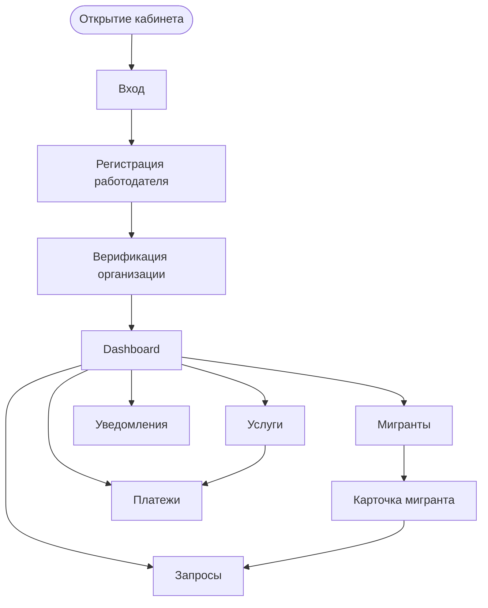

# Employer Cabinet Scenarios — MigrationOS

## 1. Назначение документа

Документ описывает основные пользовательские сценарии кабинета работодателя в MigrationOS.

Employer Cabinet Scenarios нужен, чтобы:

- зафиксировать, какие задачи работодатель решает в web-кабинете;
- описать ключевые пользовательские flows;
- связать UI-сценарии с backend API и бизнес-сущностями;
- определить состояния экранов, ошибки и edge cases;
- описать ограничения доступа работодателя;
- подготовить основу для проектирования интерфейсов, тест-кейсов и acceptance testing.

---

## 2. Контекст

Кабинет работодателя — это web-приложение для организации, которая работает с мигрантами через агентство.

Через кабинет работодатель может:

- зарегистрироваться;
- пройти проверку организации по ИНН;
- дождаться или пройти верификацию;
- видеть dashboard по своим мигрантам;
- смотреть список своих мигрантов;
- видеть статусы документов мигрантов;
- создавать запросы в агентство;
- отвечать на запросы от агентства;
- заказывать услуги;
- видеть платежи и статусы заявок;
- получать уведомления;
- управлять данными организации в рамках доступных прав.

### Технологический контекст

| Параметр | Значение |
|---|---|
| Тип приложения | Web cabinet |
| Frontend | React |
| Основная роль | `employer` |
| Контекст доступа | `org` |
| Основная модель доступа | Работодатель видит только данные своей организации |

---

## 3. Цели кабинета

| Цель | Что получает работодатель |
|---|---|
| Прозрачность по мигрантам | Видимость по статусам, срокам и рискам |
| Быстрые действия | Возможность оперативно создавать запросы и заказывать услуги |
| Контроль документов | Видимость проблемных и истекающих документов |
| Финансовая прозрачность | Видимость заявок и оплат |
| Организационная управляемость | Работа в рамках данных своей организации |

---

## 4. Роль пользователя

| Роль | Описание |
|---|---|
| `employer` | Представитель организации-работодателя, который работает с мигрантами своей организации |

Работодатель не должен видеть:

- мигрантов других организаций;
- внутренние комментарии агентства;
- служебные интеграционные логи;
- данные других работодателей;
- административные функции агентства;
- расширенные supervisor-метрики, если они не предназначены для работодателя.

---

## 5. Основные разделы кабинета

| Раздел | Назначение |
|---|---|
| Регистрация | Создание кабинета работодателя |
| Верификация | Проверка организации и доступов |
| Dashboard | Общая картина по мигрантам, документам и рискам |
| Мигранты | Список мигрантов организации |
| Карточка мигранта | Профиль, документы, статусы, риски |
| Документы | Просмотр документов в рамках permissions |
| Запросы | Обращения работодателя и ответы на запросы |
| Услуги | Заказ услуг агентства |
| Платежи | Просмотр оплат и статусов |
| Уведомления | Важные события по организации |
| Настройки организации | Данные организации и пользователи, если предусмотрено |

---

## 6. Общие UX-принципы

| ID | Правило |
|---|---|
| `EMP-GEN-001` | Работодатель всегда работает в контексте своей организации |
| `EMP-GEN-002` | Фильтры должны помогать быстро находить мигрантов с проблемами |
| `EMP-GEN-003` | Риски должны отображаться понятно: `normal`, `attention`, `critical` |
| `EMP-GEN-004` | Внутренние комментарии агентства не показываются работодателю |
| `EMP-GEN-005` | Ошибки доступа должны отображаться безопасно, без раскрытия чужих данных |
| `EMP-GEN-006` | Все списки должны поддерживать `loading`, `empty`, `error` и `pagination states` |

---

## 7. Сценарий: регистрация работодателя

### 7.1. Цель

Представитель работодателя должен создать аккаунт организации и отправить данные на проверку.

### 7.2. Предусловия

| Условие | Описание |
|---|---|
| Пользователь представляет организацию | Есть ИНН и контактные данные |
| Backend доступен | Auth, User, Employer services работают |
| Пользователь имеет доступ к email или телефону | Для подтверждения контакта |

### 7.3. Happy path

| Шаг | Действие пользователя | Поведение системы |
|---|---|---|
| 1 | Открывает страницу регистрации | Видит форму регистрации |
| 2 | Вводит ИНН организации | Система валидирует формат |
| 3 | Вводит контактные данные | Система проверяет обязательные поля |
| 4 | Отправляет форму | Backend создает заявку на регистрацию |
| 5 | Система запускает проверку организации | Например, через ФНС или внутренний процесс |
| 6 | Пользователь видит статус | «Организация ожидает проверки» |

### 7.4. Alternative flows

| Ситуация | Поведение |
|---|---|
| ИНН неверного формата | Показать field-level ошибку |
| Организация уже зарегистрирована | Показать безопасное сообщение и предложить обратиться к администратору |
| Проверка ФНС недоступна | Сохранить заявку и показать статус ожидания |
| Контактные данные не подтверждены | Ограничить доступ до подтверждения |

### 7.5. Связанные API и сущности

| Элемент | Связь |
|---|---|
| `Employer` | Организация работодателя |
| `User` | Представитель работодателя |
| `verificationStatus` | Статус проверки организации |
| `AuditLog` | Фиксация регистрации и изменения статуса |

---

## 8. Сценарий: верификация работодателя

### 8.1. Цель

Работодатель должен получить доступ к кабинету только после проверки организации и прав представителя.

### 8.2. Статусы верификации

| Статус | Что видит пользователь |
|---|---|
| `pending` | Организация ожидает проверки |
| `verified` | Организация подтверждена |
| `rejected` | Проверка не пройдена |
| `blocked` | Доступ ограничен |

### 8.3. Happy path

| Шаг | Действие пользователя | Поведение системы |
|---|---|---|
| 1 | Пользователь входит в кабинет | Система проверяет статус работодателя |
| 2 | Статус `verified` | Открывается dashboard |
| 3 | Данные организации доступны | Пользователь видит свои разделы |

### 8.4. Alternative flows

| Ситуация | Поведение |
|---|---|
| `pending` | Показать экран ожидания |
| `rejected` | Показать причину, если ее можно раскрывать |
| `blocked` | Показать сообщение об ограничении доступа |
| Не хватает документов организации | Показать список требуемых данных |

### 8.5. Связанные API и сущности

| Элемент | Связь |
|---|---|
| `Employer` | Организация работодателя |
| `Employer API` | Получение данных организации |
| `Status Models` | Верификационные статусы |

---

## 9. Сценарий: dashboard работодателя

### 9.1. Цель

Работодатель должен быстро понять состояние своей миграционной базы: сколько мигрантов в норме, где есть риски и какие действия нужны.

### 9.2. Основные виджеты

| Виджет | Назначение |
|---|---|
| Всего мигрантов | Количество мигрантов организации |
| Документы истекают скоро | Требуют внимания |
| Критичные риски | Мигранты с risk level `critical` |
| Запросы в работе | Активные запросы |
| Неоплаченные услуги | Заявки, ожидающие оплаты |
| Последние уведомления | Важные события |

### 9.3. Happy path

| Шаг | Действие пользователя | Поведение системы |
|---|---|---|
| 1 | Открывает кабинет | Загружается dashboard |
| 2 | Система применяет `org context` | Показывает только данные организации |
| 3 | Пользователь видит показатели | Может перейти в список мигрантов или запросов |
| 4 | Нажимает на виджет риска | Открывается фильтрованный список мигрантов |

### 9.4. UI-состояния

| Состояние | Поведение |
|---|---|
| `loading` | Показать skeleton |
| `empty` | Показать пустой dashboard для новой организации |
| `error` | Показать retry |
| `partial_data` | Показать доступные данные и предупреждение |
| `forbidden` | Показать безопасную ошибку доступа |

### 9.5. Связанные API и сущности

| Элемент | Связь |
|---|---|
| `GET /analytics/dashboard` | Dashboard-агрегация |
| `RiskScore` | Риск по мигрантам |
| `Request` | Активные запросы |
| `ServiceOrder` | Заявки и оплаты |

---

## 10. Сценарий: список мигрантов

### 10.1. Цель

Работодатель должен видеть список мигрантов своей организации и быстро находить тех, кто требует действий.

### 10.2. Основные поля списка

| Поле | Описание |
|---|---|
| ФИО | Имя мигранта |
| Гражданство | Страна |
| Проект | Внутренняя группировка |
| Статус документов | Общий индикатор |
| Риск | `normal`, `attention`, `critical` |
| Дата ближайшего истечения | Ближайшая критичная дата |
| Статус | Активен, архивный, заблокирован |

### 10.3. Фильтры

| Фильтр | Назначение |
|---|---|
| Поиск по ФИО | Быстрый поиск |
| Проект | Фильтр по группе |
| Риск | `normal / attention / critical` |
| Документы | `missing / expires_soon / rejected` |
| Статус мигранта | `active / archived` |
| Дата истечения | Диапазон дат |

### 10.4. Happy path

| Шаг | Действие пользователя | Поведение системы |
|---|---|---|
| 1 | Открывает раздел «Мигранты» | Видит список |
| 2 | Применяет фильтр `critical` | Список обновляется |
| 3 | Открывает карточку мигранта | Видит доступные данные |
| 4 | Переходит к документам | Видит статусы документов |

### 10.5. Edge cases

| Ситуация | Поведение |
|---|---|
| Нет мигрантов | Показать `empty state` |
| По фильтру ничего не найдено | Показать `empty search state` |
| Пользователь пытается открыть чужого мигранта | `403` или безопасный `404` |
| Данные риска временно недоступны | Показать частичный dashboard |

### 10.6. Связанные API и сущности

| Элемент | Связь |
|---|---|
| `GET /migrants` | Список мигрантов |
| `Migrant` | Карточки мигрантов |
| `Employer` | Контекст организации |

---

## 11. Сценарий: карточка мигранта

### 11.1. Цель

Работодатель должен видеть информацию по конкретному мигранту своей организации.

### 11.2. Доступные блоки

| Блок | Доступ работодателя |
|---|---|
| Базовые данные | Да, в рамках permissions |
| Документы | Да, если разрешено |
| Статусы документов | Да |
| Риск | Да, агрегированный уровень |
| Запросы | Только связанные с этим мигрантом |
| Услуги | Только связанные с организацией |
| Внутренние комментарии агентства | Нет |

### 11.3. Правила доступа

| ID | Правило |
|---|---|
| `EMP-MIGRANT-001` | Работодатель видит только мигрантов своей организации |
| `EMP-MIGRANT-002` | Внутренние комментарии агентства скрыты |
| `EMP-MIGRANT-003` | Доступ к документам проверяется отдельно |
| `EMP-MIGRANT-004` | Если мигрант больше не связан с организацией, доступ прекращается |

### 11.4. Связанные API и сущности

| Элемент | Связь |
|---|---|
| `GET /migrants/{migrantId}` | Карточка мигранта |
| `GET /migrants/{migrantId}/documents` | Документы мигранта |
| `GET /migrants/{migrantId}/risk` | Риск мигранта |

---

## 12. Сценарий: просмотр документов мигранта

### 12.1. Цель

Работодатель должен видеть статусы документов мигранта и понимать, какие действия требуются.

### 12.2. Что видит работодатель

| Статус | Интерпретация |
|---|---|
| `missing` | Документ отсутствует |
| `uploaded` | Документ загружен |
| `under_review` | Документ проверяется агентством |
| `approved` | Документ подтвержден |
| `rejected` | Документ отклонен |
| `expired` | Документ истек |
| `expires_soon` | Документ скоро истекает |

### 12.3. Доступ к файлам

Работодатель может получать файл только если:

- мигрант относится к его организации;
- роль имеет нужный permission;
- документ разрешен к просмотру работодателем;
- backend проверил контекст доступа.

### 12.4. Edge cases

| Ситуация | Поведение |
|---|---|
| Нет permission на просмотр файла | Показать статус без ссылки на файл |
| Документ архивирован | Показать как historical record, если разрешено |
| `downloadUrl` истек | Запросить новую ссылку |

### 12.5. Связанные API и сущности

| Элемент | Связь |
|---|---|
| `Document` | Статус документа |
| `DocumentFile` | Файл документа |
| `S3 Storage` | Выдача presigned URL |

---

## 13. Сценарий: создание запроса в агентство

### 13.1. Цель

Работодатель должен создать запрос в агентство по мигранту, документу, услуге или общему вопросу.

### 13.2. Happy path

| Шаг | Действие пользователя | Поведение системы |
|---|---|---|
| 1 | Открывает раздел «Запросы» | Видит свои запросы |
| 2 | Нажимает «Создать запрос» | Открывается форма |
| 3 | Выбирает тип запроса | Система показывает релевантные поля |
| 4 | Указывает мигранта или тему | Система проверяет `org context` |
| 5 | Добавляет комментарий | Система валидирует |
| 6 | Отправляет запрос | Создается `Request` |
| 7 | Видит статус `created` | Запрос появляется в списке |

### 13.3. Статусы запроса

| Статус | Что видит работодатель |
|---|---|
| `created` | Запрос создан |
| `in_progress` | Запрос в работе |
| `need_info` | Нужно предоставить информацию |
| `completed` | Запрос выполнен |
| `rejected` | Запрос отклонен |
| `cancelled` | Запрос отменен |

### 13.4. Edge cases

| Ситуация | Поведение |
|---|---|
| Работодатель выбирает чужого мигранта | `403` или безопасный `404` |
| Запрос уже закрыт | Режим read-only |
| Агентство запросило уточнение | Статус `need_info`, доступна форма ответа |
| Внешний комментарий пустой | `validation error` |

### 13.5. Связанные API и сущности

| Элемент | Связь |
|---|---|
| `GET /requests` | Список запросов |
| `POST /requests` | Создание запроса |
| `Request` | Сущность запроса |
| `Request Service API` | Поведение сервиса запросов |

---

## 14. Сценарий: ответ на запрос агентства

### 14.1. Цель

Работодатель должен ответить на запрос агентства и предоставить данные или комментарий.

### 14.2. Happy path

| Шаг | Действие пользователя | Поведение системы |
|---|---|---|
| 1 | Получает уведомление о запросе | Видит запрос в кабинете |
| 2 | Открывает запрос | Видит публичный комментарий агентства |
| 3 | Добавляет ответ | Система валидирует |
| 4 | Прикладывает файл, если нужно | Файл загружается через S3-flow |
| 5 | Отправляет ответ | Запрос обновляется |
| 6 | Агентство получает уведомление | Статус может перейти в работу |

### 14.3. Правила

| ID | Правило |
|---|---|
| `EMP-REQ-001` | Работодатель не видит `internalComment` |
| `EMP-REQ-002` | Работодатель может отвечать только на запросы своей организации |
| `EMP-REQ-003` | Файлы ответа проходят file validation |
| `EMP-REQ-004` | Действия работодателя логируются |

### 14.4. Edge cases

| Ситуация | Поведение |
|---|---|
| Файл ответа не прошел валидацию | Показать ошибку и не отправлять ответ |
| Запрос уже закрыт | Запретить редактирование |
| Нет сети | Показать retry |

---

## 15. Сценарий: заказ услуги

### 15.1. Цель

Работодатель должен заказать услугу агентства для своей организации или конкретного мигранта.

### 15.2. Happy path

| Шаг | Действие пользователя | Поведение системы |
|---|---|---|
| 1 | Открывает каталог услуг | Видит доступные услуги |
| 2 | Выбирает услугу | Видит описание, цену и требования |
| 3 | Заполняет форму | Указывает мигранта или организацию |
| 4 | Отправляет заявку | Создается `ServiceOrder` |
| 5 | Если услуга платная | Создается `Payment` |
| 6 | Пользователь переходит к оплате | Получает payment scenario |
| 7 | Webhook подтверждает оплату | Статус заявки обновляется |

### 15.3. Alternative flows

| Ситуация | Поведение |
|---|---|
| Услуга временно недоступна | Показать `unavailable state` |
| Не хватает обязательных данных | Показать validation error |
| Выбран чужой мигрант | `403` или безопасный `404` |

### 15.4. Важное правило

Frontend redirect после оплаты не подтверждает оплату.  
Статус оплаты меняется только после payment webhook.

### 15.5. Связанные API и сущности

| Элемент | Связь |
|---|---|
| `GET /services` | Каталог услуг |
| `POST /service-orders` | Создание заявки |
| `POST /payments` | Создание платежа |
| `ServiceOrder` | Заявка на услугу |
| `Payment` | Платеж |

---

## 16. Сценарий: платежи

### 16.1. Цель

Работодатель должен видеть платежи по услугам и понимать их статус.

### 16.2. Статусы платежей

| Статус | Что видит работодатель |
|---|---|
| `pending` | Ожидает оплаты |
| `paid` | Оплачено |
| `failed` | Ошибка оплаты |
| `cancelled` | Отменено |
| `refunded` | Возврат |

### 16.3. Edge cases

| Ситуация | Поведение |
|---|---|
| Webhook задерживается | Показать «Ожидаем подтверждение оплаты» |
| Оплата не прошла | Дать возможность повторить оплату |
| Сумма не совпала | Показать безопасный статус и передать в support |
| Провайдер недоступен | Показать retry позже |

### 16.4. Связанные API и сущности

| Элемент | Связь |
|---|---|
| `Payment` | Сущность платежа |
| `ServiceOrder` | Связанная заявка |
| `SBP Payment Integration` | Внешний payment flow |

---

## 17. Уведомления работодателя

| Событие | Уведомление |
|---|---|
| Документ мигранта истекает | Требуется внимание |
| Риск стал `critical` | Критичный риск по мигранту |
| Агентство создало запрос | Требуется ответ |
| Запрос выполнен | Запрос закрыт |
| Оплата подтверждена | Платеж прошел |
| Услуга выполнена | Результат доступен |

### Правила

| ID | Правило |
|---|---|
| `EMP-NOTIF-001` | Работодатель видит только уведомления своей организации |
| `EMP-NOTIF-002` | Уведомления не должны раскрывать скрытые внутренние комментарии |
| `EMP-NOTIF-003` | Deep links и переходы должны соблюдать `org context` |

---

## 18. Настройки организации

### 18.1. Цель

Работодатель должен видеть и при необходимости обновлять доступные данные организации без выхода за рамки permission-модели.

### 18.2. Что может быть доступно

| Блок | Доступ |
|---|---|
| Наименование организации | Просмотр |
| ИНН | Просмотр |
| Контактные данные | Просмотр / частичное редактирование |
| Статус верификации | Просмотр |
| Пользователи организации | Если предусмотрено правами |

### 18.3. Edge cases

| Ситуация | Поведение |
|---|---|
| Поле недоступно для редактирования | Показать read-only |
| Организация заблокирована | Ограничить критичные действия |
| Пользователь без permission пытается изменить данные | `403 Forbidden` |

---

## 19. Состояния экранов

| Состояние | Описание |
|---|---|
| `loading` | Данные загружаются |
| `empty` | Нет данных |
| `empty_search` | По фильтрам ничего не найдено |
| `error` | Ошибка загрузки |
| `forbidden` | Нет доступа |
| `partial_data` | Часть данных недоступна |
| `validation_error` | Ошибка в форме |
| `pending_verification` | Организация ожидает проверки |

### Примеры состояний по экранам

| Экран | Возможные состояния |
|---|---|
| Dashboard | `loading`, `partial_data`, `error`, `empty` |
| Мигранты | `loading`, `list`, `empty`, `empty_search`, `error` |
| Запросы | `loading`, `list`, `empty`, `validation_error`, `read_only` |
| Услуги | `catalog`, `unavailable`, `error` |
| Платежи | `pending`, `paid`, `failed`, `retry_available` |

---

## 20. Error handling

Ошибки должны соответствовать общей модели `ErrorResponse`.

| Ошибка | Поведение в кабинете |
|---|---|
| `401 Unauthorized` | Перелогинить пользователя |
| `403 Forbidden` | Показать «Нет доступа» |
| `404 Not Found` | Показать безопасный `not found` |
| `409 Conflict` | Показать конфликт статуса |
| `422 Validation Error` | Подсветить поля формы |
| `500/503` | Показать retry позже |
| `partial_data` | Показать доступные данные и предупреждение |

### Дополнительные правила

| ID | Правило |
|---|---|
| `EMP-ERR-001` | Ошибки не должны раскрывать существование чужих сущностей |
| `EMP-ERR-002` | Валидационные ошибки должны быть привязаны к форме |
| `EMP-ERR-003` | Ошибки оплаты должны отделяться от UX-событий redirect |

---

## 21. Сводная таблица сценариев

| Сценарий | Предусловия | Результат | Связанные API / сущности |
|---|---|---|---|
| Регистрация работодателя | Есть ИНН и контакты | Создана заявка на регистрацию | `Employer`, `User` |
| Верификация | Организация создана | Открыт или ограничен доступ | `Employer.verificationStatus` |
| Dashboard | Работодатель verified | Показаны агрегаты по организации | `Analytics API`, `RiskScore` |
| Список мигрантов | Есть доступ к разделу | Показан список по `org` | `GET /migrants`, `Migrant` |
| Карточка мигранта | Мигрант принадлежит организации | Показаны доступные блоки | `Migrant`, `Document`, `RiskScore` |
| Создание запроса | Есть permission `request.create` | Создан `Request` | `Request API` |
| Ответ на запрос | Есть доступ к запросу | Запрос обновлен | `Request`, S3-flow |
| Заказ услуги | Услуга доступна | Создан `ServiceOrder` | `Service`, `ServiceOrder` |
| Оплата | Есть `Payment` | Статус обновлен по webhook | `Payment`, `ServiceOrder` |

---

## 22. Mermaid user flow

---

## 23. Acceptance criteria

| ID | Критерий |
|---|---|
| `EMP-AC-001` | Работодатель может зарегистрировать организацию |
| `EMP-AC-002` | Работодатель видит статус верификации |
| `EMP-AC-003` | Неверифицированная организация не получает полный доступ |
| `EMP-AC-004` | Dashboard показывает только данные организации |
| `EMP-AC-005` | Работодатель видит только своих мигрантов |
| `EMP-AC-006` | Работодатель может фильтровать мигрантов по риску и документам |
| `EMP-AC-007` | Работодатель не видит внутренние комментарии агентства |
| `EMP-AC-008` | Работодатель может создать запрос в агентство |
| `EMP-AC-009` | Работодатель может ответить на запрос агентства |
| `EMP-AC-010` | Работодатель может заказать услугу |
| `EMP-AC-011` | Оплата считается подтвержденной только после webhook |
| `EMP-AC-012` | Кабинет корректно обрабатывает `loading`, `empty`, `error` и `forbidden states` |

---

## 24. Edge cases summary

| Сценарий | Edge case |
|---|---|
| Регистрация | Организация уже зарегистрирована |
| Верификация | ФНС или внешний контур недоступны |
| Dashboard | Часть данных недоступна |
| Мигранты | По фильтру ничего не найдено |
| Карточка мигранта | Мигрант больше не относится к организации |
| Документы | Нет permission на просмотр файла |
| Запросы | Попытка открыть чужой запрос |
| Услуги | Услуга недоступна |
| Платежи | Webhook задерживается |
| Общий | Backend недоступен |

---

## 25. Связанные артефакты

- [Functional Requirements](../01_requirements/functional-requirements.md)
- [User Stories](../01_requirements/user-stories.md)
- [Acceptance Criteria](../01_requirements/acceptance-criteria.md)
- [Role Model](../02_roles-and-access/role-model.md)
- [Permissions](../02_roles-and-access/permissions.md)
- [Access Matrix](../02_roles-and-access/access-matrix.md)
- [BPMN Employer Request](../03_processes/bpmn_employer-request.md)
- [Request Service API](../05_api/request-service-api.md)
- [Status Models](../04_data-model/status-models.md)
- [SBP Payment Integration](../06_integrations/sbp-payment.md)
- [Data Dictionary](../04_data-model/data-dictionary.md)
