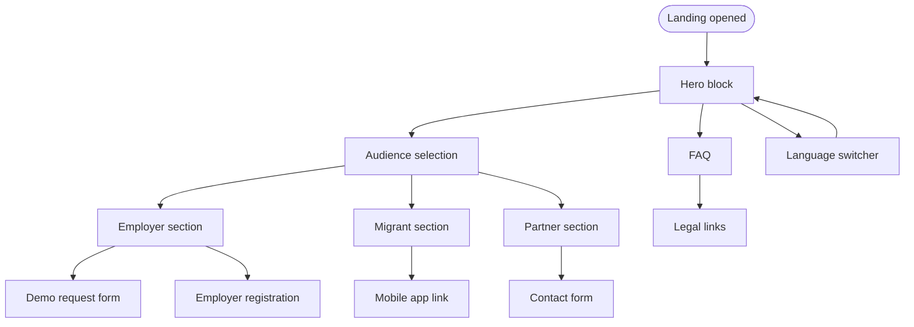

# Landing Scenarios — MigrationOS

## 1. Назначение документа

Документ описывает основные пользовательские сценарии публичного landing сайта MigrationOS.

Landing Scenarios нужен, чтобы:

- зафиксировать задачи публичного сайта;
- описать сценарии для разных аудиторий;
- связать landing с регистрацией работодателя и мобильным приложением мигранта;
- определить состояния форм, ошибок и edge cases;
- описать требования к мультиязычности, аналитике и безопасности форм;
- подготовить основу для проектирования интерфейса, контента и acceptance testing.

---

## 2. Контекст

Landing MigrationOS — это публичная часть продукта.

Через landing пользователь может:

- понять, что такое MigrationOS;
- выбрать свою аудиторию: работодатель, мигрант, партнер;
- узнать ценность продукта;
- перейти к регистрации работодателя;
- получить ссылку на мобильное приложение мигранта;
- оставить заявку на демо;
- отправить контактную форму;
- посмотреть FAQ;
- открыть юридические документы и политику ПДн;
- переключить язык интерфейса.

### Технологический контекст

| Параметр | Значение |
|---|---|
| Тип приложения | Public landing |
| Frontend | Next.js |
| Языки | `RU / EN` |
| Доступ | Публичный |
| Основные действия | CTA, demo request, contact form, переход к регистрации |

---

## 3. Цели landing

| Цель | Описание |
|---|---|
| Объяснить продукт | Кратко показать, какие задачи решает MigrationOS |
| Сегментировать аудиторию | Разделить сценарии работодателя, мигранта и партнера |
| Конвертировать работодателя | Привести к регистрации или заявке на демо |
| Помочь мигранту | Объяснить, где скачать приложение и зачем оно нужно |
| Собрать лиды | Получить контактные заявки через форму |
| Поддержать доверие | Показать безопасность, процессы, юридические документы и FAQ |

---

## 4. Основные аудитории

| Аудитория | Цель пользователя |
|---|---|
| Работодатель | Понять, как контролировать иностранных работников, документы, риски и услуги |
| Мигрант | Понять, как пользоваться приложением и получать уведомления |
| Партнер | Понять, как сотрудничать с агентством или платформой |
| Внутренний сотрудник | Быстро перейти к служебным разделам, если ссылка предусмотрена |
| Случайный посетитель | Узнать назначение продукта и контакты |

---

## 5. Основные блоки landing

| Раздел | Назначение |
|---|---|
| Hero block | Краткое позиционирование и основной CTA |
| Для работодателя | Ценность для организаций |
| Для мигранта | Ценность мобильного приложения |
| Как это работает | Общее объяснение процесса |
| Возможности | Документы, риски, уведомления, услуги, платежи |
| Интеграции | SHERPA RPA, 1С, СБП, уведомления, хранилище |
| Безопасность | ПДн, роли, доступы, аудит |
| Demo request | Заявка на демонстрацию |
| Contact form | Обратная связь |
| FAQ | Частые вопросы |
| Legal links | Политика ПДн, согласия, условия |
| Language switcher | `RU / EN` |

---

## 6. Общие UX-принципы

| ID | Правило |
|---|---|
| `LAND-GEN-001` | Пользователь должен за `5–10 секунд` понять ценность продукта |
| `LAND-GEN-002` | Основные CTA должны быть видны без долгого поиска |
| `LAND-GEN-003` | Landing должен поддерживать `RU` и `EN` |
| `LAND-GEN-004` | Формы должны иметь понятную валидацию |
| `LAND-GEN-005` | Публичный сайт не должен раскрывать внутренние данные системы |
| `LAND-GEN-006` | Юридические ссылки должны быть доступны из footer |
| `LAND-GEN-007` | Ошибки форм должны быть безопасными и понятными |

---

## 7. Сценарий: первый визит на landing

### 7.1. Цель

Посетитель должен быстро понять, что делает MigrationOS и для кого предназначена платформа.

### 7.2. Предусловия

| Условие | Описание |
|---|---|
| Пользователь открыл публичный URL | Landing доступен |
| Пользователь не авторизован | Landing публичный |
| Контент загружается | Next.js page доступна |

### 7.3. Happy path

| Шаг | Действие пользователя | Поведение системы |
|---|---|---|
| 1 | Открывает landing | Видит `hero block` |
| 2 | Читает позиционирование | Понимает назначение платформы |
| 3 | Видит основные CTA | Может выбрать регистрацию, демо или узнать подробнее |
| 4 | Скроллит страницу | Видит преимущества, сценарии и FAQ |

### 7.4. Alternative flows

| Ситуация | Поведение |
|---|---|
| Контент не загрузился | Показать `error state` или fallback |
| Пользователь открыл deep link к секции | Прокрутить к нужному блоку |
| Пользователь открыл с мобильного | Адаптивная верстка показывает mobile layout |
| Язык браузера `EN` | Можно предложить английскую версию |

### 7.5. Связанные сущности и API

| Элемент | Связь |
|---|---|
| Public content | Контент landing |
| Analytics events | Трекинг CTA и поведения |

---

## 8. Сценарий: выбор аудитории

### 8.1. Цель

Пользователь должен быстро перейти к информации, релевантной его роли.

### 8.2. Аудитории и CTA

| Аудитория | CTA |
|---|---|
| Работодатель | Зарегистрировать организацию / Запросить демо |
| Мигрант | Скачать приложение / Узнать, как пользоваться |
| Партнер | Связаться с нами |
| Агентство | Запросить демо |

### 8.3. Happy path

| Шаг | Действие пользователя | Поведение системы |
|---|---|---|
| 1 | Видит блок выбора аудитории | Выбирает нужный вариант |
| 2 | Нажимает CTA | Система переводит к релевантному блоку или форме |
| 3 | Пользователь выполняет целевое действие | Регистрация, демо-заявка или контакт |

### 8.4. Edge cases

| Ситуация | Поведение |
|---|---|
| Пользователь не понимает, что выбрать | FAQ и блок «Как это работает» помогают разобраться |
| CTA временно недоступен | Показать fallback-контакт |
| Пользователь ошибся аудиторией | Дать возможность легко вернуться к выбору |

---

## 9. Сценарий: переход к регистрации работодателя

### 9.1. Цель

Работодатель должен перейти с landing к регистрации кабинета работодателя.

### 9.2. Happy path

| Шаг | Действие пользователя | Поведение системы |
|---|---|---|
| 1 | Нажимает «Зарегистрировать организацию» | Система открывает employer registration |
| 2 | Пользователь попадает в форму регистрации | Видит поля ИНН, контакты, организацию |
| 3 | Продолжает регистрацию | Сценарий переходит в employer cabinet flow |

### 9.3. Alternative flows

| Ситуация | Поведение |
|---|---|
| Registration service недоступен | Показать fallback contact |
| Пользователь уже имеет аккаунт | Предложить перейти ко входу |

### 9.4. Правила

| ID | Правило |
|---|---|
| `LAND-EMP-001` | CTA регистрации должен вести в employer cabinet registration |
| `LAND-EMP-002` | Landing не должен сам создавать employer без backend-валидации |
| `LAND-EMP-003` | Регистрация работодателя должна дальше подчиняться role/access model |
| `LAND-EMP-004` | Если registration service недоступен, нужно показать fallback contact |

### 9.5. Связанные API и сущности

| Элемент | Связь |
|---|---|
| Employer registration flow | Переход в кабинет работодателя |
| `Employer`, `User` | Будущие сущности регистрации |

---

## 10. Сценарий: переход к мобильному приложению мигранта

### 10.1. Цель

Мигрант должен понять, как получить доступ к мобильному приложению.

### 10.2. Возможные действия

| Действие | Описание |
|---|---|
| Открыть App Store | Если iOS |
| Открыть Google Play | Если Android |
| Открыть инструкцию | Если приложение распространяется через агентство |
| Перейти к FAQ | Если нужна помощь |

### 10.3. Happy path

| Шаг | Действие пользователя | Поведение системы |
|---|---|---|
| 1 | Нажимает «Скачать приложение» | Система определяет платформу или показывает варианты |
| 2 | Выбирает магазин | Открывается store link |
| 3 | Устанавливает приложение | Дальше сценарий идет в mobile app |

### 10.4. Edge cases

| Ситуация | Поведение |
|---|---|
| Store link недоступен | Показать инструкцию или контакт |
| Платформа не определена | Показать оба варианта |
| Приложение доступно только по приглашению | Показать инструкцию получения доступа |

### 10.5. Связанные сущности и сценарии

| Элемент | Связь |
|---|---|
| Mobile app | Переход в сценарии мобильного приложения |
| Store links | Внешние ссылки на магазины |

---

## 11. Сценарий: заявка на демо

### 11.1. Цель

Работодатель или партнер должен оставить заявку на демонстрацию продукта.

### 11.2. Поля формы

| Поле | Обязательность | Комментарий |
|---|---:|---|
| Имя | Да | Контактное лицо |
| Компания | Да | Организация |
| Email | Да | Для связи |
| Телефон | Нет / Да | Зависит от политики продаж |
| Количество работников | Нет | Для квалификации лида |
| Комментарий | Нет | Дополнительный контекст |
| Согласие на обработку ПДн | Да | Нужно для отправки формы |

### 11.3. Happy path

| Шаг | Действие пользователя | Поведение системы |
|---|---|---|
| 1 | Открывает форму demo request | Видит поля |
| 2 | Заполняет данные | Система валидирует |
| 3 | Ставит согласие на ПДн | Кнопка отправки активна |
| 4 | Отправляет форму | Backend принимает заявку |
| 5 | Пользователь видит `success state` | «Спасибо, мы свяжемся с вами» |

### 11.4. Alternative flows

| Ситуация | Поведение |
|---|---|
| Email неверный | Показать field-level ошибку |
| Не отмечено согласие | Заблокировать отправку |
| Backend недоступен | Показать retry и альтернативный email/телефон |
| Заявка уже отправлена | Показать safe duplicate message |

### 11.5. Связанные сущности и API

| Элемент | Связь |
|---|---|
| `Lead` | Заявка с landing |
| `ContactRequest` | Контактная форма |
| `Consent` | Согласие на ПДн |
| `Notification` | Уведомление внутренней роли |

---

## 12. Сценарий: контактная форма

### 12.1. Цель

Пользователь должен отправить общий вопрос или обращение через форму обратной связи.

### 12.2. Поля формы

| Поле | Обязательность | Комментарий |
|---|---:|---|
| Имя | Да | Контактное лицо |
| Email или телефон | Да | Один из каналов связи |
| Тема | Нет | Категория обращения |
| Сообщение | Да | Текст вопроса |
| Согласие на ПДн | Да | Требуется перед отправкой |

### 12.3. Happy path

| Шаг | Действие пользователя | Поведение системы |
|---|---|---|
| 1 | Открывает contact form | Видит форму |
| 2 | Вводит данные | Система валидирует поля |
| 3 | Подтверждает согласие | Кнопка отправки активна |
| 4 | Отправляет сообщение | Backend принимает форму |
| 5 | Пользователь видит подтверждение | Показывается success message |

### 12.4. Правила

| ID | Правило |
|---|---|
| `LAND-FORM-001` | Форма не должна принимать данные без согласия на ПДн |
| `LAND-FORM-002` | Пользовательские ошибки должны быть field-level |
| `LAND-FORM-003` | Технические ошибки backend не показываются подробно |
| `LAND-FORM-004` | Повторная отправка должна быть защищена от дублей и спама |
| `LAND-FORM-005` | Секреты captcha или anti-spam не должны попадать во frontend |

---

## 13. Сценарий: переключение языка

### 13.1. Цель

Пользователь должен переключить язык landing между `RU` и `EN`.

### 13.2. Happy path

| Шаг | Действие пользователя | Поведение системы |
|---|---|---|
| 1 | Нажимает language switcher | Видит доступные языки |
| 2 | Выбирает `EN` | Контент переключается |
| 3 | Перезагружает страницу | Выбранный язык сохраняется |

### 13.3. Alternative flows

| Ситуация | Поведение |
|---|---|
| Язык документа недоступен | Показать fallback language |
| Переключение произошло во время заполнения формы | Не терять введенные данные без предупреждения |

### 13.4. Правила

| ID | Правило |
|---|---|
| `LAND-I18N-001` | `RU` и `EN` версии должны иметь одинаковые ключевые CTA |
| `LAND-I18N-002` | Language switch не должен сбрасывать введенные данные без предупреждения |
| `LAND-I18N-003` | Юридические документы должны открываться на доступном языке или показывать fallback |
| `LAND-I18N-004` | URL-структура должна поддерживать локаль, если используется i18n routing |

---

## 14. Сценарий: FAQ и юридические документы

### 14.1. Цель

Пользователь должен получить ответы на частые вопросы и открыть юридические документы.

### 14.2. FAQ темы

| Тема | Пример вопроса |
|---|---|
| Для работодателя | Как контролировать документы сотрудников? |
| Для мигранта | Как войти в приложение? |
| Документы | Какие документы нужно загрузить? |
| Оплата | Как оплачиваются услуги? |
| Безопасность | Как защищаются персональные данные? |
| Поддержка | Куда обращаться при проблемах? |

### 14.3. Legal links

| Документ | Назначение |
|---|---|
| Политика обработки ПДн | Публичная политика |
| Пользовательское соглашение | Условия использования |
| Согласие на обработку ПДн | Текст согласия |
| Контакты оператора | Юридическая информация |

### 14.4. Edge cases

| Ситуация | Поведение |
|---|---|
| FAQ не загрузился | Показать fallback contact |
| Документ временно недоступен | Показать безопасную ошибку |
| Нужный вопрос не найден | Предложить contact form |

---

## 15. SEO и analytics

### 15.1. SEO-требования

| Требование | Описание |
|---|---|
| `Title / description` | Уникальные для `RU` и `EN` |
| Semantic headings | Корректная структура `H1/H2/H3` |
| OpenGraph | Для шаринга ссылки |
| Sitemap / robots | Если сайт индексируется |
| Performance | Быстрая загрузка `hero block` |

### 15.2. Analytics events

| Событие | Назначение |
|---|---|
| `landing_view` | Просмотр landing |
| `cta_employer_register_click` | Клик регистрации работодателя |
| `cta_demo_click` | Клик заявки на демо |
| `demo_form_submit_success` | Успешная отправка формы |
| `demo_form_submit_error` | Ошибка формы |
| `language_switch` | Смена языка |
| `faq_open` | Открытие вопроса FAQ |

### 15.3. Правила analytics

| ID | Правило |
|---|---|
| `LAND-AN-001` | Analytics не должна собирать лишние ПДн |
| `LAND-AN-002` | Основные CTA должны быть измеримы как отдельные события |
| `LAND-AN-003` | Ошибки форм должны быть видны в аналитике агрегированно, без текста пользовательских сообщений |

---

## 16. Состояния экранов и форм

| Состояние | Описание |
|---|---|
| `loading` | Контент или форма загружается |
| `success` | Форма успешно отправлена |
| `validation_error` | Ошибка в поле |
| `network_error` | Ошибка сети или backend |
| `duplicate` | Похожая заявка уже отправлена |
| `rate_limited` | Слишком много попыток |
| `fallback_contact` | Показан альтернативный способ связи |

### Типовые состояния по разделам

| Раздел | Возможные состояния |
|---|---|
| Hero / контент | `loading`, `loaded`, `error` |
| Demo form | `idle`, `validation_error`, `submitting`, `success`, `network_error` |
| Contact form | `idle`, `duplicate`, `rate_limited`, `success` |
| FAQ | `loaded`, `empty`, `error` |

---

## 17. Error handling

Ошибки должны быть понятны публичному пользователю и не раскрывать внутренние детали.

| Ошибка | Поведение |
|---|---|
| Неверный email | Подсветить поле |
| Не отмечено согласие | Заблокировать отправку или показать ошибку |
| Backend `500/503` | Показать «Попробуйте позже» и `fallback contact` |
| Rate limit | Показать сообщение о повторе позже |
| Duplicate request | Показать безопасное сообщение |
| Ошибка i18n | Показать fallback language |

---

## 18. Security and privacy

| ID | Требование |
|---|---|
| `LAND-SEC-001` | Формы должны быть защищены от спама и массовой отправки |
| `LAND-SEC-002` | ПДн из форм передаются только по HTTPS |
| `LAND-SEC-003` | Согласие на ПДн обязательно для форм |
| `LAND-SEC-004` | Landing не должен раскрывать внутренние endpoint и технические детали |
| `LAND-SEC-005` | Ошибки не должны показывать stack trace |
| `LAND-SEC-006` | Analytics не должна собирать лишние ПДн |

### Дополнительные меры

- captcha или anti-bot должны проверяться на backend;
- rate limiting должен применяться к формам;
- публичные формы не должны использовать внутренние административные endpoint напрямую.

---

## 19. Сводная таблица сценариев

| Сценарий | Предусловия | Результат | Связанные API / сущности |
|---|---|---|---|
| Первый визит | Landing доступен | Пользователь понял ценность продукта | Public content |
| Выбор аудитории | Пользователь на landing | Переход к релевантному CTA | UI routing |
| Регистрация работодателя | Пользователь выбрал employer CTA | Переход в registration flow | `Employer`, `User` |
| Скачать приложение | Пользователь выбрал migrant CTA | Открыт store link или инструкция | Mobile app |
| Заявка на демо | Заполнена форма и дано согласие | Создан `Lead` или `ContactRequest` | `Lead`, `Consent` |
| Контактная форма | Заполнено сообщение | Создано обращение | `ContactRequest` |
| Переключение языка | Доступна локаль | Контент отображен на выбранном языке | i18n |
| FAQ / Legal | Пользователь открыл раздел | Получил справочную или юридическую информацию | Static content |

---

## 20. Mermaid user flow

---

## 21. Acceptance criteria

| ID | Критерий |
|---|---|
| `LAND-AC-001` | Пользователь видит понятный `hero block` и основной CTA |
| `LAND-AC-002` | Пользователь может выбрать аудиторию |
| `LAND-AC-003` | Работодатель может перейти к регистрации |
| `LAND-AC-004` | Пользователь может отправить demo request |
| `LAND-AC-005` | Форма требует согласие на ПДн |
| `LAND-AC-006` | Ошибки формы показываются как field-level или safe global errors |
| `LAND-AC-007` | Пользователь может переключить `RU / EN` |
| `LAND-AC-008` | Юридические документы доступны из footer |
| `LAND-AC-009` | Landing не раскрывает внутренние данные и technical stack traces |
| `LAND-AC-010` | На мобильном устройстве landing отображается адаптивно |
| `LAND-AC-011` | Analytics events фиксируют основные CTA без лишних ПДн |
| `LAND-AC-012` | При backend error пользователь видит `fallback contact` |

---

## 22. Edge cases summary

| Сценарий | Edge case |
|---|---|
| Первый визит | Контент не загрузился |
| Выбор аудитории | Пользователь не понимает, какой сценарий выбрать |
| Регистрация | Employer registration service недоступен |
| Скачать приложение | Store link недоступен |
| Demo request | Backend недоступен |
| Contact form | Rate limit или spam protection |
| Language switch | Перевод юридического документа отсутствует |
| FAQ | Вопрос не найден |
| Analytics | Пользователь запретил tracking |

---

## 23. Связанные артефакты

- [Project Scope](../00_case-overview/project-scope.md)
- [Product Vision](../00_case-overview/product-vision.md)
- [Stakeholders](../00_case-overview/stakeholders.md)
- [Functional Requirements](../01_requirements/functional-requirements.md)
- [User Stories](../01_requirements/user-stories.md)
- [Acceptance Criteria](../01_requirements/acceptance-criteria.md)
- [Employer Cabinet Scenarios](./employer-cabinet-scenarios.md)
- [Migrant App Scenarios](./migrant-app-scenarios.md)
- [Permissions](../02_roles-and-access/permissions.md)
