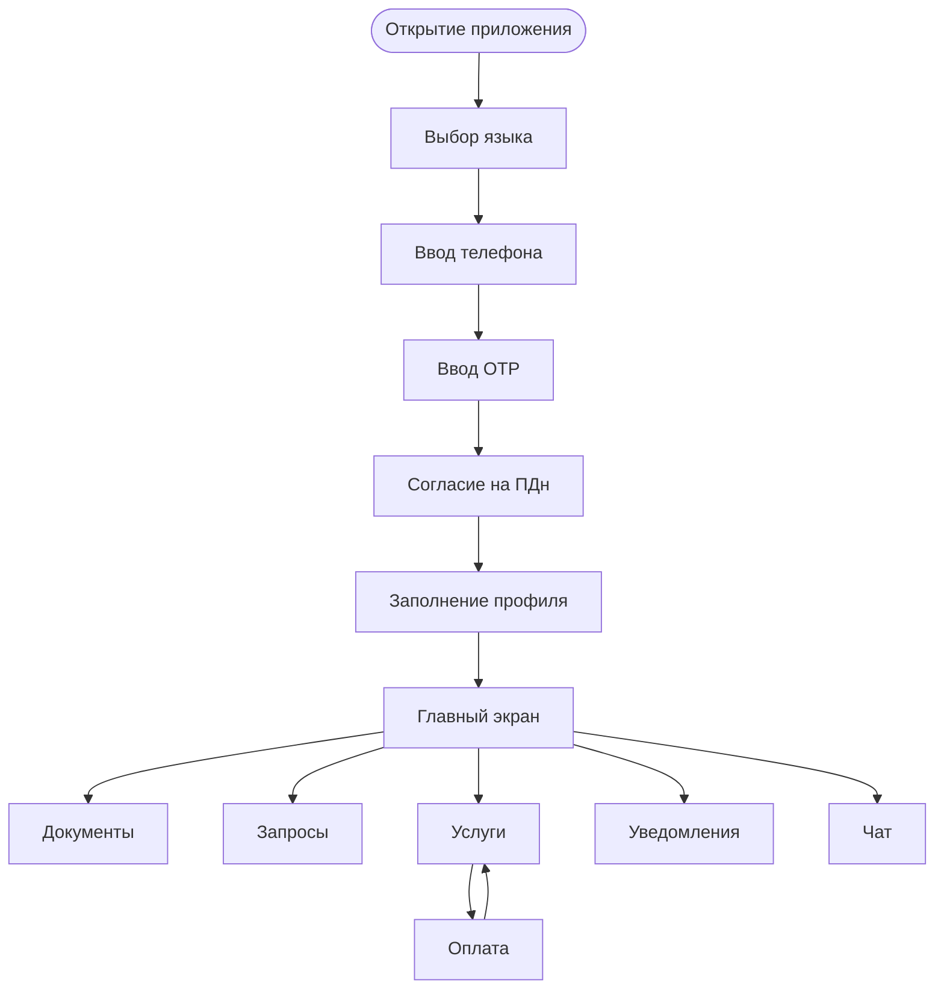

# Migrant App Scenarios — MigrationOS

## 1. Назначение документа

Документ описывает основные пользовательские сценарии мобильного приложения мигранта в MigrationOS.

Migrant App Scenarios нужен, чтобы:

- зафиксировать, какие задачи мигрант решает в мобильном приложении;
- описать ключевые пользовательские flows;
- связать UI-сценарии с backend API и бизнес-сущностями;
- определить состояния экранов, ошибки и edge cases;
- подготовить основу для проектирования интерфейсов, тест-кейсов и acceptance testing.

---

## 2. Контекст

Мобильное приложение MigrationOS предназначено для мигранта.

Через приложение мигрант может:

- зарегистрироваться и войти по телефону через OTP;
- заполнить профиль;
- дать согласие на обработку ПДн;
- загрузить документы;
- отслеживать статусы документов;
- получать push-уведомления;
- создавать запросы;
- заказывать услуги;
- оплачивать услуги;
- общаться с агентством или поддержкой;
- получать напоминания о сроках документов.

### Поддерживаемые языки

| Язык | Назначение |
|---|---|
| `RU` | Основной язык интерфейса |
| `UZ` | Язык для части мигрантов |
| `EN` | Дополнительный язык интерфейса |

### Технологический контекст

| Параметр | Значение |
|---|---|
| Mobile stack | `React Native` |
| iOS | `iOS 15+` |
| Android | `Android 10+` |
| Push | `FCM` |
| Хранение файлов | `S3-compatible storage` через backend |

Мультиязычность должна поддерживаться на уровне:

- статических текстов интерфейса;
- ошибок и валидационных сообщений;
- push-уведомлений;
- заголовков и CTA в основных сценариях.

---

## 3. Цели приложения

| Цель | Что получает мигрант |
|---|---|
| Быстрый вход | Авторизация по телефону и OTP без сложной регистрации |
| Прозрачность статусов | Видимость по документам, запросам, услугам и оплатам |
| Самообслуживание | Возможность самому обновлять данные и загружать файлы |
| Своевременные уведомления | Напоминания о документах и изменениях статусов |
| Коммуникация | Канал взаимодействия с агентством и поддержкой |

---

## 4. Роль пользователя

| Роль | Описание |
|---|---|
| `migrant` | Пользователь, который видит только свой профиль, свои документы, свои запросы, свои услуги и свои уведомления |

Мигрант не должен видеть:

- чужие профили;
- документы других мигрантов;
- внутренние комментарии агентства;
- служебные статусы интеграций;
- административные данные работодателя или агентства.

---

## 5. Основные разделы приложения

| Раздел | Назначение |
|---|---|
| Авторизация | Вход по телефону и OTP |
| Профиль | Личные данные мигранта |
| Документы | Загрузка и статусы документов |
| Уведомления | Push и in-app notifications |
| Запросы | Обращения к работодателю или агентству |
| Услуги | Заказ платных или бесплатных услуг |
| Платежи | Просмотр статуса оплаты |
| Чат | Коммуникация с агентством |
| Настройки | Язык, уведомления, выход |

---

## 6. Общие UX-принципы

| ID | Правило |
|---|---|
| `MOB-GEN-001` | Все ключевые сценарии должны работать на `RU`, `UZ`, `EN` |
| `MOB-GEN-002` | Критичные ошибки должны быть понятны пользователю, без технических деталей |
| `MOB-GEN-003` | Push и deep links не должны открывать экран без повторной проверки авторизации |
| `MOB-GEN-004` | Offline и retry states должны быть предусмотрены в upload, запросах, чате и оплатах |
| `MOB-GEN-005` | Пользователь должен видеть только доступные ему данные по модели `own` |

---

## 7. Сценарий: первый вход и регистрация

### 7.1. Цель

Мигрант должен войти в приложение по номеру телефона и подтвердить доступ через OTP.

### 7.2. Предусловия

| Условие | Описание |
|---|---|
| Пользователь установил приложение | `iOS 15+` или `Android 10+` |
| Номер телефона доступен пользователю | На него приходит OTP |
| Backend доступен | `Auth Service` работает |

### 7.3. Happy path

| Шаг | Действие пользователя | Поведение системы |
|---|---|---|
| 1 | Открывает приложение | Видит экран выбора языка или входа |
| 2 | Выбирает язык | Интерфейс переключается |
| 3 | Вводит телефон | Система валидирует формат |
| 4 | Нажимает «Получить код» | Backend отправляет OTP |
| 5 | Вводит OTP | Backend проверяет код |
| 6 | Код верный | Пользователь входит в приложение |
| 7 | Профиль неполный | Система переводит на заполнение профиля |

### 7.4. Alternative flows

| Ситуация | Поведение |
|---|---|
| Неверный OTP | Показать ошибку и дать повторить |
| OTP истек | Предложить запросить новый код |
| Слишком много попыток | Временно заблокировать повтор |
| Телефон в неверном формате | Подсветить поле и показать ошибку |
| Нет сети | Показать `offline/error state` |

### 7.5. Связанные API и сущности

| Элемент | Связь |
|---|---|
| `GET /auth/me` | Проверка текущей сессии |
| `Auth API` | OTP login |
| `User` | Пользователь приложения |
| `Migrant` | Профиль мигранта |

---

## 8. Сценарий: заполнение профиля

### 8.1. Цель

Мигрант должен заполнить базовые данные профиля, необходимые для работы с документами и услугами.

### 8.2. Поля профиля

| Поле | Обязательность | Комментарий |
|---|---:|---|
| ФИО | Да | Как в документе |
| Дата рождения | Да | Для идентификации |
| Гражданство | Да | Влияет на сценарии документов |
| Телефон | Да | Используется для входа |
| Email | Нет | Для дополнительных уведомлений |
| Работодатель | Нет / системно | Может быть связан через агентство или 1С |
| Проект | Нет | Используется как группировка |

### 8.3. Happy path

| Шаг | Действие пользователя | Поведение системы |
|---|---|---|
| 1 | Открывает профиль | Видит форму |
| 2 | Заполняет данные | Система валидирует поля |
| 3 | Нажимает «Сохранить» | Backend сохраняет профиль |
| 4 | Данные корректны | Профиль считается заполненным |
| 5 | Система показывает следующий шаг | Например, загрузку документов |

### 8.4. Alternative flows и edge cases

| Ситуация | Поведение |
|---|---|
| Обязательное поле пустое | Показать field-level ошибку |
| Дата рождения в будущем | Запретить сохранение |
| Профиль уже связан с работодателем | Не дать изменить связь без прав |
| Backend недоступен | Показать ошибку и не потерять введенные данные |

### 8.5. Связанные API и сущности

| Элемент | Связь |
|---|---|
| `User` | Учетная запись |
| `Migrant` | Профиль мигранта |
| `User Service` | Профиль пользователя |

---

## 9. Сценарий: согласие на обработку ПДн

### 9.1. Цель

Перед загрузкой документов и использованием персональных данных мигрант должен дать согласие на обработку ПДн.

### 9.2. Happy path

| Шаг | Действие пользователя | Поведение системы |
|---|---|---|
| 1 | Открывает приложение после входа | Видит экран согласия |
| 2 | Читает текст согласия | Может открыть подробности |
| 3 | Ставит чекбокс | Кнопка продолжения становится активной |
| 4 | Подтверждает | Система сохраняет факт согласия |
| 5 | Продолжает работу | Получает доступ к основным разделам |

### 9.3. Alternative flows

| Ситуация | Поведение |
|---|---|
| Пользователь не согласен | Не получает доступ к сценариям загрузки документов |
| Текст согласия не загрузился | Показать retry и заблокировать продолжение |
| Согласие уже дано | Экран повторно не показывается без необходимости |

### 9.4. Правила

| ID | Правило |
|---|---|
| `MOB-PDN-001` | Без согласия нельзя загружать документы |
| `MOB-PDN-002` | Факт согласия должен сохраняться с датой и версией текста |
| `MOB-PDN-003` | Пользователь должен иметь возможность открыть текст согласия |
| `MOB-PDN-004` | Отзыв согласия требует отдельного регламента |

---

## 10. Сценарий: загрузка документа

### 10.1. Цель

Мигрант должен загрузить документ и отправить его на проверку.

### 10.2. Типы документов

| Тип документа | Пример |
|---|---|
| Паспорт | Фото или PDF |
| Патент | PDF или фото |
| Миграционная карта | Фото |
| Регистрация | PDF или фото |
| Чек оплаты | Фото или PDF |

### 10.3. Happy path

| Шаг | Действие пользователя | Поведение системы |
|---|---|---|
| 1 | Открывает раздел «Документы» | Видит список документов и статусы |
| 2 | Выбирает тип документа | Видит требования к файлу |
| 3 | Загружает файл | Система проверяет формат и размер |
| 4 | Файл успешно загружен | Создается `DocumentFile` |
| 5 | Документ отправляется на проверку | Статус становится `uploaded` или `under_review` |
| 6 | Пользователь видит результат | Экран обновляется |

### 10.4. Alternative flows

| Ситуация | Поведение |
|---|---|
| Файл слишком большой | Показать ошибку |
| Неверный формат | Разрешить выбрать другой файл |
| Потеря сети при upload | Показать retry |
| Upload session истекла | Создать новую session |
| Документ отклонен | Показать причину и кнопку «Загрузить заново» |

### 10.5. Связанные API, сущности и интеграции

| Элемент | Связь |
|---|---|
| `Document` | Бизнес-сущность документа |
| `DocumentFile` | Файл документа |
| `Document API` | Upload и получение статусов |
| `S3 Storage` | Хранение файла |
| `Notification` | Уведомление о статусе |
| `AuditLog` | Логирование загрузки |

---

## 11. Сценарий: просмотр статусов документов

### 11.1. Цель

Мигрант должен понимать, какие документы в порядке, какие требуют действий и какие скоро истекают.

### 11.2. Возможные статусы

| Статус | Что видит пользователь |
|---|---|
| `missing` | Документ не загружен |
| `uploaded` | Документ загружен |
| `under_review` | Документ проверяется |
| `approved` | Документ подтвержден |
| `rejected` | Документ отклонен |
| `expired` | Документ истек |
| `expires_soon` | Документ скоро истекает |

### 11.3. UI-состояния

| Состояние | Поведение |
|---|---|
| Все документы в порядке | Показать положительный статус |
| Есть истекающий документ | Показать предупреждение |
| Есть отклоненный документ | Показать причину и CTA |
| Нет документов | Показать `empty state` |
| Ошибка загрузки статусов | Показать `error state` и retry |

### 11.4. Связанные API и сущности

| Элемент | Связь |
|---|---|
| `GET /migrants/{migrantId}/documents` | Список документов |
| `Document` | Статусы документа |
| `Status Models` | Допустимые статусы |

---

## 12. Сценарий: push и in-app уведомления

### 12.1. Цель

Мигрант должен получать важные уведомления по документам, запросам, услугам и платежам.

### 12.2. Примеры уведомлений

| Тип | Текст |
|---|---|
| `document.expires_soon` | «Патент истекает через 7 дней» |
| `document.rejected` | «Документ отклонен. Нужно загрузить новый файл» |
| `request.need_info` | «По запросу нужна дополнительная информация» |
| `service_order.paid` | «Оплата подтверждена» |
| `service_order.completed` | «Услуга выполнена» |

### 12.3. Deep links

| Тип уведомления | Deep link |
|---|---|
| Документ | `migrationos://documents/{documentId}` |
| Запрос | `migrationos://requests/{requestId}` |
| Услуга | `migrationos://service-orders/{serviceOrderId}` |
| Профиль | `migrationos://profile` |

### 12.4. Alternative flows

| Ситуация | Поведение |
|---|---|
| Push не доставлен | In-app уведомление остается доступным |
| Пользователь нажал push без активной сессии | Открыть login flow, затем deep link |
| Deep link ведет на недоступную сущность | Показать безопасный `not found / forbidden state` |

### 12.5. Правила

| ID | Правило |
|---|---|
| `MOB-NOTIF-001` | Push payload не должен содержать лишние ПДн |
| `MOB-NOTIF-002` | Deep link открывается только после авторизации |
| `MOB-NOTIF-003` | Если push не доставлен, in-app уведомление может остаться доступным |
| `MOB-NOTIF-004` | Пользователь может настраивать часть уведомлений |

---

## 13. Сценарий: создание запроса

### 13.1. Цель

Мигрант должен создать запрос к работодателю или агентству.

### 13.2. Happy path

| Шаг | Действие пользователя | Поведение системы |
|---|---|---|
| 1 | Открывает раздел «Запросы» | Видит список своих запросов |
| 2 | Нажимает «Создать запрос» | Видит форму |
| 3 | Выбирает тип запроса | Система показывает нужные поля |
| 4 | Добавляет комментарий | Система валидирует данные |
| 5 | Отправляет запрос | Создается `Request` |
| 6 | Получает статус `created` | Видит запрос в списке |

### 13.3. Alternative flows

| Ситуация | Поведение |
|---|---|
| Не выбран тип запроса | Показать validation error |
| Нет сети | Сохранить черновик локально или показать retry |
| Пользователь пытается изменить завершенный запрос | Показать read-only состояние |

### 13.4. Связанные статусы

| Статус | Что видит мигрант |
|---|---|
| `created` | Запрос создан |
| `in_progress` | Запрос в работе |
| `need_info` | Нужно дополнить информацию |
| `completed` | Запрос выполнен |
| `rejected` | Запрос отклонен |
| `cancelled` | Запрос отменен |

### 13.5. Связанные API и сущности

| Элемент | Связь |
|---|---|
| `GET /requests` | Список запросов |
| `POST /requests` | Создание запроса |
| `Request` | Бизнес-сущность запроса |
| `Request Service API` | Поведение сервиса запросов |

---

## 14. Сценарий: заказ услуги

### 14.1. Цель

Мигрант должен выбрать услугу, создать заявку и оплатить ее, если услуга платная.

### 14.2. Happy path

| Шаг | Действие пользователя | Поведение системы |
|---|---|---|
| 1 | Открывает раздел «Услуги» | Видит каталог |
| 2 | Выбирает услугу | Видит описание, цену и требования |
| 3 | Заполняет форму | Система валидирует данные |
| 4 | Создает заявку | Создается `ServiceOrder` |
| 5 | Если услуга платная | Создается `Payment` |
| 6 | Пользователь переходит к оплате | Открывается payment scenario |
| 7 | Пользователь возвращается в приложение | Видит статус ожидания |
| 8 | Payment webhook подтверждает оплату | Статус заявки обновляется |
| 9 | Пользователь получает уведомление | Видит заявку в работе |

### 14.3. Alternative flows

| Ситуация | Поведение |
|---|---|
| Оплата не завершена | Заявка остается `waiting_payment` |
| Webhook задерживается | Показать «Ожидаем подтверждение оплаты» |
| Оплата `failed` | Дать возможность повторить оплату |
| Услуга недоступна | Показать `unavailable state` |
| Не хватает документов | Показать список недостающих данных |

### 14.4. Важное правило

Frontend redirect после оплаты не подтверждает оплату.  
Статус оплаты меняется только после payment webhook.

### 14.5. Связанные API и сущности

| Элемент | Связь |
|---|---|
| `GET /services` | Каталог услуг |
| `POST /service-orders` | Создание заявки |
| `POST /payments` | Создание платежа |
| `ServiceOrder` | Заявка на услугу |
| `Payment` | Платеж |

---

## 15. Сценарий: просмотр статуса оплаты

### 15.1. Цель

Мигрант должен видеть, что происходит с оплатой услуги, даже если провайдер еще не подтвердил результат.

### 15.2. Основные состояния

| Состояние | Что видит пользователь |
|---|---|
| `pending` | «Ожидаем подтверждение оплаты» |
| `paid` | «Оплата подтверждена» |
| `failed` | «Оплата не прошла» |
| `cancelled` | «Платеж отменен» |
| `refunded` | «Выполнен возврат» |

### 15.3. Edge cases

| Ситуация | Поведение |
|---|---|
| Redirect был успешным, а webhook не пришел | Оставить `pending` и показать информационный текст |
| Платеж уже `paid`, но экран открыт давно | Обновить экран через polling / refresh |
| Пользователь запускает оплату повторно | Проверить, нет ли активного `pending`-платежа |

---

## 16. Сценарий: чат

### 16.1. Цель

Мигрант должен иметь возможность написать в поддержку или агентство по своему вопросу.

### 16.2. Happy path

| Шаг | Действие пользователя | Поведение системы |
|---|---|---|
| 1 | Открывает чат | Видит историю сообщений |
| 2 | Пишет сообщение | Система отправляет его через backend |
| 3 | Получает ответ | Сообщение появляется в чате |
| 4 | Получает push | Если приложение не активно |

### 16.3. Edge cases

| Ситуация | Поведение |
|---|---|
| Нет сети | Сообщение получает статус «не отправлено» |
| Realtime-канал недоступен | Использовать polling или retry |
| Пользователь заблокирован | Запретить отправку |
| Сообщение пустое | Не отправлять |

---

## 17. Состояния экранов

| Состояние | Описание |
|---|---|
| `Loading` | Данные загружаются |
| `Empty` | Нет данных |
| `Error` | Ошибка загрузки или действия |
| `Offline` | Нет сети |
| `Forbidden` | Нет доступа |
| `Validation error` | Ошибка в поле формы |
| `Success` | Действие выполнено |
| `Pending` | Действие ожидает подтверждения |

### Примеры экранных состояний

| Экран | Возможные состояния |
|---|---|
| Документы | `loading`, `empty`, `list`, `error`, `uploading` |
| Запросы | `loading`, `empty`, `list`, `need_info`, `error` |
| Услуги | `loading`, `catalog`, `unavailable`, `error` |
| Платеж | `pending`, `paid`, `failed`, `retry_available` |
| Чат | `loading`, `history`, `empty`, `offline`, `send_failed` |

---

## 18. Error handling

Ошибки должны соответствовать общей модели `ErrorResponse`.

| Ошибка | Поведение в мобильном приложении |
|---|---|
| `401 Unauthorized` | Перелогинить пользователя или обновить сессию |
| `403 Forbidden` | Показать «Нет доступа» |
| `404 Not Found` | Показать безопасный `not found` |
| `409 Conflict` | Показать конфликт статуса |
| `422 Validation Error` | Подсветить поля |
| `500/503` | Показать retry позже |
| Нет сети | Показать `offline state` |

### Дополнительные правила

| ID | Правило |
|---|---|
| `MOB-ERR-001` | Ошибка не должна раскрывать внутренние коды интеграций пользователю |
| `MOB-ERR-002` | Field-level ошибки должны показываться рядом с полями |
| `MOB-ERR-003` | Ошибки платежа должны отличаться от ошибок redirect |

---

## 19. Deep links

| Раздел | Пример |
|---|---|
| Профиль | `migrationos://profile` |
| Документ | `migrationos://documents/{documentId}` |
| Запрос | `migrationos://requests/{requestId}` |
| Услуга | `migrationos://service-orders/{serviceOrderId}` |
| Чат | `migrationos://chat/{threadId}` |
| Уведомление | `migrationos://notifications/{notificationId}` |

### Правила deep links

| ID | Правило |
|---|---|
| `MOB-DL-001` | Deep link должен проверять активную сессию |
| `MOB-DL-002` | После login пользователь должен попадать на исходный экран, если доступ разрешен |
| `MOB-DL-003` | Если сущность недоступна, показывается безопасный экран ошибки |

---

## 20. Сводная таблица сценариев

| Сценарий | Предусловия | Результат | Связанные API / сущности |
|---|---|---|---|
| Первый вход | Установлено приложение, доступен телефон | Пользователь вошел по OTP | `Auth API`, `User`, `Migrant` |
| Заполнение профиля | Пользователь авторизован | Профиль сохранен | `User`, `Migrant` |
| Согласие на ПДн | Пользователь вошел впервые | Зафиксирован факт согласия | профиль, consent-факт |
| Загрузка документа | Дано согласие, есть доступ к документу | Создан `DocumentFile` | `Document`, `DocumentFile`, `S3` |
| Просмотр статусов | Документы существуют или отсутствуют | Пользователь видит актуальные статусы | `Document`, `Status Models` |
| Создание запроса | Пользователь авторизован | Создан `Request` | `Request API`, `Request` |
| Заказ услуги | Услуга доступна | Создан `ServiceOrder` | `Service`, `ServiceOrder` |
| Оплата услуги | Есть `Payment` | Статус обновлен по webhook | `Payment`, payment flow |
| Чат | Есть доступ к диалогу | Сообщение отправлено | `ChatThread`, `ChatMessage` |

---

## 21. Mermaid user flow

---

## 22. Acceptance criteria

| ID | Критерий |
|---|---|
| `MOB-AC-001` | Мигрант может войти по телефону и OTP |
| `MOB-AC-002` | Мигрант может заполнить профиль |
| `MOB-AC-003` | Без согласия на ПДн нельзя загрузить документы |
| `MOB-AC-004` | Мигрант может загрузить документ разрешенного типа |
| `MOB-AC-005` | Мигрант видит статус каждого документа |
| `MOB-AC-006` | Мигрант получает уведомления по критичным событиям |
| `MOB-AC-007` | Deep link открывает нужный экран после авторизации |
| `MOB-AC-008` | Мигрант может создать запрос |
| `MOB-AC-009` | Мигрант может заказать услугу |
| `MOB-AC-010` | Оплата считается подтвержденной только после webhook |
| `MOB-AC-011` | Приложение корректно обрабатывает `offline/error states` |
| `MOB-AC-012` | Пользователь не видит чужие данные |

---

## 23. Edge cases summary

| Сценарий | Edge case |
|---|---|
| Авторизация | OTP истек или введен неверно |
| Профиль | Обязательные поля не заполнены |
| ПДн | Пользователь не дал согласие |
| Документы | Файл слишком большой или неверного типа |
| Документы | Upload session истекла |
| Уведомления | Push не доставлен, но in-app notification доступна |
| Запросы | Нельзя изменить завершенный запрос |
| Услуги | Webhook оплаты задерживается |
| Чат | Realtime-канал недоступен |
| Общий | Нет сети или backend недоступен |

---

## 24. Связанные артефакты

- [Functional Requirements](../01_requirements/functional-requirements.md)
- [User Stories](../01_requirements/user-stories.md)
- [Acceptance Criteria](../01_requirements/acceptance-criteria.md)
- [Role Model](../02_roles-and-access/role-model.md)
- [Permissions](../02_roles-and-access/permissions.md)
- [BPMN Migrant Registration](../03_processes/bpmn_migrant-registration.md)
- [BPMN Document Upload](../03_processes/bpmn_document-upload.md)
- [FCM Push Integration](../06_integrations/fcm-push.md)
- [S3 Storage Integration](../06_integrations/s3-storage.md)
- [Request Service API](../05_api/request-service-api.md)
- [Status Models](../04_data-model/status-models.md)
