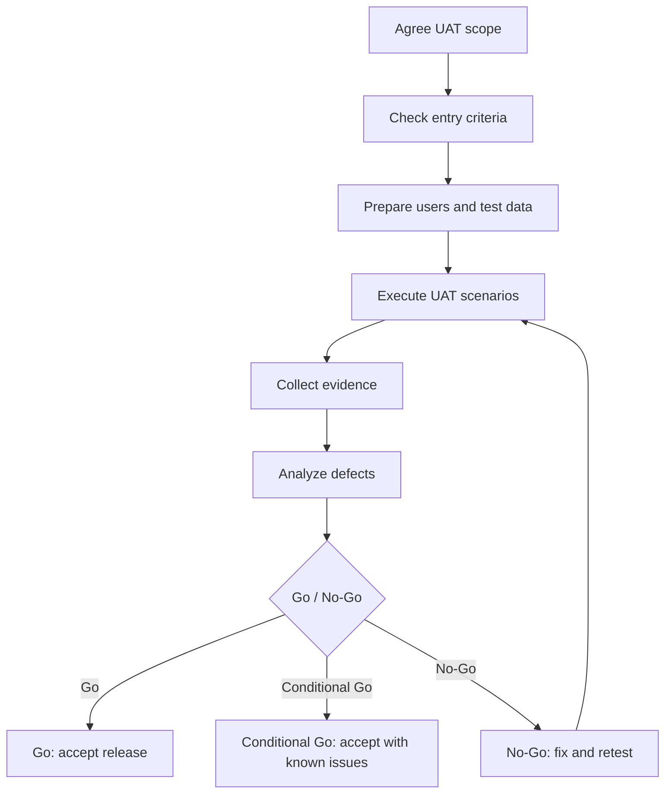

# Acceptance Testing — MigrationOS

## 1. Назначение документа

Документ описывает подход к приемочному тестированию MigrationOS.

Acceptance Testing нужен, чтобы:

- подтвердить готовность продукта к использованию бизнесом;
- проверить ключевые пользовательские и операционные сценарии;
- убедиться, что требования и acceptance criteria выполнены;
- зафиксировать критерии входа, выхода и go/no-go decision;
- определить роли участников приемки;
- связать приемочные проверки с тест-кейсами, чек-листами и бизнес-целями.

---

## 2. Что такое приемочное тестирование

Приемочное тестирование — это проверка продукта с точки зрения готовности к бизнес-использованию.

В отличие от обычного функционального тестирования, приемка отвечает на вопрос:

> Можно ли считать текущую версию MigrationOS пригодной для запуска в согласованном scope?

Приемка не заменяет QA, API-тесты, security-тесты и регрессию. Она проводится после того, как основные проверки уже выполнены.

---

## 3. Цели приемки

| Цель | Описание |
|---|---|
| Проверить бизнес-ценность | Пользовательские сценарии решают заявленные задачи |
| Проверить критичные процессы | Документы, риски, запросы, услуги и оплаты работают end-to-end |
| Проверить доступы | Пользователи видят только свои данные |
| Проверить интеграции | Критичные внешние события корректно обрабатываются |
| Проверить трассируемость | Важные действия попадают в `IntegrationLog` и `AuditLog` |
| Проверить UX-состояния | Пользователь понимает ошибки, ожидание и статус операций |
| Принять релизное решение | Зафиксировать `go/no-go` и known issues |

---

## 4. Scope приемки

### 4.1. In scope

| Контур | Что принимается |
|---|---|
| `Migrant App` | OTP-вход, профиль, ПДн, документы, запросы, услуги, платежи, push |
| `Employer Cabinet` | регистрация, верификация, dashboard, мигранты, запросы, услуги, платежи |
| `Admin Panel` | 2FA, документы, запросы, риски, РКЛ, логи, роли |
| `Landing` | RU/EN, CTA, формы, legal links |
| `Backend API` | ключевые API-контракты, ошибки, статусы |
| `Integrations` | SHERPA RPA, SBP, S3, FCM, 1C в sandbox/stub режиме |
| `Security / Privacy` | permissions, ПДн, private files, safe errors |
| `Reporting / Logs` | `IntegrationLog`, `AuditLog`, traceability |

### 4.2. Out of scope

| Область | Причина |
|---|---|
| Разработка SHERPA RPA-робота | Внешний контур |
| Прямой контур МВД или иных госсистем | Не входит в текущий scope |
| Полное production-нагрузочное тестирование | Относится к performance testing |
| White Label и мультибрендовые сценарии | Не входят в текущий MVP |
| Полная автоматизация всех marketplace-потоков | Может быть отдельным этапом |

---

## 5. Участники приемки

| Роль | Ответственность |
|---|---|
| `Product Owner` | Подтверждает бизнес-готовность и принимает `go/no-go` |
| `System Analyst` | Сопоставляет результаты с требованиями, user stories и acceptance criteria |
| `QA Engineer` | Готовит evidence, результаты тестирования и дефекты |
| `Business Stakeholder` | Подтверждает соответствие ключевым бизнес-процессам |
| `Представитель агентства` | Проверяет операционные сценарии manager/supervisor |
| `Представитель работодателя` | Проверяет employer cabinet как внешний участник UAT |
| `Internal users` | Проверяют admin panel, риски, логи и ручной разбор |
| `Backend / Frontend / Mobile Developers` | Поддерживают исправления и объясняют техническое поведение |
| `DevOps` | Поддерживает окружение, доступность интеграций, логов и monitoring |

---

## 6. Критерии входа в приемку

Приемка может начинаться, если:

- scope релиза согласован;
- требования, user stories и acceptance criteria актуальны;
- [Test Strategy](./test-strategy.md), [Test Cases](./test-cases.md) и [QA Checklist](./checklist.md) подготовлены;
- сборка развернута на `stage` или UAT-окружении;
- smoke checklist пройден;
- critical и major blockers отсутствуют;
- тестовые пользователи и роли созданы;
- тестовые данные и sandbox/stub интеграции подготовлены;
- известные ограничения зафиксированы до старта приемки.

---

## 7. Критерии выхода из приемки

Приемка считается завершенной, если:

- все критичные UAT-сценарии пройдены;
- critical defects отсутствуют;
- major defects закрыты или согласованы как known issues;
- security/privacy критичные проверки пройдены;
- payment webhook, RKL webhook и S3 access проверены;
- `IntegrationLog` и `AuditLog` проверены;
- результаты приемки задокументированы;
- Product Owner принял `go/no-go decision`.

---

## 8. Go / No-Go критерии

| Решение | Условия |
|---|---|
| `Go` | Критичные сценарии пройдены, critical defects нет, major defects согласованы |
| `Conditional Go` | Есть некритичные known issues, согласован план исправления |
| `No-Go` | Есть critical defect, нарушены permissions/security/payment/RKL/S3 или приемка не завершена |

### 8.1. No-Go triggers

| Trigger | Почему блокирует |
|---|---|
| Утечка чужих данных | Нарушение security/privacy |
| Payment становится `paid` без webhook | Финансовый риск |
| RKL matched не создает critical risk | Комплаенс-риск |
| Чужой файл доступен через S3 URL | Утечка ПДн |
| Internal comments видны внешним ролям | Нарушение модели доступа |
| Critical actions не логируются | Нет трассируемости |
| Admin 2FA не работает | Security-риск |

---

## 9. Критичные приемочные сценарии

Ниже перечислены сценарии, которые должны быть обязательно пройдены перед принятием релизного решения:

- OTP-вход мигранта и 2FA для internal users;
- permissions для migrant, employer, manager, supervisor и superadmin;
- document upload и document review;
- employer registration и employer verification;
- request flow для внешних и внутренних ролей;
- service order и payment webhook;
- RKL `matched` и `unmatched`;
- S3 file access и private download;
- FCM push и deep links;
- `IntegrationLog` и `AuditLog`;
- landing forms и consent.

---

## 10. Приемочные сценарии: Migrant App

| ID | Сценарий | Роль | Предусловия | Шаги | Ожидаемый результат | Acceptance criteria |
|---|---|---|---|---|---|---|
| `UAT-MOB-001` | OTP-вход мигранта | `migrant` | Пользователь существует, OTP service доступен | 1. Открыть app. 2. Ввести телефон. 3. Получить и ввести OTP. | Пользователь входит в приложение. | `MOB-AC-001` |
| `UAT-MOB-002` | Согласие на ПДн | `migrant` | Пользователь вошел впервые | 1. Открыть экран согласия. 2. Подтвердить согласие. | Факт согласия сохранен, доступ к документам открыт. | `MOB-AC-003` |
| `UAT-MOB-003` | Загрузка документа | `migrant` | Consent дан, документ доступен | 1. Открыть документы. 2. Выбрать тип. 3. Загрузить валидный файл. | Документ загружен, статус обновлен. | `MOB-AC-004`, `MOB-AC-005` |
| `UAT-MOB-004` | Создание запроса | `migrant` | Пользователь авторизован | 1. Открыть запросы. 2. Создать запрос. | Создан `Request` со статусом `created`. | `MOB-AC-008` |
| `UAT-MOB-005` | Заказ услуги и ожидание оплаты | `migrant` | Услуга доступна | 1. Создать заявку. 2. Перейти к оплате. 3. Вернуться по redirect. | Оплата остается `pending` до webhook. | `MOB-AC-009`, `MOB-AC-010` |
| `UAT-MOB-006` | Push deep link | `migrant` | Есть уведомление с deep link | 1. Открыть push. 2. При необходимости авторизоваться. | Открывается доступный целевой экран. | `MOB-AC-006`, `MOB-AC-007` |

---

## 11. Приемочные сценарии: Employer Cabinet

| ID | Сценарий | Роль | Предусловия | Шаги | Ожидаемый результат | Acceptance criteria |
|---|---|---|---|---|---|---|
| `UAT-EMP-001` | Регистрация работодателя | `employer` | Есть ИНН и контакты | 1. Открыть регистрацию. 2. Заполнить данные. 3. Отправить. | Создана заявка, показан статус проверки. | `EMP-AC-001`, `EMP-AC-002` |
| `UAT-EMP-002` | Доступ verified employer | `employer` | Организация `verified` | 1. Войти в кабинет. | Открыт dashboard организации. | `EMP-AC-003`, `EMP-AC-004` |
| `UAT-EMP-003` | Просмотр своих мигрантов | `employer` | Есть мигранты организации | 1. Открыть список мигрантов. 2. Открыть карточку. | Видны только мигранты своей организации. | `EMP-AC-005` |
| `UAT-EMP-004` | Фильтр по риску | `employer` | Есть мигранты с разными рисками | 1. Применить фильтр `critical`. | Отображаются только critical cases организации. | `EMP-AC-006` |
| `UAT-EMP-005` | Создание запроса | `employer` | Employer verified | 1. Открыть запросы. 2. Создать запрос в агентство. | Запрос создан и виден в списке. | `EMP-AC-008` |
| `UAT-EMP-006` | Заказ услуги и оплата | `employer` | Услуга доступна | 1. Создать `ServiceOrder`. 2. Перейти к оплате. 3. Проверить статус. | Заявка создана, платеж подтверждается только webhook. | `EMP-AC-010`, `EMP-AC-011` |

---

## 12. Приемочные сценарии: Admin Panel

| ID | Сценарий | Роль | Предусловия | Шаги | Ожидаемый результат | Acceptance criteria |
|---|---|---|---|---|---|---|
| `UAT-ADM-001` | Login + 2FA | `manager` / `supervisor` / `superadmin` | Internal user активен | 1. Войти. 2. Пройти 2FA. | Пользователь входит, меню соответствует роли. | `ADM-AC-001`, `ADM-AC-002` |
| `UAT-ADM-002` | Проверка документа | `manager` | Документ `under_review` | 1. Открыть документ. 2. Approve или reject с причиной. | Статус обновлен, действие залогировано. | `ADM-AC-003`, `ADM-AC-004` |
| `UAT-ADM-003` | Обработка запроса | `manager` | Есть request `created` | 1. Взять в работу. 2. Ответить. 3. Закрыть. | Request проходит допустимые статусы. | `Request acceptance criteria` |
| `UAT-ADM-004` | Critical risk control | `supervisor` | Есть critical case | 1. Открыть risks. 2. Назначить ответственного. | Critical case виден supervisor, назначение логируется. | `ADM-AC-005` |
| `UAT-ADM-005` | RKL unmatched manual review | `manager` / `supervisor` | Есть unmatched event | 1. Открыть РКЛ. 2. Выполнить ручной разбор. | Автоматической слабой связи нет, manual action в `AuditLog`. | `ADM-AC-006`, `ADM-AC-007` |
| `UAT-ADM-006` | Users and roles | `superadmin` | Superadmin авторизован | 1. Создать internal user. 2. Назначить роль. | Пользователь создан, роль назначена, действие в `AuditLog`. | `ADM-AC-009` |
| `UAT-ADM-007` | Bulk actions | `supervisor` / `superadmin` | Есть доступные записи | 1. Выбрать записи. 2. Запустить bulk action. | Показан preview и result summary. | `ADM-AC-011` |

---

## 13. Приемочные сценарии: Landing

| ID | Сценарий | Роль | Предусловия | Шаги | Ожидаемый результат | Acceptance criteria |
|---|---|---|---|---|---|---|
| `UAT-LAND-001` | Первый визит | `public user` | Landing доступен | 1. Открыть landing. | Hero block и CTA понятны и доступны. | `LAND-AC-001` |
| `UAT-LAND-002` | Выбор аудитории | `public user` | Landing открыт | 1. Выбрать employer / migrant / partner. | Пользователь попадает к релевантному CTA. | `LAND-AC-002` |
| `UAT-LAND-003` | Demo request | `public user` | Form backend доступен | 1. Заполнить форму. 2. Дать consent. 3. Отправить. | Заявка отправлена, success state показан. | `LAND-AC-004`, `LAND-AC-005` |
| `UAT-LAND-004` | RU / EN | `public user` | Landing открыт | 1. Переключить язык. | Контент и CTA отображаются на выбранном языке. | `LAND-AC-007` |
| `UAT-LAND-005` | Legal links | `public user` | Landing открыт | 1. Открыть footer. 2. Перейти по legal links. | Юридические документы доступны. | `LAND-AC-008` |

---

## 14. Приемочные сценарии: интеграции

| ID | Сценарий | Роль | Предусловия | Шаги | Ожидаемый результат | Acceptance criteria |
|---|---|---|---|---|---|---|
| `UAT-INT-001` | Payment webhook | `QA / Analyst` | Есть pending payment | 1. Отправить valid webhook. 2. Проверить payment и service order. | Payment становится `paid`, `ServiceOrder` обновляется. | `Payment AC` |
| `UAT-INT-002` | Payment duplicate | `QA / Analyst` | Webhook уже обработан | 1. Повторить webhook. | Дубликат не меняет бизнес-сущности повторно. | `Payment AC` |
| `UAT-INT-003` | RKL matched | `QA / Analyst` | Есть migrant | 1. Отправить matched webhook. | Создан critical risk, supervisor видит alert. | `RKL AC` |
| `UAT-INT-004` | RKL unmatched | `QA / Analyst` | Нет надежного match | 1. Отправить unmatched webhook. | Событие уходит в manual review. | `RKL AC` |
| `UAT-INT-005` | S3 file access | `QA / Analyst` | Есть документ и файл | 1. Запросить download URL доступным и недоступным пользователем. | Доступный получает URL, недоступный — safe deny. | `S3 AC` |
| `UAT-INT-006` | FCM push | `QA / Analyst` | Есть active device token | 1. Сгенерировать уведомление. 2. Проверить payload и delivery result. | Push создан без лишних ПДн, ошибка FCM не ломает бизнес-операцию. | `FCM AC` |
| `UAT-INT-007` | 1C batch | `QA / Analyst` | Есть batch fixture | 1. Запустить import. 2. Проверить summary. | Данные обработаны, ошибки отражены как `partial_success` при необходимости. | `1C AC` |

---

## 15. Приемочные сценарии: security / privacy / logs

| ID | Сценарий | Роль | Предусловия | Шаги | Ожидаемый результат | Acceptance criteria |
|---|---|---|---|---|---|---|
| `UAT-SEC-001` | Employer не видит чужую организацию | `employer` | Есть две организации | 1. Войти как `Org1`. 2. Попробовать открыть данные `Org2`. | Данные `Org2` не раскрываются. | `Permissions AC` |
| `UAT-SEC-002` | Migrant не видит чужой deep link | `migrant` | Есть deep link чужого документа | 1. Открыть deep link. | Safe `404/403`, данные не раскрываются. | `Permissions AC` |
| `UAT-SEC-003` | Raw IntegrationLog скрыт | `manager` / `supervisor` | Есть event с raw payload | 1. Открыть log без permission. | Raw payload скрыт, secrets не видны. | `Logs AC` |
| `UAT-SEC-004` | AuditLog критичного действия | `supervisor` / `superadmin` | Есть критичное действие | 1. Изменить статус / выполнить manual match. | В `AuditLog` есть actor, action, entity, timestamp. | `Audit AC` |
| `UAT-SEC-005` | Presigned URL не публичный | `QA / Analyst` | Есть файл документа | 1. Проверить URL и доступ без прав. | Файл не доступен без backend-проверки. | `S3 AC` |

---

## 16. Acceptance checklist

- [ ] Все UAT-сценарии из согласованного scope выполнены.
- [ ] Все critical UAT-сценарии пройдены.
- [ ] Permissions проверены для `migrant`, `employer`, `manager`, `supervisor`, `superadmin`.
- [ ] Payment webhook подтверждает оплату.
- [ ] Redirect оплаты не подтверждает оплату.
- [ ] RKL matched создает critical risk.
- [ ] RKL unmatched уходит в manual review.
- [ ] S3 file access проверяет permissions.
- [ ] FCM push не содержит лишние ПДн.
- [ ] `IntegrationLog` создается для критичных интеграционных событий.
- [ ] `AuditLog` создается для критичных ручных действий.
- [ ] Landing forms требуют consent.
- [ ] No-Go triggers отсутствуют.
- [ ] Known issues согласованы.
- [ ] Go / No-Go decision зафиксирован.

---

## 17. Defect handling during acceptance

| Severity | Что делать |
|---|---|
| `Critical` | Блокирует приемку, нужен fix и повторная проверка |
| `Major` | Может блокировать приемку, решение принимает Product Owner |
| `Medium` | Может быть принят как known issue с планом исправления |
| `Low` | Обычно не блокирует приемку |

### 17.1. Правила

| ID | Правило |
|---|---|
| `UAT-DEF-001` | Каждый дефект должен иметь шаги воспроизведения и evidence |
| `UAT-DEF-002` | Для интеграционных дефектов указывать `traceId` или `eventId` |
| `UAT-DEF-003` | Для security/privacy дефектов всегда ставить высокий приоритет |
| `UAT-DEF-004` | Known issues должны быть явно согласованы до `Go` |

---

## 18. Acceptance evidence

Для приемки нужно сохранять evidence:

| Evidence | Пример |
|---|---|
| Скриншоты | Успешная загрузка документа, dashboard, статус оплаты |
| API responses | Payment webhook, RKL webhook, `ErrorResponse` |
| Логи | `IntegrationLog`, `AuditLog`, `traceId` |
| Видео | Сквозной flow услуги или регистрации |
| UAT протокол | Итоговая таблица сценариев и статусов |
| Список дефектов | Open / Closed / Known Issues |

---

## 19. Итоговый протокол приемки

Шаблон итогового протокола:

| ID сценария | Название | Статус | Дефекты | Evidence | Комментарий |
|---|---|---|---|---|---|
| `UAT-MOB-001` | OTP-вход мигранта | Passed / Failed / Blocked |  |  |  |
| `UAT-EMP-001` | Регистрация работодателя | Passed / Failed / Blocked |  |  |  |
| `UAT-ADM-001` | Login + 2FA | Passed / Failed / Blocked |  |  |  |
| `UAT-INT-001` | Payment webhook | Passed / Failed / Blocked |  |  |  |
| `UAT-SEC-001` | Employer не видит чужую организацию | Passed / Failed / Blocked |  |  |  |

---

## 20. Mermaid diagram: acceptance testing flow

---

## 21. Связанные артефакты

- [Test Strategy](./test-strategy.md)
- [Test Cases](./test-cases.md)
- [QA Checklist](./checklist.md)
- [Acceptance Criteria](../01_requirements/acceptance-criteria.md)
- [User Stories](../01_requirements/user-stories.md)
- [UI Edge Cases](../07_ui-scenarios/edge-cases.md)
- [Permissions](../02_roles-and-access/permissions.md)
- [Status Models](../04_data-model/status-models.md)
- [SBP Payment Integration](../06_integrations/sbp-payment.md)
- [SHERPA RPA Integration](../06_integrations/sherpa-rpa.md)
- [S3 Storage Integration](../06_integrations/s3-storage.md)
- [FCM Push Integration](../06_integrations/fcm-push.md)
- [Integration Logs](../06_integrations/integration-logs.md)
