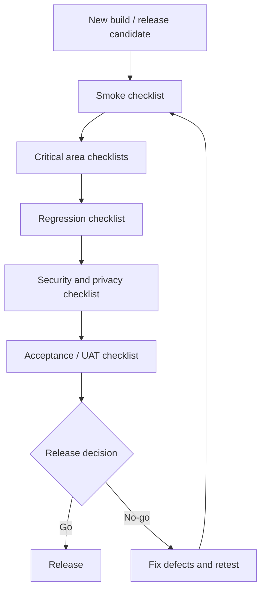

# QA Checklist — MigrationOS

## 1. Назначение документа

Документ содержит набор чек-листов для быстрой проверки качества MigrationOS.

QA Checklist нужен, чтобы:

- быстро проверить готовность сборки;
- покрыть критичные пользовательские и интеграционные сценарии;
- использовать документ как основу для smoke, regression и release readiness;
- помочь QA, системному аналитику, разработчикам и Product Owner синхронизировать ожидания;
- не заменять подробные тест-кейсы, а дополнять их быстрыми проверками.

---

## 2. Как использовать чек-лист

Чек-лист применяется:

- перед передачей сборки в QA;
- после деплоя на `test` / `stage`;
- перед UAT;
- перед релизом;
- после hotfix;
- после изменений в ролях, статусах, интеграциях или оплатах.

---

## 3. Приоритеты проверок

| Приоритет | Значение | Примеры |
|---|---|---|
| `Critical` | Без проверки нельзя выпускать релиз | permissions, payments, RKL, S3 access, security |
| `High` | Проверяется в каждом регрессе | auth, documents, requests, statuses, logs |
| `Medium` | Проверяется перед крупным релизом | UI states, filters, localization, notifications |
| `Low` | Проверяется по необходимости | косметика, второстепенные состояния |

---

## 4. Smoke checklist

- [ ] Сборка открывается без критичных ошибок.
- [ ] Backend API отвечает на health check.
- [ ] OpenAPI endpoints доступны в тестовом окружении.
- [ ] Migrant App открывается.
- [ ] Employer Cabinet открывается.
- [ ] Admin Panel открывается.
- [ ] Landing открывается.
- [ ] Пользователь `migrant` может войти.
- [ ] Employer user может войти.
- [ ] Internal user может войти через login + 2FA.
- [ ] Основные меню отображаются согласно роли.
- [ ] База данных доступна.
- [ ] Интеграционные stubs / sandbox доступны.
- [ ] Логи приложения доступны для анализа.

---

## 5. Auth checklist

- [ ] OTP отправляется на валидный номер.
- [ ] Валидный OTP создает сессию `migrant`.
- [ ] Неверный OTP не создает сессию.
- [ ] Истекший OTP отклоняется.
- [ ] Превышение попыток OTP блокирует повторные попытки.
- [ ] Employer login работает для `verified employer`.
- [ ] `Pending employer` не получает полный доступ.
- [ ] Admin login требует 2FA.
- [ ] Неверный 2FA отклоняется.
- [ ] Заблокированный internal user не может войти.
- [ ] Истекшая сессия ведет к refresh или login.
- [ ] Logout завершает сессию.

---

## 6. Permissions checklist

- [ ] Migrant видит только свой профиль.
- [ ] Migrant не может открыть чужой deep link.
- [ ] Migrant не видит чужие документы.
- [ ] Employer видит только мигрантов своей организации.
- [ ] Employer не может открыть мигранта другой организации.
- [ ] Employer не видит внутренние комментарии агентства.
- [ ] Manager не видит superadmin-разделы.
- [ ] Supervisor видит critical risk cases.
- [ ] Superadmin может управлять пользователями и ролями.
- [ ] Raw `IntegrationLog` скрыт без отдельного permission.
- [ ] Presigned URL не выдается без доступа к документу.
- [ ] Ошибки доступа не раскрывают существование чужих сущностей.

---

## 7. Migrant App checklist

- [ ] Пользователь может выбрать язык.
- [ ] Пользователь может войти по телефону и OTP.
- [ ] Пользователь может заполнить профиль.
- [ ] Без согласия на ПДн загрузка документов недоступна.
- [ ] Пользователь может загрузить документ допустимого типа.
- [ ] Файл неверного типа отклоняется.
- [ ] Файл слишком большого размера отклоняется.
- [ ] Пользователь видит статусы документов.
- [ ] Отклоненный документ показывает понятный CTA.
- [ ] Пользователь может создать запрос.
- [ ] Пользователь может заказать услугу.
- [ ] Redirect после оплаты не подтверждает оплату.
- [ ] После payment webhook статус оплаты обновляется.
- [ ] Push deep link открывает нужный экран после авторизации.
- [ ] Offline state отображается при отсутствии сети.

---

## 8. Employer Cabinet checklist

- [ ] Работодатель может зарегистрировать организацию.
- [ ] Некорректный ИНН показывает field-level ошибку.
- [ ] `Pending employer` видит экран ожидания.
- [ ] `Verified employer` видит dashboard.
- [ ] Dashboard показывает только данные организации.
- [ ] Список мигрантов фильтруется по риску.
- [ ] Работодатель открывает карточку своего мигранта.
- [ ] Чужой мигрант недоступен.
- [ ] Работодатель может создать запрос в агентство.
- [ ] Работодатель может ответить на запрос агентства.
- [ ] Работодатель может заказать услугу.
- [ ] Платеж остается `pending` до webhook.
- [ ] Внутренние комментарии агентства не отображаются.
- [ ] `Empty` и `error` states отображаются корректно.

---

## 9. Admin Panel checklist

- [ ] Internal user входит через login + 2FA.
- [ ] Меню соответствует роли.
- [ ] Manager видит очередь документов.
- [ ] Manager может одобрить документ.
- [ ] Manager может отклонить документ только с причиной.
- [ ] Конфликт обработки документа другим manager показывает `409 conflict`.
- [ ] Manager может взять запрос в работу.
- [ ] Internal comment не виден внешним ролям.
- [ ] Supervisor видит critical risk cases.
- [ ] Supervisor может назначить ответственного.
- [ ] RKL unmatched доступен для ручного разбора.
- [ ] Ручное сопоставление RKL логируется в `AuditLog`.
- [ ] Superadmin может создать внутреннего пользователя.
- [ ] Нельзя удалить последнего superadmin.
- [ ] Bulk action показывает preview.
- [ ] `Partial success` bulk action показывает отчет.

---

## 10. Landing checklist

- [ ] Landing открывается без ошибок.
- [ ] Hero block и основной CTA видны.
- [ ] Пользователь может выбрать аудиторию.
- [ ] Работодатель может перейти к регистрации.
- [ ] Мигрант может перейти к mobile app link или инструкции.
- [ ] RU / EN переключаются корректно.
- [ ] Demo request отправляется при валидных данных.
- [ ] Demo request без согласия на ПДн не отправляется.
- [ ] Неверный email показывает field-level ошибку.
- [ ] При ошибке backend формы показывается fallback contact.
- [ ] Legal links доступны из footer.
- [ ] Analytics events не содержат лишние ПДн.

---

## 11. Documents and S3 checklist

- [ ] Upload файла работает для доступного документа.
- [ ] Metadata файла сохраняется в БД.
- [ ] Binary file не хранится в БД.
- [ ] `storageKey` не содержит ПДн.
- [ ] Upload session имеет TTL.
- [ ] Expired upload session не завершается успешно.
- [ ] Download URL выдается только после проверки permissions.
- [ ] Download URL имеет короткий TTL.
- [ ] Чужой файл недоступен.
- [ ] Presigned URL не логируется целиком.
- [ ] Bucket не публичный.
- [ ] Файлы хранятся с server-side encryption, если это включено в окружении.

---

## 12. Payments checklist

- [ ] Payment создается для `ServiceOrder`.
- [ ] Payment получает статус `pending`.
- [ ] Пользователь получает `paymentUrl` / payment scenario.
- [ ] Frontend redirect не переводит payment в `paid`.
- [ ] Валидный webhook переводит payment в `paid`.
- [ ] Валидный webhook обновляет связанный `ServiceOrder`.
- [ ] Duplicate webhook не меняет статус повторно.
- [ ] Amount mismatch не переводит payment в `paid`.
- [ ] Invalid signature не меняет payment.
- [ ] Unknown `providerPaymentId` обрабатывается как unmatched / safe error.
- [ ] Payment webhook создает `IntegrationLog`.
- [ ] Ошибки оплаты не раскрывают технические детали пользователю.

---

## 13. RKL / SHERPA RPA checklist

- [ ] Валидный RKL webhook принимается.
- [ ] Invalid trust policy отклоняется.
- [ ] RKL `not_found` создает `RklCheck` без critical risk.
- [ ] RKL `matched` создает critical risk.
- [ ] Supervisor получает alert по critical risk.
- [ ] RKL unmatched уходит в manual review.
- [ ] Слабое совпадение не сопоставляется автоматически.
- [ ] Duplicate RKL event не создает дубль проверки.
- [ ] Ручное сопоставление unmatched логируется в `AuditLog`.
- [ ] RKL webhook создает `IntegrationLog`.

---

## 14. 1C checklist

- [ ] Employer batch импортируется.
- [ ] Migrant batch импортируется.
- [ ] `externalId` обновляет существующую запись.
- [ ] Повторный batch определяется как duplicate.
- [ ] Batch с частичными ошибками получает `partial_success`.
- [ ] Невалидные строки получают `validation_error`.
- [ ] Migrant без employer mapping уходит в unmatched.
- [ ] `IntegrationLog` хранит batch summary.
- [ ] Batch import не создает дубли сущностей.

---

## 15. FCM checklist

- [ ] Device token регистрируется.
- [ ] Один пользователь может иметь несколько device tokens.
- [ ] Push создается по событию `document.expires_soon`.
- [ ] Push payload не содержит лишние ПДн.
- [ ] Invalid token помечается inactive.
- [ ] FCM timeout уходит в retry.
- [ ] Ошибка FCM не откатывает бизнес-операцию.
- [ ] Deep link из push проверяет авторизацию.
- [ ] Пользовательские настройки уведомлений учитываются.
- [ ] Failed push фиксируется в delivery log / `IntegrationLog`.

---

## 16. IntegrationLog checklist

- [ ] Inbound webhook создает `IntegrationLog`.
- [ ] Outbound API call создает `IntegrationLog` там, где это требуется.
- [ ] Duplicate event получает статус `duplicate`.
- [ ] Unmatched event получает статус `unmatched`.
- [ ] Validation error получает статус `validation_error`.
- [ ] Retry увеличивает `attempt_number`.
- [ ] Для критичных событий сохраняется `payload_hash`.
- [ ] Raw payload скрыт без permission.
- [ ] Secrets, signatures, tokens и presigned URLs не отображаются.
- [ ] `traceId` есть у ошибочных событий.
- [ ] Batch summary отображается для `partial_success`.

---

## 17. AuditLog checklist

- [ ] Смена статуса документа логируется.
- [ ] Отклонение документа с причиной логируется.
- [ ] Ручное сопоставление RKL unmatched логируется.
- [ ] Назначение ответственного по critical risk логируется.
- [ ] Изменение роли пользователя логируется.
- [ ] Bulk action логируется.
- [ ] `AuditLog` содержит actor, action, entity, timestamp.
- [ ] `AuditLog` доступен только ролям с permission.
- [ ] `AuditLog` не заменяет `IntegrationLog`.

---

## 18. Status transitions checklist

- [ ] Request `created → in_progress` разрешен.
- [ ] Request `completed → in_progress` запрещен без специального правила.
- [ ] Document `under_review → approved` разрешен.
- [ ] Document `under_review → rejected` требует причину.
- [ ] Document `approved → rejected` запрещен без специального permission.
- [ ] Payment `pending → paid` возможен только через webhook.
- [ ] ServiceOrder `waiting_payment → paid` происходит после payment webhook.
- [ ] RKL `matched` влияет на risk score.
- [ ] Stale UI action получает `409 conflict`.
- [ ] Недопустимый переход не меняет бизнес-сущность.

---

## 19. UI states checklist

- [ ] Loading state отображается на списках.
- [ ] Empty state отображается при отсутствии данных.
- [ ] Empty search state отображается при пустом результате фильтра.
- [ ] Error state содержит retry.
- [ ] Forbidden state не раскрывает чужие данные.
- [ ] Not found state безопасен.
- [ ] Validation errors отображаются рядом с полями.
- [ ] Conflict state предлагает обновить данные.
- [ ] Partial data state показывает предупреждение.
- [ ] Read-only state используется для закрытых или недоступных сущностей.
- [ ] Offline state отображается в mobile app.

---

## 20. Security and privacy checklist

- [ ] Пользователь не может открыть чужую сущность по URL.
- [ ] Employer не видит данные другой организации.
- [ ] Migrant не видит чужие документы и запросы.
- [ ] Internal roles ограничены RBAC.
- [ ] 2FA включена для внутренних ролей.
- [ ] Push payload не содержит лишние ПДн.
- [ ] Presigned URL не логируется целиком.
- [ ] Raw `IntegrationLog` скрыт без permission.
- [ ] Secrets и API keys не отображаются в UI и логах.
- [ ] Landing forms требуют consent.
- [ ] Analytics не собирает лишние ПДн.
- [ ] Ошибки не показывают stack trace.

---

## 21. Performance checklist

- [ ] Основные API отвечают в целевых рамках NFR.
- [ ] Списки используют pagination.
- [ ] Фильтры по мигрантам не деградируют на больших данных.
- [ ] Dashboard загружается в приемлемое время.
- [ ] Payment webhook обрабатывается без заметной задержки.
- [ ] RKL webhook обновляет риск в целевом SLA.
- [ ] 1C batch обрабатывается с понятным summary.
- [ ] Upload больших файлов не блокирует приложение.
- [ ] Push-уведомления отправляются в целевом SLA.
- [ ] Retry queue не растет бесконтрольно.

---

## 22. Regression checklist

- [ ] Auth flows проверены.
- [ ] Permissions проверены.
- [ ] Documents upload/review проверены.
- [ ] Requests flow проверен.
- [ ] Services and payments проверены.
- [ ] Payment webhook проверен.
- [ ] RKL webhook проверен.
- [ ] S3 file access проверен.
- [ ] FCM push проверен.
- [ ] `IntegrationLog` проверен.
- [ ] `AuditLog` проверен.
- [ ] UI edge cases проверены.
- [ ] Landing forms проверены.

---

## 23. Release readiness checklist

- [ ] Critical defects закрыты.
- [ ] Major defects закрыты или согласованы как known issues.
- [ ] Smoke checklist пройден.
- [ ] Regression checklist пройден.
- [ ] Security/privacy checklist пройден.
- [ ] Payment webhook проверен.
- [ ] RKL webhook проверен.
- [ ] S3 access проверен.
- [ ] Permissions проверены.
- [ ] `IntegrationLog` и `AuditLog` проверены.
- [ ] Acceptance criteria пройдены.
- [ ] UAT завершен или готов к запуску.
- [ ] Monitoring и alerts настроены для критичных сценариев.
- [ ] Release decision зафиксирован.

---

## 24. Mermaid diagram: checklist-based testing flow

---

## 25. Связанные артефакты

- [Test Strategy](./test-strategy.md)
- [Test Cases](./test-cases.md)
- [Acceptance Testing](./acceptance-testing.md)
- [Acceptance Criteria](../01_requirements/acceptance-criteria.md)
- [UI Edge Cases](../07_ui-scenarios/edge-cases.md)
- [Error Model](../05_api/error-model.md)
- [Permissions](../02_roles-and-access/permissions.md)
- [Access Matrix](../02_roles-and-access/access-matrix.md)
- [Integrations Overview](../06_integrations/integrations-overview.md)
- [Integration Logs](../06_integrations/integration-logs.md)
