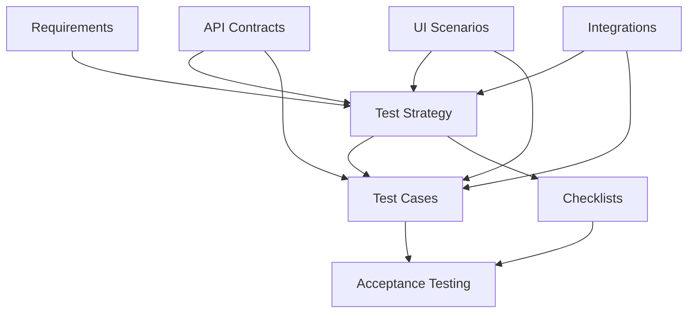

# Test Cases — MigrationOS

## 1. Назначение документа

Документ содержит набор тест-кейсов для проверки ключевых сценариев MigrationOS.

Test Cases нужны, чтобы:

- перевести требования и пользовательские сценарии в проверяемые тесты;
- покрыть positive, negative, boundary, permission, integration и edge cases;
- проверить роли, доступы, статусы, логи и интеграции;
- подготовить основу для ручного, API- и автоматизированного тестирования;
- обеспечить трассировку между тестами, требованиями, API-контрактами и acceptance criteria.

---

## 2. Формат тест-кейса

| Поле | Описание |
|---|---|
| `ID` | Уникальный идентификатор тест-кейса |
| Название | Что проверяется |
| Приоритет | `Critical`, `High`, `Medium`, `Low` |
| Тип | Functional, Negative, Boundary, Permission, Integration, Edge, Security, Regression |
| Предусловия | Что должно быть подготовлено |
| Шаги | Последовательность действий тестировщика |
| Ожидаемый результат | Проверяемый результат |
| Трассировка | Связанные требования, API, сценарии, интеграции или статусные модели |

---

## 3. Auth и сессии

| ID | Название | Приоритет | Тип | Предусловия | Шаги | Ожидаемый результат | Трассировка |
|---|---|---|---|---|---|---|---|
| `TC-AUTH-001` | Успешный OTP-вход мигранта | Critical | Functional | Существует пользователь `migrant`, OTP service доступен | 1. Открыть app. 2. Ввести валидный телефон. 3. Запросить OTP. 4. Ввести корректный код. | Создана сессия мигранта, открыт следующий экран по профилю/consent. | `Acceptance Criteria`, `OpenAPI`, `Migrant App Scenarios` |
| `TC-AUTH-002` | Неверный OTP | High | Negative | Пользователь существует, OTP отправлен | 1. Ввести телефон. 2. Запросить OTP. 3. Ввести неверный код. | Вход не выполнен, показана безопасная ошибка, сессия не создана. | `Error Model`, `Edge Cases`, `OpenAPI` |
| `TC-AUTH-003` | Истекший OTP | High | Negative | OTP создан и просрочен | 1. Запросить OTP. 2. Дождаться окончания TTL. 3. Ввести код. | Показано сообщение об истекшем коде, доступен повторный запрос OTP. | `Error Model`, `Edge Cases` |
| `TC-AUTH-004` | Превышение количества попыток OTP | Critical | Security | Для пользователя настроен лимит попыток | 1. Несколько раз ввести неверный OTP до лимита. 2. Повторить попытку. | Дальнейшие попытки временно заблокированы, показано safe rate-limit/lockout сообщение. | `Non-functional Requirements`, `Error Model` |
| `TC-AUTH-005` | Успешный login employer | Critical | Functional | Существует verified employer user | 1. Открыть employer cabinet. 2. Ввести валидные credentials. 3. Выполнить вход. | Создана сессия employer, открыт кабинет организации. | `Employer Cabinet Scenarios`, `Permissions` |
| `TC-AUTH-006` | Истекшая сессия employer cabinet | High | Edge | Employer авторизован, срок сессии истек | 1. Открыть защищенный раздел после истечения сессии. 2. Выполнить действие. | Пользователь перенаправлен на login или refresh-flow, данные не раскрываются. | `Error Model`, `Edge Cases` |
| `TC-AUTH-007` | Успешный login admin + 2FA | Critical | Security | Внутренний пользователь активен, 2FA включена | 1. Открыть admin panel. 2. Ввести логин/пароль. 3. Ввести корректный 2FA-код. | Выполнен вход, доступное меню соответствует роли. | `Admin Panel Scenarios`, `Permissions` |
| `TC-AUTH-008` | Неверный 2FA | Critical | Security | Внутренний пользователь существует | 1. Ввести валидные credentials. 2. Ввести неверный 2FA-код. | Вход не выполнен, показана безопасная ошибка, счетчик попыток обновлен. | `Error Model`, `Edge Cases` |
| `TC-AUTH-009` | Заблокированный внутренний пользователь не может войти | Critical | Security | Пользователь internal имеет статус `blocked` | 1. Попробовать выполнить login + 2FA. | Доступ не предоставлен, панель не открывается, факт попытки может логироваться. | `Permissions`, `Access Matrix`, `AuditLog` |

---

## 4. Permissions и access control

| ID | Название | Приоритет | Тип | Предусловия | Шаги | Ожидаемый результат | Трассировка |
|---|---|---|---|---|---|---|---|
| `TC-PERM-001` | Мигрант видит только свой профиль | Critical | Permission | Есть два мигранта `A` и `B` | 1. Войти как `A`. 2. Открыть профиль. 3. Проверить доступные данные. | Отображаются только данные `A`, данные `B` недоступны. | `Permissions`, `Access Matrix`, `Migrant App Scenarios` |
| `TC-PERM-002` | Мигрант не может открыть чужой deep link | Critical | Permission | Существует deep link на документ/запрос другого мигранта | 1. Войти как `A`. 2. Открыть deep link сущности `B`. | Возвращается safe `404` или `403`, чужие данные не раскрываются. | `Edge Cases`, `Error Model`, `FCM Push` |
| `TC-PERM-003` | Employer видит только мигрантов своей организации | Critical | Permission | Есть employers `Org1` и `Org2`, у каждой свои мигранты | 1. Войти как user `Org1`. 2. Открыть список мигрантов. | В списке только мигранты `Org1`. | `Employer Cabinet Scenarios`, `Permissions`, `Access Matrix` |
| `TC-PERM-004` | Employer не может открыть мигранта другой организации | Critical | Permission | Существует migrant из `Org2` | 1. Войти как employer `Org1`. 2. Открыть URL/карточку migrant `Org2`. | Доступ запрещен безопасным способом, данные карточки не показаны. | `Permissions`, `Edge Cases` |
| `TC-PERM-005` | Manager не видит superadmin-разделы | High | Permission | Внутренний пользователь с ролью `manager` активен | 1. Войти в admin panel. 2. Проверить меню и прямой переход в users/settings. | Разделы superadmin скрыты или возвращают `403`. | `Role Model`, `Permissions`, `Access Matrix` |
| `TC-PERM-006` | Supervisor видит critical risk cases | Critical | Permission | Есть migrant с `risk=critical` | 1. Войти как supervisor. 2. Открыть раздел risks. | Critical case отображается и доступен для работы. | `Admin Panel Scenarios`, `Status Models` |
| `TC-PERM-007` | Superadmin может управлять пользователями | Critical | Permission | Есть superadmin user | 1. Войти как superadmin. 2. Открыть users & roles. 3. Создать/изменить пользователя. | Действие доступно и успешно выполняется. | `Access Matrix`, `Permissions`, `AuditLog` |
| `TC-PERM-008` | Raw IntegrationLog скрыт без permission | Critical | Security | Есть integration event с raw payload, пользователь не имеет расширенного права | 1. Войти как manager/supervisor без raw-log permission. 2. Открыть карточку IntegrationLog. | Raw payload не показан, отображается только safe metadata. | `Integration Logs`, `Permissions` |
| `TC-PERM-009` | Presigned URL не выдается без доступа к документу | Critical | Permission | Есть файл документа чужой сущности | 1. Выполнить запрос download URL без прав доступа. | URL не выдается, возвращается `403` или safe `404`. | `S3 Storage`, `Permissions`, `Error Model` |

---

## 5. Migrant App

| ID | Название | Приоритет | Тип | Предусловия | Шаги | Ожидаемый результат | Трассировка |
|---|---|---|---|---|---|---|---|
| `TC-MOB-001` | Первый вход и выбор языка | High | Functional | Приложение установлено, пользователь не авторизован | 1. Открыть app. 2. Выбрать язык. 3. Продолжить вход. | Интерфейс переключается на выбранную локаль, flow входа продолжается. | `Migrant App Scenarios`, `Acceptance Criteria` |
| `TC-MOB-002` | Заполнение профиля | Critical | Functional | Мигрант вошел, профиль неполный | 1. Открыть профиль. 2. Заполнить обязательные поля. 3. Сохранить. | Профиль сохраняется, ошибки валидации отсутствуют, доступен следующий шаг. | `Functional Requirements`, `OpenAPI` |
| `TC-MOB-003` | Согласие на обработку ПДн обязательно перед загрузкой документов | Critical | Permission | Мигрант вошел, consent не дан | 1. Открыть документы. 2. Попробовать начать upload. | Система требует согласие, загрузка недоступна до подтверждения. | `Migrant App Scenarios`, `Permissions` |
| `TC-MOB-004` | Успешная загрузка документа | Critical | Functional | Есть документ, согласие дано, файл допустимого типа и размера | 1. Выбрать документ. 2. Загрузить валидный файл. 3. Дождаться завершения. | Создан `DocumentFile`, статус документа обновлен на `uploaded`/`under_review`. | `S3 Storage`, `Status Models` |
| `TC-MOB-005` | Загрузка файла неверного типа | High | Negative | Мигрант готов к upload | 1. Выбрать файл с недопустимым MIME type. 2. Попробовать загрузить. | Upload отклонен, показана field-level ошибка, файл не сохранен. | `Error Model`, `S3 Storage`, `Edge Cases` |
| `TC-MOB-006` | Upload session истекла | High | Edge | Создана upload session, TTL истек | 1. Получить upload session. 2. Дождаться истечения. 3. Попробовать завершить upload. | Возвращается ошибка истекшей session, предлагается создать новую. | `S3 Storage`, `Error Model` |
| `TC-MOB-007` | Просмотр статусов документов | High | Functional | У мигранта есть документы в разных статусах | 1. Открыть раздел документов. | Для каждого документа отображается актуальный статус и релевантный CTA. | `Status Models`, `Migrant App Scenarios` |
| `TC-MOB-008` | Создание запроса | High | Functional | Мигрант авторизован | 1. Открыть Requests. 2. Создать новый запрос с валидными данными. 3. Отправить. | Создан `Request` со статусом `created`, отображается в списке. | `Request Service API`, `Status Models` |
| `TC-MOB-009` | Заказ платной услуги | Critical | Functional | Услуга доступна, обязательные данные заполнены | 1. Открыть услугу. 2. Заполнить форму. 3. Создать заявку. | Создан `ServiceOrder`, создан `Payment` со статусом `pending`, доступен payment flow. | `SBP Payment`, `Status Models` |
| `TC-MOB-010` | Redirect после оплаты не подтверждает оплату | Critical | Edge | Payment создан, пользователь вернулся по redirect до webhook | 1. Пройти payment redirect. 2. Вернуться в приложение. 3. Открыть payment status. | Статус остается `pending`/`waiting_payment`, сообщение объясняет ожидание webhook. | `SBP Payment`, `Edge Cases`, `Status Models` |
| `TC-MOB-011` | Payment webhook обновляет статус оплаты | Critical | Integration | Есть pending payment и входящий валидный webhook | 1. Отправить valid payment webhook. 2. Обновить экран оплаты. | `Payment` становится `paid`, связанный `ServiceOrder` обновлен, пользователь видит новый статус. | `SBP Payment`, `OpenAPI`, `Status Models` |
| `TC-MOB-012` | Deep link открывает документ после авторизации | High | Functional | Есть push/deep link на доступный документ | 1. Открыть deep link без активной сессии. 2. Выполнить login. 3. Дождаться навигации. | После авторизации открывается целевой экран документа. | `FCM Push`, `Migrant App Scenarios` |
| `TC-MOB-013` | Offline state при потере сети | High | Edge | Устройство offline | 1. Открыть критичный раздел или выполнить действие. 2. Оценить UI. | Показан offline/error state, данные не искажаются, доступен retry после восстановления сети. | `Edge Cases`, `Non-functional Requirements` |

---

## 6. Employer Cabinet

| ID | Название | Приоритет | Тип | Предусловия | Шаги | Ожидаемый результат | Трассировка |
|---|---|---|---|---|---|---|---|
| `TC-EMP-001` | Регистрация работодателя с корректным ИНН | Critical | Functional | Employer registration service доступен | 1. Открыть форму регистрации. 2. Ввести валидный ИНН и контакты. 3. Отправить. | Создана заявка на регистрацию, показан статус ожидания проверки. | `Employer Cabinet Scenarios`, `Acceptance Criteria` |
| `TC-EMP-002` | Регистрация с некорректным ИНН | High | Negative | Форма регистрации доступна | 1. Ввести ИНН неверного формата. 2. Отправить форму. | Сохранение не выполнено, поле ИНН подсвечено ошибкой. | `Error Model`, `Edge Cases` |
| `TC-EMP-003` | Pending employer видит экран ожидания | High | Functional | Employer user связан с `verificationStatus=pending` | 1. Войти в кабинет. | Открывается экран ожидания верификации, полный кабинет недоступен. | `Employer Cabinet Scenarios`, `Status Models` |
| `TC-EMP-004` | Verified employer видит dashboard | Critical | Functional | Employer verified | 1. Войти в кабинет. | Открывается dashboard организации. | `Employer Cabinet Scenarios` |
| `TC-EMP-005` | Dashboard показывает только данные организации | Critical | Permission | Есть данные двух организаций | 1. Войти как `Org1`. 2. Сравнить виджеты и списки. | На dashboard отображаются только данные `Org1`. | `Permissions`, `Access Matrix` |
| `TC-EMP-006` | Фильтрация мигрантов по critical risk | High | Functional | У организации есть мигранты с разным risk level | 1. Открыть список мигрантов. 2. Применить фильтр `critical`. | Отображаются только мигранты с critical risk. | `Employer Cabinet Scenarios`, `Status Models` |
| `TC-EMP-007` | Просмотр карточки своего мигранта | High | Functional | У организации есть связанный migrant | 1. Открыть список. 2. Перейти в карточку своего мигранта. | Открывается карточка мигранта с доступными данными и документами в рамках permissions. | `Permissions`, `Data Dictionary` |
| `TC-EMP-008` | Попытка открыть чужого мигранта | Critical | Permission | Есть migrant другой организации | 1. Открыть прямой URL чужой карточки. | Возвращается safe `404`/`403`, чужие данные не раскрыты. | `Permissions`, `Edge Cases`, `Error Model` |
| `TC-EMP-009` | Создание запроса в агентство | High | Functional | Employer верифицирован | 1. Открыть Requests. 2. Заполнить форму. 3. Отправить. | Создан `Request` со статусом `created`, виден в списке запросов. | `Request Service API`, `Status Models` |
| `TC-EMP-010` | Ответ на запрос агентства | High | Functional | Есть запрос в статусе `need_info` | 1. Открыть запрос. 2. Добавить ответ/файл. 3. Отправить. | Ответ сохранен, внешний комментарий виден, внутренние поля работодателю не доступны. | `Request Service API`, `Permissions`, `S3 Storage` |
| `TC-EMP-011` | Заказ услуги работодателем | Critical | Functional | Услуга доступна для employer | 1. Открыть каталог. 2. Выбрать услугу. 3. Создать заказ. | Создан `ServiceOrder`, при платной услуге создан `Payment`. | `SBP Payment`, `Status Models` |
| `TC-EMP-012` | Webhook задерживается, платеж остается pending | Critical | Edge | Payment создан, webhook не поступил в SLA окна UI | 1. Вернуться из payment scenario. 2. Открыть payment/service order. | Платеж остается `pending`, интерфейс показывает ожидание подтверждения. | `SBP Payment`, `Edge Cases` |

---

## 7. Admin Panel

| ID | Название | Приоритет | Тип | Предусловия | Шаги | Ожидаемый результат | Трассировка |
|---|---|---|---|---|---|---|---|
| `TC-ADM-001` | Manager видит очередь документов | High | Functional | Есть документы `under_review`, manager имеет scope | 1. Войти как manager. 2. Открыть Documents queue. | Очередь загружается, отображаются доступные документы. | `Admin Panel Scenarios`, `Status Models` |
| `TC-ADM-002` | Manager одобряет документ | Critical | Functional | Документ `under_review`, manager имеет права | 1. Открыть документ. 2. Нажать Approve. 3. Подтвердить действие. | Статус документа становится `approved`, действие логируется. | `Status Models`, `AuditLog` |
| `TC-ADM-003` | Manager отклоняет документ с причиной | Critical | Functional | Документ `under_review` | 1. Открыть документ. 2. Нажать Reject. 3. Указать причину. 4. Подтвердить. | Статус становится `rejected`, причина сохранена, пользователь получает уведомление. | `Status Models`, `FCM Push`, `AuditLog` |
| `TC-ADM-004` | Отклонение документа без причины запрещено | High | Negative | Документ открыт на отклонение | 1. Нажать Reject. 2. Не указывать причину. 3. Отправить форму. | Действие не выполнено, показана validation error. | `Error Model`, `Edge Cases` |
| `TC-ADM-005` | Конфликт при обработке документа другим manager | Critical | Edge | Один и тот же документ открыт у двух managers | 1. Manager A approves/rejects документ. 2. Manager B пытается выполнить действие на stale screen. | Возвращается `409 Conflict`, UI предлагает обновить данные. | `Status Models`, `Error Model`, `Edge Cases` |
| `TC-ADM-006` | Manager берет запрос в работу | High | Functional | Есть `Request` со статусом `created` | 1. Открыть request. 2. Нажать Take in work. | Статус request становится `in_progress`, assignee зафиксирован. | `Request Service API`, `Status Models`, `AuditLog` |
| `TC-ADM-007` | internalComment не виден внешним ролям | Critical | Permission | В запросе есть `internalComment` | 1. Добавить internalComment в admin. 2. Открыть тот же request как employer/migrant. | Внешний пользователь не видит internalComment. | `Permissions`, `Access Matrix`, `Request Service API` |
| `TC-ADM-008` | Supervisor видит critical risk | Critical | Functional | Есть critical risk case | 1. Войти как supervisor. 2. Открыть Risks. | Critical case отображается в списке и деталях. | `Status Models`, `Admin Panel Scenarios` |
| `TC-ADM-009` | Supervisor назначает ответственного | High | Functional | Есть critical case без assignee | 1. Открыть кейс. 2. Назначить manager. 3. Сохранить. | Assignee сохранен, действие попало в `AuditLog`. | `AuditLog`, `Permissions` |
| `TC-ADM-010` | Superadmin создает внутреннего пользователя | Critical | Functional | Superadmin авторизован | 1. Открыть Users. 2. Создать internal user. 3. Назначить роль. | Пользователь создан, роль назначена, действие залогировано. | `Permissions`, `Access Matrix`, `AuditLog` |
| `TC-ADM-011` | Нельзя удалить последнего superadmin | Critical | Security | В системе остался один superadmin | 1. Попробовать удалить или понизить роль последнего superadmin. | Действие запрещено, система сохраняет хотя бы одного superadmin. | `Access Matrix`, `Error Model` |
| `TC-ADM-012` | Bulk action показывает preview | High | Functional | Есть набор сущностей для bulk action | 1. Выбрать несколько записей. 2. Запустить bulk action. | Перед выполнением показан preview с числом затрагиваемых объектов. | `Admin Panel Scenarios`, `AuditLog` |
| `TC-ADM-013` | Bulk action partial success показывает отчет | High | Edge | Часть выбранных записей валидна, часть нет | 1. Выполнить bulk action по смешанному набору. 2. Дождаться результата. | Показан отчет `partial_success` с успешными и ошибочными элементами. | `Integration Logs`, `Error Model`, `Edge Cases` |

---

## 8. Landing

| ID | Название | Приоритет | Тип | Предусловия | Шаги | Ожидаемый результат | Трассировка |
|---|---|---|---|---|---|---|---|
| `TC-LAND-001` | Первый визит, hero block и CTA отображаются | High | Functional | Landing доступен | 1. Открыть публичный URL. | Hero block, ключевой value proposition и CTA отображаются без ошибки. | `Landing Scenarios`, `Acceptance Criteria` |
| `TC-LAND-002` | Переключение RU / EN | High | Functional | Landing открыт | 1. Переключить язык с RU на EN и обратно. | Контент и CTA переключаются на выбранную локаль. | `Landing Scenarios` |
| `TC-LAND-003` | Переход к регистрации работодателя | High | Functional | CTA employer registration доступен | 1. Нажать CTA регистрации. | Открывается registration flow employer cabinet. | `Employer Cabinet Scenarios`, `Landing Scenarios` |
| `TC-LAND-004` | Переход к mobile app link | Medium | Functional | Доступны store links или инструкция | 1. Нажать CTA для migrant app. | Пользователь переходит на store link или инструкцию. | `Migrant App Scenarios`, `Landing Scenarios` |
| `TC-LAND-005` | Успешная отправка demo request | High | Functional | Form backend доступен | 1. Заполнить валидную форму. 2. Подтвердить consent. 3. Отправить. | Форма успешно отправлена, показан success state. | `Landing Scenarios`, `Acceptance Criteria` |
| `TC-LAND-006` | Demo request без согласия на ПДн запрещен | Critical | Negative | Форма открыта | 1. Заполнить поля. 2. Не отмечать consent. 3. Отправить. | Отправка запрещена, показана ошибка по consent. | `Permissions`, `Landing Scenarios` |
| `TC-LAND-007` | Неверный email показывает field-level ошибку | Medium | Boundary | Форма demo/contact открыта | 1. Ввести email неверного формата. 2. Отправить. | Поле email подсвечено, запрос не отправлен. | `Error Model`, `Landing Scenarios` |
| `TC-LAND-008` | Backend формы недоступен, показывается fallback contact | High | Edge | Backend формы отвечает `503`/timeout | 1. Заполнить форму. 2. Отправить. | Показано безопасное сообщение и альтернативный контакт. | `Edge Cases`, `Error Model` |
| `TC-LAND-009` | Analytics event фиксирует CTA без ПДн | Medium | Security | Analytics подключена | 1. Нажать ключевой CTA. 2. Проверить payload analytics event. | Событие отправлено без email, телефона и иных ПДн. | `Non-functional Requirements`, `Landing Scenarios` |

---

## 9. Documents и S3 Storage

| ID | Название | Приоритет | Тип | Предусловия | Шаги | Ожидаемый результат | Трассировка |
|---|---|---|---|---|---|---|---|
| `TC-S3-001` | Успешный upload файла через backend | Critical | Integration | Есть documentId, валидный файл, пользователь имеет права | 1. Отправить файл через backend endpoint. | Metadata и object сохранены, статус файла `uploaded`. | `S3 Storage`, `OpenAPI` |
| `TC-S3-002` | Создание upload session через presigned URL | High | Integration | Пользователь имеет доступ к документу | 1. Вызвать upload-session endpoint. | Возвращены `uploadId`, `uploadUrl`, `storageKey`, `expiresAt`. | `S3 Storage`, `OpenAPI` |
| `TC-S3-003` | Complete upload после успешной загрузки | High | Integration | Upload session активна, файл загружен в S3 | 1. Вызвать complete endpoint с uploadId/hash. | Файл переводится в `uploaded`, metadata финализирована. | `S3 Storage`, `Status Models` |
| `TC-S3-004` | Upload session expired | High | Edge | Upload session создана и просрочена | 1. Попробовать complete expired session. | Сессия не завершается, возвращается error об истечении срока. | `Error Model`, `S3 Storage` |
| `TC-S3-005` | Download URL выдается после проверки permissions | Critical | Permission | Пользователь имеет доступ к файлу | 1. Вызвать download-url endpoint. | Возвращен presigned download URL только после успешной проверки прав. | `Permissions`, `S3 Storage` |
| `TC-S3-006` | Download URL имеет TTL | High | Boundary | Download URL создан | 1. Получить URL. 2. Проверить `expiresAt` или срок действия. | URL ограничен по времени, после истечения становится невалидным. | `S3 Storage`, `Non-functional Requirements` |
| `TC-S3-007` | Forbidden при попытке получить чужой файл | Critical | Permission | Есть чужой `documentFileId` | 1. Выполнить запрос download URL/metadata без прав. | Возвращается `403` или safe `404`, URL не выдается. | `Permissions`, `Error Model`, `Edge Cases` |
| `TC-S3-008` | storageKey не содержит ПДн | Critical | Security | Есть созданный `DocumentFile` | 1. Получить metadata файла. 2. Проверить `storageKey`. | `storageKey` не содержит ФИО, паспорт, телефон и другие ПДн. | `S3 Storage`, `Security Requirements` |
| `TC-S3-009` | Presigned URL не логируется целиком | Critical | Security | Выполнена выдача presigned URL | 1. Проверить `IntegrationLog`/технические логи. | Полный URL не сохраняется в открытом виде. | `Integration Logs`, `S3 Storage` |

---

## 10. Payments / SBP

| ID | Название | Приоритет | Тип | Предусловия | Шаги | Ожидаемый результат | Трассировка |
|---|---|---|---|---|---|---|---|
| `TC-PAY-001` | Создание payment для service order | Critical | Functional | Есть `ServiceOrder` в статусе `waiting_payment` | 1. Вызвать create payment flow. | Создан `Payment` со статусом `pending`, связан с `ServiceOrder`. | `SBP Payment`, `Status Models`, `OpenAPI` |
| `TC-PAY-002` | Получение paymentUrl / payment scenario | Critical | Integration | Payment creation endpoint доступен | 1. Создать payment. 2. Проверить ответ провайдера/системы. | Получен `providerPaymentId` и `paymentUrl`/scenario. | `SBP Payment`, `OpenAPI` |
| `TC-PAY-003` | Frontend redirect не меняет статус на paid | Critical | Edge | Пользователь вернулся по redirect, webhook еще не пришел | 1. Завершить frontend redirect. 2. Проверить статус платежа. | `Payment.status` остается `pending`, `ServiceOrder` не становится `paid`. | `SBP Payment`, `Status Models`, `Edge Cases` |
| `TC-PAY-004` | Валидный payment webhook переводит payment в paid | Critical | Integration | Есть pending payment, webhook подписан корректно | 1. Отправить valid payment webhook `status=paid`. | `Payment` становится `paid`, связанный `ServiceOrder` переходит в `paid`. | `SBP Payment`, `OpenAPI`, `Status Models` |
| `TC-PAY-005` | Duplicate payment webhook не меняет статус повторно | Critical | Integration | Payment webhook уже обработан | 1. Повторно отправить тот же webhook/eventId. | Повторный перевод не выполняется, лог фиксирует `duplicate`. | `SBP Payment`, `Integration Logs` |
| `TC-PAY-006` | Amount mismatch не переводит payment в paid | Critical | Negative | Есть pending payment, webhook содержит неверную сумму | 1. Отправить webhook с amount mismatch. | Платеж не становится `paid`, возникает согласованная ошибка/лог расхождения. | `SBP Payment`, `Error Model`, `Integration Logs` |
| `TC-PAY-007` | Invalid signature не меняет payment | Critical | Security | Есть pending payment | 1. Отправить webhook с неверной подписью. | Событие отклонено, `Payment` и `ServiceOrder` не меняются. | `SBP Payment`, `Error Model` |
| `TC-PAY-008` | providerPaymentId неизвестен, событие unmatched | High | Integration | Входящий webhook с неизвестным `providerPaymentId` | 1. Отправить webhook. | Событие не сопоставляется, получает `unmatched`/safe handling, чужие сущности не создаются. | `SBP Payment`, `Integration Logs` |
| `TC-PAY-009` | IntegrationLog фиксирует payment webhook | Critical | Integration | Выполнен inbound payment webhook | 1. Отправить webhook. 2. Открыть `IntegrationLog`. | Создана запись с `integration_name`, `event_id`, `status`, `traceId`. | `Integration Logs`, `SBP Payment` |

---

## 11. RKL / SHERPA RPA

| ID | Название | Приоритет | Тип | Предусловия | Шаги | Ожидаемый результат | Трассировка |
|---|---|---|---|---|---|---|---|
| `TC-RKL-001` | Валидный RKL webhook со статусом not_found | Critical | Integration | Есть migrant, webhook подписан корректно | 1. Отправить valid RKL webhook с `matched=false`. | Создан `RklCheck`, риск не повышается до critical. | `SHERPA RPA`, `Status Models`, `OpenAPI` |
| `TC-RKL-002` | RKL matched устанавливает critical risk | Critical | Integration | Есть migrant, приходит `matched=true` | 1. Отправить valid matched webhook. | Создан `RklCheck`, `RiskScore` становится `critical`. | `SHERPA RPA`, `Status Models` |
| `TC-RKL-003` | RKL unmatched уходит в manual review | Critical | Integration | Webhook не может быть сопоставлен с migrant | 1. Отправить unmatched webhook. | Событие получает `unmatched`, автоматическая привязка не выполняется. | `SHERPA RPA`, `Integration Logs`, `Edge Cases` |
| `TC-RKL-004` | Duplicate RKL event не создает дубль проверки | Critical | Integration | Событие уже обработано | 1. Повторно отправить webhook с тем же `eventId`. | Новый `RklCheck` не создается, в логах статус `duplicate`. | `SHERPA RPA`, `Integration Logs` |
| `TC-RKL-005` | Invalid trust policy отклоняет webhook | Critical | Security | Endpoint доступен | 1. Отправить webhook без валидной trust policy/signature. | Событие отклонено, бизнес-данные не изменяются. | `SHERPA RPA`, `Error Model` |
| `TC-RKL-006` | Слабое совпадение не сопоставляется автоматически | Critical | Permission | Есть несколько кандидатов на сопоставление | 1. Отправить событие со слабым match. | Автоматическая связь не создается, кейс остается на manual review. | `SHERPA RPA`, `Edge Cases`, `Permissions` |
| `TC-RKL-007` | Ручное сопоставление unmatched попадает в AuditLog | High | Functional | Есть unmatched RKL event, internal role имеет право на разбор | 1. Выполнить manual match в admin panel. | Действие зафиксировано в `AuditLog` с actor и target entity. | `AuditLog`, `SHERPA RPA`, `Admin Panel Scenarios` |
| `TC-RKL-008` | Supervisor получает alert по critical risk | High | Integration | RKL matched обработан | 1. Обработать matched webhook. 2. Проверить notifications/critical queue supervisor. | Supervisor видит alert/critical case. | `FCM Push`, `Admin Panel Scenarios`, `Status Models` |

---

## 12. 1C Integration

| ID | Название | Приоритет | Тип | Предусловия | Шаги | Ожидаемый результат | Трассировка |
|---|---|---|---|---|---|---|---|
| `TC-1C-001` | Успешный импорт employer batch | High | Integration | Подготовлен валидный batch employers из 1C | 1. Загрузить batch. 2. Дождаться обработки. | Работодатели созданы/обновлены, batch обработан успешно. | `1C Integration`, `Integration Logs` |
| `TC-1C-002` | Успешный импорт migrant batch | High | Integration | Есть валидный migrant batch и необходимые связи | 1. Загрузить batch. 2. Проверить созданные записи. | Мигранты импортированы, внешние ID связаны с внутренними сущностями. | `1C Integration`, `Data Dictionary` |
| `TC-1C-003` | Повторный batch определяется как duplicate | High | Integration | Batch уже был обработан | 1. Повторно загрузить batch с тем же `batchId`. | Повтор распознан как duplicate, дубли не создаются. | `1C Integration`, `Integration Logs` |
| `TC-1C-004` | Migrant без employer уходит в unmatched | High | Integration | Batch содержит migrant без валидного employer mapping | 1. Импортировать batch. | Элемент не связывается автоматически, фиксируется `unmatched`/manual review. | `1C Integration`, `Integration Logs` |
| `TC-1C-005` | Batch с частичными ошибками получает partial_success | High | Integration | Batch содержит валидные и невалидные строки | 1. Загрузить mixed batch. | Общий статус batch `partial_success`, доступна summary по строкам. | `Integration Logs`, `1C Integration` |
| `TC-1C-006` | externalId обновляет существующую запись, а не создает дубль | Critical | Integration | В системе уже есть сущность с тем же `externalId` | 1. Импортировать строку с существующим `externalId` и новыми данными. | Выполняется update существующей записи, дубль не создается. | `1C Integration`, `Database` |
| `TC-1C-007` | Неверный формат даты дает validation_error | High | Negative | Batch содержит invalid date | 1. Импортировать batch. | Невалидная строка получает `validation_error`, причина доступна в summary. | `Error Model`, `1C Integration` |
| `TC-1C-008` | IntegrationLog хранит batch summary | High | Integration | Batch обработан | 1. Открыть запись `IntegrationLog` по batch. | В логе есть summary: total, processed, validation errors, unmatched, failed. | `Integration Logs`, `1C Integration` |

---

## 13. FCM Push

| ID | Название | Приоритет | Тип | Предусловия | Шаги | Ожидаемый результат | Трассировка |
|---|---|---|---|---|---|---|---|
| `TC-FCM-001` | Регистрация device token | High | Functional | Пользователь авторизован в mobile app | 1. Отправить device token с платформой и appVersion. | Token сохранен и связан с пользователем. | `FCM Push`, `OpenAPI` |
| `TC-FCM-002` | Отправка push по document.expires_soon | High | Integration | Есть валидный token, документ скоро истекает | 1. Сгенерировать событие `document.expires_soon`. | Создано уведомление и отправлен push в FCM. | `FCM Push`, `Status Models` |
| `TC-FCM-003` | Push payload не содержит лишние ПДн | Critical | Security | Подготовлен outbound push payload | 1. Проверить JSON payload перед отправкой. | В payload нет паспортных данных, лишних ФИО, токенов авторизации. | `FCM Push`, `Security Requirements` |
| `TC-FCM-004` | Invalid token помечается inactive | High | Integration | У пользователя есть невалидный token | 1. Отправить push. 2. Получить ответ `invalid token`. | Token деактивирован, повторная отправка на него не выполняется. | `FCM Push`, `Integration Logs` |
| `TC-FCM-005` | FCM timeout уходит в retry | High | Edge | FCM временно недоступен/timeout | 1. Инициировать отправку push. 2. Смоделировать timeout. | Создается retry-задача или attempt, событие трассируется в логах. | `FCM Push`, `Integration Logs`, `Edge Cases` |
| `TC-FCM-006` | Ошибка FCM не откатывает бизнес-операцию | Critical | Integration | Есть бизнес-операция, которая триггерит push | 1. Выполнить бизнес-операцию. 2. Смоделировать ошибку FCM. | Основная операция остается успешной, push уходит в failed/retry отдельно. | `FCM Push`, `Error Model`, `Test Strategy` |
| `TC-FCM-007` | Push deep link открывается после авторизации | High | Functional | Есть push с deep link, пользователь не авторизован | 1. Открыть push. 2. Выполнить login. 3. Дождаться перехода. | После авторизации открывается целевой экран, если доступ разрешен. | `FCM Push`, `Migrant App Scenarios` |
| `TC-FCM-008` | Пользовательские настройки уведомлений учитываются | High | Functional | Пользователь отключил отключаемый тип уведомлений | 1. Изменить notification settings. 2. Сгенерировать соответствующее событие. | Push не отправляется или отправляется согласно настройкам и политике критичности. | `FCM Push`, `Permissions` |

---

## 14. IntegrationLog и AuditLog

| ID | Название | Приоритет | Тип | Предусловия | Шаги | Ожидаемый результат | Трассировка |
|---|---|---|---|---|---|---|---|
| `TC-LOG-001` | Inbound webhook создает IntegrationLog | Critical | Integration | Доступен inbound webhook endpoint | 1. Отправить валидный webhook. | Создан `IntegrationLog` с `direction=inbound` и базовыми полями. | `Integration Logs`, `OpenAPI` |
| `TC-LOG-002` | Duplicate event получает статус duplicate | Critical | Integration | Событие уже было обработано | 1. Повторно отправить event с тем же ключом идемпотентности. | В логах фиксируется `duplicate`, дубль бизнес-эффекта не создается. | `Integration Logs`, `Error Model` |
| `TC-LOG-003` | Unmatched event получает статус unmatched | High | Integration | Событие нельзя сопоставить с сущностью | 1. Отправить unmatched event. | `IntegrationLog.status = unmatched`. | `Integration Logs`, `SHERPA RPA`, `SBP Payment` |
| `TC-LOG-004` | Validation error получает статус validation_error | High | Negative | Интеграционный payload невалиден | 1. Отправить payload с нарушением схемы. | В логах отражен `validation_error`, обработка не завершается как processed. | `Integration Logs`, `Error Model` |
| `TC-LOG-005` | Retry увеличивает attempt_number | High | Edge | Интеграционный вызов падает и переходит в retry | 1. Смоделировать временную ошибку. 2. Повторить обработку. | `attempt_number` увеличивается, traceability сохранена. | `Integration Logs`, `Test Strategy` |
| `TC-LOG-006` | payload_hash сохраняется для критичных событий | High | Security | Обрабатывается критичный webhook | 1. Отправить webhook. 2. Проверить лог. | `payload_hash` сохранен и доступен в metadata. | `Integration Logs`, `Security Requirements` |
| `TC-LOG-007` | Raw payload скрыт без permission | Critical | Permission | Пользователь без raw-log access открывает event | 1. Открыть карточку event в admin panel. | Видна только safe metadata, raw payload скрыт. | `Integration Logs`, `Permissions` |
| `TC-LOG-008` | Secrets не отображаются в логах | Critical | Security | Интеграционный вызов содержит секретные headers/keys | 1. Выполнить интеграционный вызов. 2. Проверить отображение логов. | Подписи, API keys, tokens, presigned URLs не раскрываются. | `Integration Logs`, `Security Requirements` |
| `TC-LOG-009` | Ручное изменение статуса документа попадает в AuditLog | High | Functional | Manager имеет право менять статус документа | 1. Изменить статус документа вручную. | В `AuditLog` создана запись с actor, action, entity и timestamp. | `AuditLog`, `Admin Panel Scenarios`, `Status Models` |
| `TC-LOG-010` | Ручное сопоставление RKL unmatched попадает в AuditLog | High | Functional | Есть unmatched RKL event | 1. Выполнить manual match в admin panel. | В `AuditLog` отражено действие ручного сопоставления. | `AuditLog`, `SHERPA RPA`, `Admin Panel Scenarios` |

---

## 15. Status transitions

| ID | Название | Приоритет | Тип | Предусловия | Шаги | Ожидаемый результат | Трассировка |
|---|---|---|---|---|---|---|---|
| `TC-STAT-001` | Допустимый переход request created → in_progress | High | Functional | Есть request со статусом `created`, internal role имеет права | 1. Взять request в работу. | Статус меняется на `in_progress`, переход считается валидным. | `Status Models`, `Request Service API` |
| `TC-STAT-002` | Недопустимый переход completed → in_progress дает 409 | Critical | Negative | Есть request со статусом `completed` | 1. Попробовать вернуть его в `in_progress` без спецправ. | Возвращается `409 Conflict`, статус не меняется. | `Status Models`, `Error Model`, `Edge Cases` |
| `TC-STAT-003` | Document under_review → approved | Critical | Functional | Есть документ `under_review` | 1. Одобрить документ через admin panel. | Статус документа становится `approved`. | `Status Models`, `Admin Panel Scenarios` |
| `TC-STAT-004` | Document approved → rejected запрещен без специального permission | Critical | Permission | Есть approved document, пользователь без special override permission | 1. Попробовать отклонить approved document. | Действие запрещено, статус остается прежним. | `Permissions`, `Status Models`, `Access Matrix` |
| `TC-STAT-005` | Payment pending → paid только по webhook | Critical | Permission | Есть pending payment | 1. Попробовать перевести payment в `paid` из UI/обычным API. 2. Затем отправить valid webhook. | Ручной переход запрещен, valid webhook выполняет переход. | `SBP Payment`, `Status Models`, `Permissions` |
| `TC-STAT-006` | Service order waiting_payment → paid после payment webhook | Critical | Integration | Есть `ServiceOrder=waiting_payment`, связанный payment pending | 1. Отправить valid payment webhook. | `ServiceOrder` обновляется до `paid` только после webhook. | `SBP Payment`, `Status Models` |
| `TC-STAT-007` | RKL matched влияет на risk score | Critical | Integration | Есть migrant и matched RKL webhook | 1. Обработать matched webhook. 2. Проверить risk score. | Риск обновлен согласно модели, critical case доступен supervisor. | `SHERPA RPA`, `Status Models` |
| `TC-STAT-008` | Конфликт при stale UI state | High | Edge | Экран сущности открыт, статус изменен параллельно | 1. Выполнить действие со stale UI. | Backend возвращает `409`, UI предлагает перезагрузить данные. | `Error Model`, `Edge Cases`, `Status Models` |

---

## 16. Traceability matrix

| Область | Test Case IDs | Связанные артефакты |
|---|---|---|
| Auth | `TC-AUTH-001`–`TC-AUTH-009` | [Test Strategy](./test-strategy.md), [Acceptance Criteria](../01_requirements/acceptance-criteria.md), [OpenAPI Specification](../05_api/openapi.yaml), [Error Model](../05_api/error-model.md) |
| Permissions | `TC-PERM-001`–`TC-PERM-009`, `TC-STAT-004`, `TC-STAT-005` | [Permissions](../02_roles-and-access/permissions.md), [Access Matrix](../02_roles-and-access/access-matrix.md), [UI Edge Cases](../07_ui-scenarios/edge-cases.md) |
| Migrant App | `TC-MOB-001`–`TC-MOB-013` | [Acceptance Criteria](../01_requirements/acceptance-criteria.md), [UI Edge Cases](../07_ui-scenarios/edge-cases.md), [S3 Storage Integration](../06_integrations/s3-storage.md), [FCM Push Integration](../06_integrations/fcm-push.md) |
| Employer Cabinet | `TC-EMP-001`–`TC-EMP-012` | [Acceptance Criteria](../01_requirements/acceptance-criteria.md), [Permissions](../02_roles-and-access/permissions.md), [Status Models](../04_data-model/status-models.md) |
| Admin Panel | `TC-ADM-001`–`TC-ADM-013` | [UI Edge Cases](../07_ui-scenarios/edge-cases.md), [Permissions](../02_roles-and-access/permissions.md), [Status Models](../04_data-model/status-models.md), [Integration Logs](../06_integrations/integration-logs.md) |
| Landing | `TC-LAND-001`–`TC-LAND-009` | [Acceptance Criteria](../01_requirements/acceptance-criteria.md), [UI Edge Cases](../07_ui-scenarios/edge-cases.md) |
| Documents / S3 | `TC-S3-001`–`TC-S3-009`, `TC-MOB-004`–`TC-MOB-006` | [S3 Storage Integration](../06_integrations/s3-storage.md), [OpenAPI Specification](../05_api/openapi.yaml), [Error Model](../05_api/error-model.md) |
| Payments | `TC-PAY-001`–`TC-PAY-009`, `TC-MOB-009`–`TC-MOB-011`, `TC-EMP-012`, `TC-STAT-005`, `TC-STAT-006` | [SBP Payment Integration](../06_integrations/sbp-payment.md), [Status Models](../04_data-model/status-models.md), [Integration Logs](../06_integrations/integration-logs.md) |
| RKL | `TC-RKL-001`–`TC-RKL-008`, `TC-STAT-007` | [SHERPA RPA Integration](../06_integrations/sherpa-rpa.md), [Status Models](../04_data-model/status-models.md), [Integration Logs](../06_integrations/integration-logs.md) |
| 1C | `TC-1C-001`–`TC-1C-008` | [Integration Logs](../06_integrations/integration-logs.md), [OpenAPI Specification](../05_api/openapi.yaml), [Error Model](../05_api/error-model.md) |
| FCM | `TC-FCM-001`–`TC-FCM-008`, `TC-MOB-012` | [FCM Push Integration](../06_integrations/fcm-push.md), [UI Edge Cases](../07_ui-scenarios/edge-cases.md) |
| Logs | `TC-LOG-001`–`TC-LOG-010`, `TC-PERM-008`, `TC-PAY-009`, `TC-RKL-007` | [Integration Logs](../06_integrations/integration-logs.md), [Error Model](../05_api/error-model.md), [Permissions](../02_roles-and-access/permissions.md) |
| Status transitions | `TC-STAT-001`–`TC-STAT-008`, `TC-ADM-005`, `TC-PAY-004`, `TC-RKL-002` | [Status Models](../04_data-model/status-models.md), [Error Model](../05_api/error-model.md), [UI Edge Cases](../07_ui-scenarios/edge-cases.md) |

---

## 17. Mermaid diagram: покрытие тест-кейсов

---

## 18. Связанные артефакты

- [Test Strategy](./test-strategy.md)
- [Acceptance Criteria](../01_requirements/acceptance-criteria.md)
- [UI Edge Cases](../07_ui-scenarios/edge-cases.md)
- [Error Model](../05_api/error-model.md)
- [OpenAPI Specification](../05_api/openapi.yaml)
- [Status Models](../04_data-model/status-models.md)
- [Permissions](../02_roles-and-access/permissions.md)
- [Access Matrix](../02_roles-and-access/access-matrix.md)
- [SBP Payment Integration](../06_integrations/sbp-payment.md)
- [SHERPA RPA Integration](../06_integrations/sherpa-rpa.md)
- [S3 Storage Integration](../06_integrations/s3-storage.md)
- [FCM Push Integration](../06_integrations/fcm-push.md)
- [Integration Logs](../06_integrations/integration-logs.md)
