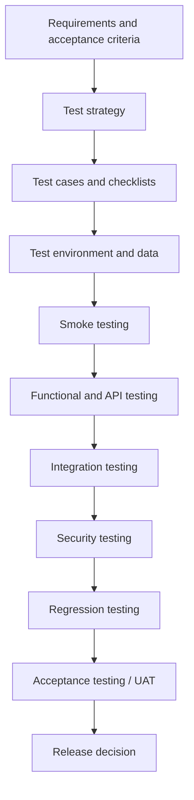

# Test Strategy — MigrationOS

## 1. Назначение документа

Документ описывает стратегию тестирования платформы MigrationOS.

Test Strategy нужен, чтобы:

- зафиксировать единый подход к контролю качества продукта;
- определить уровни и типы тестирования для всех контуров MigrationOS;
- выделить критичные зоны риска и обязательные проверки;
- связать тестирование с требованиями, API-контрактами, статусными моделями и интеграциями;
- определить тестовые окружения, тестовые данные, роли участников и критерии готовности;
- подготовить основу для тест-кейсов, чек-листов, регрессии и acceptance testing.

---

## 2. Контекст продукта

MigrationOS включает несколько пользовательских и технических контуров, которые должны проверяться как по отдельности, так и в сквозных сценариях.

| Контур | Описание |
|---|---|
| `Migrant App` | Мобильное приложение мигранта на React Native |
| `Employer Cabinet` | Web-кабинет работодателя на React |
| `Admin Panel` | Внутренняя административная панель для ролей `manager`, `supervisor`, `superadmin` |
| `Landing` | Публичный сайт на Next.js |
| `Backend API` | REST API и доменные сервисы |
| `Database` | PostgreSQL, бизнес-сущности, связи, ограничения и статусные модели |
| `Integrations` | SHERPA RPA, 1C, SBP / payment provider, FCM, S3 |
| `Risk & Logs` | `RiskScore`, `RklCheck`, `IntegrationLog`, `AuditLog` |

---

## 3. Цели тестирования

| Цель | Описание |
|---|---|
| Проверить бизнес-сценарии | Убедиться, что ключевые пользовательские flows работают end-to-end |
| Проверить корректность данных | Подтвердить правильность сущностей, связей, статусов и расчетов |
| Проверить доступы | Исключить доступ к чужим данным и неразрешенным действиям |
| Проверить интеграции | Убедиться, что внешние события корректно принимаются и обрабатываются |
| Проверить обработку ошибок | Подтвердить безопасное поведение при edge cases, валидациях и сбоях |
| Проверить нефункциональные требования | Оценить производительность, надежность, безопасность и наблюдаемость |
| Подготовить приемку | Обеспечить основу для UAT и acceptance testing |

---

## 4. Область тестирования

### 4.1. In scope

| Область | Что тестируется |
|---|---|
| Авторизация | OTP, login, 2FA, refresh session, logout |
| Роли и доступы | `own`, `org`, `internal` scopes, RBAC, access matrix |
| Документы | Upload, review, статусы, версии, file access |
| Запросы | Создание, обработка, `need_info`, `completed`, `rejected` |
| Услуги | Каталог, `ServiceOrder`, статусы, ограничения по данным |
| Оплаты | Создание платежа, redirect, payment webhook, `pending/paid/failed` |
| РКЛ | RKL webhook, `matched`, `unmatched`, duplicate, влияние на risk |
| Уведомления | Push, in-app notifications, delivery states, deep links |
| Интеграции | SHERPA RPA, 1C, SBP, FCM, S3 |
| UI states | `loading`, `empty`, `error`, `forbidden`, `conflict`, `partial_data` |
| Логи | `IntegrationLog`, `AuditLog`, traceability, log visibility |
| Landing | CTA, формы, RU/EN, consent, публичные ошибки, analytics |

### 4.2. Out of scope

| Область | Почему |
|---|---|
| Разработка RPA-робота SHERPA | Это внешний контур и внешняя ответственность |
| Прямое тестирование внутренних систем госорганов | На текущем этапе нет подтвержденного прямого контура |
| Полная автоматизация всех внешних партнерских каналов | Может быть отдельным этапом развития продукта |
| White-label и многоарендность вне текущей модели | Не входят в scope текущего кейса |

---

## 5. Уровни тестирования

| Уровень | Цель | Типовые примеры |
|---|---|---|
| `Unit testing` | Проверка отдельных функций, правил и маппингов | Валидации, расчеты риска, status transitions, normalizers |
| `Component / UI testing` | Проверка экранов и компонентов изолированно | Формы, states, role-based visibility |
| `API testing` | Проверка REST API и контрактов | Endpoint behavior, `ErrorResponse`, filters, pagination |
| `Integration testing` | Проверка взаимодействия между сервисами и внешними системами | Webhooks, S3 upload/download, FCM send, 1C batch |
| `Database testing` | Проверка схемы, связей, ограничений и миграций | FK, unique constraints, data consistency |
| `E2E testing` | Проверка сквозных бизнес-сценариев | Регистрация, загрузка документа, заказ услуги и оплата |
| `Security testing` | Проверка доступа, защиты данных и безопасных ошибок | RBAC, 2FA, deep links, private file access |
| `Performance testing` | Проверка нагрузки, времени ответа и устойчивости | API latency, webhook throughput, dashboard load |
| `Acceptance testing` | Проверка готовности продукта бизнесом | UAT по acceptance criteria |

---

## 6. Типы тестов

| Тип тестирования | Что проверяет |
|---|---|
| `Functional` | Соответствие функциональным требованиям и user stories |
| `Non-functional` | Производительность, надежность, безопасность, usability |
| `Smoke` | Базовая пригодность сборки к дальнейшему тестированию |
| `Sanity` | Что конкретное изменение работает после фикса |
| `Regression` | Что ранее реализованные сценарии не сломались |
| `Negative testing` | Корректность обработки ошибок, запретов и неверных данных |
| `Boundary testing` | Граничные значения полей, размеров файлов, лимитов и дат |
| `Permission testing` | Ограничения по ролям, scope и доступу к сущностям |
| `Contract testing` | Соответствие API и integration contracts |
| `Exploratory testing` | Поиск неожиданных сценариев и UX-проблем |
| `Resilience testing` | Поведение при сетевых сбоях, timeout, retry и partial failures |

---

## 7. Тестовые окружения

| Окружение | Назначение | Особенности |
|---|---|---|
| `Local` | Разработка и первичная проверка | Stub/mocks, быстрый цикл проверки |
| `Dev` | Интеграция изменений команды | Частично нестабильное окружение |
| `Test / QA` | Основное функциональное тестирование | Контролируемые тестовые данные и сценарии |
| `Stage` | Предрелизная проверка и UAT | Максимально близко к production |
| `Production` | Smoke после релиза, monitoring и incident response | Безопасные post-release проверки |

### 7.1. Правила окружений

| ID | Правило |
|---|---|
| `TEST-ENV-001` | Production ПДн не используются в тестах без обезличивания |
| `TEST-ENV-002` | Для webhook-интеграций должны быть доступны sandbox, stub или replay fixtures |
| `TEST-ENV-003` | `Stage` должен быть максимально близок к production по конфигурации |
| `TEST-ENV-004` | Секреты, ключи и сертификаты должны быть разделены по окружениям |
| `TEST-ENV-005` | Тесты производительности не должны запускаться на shared environment без согласования |

---

## 8. Тестовые данные

| Категория | Примеры данных |
|---|---|
| Пользователи | `migrant`, `employer`, `manager`, `supervisor`, `superadmin` |
| Работодатели | `pending`, `verified`, `rejected`, `blocked` |
| Мигранты | `active`, `archived`, `critical risk`, `without employer`, `with employer` |
| Документы | `missing`, `uploaded`, `under_review`, `approved`, `rejected`, `expired` |
| Запросы | `created`, `in_progress`, `need_info`, `completed`, `rejected`, `cancelled` |
| Услуги | бесплатные, платные, недоступные, требующие дополнительных данных |
| `ServiceOrder` | `draft`, `waiting_payment`, `paid`, `in_progress`, `completed`, `cancelled` |
| `Payment` | `pending`, `paid`, `failed`, `cancelled`, `refunded` |
| `RKL` события | `matched`, `not_found`, `unmatched`, `duplicate`, invalid source |
| `IntegrationLog` | `processed`, `failed`, `duplicate`, `unmatched`, `partial_success`, `retry_scheduled` |

### 8.1. Правила тестовых данных

| ID | Правило |
|---|---|
| `TEST-DATA-001` | Тестовые ПДн должны быть синтетическими или обезличенными |
| `TEST-DATA-002` | Нужны данные как для positive, так и для negative сценариев |
| `TEST-DATA-003` | Для каждой роли и каждого scope нужны отдельные тестовые пользователи |
| `TEST-DATA-004` | Для интеграций нужны повторяемые webhook и batch fixtures |
| `TEST-DATA-005` | Должны существовать данные для проверки конфликтов статусов и duplicate-сценариев |

---

## 9. Критичные зоны риска

| Зона риска | Почему критично | Что обязательно тестировать |
|---|---|---|
| `Permissions` | Риск утечки данных и нарушения модели доступа | `own/org/internal` scopes, безопасный `403/404`, скрытие внутренних полей |
| `Status transitions` | Риск поломки бизнес-процесса | допустимые и недопустимые переходы, `409 Conflict` |
| `Payment webhook` | Финансовые последствия | статус `paid` только по webhook, duplicate, amount mismatch |
| `RKL webhook` | Комплаенс и риск | `matched`, `unmatched`, duplicate, trust policy |
| `S3 file access` | Работа с файлами ПДн | presigned URL, TTL, permissions, private storage |
| `IntegrationLog` | Основа расследования инцидентов | `traceId`, `payload_hash`, статусы, retry, visibility |
| `AuditLog` | Юридическая трассируемость действий | логирование критичных действий и ручного разбора |
| `UI edge cases` | Срыв пользовательских сценариев | offline, deep links, partial data, stale screens, validation |
| `1C batch` | Ошибки массовых данных | `partial_success`, duplicates, unmatched, mapping |
| `Mobile offline` | Потеря данных и UX-сбои | upload retry, chat retry, сохранение черновиков |

---

## 10. Стратегия тестирования API

API-тестирование должно подтверждать, что backend соответствует контрактам и безопасно обрабатывает как штатные, так и ошибочные сценарии.

### 10.1. Основные проверки API

- соответствие [OpenAPI Specification](../05_api/openapi.yaml);
- обязательные поля, типы данных и enum values;
- корректность HTTP-кодов и `ErrorResponse`;
- пагинация, фильтры и сортировка;
- role-based access и object-level permissions;
- идемпотентность webhook и critical operations;
- `traceId` в ошибках;
- rate limiting для OTP и публичных форм;
- консистентность статусных переходов.

### 10.2. Зоны API-проверок

| API area | Обязательные проверки |
|---|---|
| `Auth` | OTP, lockout, refresh session, 2FA для внутренних ролей |
| `Documents` | upload session, approve, reject, file metadata, permissions |
| `Requests` | create, assign, `need_info`, `completed`, visibility by role |
| `Payments` | create payment, webhook, duplicate event, amount mismatch |
| `RKL` | webhook validation, invalid source, unmatched, duplicate |
| `Users / Roles` | RBAC, hidden fields, role-restricted endpoints |
| `Logs` | `IntegrationLog`, `AuditLog`, ограничение доступа, filters |
| `Files` | download URL, TTL, safe access, expired session handling |

---

## 11. Стратегия тестирования UI

UI-тестирование должно подтверждать, что пользовательские интерфейсы корректно реализуют бизнес-сценарии, безопасно обрабатывают ошибки и не нарушают модель доступа.

### 11.1. Общие проверки UI

- happy path и alternative flows;
- edge cases и error states;
- loading, empty, forbidden, conflict и partial states;
- field-level validation;
- корректная навигация и routing;
- локализация и i18n;
- базовая accessibility-проверка;
- корректное скрытие недоступных действий;
- deep links и возврат после авторизации.

### 11.2. UI-контуры

| UI | Что обязательно тестировать |
|---|---|
| `Migrant App` | OTP, профиль, consent, документы, запросы, услуги, оплата, push, deep links, offline |
| `Employer Cabinet` | регистрация, верификация, dashboard, мигранты, документы, запросы, услуги, платежи |
| `Admin Panel` | 2FA, document review, requests, risks, RKL, logs, bulk actions, user management |
| `Landing` | CTA, demo form, contact form, RU/EN, FAQ, legal links, analytics events |

---

## 12. Стратегия тестирования базы данных

Тестирование базы данных должно подтверждать, что модель данных поддерживает бизнес-правила MigrationOS и не допускает неконсистентных состояний.

| Область | Что проверять |
|---|---|
| Схема | Таблицы, индексы, ограничения, nullable/non-null поля |
| Связи | FK между `Migrant`, `Employer`, `Document`, `Request`, `Payment`, `ServiceOrder` |
| Уникальность | `externalId`, `eventId`, `providerPaymentId`, idempotency keys |
| Миграции | Корректность schema changes и backward compatibility |
| Журналы | Связи `IntegrationLog` и `AuditLog` с бизнес-сущностями |
| Данные статусов | Соответствие статусным моделям и допустимым переходам |

---

## 13. Стратегия тестирования интеграций

| Интеграция | Что тестировать |
|---|---|
| `SHERPA RPA` | trust policy, webhook contract, `eventId`, `matched/unmatched`, duplicate, `IntegrationLog` |
| `1C` | batch import, external IDs, deduplication, `partial_success`, unmatched records |
| `SBP / Payment Provider` | create payment, idempotency key, webhook signature, duplicate `paid`, amount mismatch |
| `FCM` | device tokens, invalid token handling, failed push, retry, non-blocking behavior |
| `S3 Storage` | upload, download URL, TTL, permissions, expired session, private access |

### 13.1. Отдельно критично тестировать

| Критичная область | Что проверять |
|---|---|
| `Payment webhook` | только webhook подтверждает оплату; redirect не меняет статус |
| `RKL webhook` | `matched` ведет к risk escalation; `unmatched` не создает автоматическую связь |
| `S3 file access` | файл не публичен; presigned URL живет ограниченное время и выдается после backend-проверки |
| `IntegrationLog` | каждый критичный inbound/outbound event фиксируется со статусом и traceability |
| `AuditLog` | ручное сопоставление, смена статуса, role actions и bulk actions логируются |

---

## 14. Стратегия тестирования безопасности

Тестирование безопасности для кейса MigrationOS должно быть сосредоточено на защите ПДн, ролях и контроле критичных действий.

| Направление | Что проверять |
|---|---|
| RBAC и object access | пользователь не видит чужие данные и чужие действия |
| 2FA | внутренние роли не входят без второго фактора |
| Deep links | нельзя открыть чужую сущность по прямой ссылке |
| Files | presigned URL не публичный, TTL ограничен, backend проверяет permissions |
| Logs | secrets, signatures, tokens и лишние ПДн не попадают в UI и технические логи |
| Webhooks | trust policy, signature verification, idempotency |
| Landing forms | anti-spam, rate limiting, safe public error messages |
| Push payload | отсутствие лишних ПДн и чувствительных деталей |

---

## 15. Стратегия тестирования производительности

| Область | Что проверять |
|---|---|
| `Backend API` | latency, throughput, degradation under load |
| `Dashboard` | скорость загрузки агрегатов и фильтров |
| `Payment webhook` | время обработки и обновления `Payment` / `ServiceOrder` |
| `RKL webhook` | время обработки и обновления риска |
| `1C batch` | длительность обработки и частичные ошибки |
| `S3 upload/download` | стабильность работы с файлами и временем ответа |
| `Push` | массовая отправка критичных уведомлений |
| `Database` | selectivity индексов, pagination, sorting, heavy filters |

### 15.1. Ориентиры производительности

- основные API-сценарии должны укладываться в целевой response time из NFR;
- система должна выдерживать рост нагрузки без нарушения критичных бизнес-потоков;
- webhook-обработка должна быть достаточно быстрой, чтобы не ломать операционные SLA;
- dashboard и риск-агрегации не должны давать критической задержки для внутренних ролей.

---

## 16. Стратегия приемочного тестирования

Acceptance testing должно подтверждать, что MigrationOS соответствует ожиданиям бизнеса, ролям пользователей и сценариям из acceptance criteria.

| Контур | Что подтверждается на приемке |
|---|---|
| `Migrant App` | ключевые сценарии мигранта, документы, уведомления, услуги и платежи |
| `Employer Cabinet` | управление мигрантами организации, запросами, услугами и рисками |
| `Admin Panel` | обработка документов, запросов, рисков, РКЛ и логов |
| `Landing` | понятный публичный flow, формы, CTA и RU/EN |
| `Integrations` | критичные inbound/outbound сценарии на sandbox/stub контуре |

---

## 17. Regression strategy

Регрессионное тестирование должно запускаться перед релизом, после критичных изменений и после исправления дефектов в чувствительных зонах.

### 17.1. Когда выполняется регрессия

- перед production release;
- после изменений в `permissions` и `access matrix`;
- после изменений в status models;
- после изменений в payment webhook и RKL webhook;
- после изменений в file upload/download flow;
- после изменения OpenAPI-контрактов;
- после изменений в critical UI navigation и deep links.

### 17.2. Минимальный regression pack

| Блок | Сценарии |
|---|---|
| `Auth` | OTP, login, 2FA, session expiration |
| `Permissions` | `own/org/internal` access, hidden fields |
| `Documents` | upload, approve, reject, conflict |
| `Payments` | `pending`, `paid` по webhook, duplicate webhook |
| `RKL` | `matched`, `unmatched`, duplicate event |
| `Requests` | create, `need_info`, complete, read-only closed request |
| `Files` | presigned URL, forbidden access, expired session |
| `Logs` | `IntegrationLog`, `AuditLog`, visibility by role |
| `Landing` | forms, consent, RU/EN, fallback states |

---

## 18. Defect management

### 18.1. Карточка дефекта

| Поле | Описание |
|---|---|
| `Title` | Краткое описание проблемы |
| `Environment` | Где найден дефект |
| `Preconditions` | Исходные данные и состояние |
| `Steps to reproduce` | Шаги воспроизведения |
| `Actual result` | Фактический результат |
| `Expected result` | Ожидаемый результат |
| `Severity` | Влияние на систему |
| `Priority` | Срочность исправления |
| `Evidence` | Скриншоты, видео, логи, `traceId`, `eventId` |
| `Linked requirement` | Требование, acceptance criterion или API contract |
| `Linked test case` | Связанный тест-кейс или чек-лист |

### 18.2. Классификация severity

| Severity | Значение |
|---|---|
| `Critical` | Утечка данных, финансовая ошибка, неверный critical risk, блокер релиза |
| `Major` | Ломается ключевой бизнес-сценарий без приемлемого обходного пути |
| `Medium` | Есть обходной путь, но процесс или UX существенно нарушен |
| `Low` | Косметическая, локальная или редкая проблема |

---

## 19. Entry criteria

Тестирование может начинаться, когда выполнены следующие условия:

- требования зафиксированы;
- acceptance criteria доступны;
- API-контракты и статусные модели описаны;
- тестовое окружение развернуто и доступно;
- роли, permissions и тестовые пользователи созданы;
- подготовлены тестовые данные и fixtures;
- интеграции доступны в sandbox, mock или stub режиме;
- сборка проходит smoke-check.

---

## 20. Exit criteria

Тестирование может считаться завершенным, когда:

- критичные дефекты закрыты;
- major defects закрыты или согласованы как known issues;
- acceptance criteria пройдены;
- regression pack выполнен;
- security-critical проверки завершены;
- проверки `permissions`, `status transitions`, `payment webhook`, `RKL webhook`, `S3 access`, `IntegrationLog`, `AuditLog` выполнены;
- результаты тестирования зафиксированы и прозрачны для релизного решения.

---

## 21. Роли и ответственность

| Роль | Ответственность |
|---|---|
| `System Analyst` | Требования, acceptance criteria, edge cases, трассировка требований в тестирование |
| `QA Engineer` | Test design, execution, defect reporting, regression, test evidence |
| `Backend Developer` | Unit/API tests, fixes, integration stability, logging |
| `Frontend Developer` | UI states, validation, role-based visibility, landing behavior |
| `Mobile Developer` | Mobile flows, push, deep links, offline behavior |
| `DevOps` | Environments, secrets, observability, test support for integrations |
| `Product Owner` | Приоритизация дефектов, release decision, acceptance scope |
| `Business Stakeholder` | UAT и бизнес-подтверждение ключевых сценариев |

---

## 22. Mermaid diagram: общий testing flow

---

## 23. Связанные артефакты

- [Functional Requirements](../01_requirements/functional-requirements.md)
- [Non-functional Requirements](../01_requirements/non-functional-requirements.md)
- [Acceptance Criteria](../01_requirements/acceptance-criteria.md)
- [UI Edge Cases](../07_ui-scenarios/edge-cases.md)
- [Error Model](../05_api/error-model.md)
- [OpenAPI Specification](../05_api/openapi.yaml)
- [Status Models](../04_data-model/status-models.md)
- [Permissions](../02_roles-and-access/permissions.md)
- [Access Matrix](../02_roles-and-access/access-matrix.md)
- [Integrations Overview](../06_integrations/integrations-overview.md)
- [Integration Logs](../06_integrations/integration-logs.md)
