# Architecture Overview — MigrationOS

## 1. Назначение документа

Документ описывает верхнеуровневую архитектуру MigrationOS.

Architecture Overview нужен, чтобы:

- показать основные компоненты системы;
- зафиксировать архитектурные границы и зоны ответственности;
- связать пользовательские приложения, backend, данные и интеграции;
- объяснить ключевые архитектурные решения;
- показать, как система поддерживает безопасность, масштабирование, отказоустойчивость и наблюдаемость;
- подготовить основу для C4 Context, C4 Container, sequence diagrams и deployment context.

---

## 2. Архитектурный контекст

MigrationOS — цифровая платформа для сопровождения миграционного учета, документооборота, сервисных операций и контроля рисков при работе с иностранной рабочей силой.

Платформа должна поддерживать:

- мобильное приложение мигранта;
- web-кабинет работодателя;
- административную панель агентства;
- публичный landing;
- backend API и доменные сервисы;
- хранение структурированных данных и файлов;
- интеграции с внешними системами;
- уведомления;
- аудит и журналирование;
- аналитику рисков и РКЛ-проверки.

---

## 3. Архитектурные цели

| Цель | Описание |
|---|---|
| Масштабируемость | Поддержка роста количества мигрантов, работодателей, документов и запросов |
| Безопасность | Защита ПДн, файлов, ролей, webhook-сценариев и критичных действий |
| Модульность | Разделение доменов и независимое развитие сервисов |
| Интегрируемость | Поддержка SHERPA RPA, 1C, SBP, FCM, S3 и потенциальных внешних контуров |
| Наблюдаемость | Логи, метрики, трассировка и алерты по критичным сценариям |
| Отказоустойчивость | Контролируемое поведение при сбоях сервисов и интеграций |
| Проверяемость | Возможность тестировать API, UI, интеграции и бизнес-правила на уровне контрактов |

---

## 4. Архитектурные принципы

| ID | Принцип |
|---|---|
| `ARCH-PR-001` | Frontend не должен напрямую обращаться к внутренним хранилищам и интеграциям |
| `ARCH-PR-002` | Все доступы к данным и действиям проверяются на backend |
| `ARCH-PR-003` | Файлы документов хранятся в S3-compatible storage, а не в БД |
| `ARCH-PR-004` | PostgreSQL хранит бизнес-сущности, связи, статусы и metadata |
| `ARCH-PR-005` | Интеграции должны журналироваться через `IntegrationLog` |
| `ARCH-PR-006` | Критичные ручные действия должны журналироваться через `AuditLog` |
| `ARCH-PR-007` | Payment status меняется только на основании webhook от payment provider |
| `ARCH-PR-008` | RKL `matched` должен приводить к risk escalation |
| `ARCH-PR-009` | Ошибки API возвращаются в единой модели `ErrorResponse` |
| `ARCH-PR-010` | Внешние сбои не должны раскрывать внутренние детали пользователю |

---

## 5. Пользовательские контуры

| Контур | Технология | Пользователи | Назначение |
|---|---|---|---|
| `Migrant Mobile App` | React Native | `migrant` | Профиль, документы, запросы, услуги, оплаты, push, чат |
| `Employer Cabinet` | React | `employer` | Dashboard, мигранты организации, запросы, услуги, платежи |
| `Admin Panel` | React | `manager`, `supervisor`, `superadmin` | Операционная обработка, риски, РКЛ, логи, роли |
| `Landing` | Next.js | public users | Публичная презентация продукта, формы, CTA, RU/EN |

### 5.1. Роль frontend-слоя

Frontend-контуры отвечают за:

- отображение данных и состояний;
- валидацию пользовательского ввода на уровне UX;
- навигацию и deep links;
- локализацию интерфейса;
- безопасное отображение ошибок и CTA.

Frontend не является источником истины для:

- проверки permissions;
- допустимости статусных переходов;
- подтверждения оплаты;
- принятия интеграционных событий;
- выдачи доступа к private files.

---

## 6. Backend architecture

Backend MigrationOS строится как набор доменных микросервисов на FastAPI, публикующих REST API и работающих за единым API Gateway.

### 6.1. Доменные сервисы

| Сервис | Ответственность |
|---|---|
| `Auth Service` | Login, OTP, 2FA, session/refresh, JWT |
| `User Service` | Пользователи, профили, роли, связи с migrant/employer |
| `Document Service` | Документы, статусы, metadata, review flow |
| `File Service` | Upload/download flow, S3, presigned URL |
| `Request Service` | Запросы, комментарии, статусы, assignee |
| `Marketplace Service` | Каталог услуг, `ServiceOrder`, входные формы |
| `Payment Service` | Payment creation, payment webhook, payment statuses |
| `RKL Service` | RKL checks, SHERPA RPA webhook, matched/unmatched |
| `Analytics / Risk Service` | `RiskScore`, dashboard, агрегаты, alerts |
| `Notification Service` | In-app notifications, FCM push, email |
| `Chat Service` | Чаты, сообщения, realtime/polling |
| `Integration Service` | `IntegrationLog`, retry, inbound/outbound events |
| `Audit Service` | `AuditLog` критичных действий |

### 6.2. Взаимодействие сервисов

Архитектура предполагает:

- синхронные REST-вызовы для пользовательских API;
- асинхронные сценарии для webhook, retry, push и batch processing;
- доменное разделение ответственности между сервисами;
- единое применение RBAC, error model и traceability.

---

## 7. Хранилища данных

| Хранилище | Назначение |
|---|---|
| `PostgreSQL` | Основные бизнес-сущности, связи, статусы, metadata |
| `Redis` | Cache, sessions, rate limits, temporary state, queues |
| `S3-compatible storage` | Binary files документов и вложений |
| `Logs / Metrics storage` | Технические логи, метрики, dashboards |

### 7.1. Правило хранения файлов

Binary-файлы документов не хранятся в PostgreSQL.

В БД хранится только:

- `document_id`;
- `document_file_id`;
- `storage_key`;
- `file_name`;
- `mime_type`;
- `file_size`;
- `file_hash`;
- `uploaded_by`;
- статус;
- audit и integration metadata.

### 7.2. Роль Redis

Redis используется для:

- хранения временных сессий и OTP state;
- rate limiting;
- кэша для часто читаемых данных;
- временных ключей идемпотентности;
- coordination/state для retry и background-процессов.

---

## 8. Интеграции

| Интеграция | Направление | Назначение |
|---|---|---|
| `SHERPA RPA` | Inbound | Получение результатов РКЛ-проверок |
| `1C` | Inbound / Outbound | Импорт и обмен учетными и операционными данными |
| `SBP / Payment Provider` | Outbound / Inbound | Создание платежей и получение payment webhook |
| `FCM` | Outbound | Push-уведомления |
| `S3 Storage` | Outbound | Хранение и выдача файлов |
| `Email Provider` | Outbound | Email-уведомления |
| `EPGU / Госуслуги` | External / Potential | Возможная государственная интеграция |

### 8.1. Архитектурная роль интеграционного слоя

Integration layer отвечает за:

- нормализацию внешних payload;
- trust policy и webhook validation;
- retry и idempotency;
- запись технических статусов в `IntegrationLog`;
- безопасную обработку duplicate и unmatched сценариев.

Интеграционный слой не должен:

- обходить доменные правила;
- напрямую менять данные в БД вне доменной логики;
- принимать пользовательские решения вместо business services.

---

## 9. API Gateway

API Gateway / Kong используется как единая точка входа для клиентских приложений и внешних webhook.

### 9.1. Задачи API Gateway

- маршрутизация запросов;
- TLS termination;
- rate limiting;
- request size limits;
- API keys для интеграций;
- IP allowlist для webhooks;
- correlation ID;
- centralized access logging;
- базовая защита публичных endpoint.

### 9.2. Что остается за backend

Даже при наличии API Gateway:

- permissions проверяются внутри backend-сервисов;
- status transitions валидируются в доменном слое;
- webhook business outcome определяется только доменными сервисами;
- ошибки маппятся в `ErrorResponse` на уровне backend API.

---

## 10. Архитектурные слои

| Слой | Компоненты | Ответственность |
|---|---|---|
| `Presentation Layer` | Mobile app, web apps, landing | UI, формы, состояния, навигация |
| `API Layer` | API Gateway, REST API | Контракты, маршрутизация, auth entry point |
| `Domain Layer` | Auth, Document, Request, Payment, RKL, Risk services | Бизнес-логика |
| `Integration Layer` | Adapters, webhooks, `IntegrationLog`, retry | Обмен с внешними системами |
| `Data Layer` | PostgreSQL, Redis, S3 | Хранение данных, metadata, файлов |
| `Observability Layer` | Logs, metrics, tracing, alerts | Мониторинг и расследование |
| `Security Layer` | RBAC, JWT, 2FA, permissions, audit | Защита данных и действий |

---

## 11. Границы ответственности

| Зона | Что делает | Что не делает |
|---|---|---|
| Frontend | Отображает UI, собирает ввод, показывает ошибки | Не принимает финальные решения по доступам и статусам |
| Backend API | Проверяет права, применяет бизнес-правила, возвращает данные | Не хранит binary-файлы в БД |
| Database | Хранит сущности, связи, статусы, metadata | Не управляет бизнес-процессами как source of truth |
| Redis | Ускоряет чтение и хранит временное состояние | Не является долговременным бизнес-хранилищем |
| S3 Storage | Хранит binary content | Не решает, кто имеет доступ к файлу |
| Integration Adapters | Нормализуют обмен с внешними системами | Не должны обходить доменные правила |
| External Systems | Отправляют или принимают события | Не определяют внутреннюю модель доступа MigrationOS |
| Observability Layer | Помогает расследовать инциденты | Не заменяет бизнес-валидацию |

---

## 12. Безопасность

Ключевые требования безопасности:

| Область | Требование |
|---|---|
| Auth | OTP для migrant, login/2FA для внутренних ролей |
| RBAC | Доступ зависит от роли и scope |
| Object permissions | Проверка доступа к каждой чувствительной сущности |
| Files | Доступ к файлам только через backend-проверку и presigned URL |
| Logs | Secrets, tokens, signatures и presigned URL не логируются в открытом виде |
| PII | ПДн не попадают в публичные payload и unsafe logs |
| Webhooks | Trust policy, signature/API key/IP allowlist |
| Audit | Критичные действия журналируются |

### 12.1. Security-by-design решения

| Решение | Обоснование |
|---|---|
| `Webhook-only payment confirmation` | Снижает риск финансовых ошибок от frontend redirect |
| `Private object storage` | Уменьшает риск утечки файлов с ПДн |
| `Object-level permission checks` | Не допускает доступа к чужим сущностям даже при знании URL |
| `2FA for internal users` | Снижает риск компрометации административного контура |
| `Safe error responses` | Не раскрывает внутреннее устройство и чувствительные детали |

---

## 13. Наблюдаемость

| Инструмент / механизм | Назначение |
|---|---|
| `traceId` | Трассировка запроса или события |
| `correlationId` | Связь событий одного бизнес-процесса |
| `IntegrationLog` | Журнал inbound/outbound интеграций |
| `AuditLog` | Журнал критичных действий пользователей |
| `Prometheus` | Сбор метрик |
| `Grafana` | Dashboards и визуализация |
| `Alerts` | Уведомления о критичных сбоях |
| `Application logs` | Техническая диагностика |

### 13.1. Критичные алерты

| Условие | Кому |
|---|---|
| Нет данных РКЛ до контрольного времени | Supervisor / Support |
| Рост failed payment webhooks | Backend / Finance |
| S3 недоступен | Backend / DevOps |
| Рост forbidden / access denied | Security / Backend |
| FCM failed push резко выросли | Backend / Mobile |
| 1C batch не обработан | Support / Backend |
| Critical risk создан | Supervisor |

---

## 14. Отказоустойчивость и retry

| Сценарий | Подход |
|---|---|
| Временный сбой внешней системы | Retry с ограничением попыток |
| Duplicate webhook | Idempotency key и статус `duplicate` |
| Payment webhook повторился | Не менять статус повторно |
| FCM timeout | Retry без отката бизнес-операции |
| S3 timeout | Retry или controlled error |
| 1C partial failure | `partial_success` и summary |
| RKL unmatched | Manual review без рискованной автосвязи |

### 14.1. Архитектурное значение отказоустойчивости

Отказоустойчивость в MigrationOS реализуется не через "полное отсутствие ошибок", а через контролируемое поведение:

- пользователь получает безопасное и понятное сообщение;
- критичная бизнес-сущность не переходит в неконсистентное состояние;
- интеграционное событие можно расследовать по `IntegrationLog`;
- повторная доставка события не создает дубликаты.

---

## 15. Масштабирование

| Область | Подход |
|---|---|
| Backend API | Горизонтальное масштабирование сервисов в Kubernetes |
| Read-heavy lists | Pagination, indexes, optimized filters |
| Dashboard | Aggregations, cache, async recalculation |
| Webhooks | Queue / retry и idempotency |
| Files | S3-compatible storage |
| Push | Асинхронная отправка |
| Batch import | Background processing |
| Logs | Отдельное хранение и индексация при росте объема |

### 15.1. Облачная и runtime-среда

Архитектура предполагает deployment в Docker/Kubernetes в инфраструктуре Yandex Cloud или VK Cloud с возможностью:

- масштабировать сервисы независимо;
- отделять stateful и stateless компоненты;
- централизованно управлять конфигурацией;
- внедрять наблюдаемость и алерты на уровне платформы.

---

## 16. Ключевые архитектурные решения

| ID | Решение | Обоснование |
|---|---|---|
| `ADR-001` | Использовать REST API | Простота интеграции с web/mobile и внешними сервисами |
| `ADR-002` | Использовать микросервисный backend на FastAPI | Разделение доменов и независимое развитие сервисов |
| `ADR-003` | Использовать PostgreSQL как основное хранилище | Надежная relational-модель для связей и статусов |
| `ADR-004` | Хранить файлы в S3-compatible storage | Безопасное и масштабируемое хранение binary content |
| `ADR-005` | Использовать Redis для cache/session/rate limits | Быстрые временные данные и ограничение частоты запросов |
| `ADR-006` | Подтверждать оплату только по webhook | Исключение финансовых ошибок из-за frontend redirect |
| `ADR-007` | Логировать интеграции через `IntegrationLog` | Трассируемость и расследование интеграционных инцидентов |
| `ADR-008` | Логировать ручные критичные действия через `AuditLog` | Юридическая и операционная трассируемость |
| `ADR-009` | Использовать presigned URL для файлов | Временный доступ к private object storage |
| `ADR-010` | Использовать API Gateway | Централизация входа, rate limiting и маршрутизация |
| `ADR-011` | Развертывать сервисы в Docker/Kubernetes | Управляемое масштабирование и эксплуатация |
| `ADR-012` | Использовать Prometheus/Grafana | Стандартизованная наблюдаемость и оперативный контроль |

---

## 17. Mermaid architecture diagram

```mermaid
flowchart TD
    subgraph Clients["Client Applications"]
        Mobile["Migrant App<br/>React Native"]
        EmployerWeb["Employer Cabinet<br/>React"]
        AdminWeb["Admin Panel<br/>React"]
        Landing["Landing<br/>Next.js"]
    end

    Gateway["API Gateway / Kong"]

    subgraph Backend["Backend Services / FastAPI"]
        Auth["Auth Service"]
        User["User Service"]
        Document["Document Service"]
        File["File Service"]
        Request["Request Service"]
        Marketplace["Marketplace Service"]
        Payment["Payment Service"]
        RKL["RKL Service"]
        Risk["Analytics / Risk Service"]
        Notification["Notification Service"]
        Chat["Chat Service"]
        Integration["Integration Service"]
        Audit["Audit Service"]
    end

    subgraph Data["Data Layer"]
        PG["PostgreSQL"]
        Redis["Redis"]
        S3["S3-compatible Storage"]
    end

    subgraph External["External Systems"]
        Sherpa["SHERPA RPA"]
        OneC["1C"]
        SBP["SBP / Payment Provider"]
        FCM["FCM"]
        Email["Email Provider"]
        EPGU["EPGU / Госуслуги"]
    end

    subgraph Ops["Platform / Operations"]
        K8s["Docker / Kubernetes"]
        Cloud["Yandex Cloud / VK Cloud"]
        Prom["Prometheus"]
        Graf["Grafana"]
        Alerts["Alerts"]
    end

    Mobile --> Gateway
    EmployerWeb --> Gateway
    AdminWeb --> Gateway
    Landing --> Gateway

    Gateway --> Auth
    Gateway --> User
    Gateway --> Document
    Gateway --> File
    Gateway --> Request
    Gateway --> Marketplace
    Gateway --> Payment
    Gateway --> RKL
    Gateway --> Risk
    Gateway --> Notification
    Gateway --> Chat
    Gateway --> Integration
    Gateway --> Audit

    Auth --> PG
    User --> PG
    Document --> PG
    Request --> PG
    Marketplace --> PG
    Payment --> PG
    RKL --> PG
    Risk --> PG
    Integration --> PG
    Audit --> PG

    Auth --> Redis
    Risk --> Redis
    Integration --> Redis
    File --> S3

    Sherpa --> Gateway
    OneC --> Gateway
    SBP --> Gateway

    Payment --> SBP
    Notification --> FCM
    Notification --> Email
    Integration --> OneC
    Integration --> EPGU

    Auth --> Prom
    Payment --> Prom
    RKL --> Prom
    Integration --> Prom
    Prom --> Graf
    Prom --> Alerts

    K8s --> Auth
    K8s --> Payment
    K8s --> Integration
    Cloud --> K8s
```

---

## 18. Основные архитектурные риски

| Риск | Последствие | Митигирующие меры |
|---|---|---|
| Ошибка permissions | Утечка данных | RBAC, object-level access checks, tests |
| Payment status меняется неверно | Финансовые ошибки | Webhook-only confirmation, idempotency |
| RKL matched не обработан | Комплаенс-риск | Alerts, `IntegrationLog`, supervisor queue |
| S3 object стал публичным | Утечка ПДн | Private bucket, presigned URL, audits |
| 1C batch создал дубли | Ошибки данных | `externalId`, idempotency, duplicate checks |
| Логи содержат ПДн | Security incident | Masking, `payload_hash`, restricted access |
| Dashboard медленный | Плохой UX | Indexes, cache, async aggregations |
| Retry создает дубли | Неконсистентность | Idempotency keys, `IntegrationLog` statuses |

---

## 19. Связанные артефакты

- [Project Scope](../00_project-overview/project-scope.md)
- [Non-functional Requirements](../01_requirements/non-functional-requirements.md)
- [Integrations Overview](../06_integrations/integrations-overview.md)
- [OpenAPI Specification](../05_api/openapi.yaml)
- [Data Dictionary](../04_data-model/data-dictionary.md)
- [ERD](../04_data-model/erd.md)
- [Permissions](../02_roles-and-access/permissions.md)
- [Error Model](../05_api/error-model.md)
- [Test Strategy](../08_testing/test-strategy.md)
- [Deployment Context](./deployment-context.md)
