# C4 Container — MigrationOS

## 1. Назначение документа

Документ описывает C4 Container Diagram для MigrationOS.

C4 Container нужен, чтобы:

- показать основные приложения и runtime-контейнеры системы;
- описать backend-сервисы и их зоны ответственности;
- показать ключевые хранилища данных;
- показать взаимодействия с внешними системами;
- зафиксировать протоколы и основные потоки данных;
- подготовить основу для sequence diagrams и deployment context.

---

## 2. Уровень диаграммы

C4 Container — это второй уровень C4-модели.

На этом уровне MigrationOS уже не рассматривается как единый черный ящик.  
Система раскладывается на основные контейнеры:

- frontend-приложения;
- API Gateway;
- backend-сервисы;
- базы данных и хранилища;
- интеграционные контуры;
- внешние системы.

Документ не детализирует:

- классы;
- функции;
- таблицы на уровне SQL;
- внутреннюю реализацию сервисов;
- Kubernetes manifests;
- кодовую структуру репозиториев.

---

## 3. Container scope

В рамках C4 Container MigrationOS включает следующие группы контейнеров:

| Группа | Контейнеры |
|---|---|
| Client applications | `Migrant Mobile App`, `Employer Cabinet`, `Admin Panel`, `Landing` |
| API entry point | `API Gateway / Kong` |
| Backend services | FastAPI domain services |
| Data stores | `PostgreSQL`, `Redis`, `S3-compatible Storage` |
| External integrations | `SHERPA RPA`, `1C`, `SBP`, `FCM`, `Email Provider`, `EPGU` |
| Observability | Логи, метрики, alerts через platform tooling |

---

## 4. Client applications

| Контейнер | Технология | Пользователи | Ответственность |
|---|---|---|---|
| `Migrant Mobile App` | React Native | `migrant` | Профиль, документы, запросы, услуги, оплаты, push/deep links, чат |
| `Employer Cabinet` | React | `employer` | Dashboard организации, мигранты, документы, запросы, услуги, платежи |
| `Admin Panel` | React | `manager`, `supervisor`, `superadmin` | Документы, запросы, риски, РКЛ, логи, роли, bulk actions |
| `Landing` | Next.js | public users | Публичный сайт, CTA, demo/contact forms, RU/EN, legal links |

### 4.1. Общие правила frontend-контейнеров

| ID | Правило |
|---|---|
| `C4CONT-FE-001` | Frontend не принимает финальные решения по доступам |
| `C4CONT-FE-002` | Frontend не подтверждает оплату по redirect |
| `C4CONT-FE-003` | Frontend не обращается напрямую к PostgreSQL, Redis или S3 |
| `C4CONT-FE-004` | Frontend показывает safe errors из `ErrorResponse` |
| `C4CONT-FE-005` | Все private данные запрашиваются через backend API |

---

## 5. API Gateway / Kong

| Контейнер | Назначение |
|---|---|
| `API Gateway / Kong` | Единая точка входа для UI-приложений и внешних webhook |

### 5.1. Ответственность API Gateway

- маршрутизация запросов к backend-сервисам;
- TLS termination;
- rate limiting;
- request size limits;
- API keys для интеграций;
- IP allowlist для webhook-контуров;
- centralized access logging;
- correlation ID / trace propagation;
- защита публичных endpoint на инфраструктурном уровне.

### 5.2. Что не является ответственностью Gateway

| Не делает | Почему |
|---|---|
| Не принимает бизнес-решения | Это responsibility доменных сервисов |
| Не проверяет object-level permissions полностью | Это делает backend |
| Не меняет payment status | Payment status меняет `Payment Service` по webhook |
| Не сопоставляет RKL-события | Это делает `RKL Service` и integration logic |

---

## 6. Backend services

Backend построен как набор доменных сервисов на FastAPI.

| Сервис | Основная ответственность | Основные данные |
|---|---|---|
| `Auth Service` | OTP, login, 2FA, JWT, refresh/session | users, sessions, OTP state |
| `User Service` | Пользователи, роли, профили, связи с migrant/employer | User, Role, Permission |
| `Document Service` | Документы, статусы, review flow, версии | Document, DocumentStatus |
| `File Service` | Upload/download flow, presigned URL, file metadata | DocumentFile, storageKey |
| `Request Service` | Запросы, комментарии, assignee, статусы | Request, RequestComment |
| `Marketplace Service` | Каталог услуг, формы, service orders | Service, ServiceOrder |
| `Payment Service` | Создание платежа, webhook, статусы оплат | Payment, providerPaymentId |
| `RKL Service` | РКЛ-проверки, matched/unmatched, risk impact | RklCheck |
| `Analytics / Risk Service` | RiskScore, dashboard, агрегаты, alerts | RiskScore, analytics views |
| `Notification Service` | In-app notifications, FCM push, email | Notification, DeviceToken |
| `Chat Service` | Чаты, сообщения, realtime/polling | Chat, Message |
| `Integration Service` | IntegrationLog, retry, idempotency, inbound/outbound events | IntegrationLog |
| `Audit Service` | AuditLog критичных действий пользователей | AuditLog |

### 6.1. Принципы сервисной декомпозиции

| Принцип | Пояснение |
|---|---|
| Domain ownership | Каждый сервис отвечает за свой домен и правила |
| Clear write boundaries | Критичные записи меняются в одном доменном owner-сервисе |
| REST contracts | Внешний доступ идет через согласованные API-контракты |
| Async side effects | Retry, push, webhooks и batch не должны ломать основную транзакцию |

---

## 7. Data stores

| Хранилище | Тип | Ответственность |
|---|---|---|
| `PostgreSQL` | Relational database | Бизнес-сущности, связи, статусы, metadata, logs |
| `Redis` | In-memory store | Cache, sessions, OTP state, rate limits, temporary idempotency keys |
| `S3-compatible Storage` | Object storage | Binary-файлы документов и вложений |

### 7.1. Data ownership

| Данные | Source of truth |
|---|---|
| Пользователи и роли | `User Service` + `PostgreSQL` |
| Сессии и OTP state | `Auth Service` + `Redis` |
| Документы и статусы | `Document Service` + `PostgreSQL` |
| Binary files | `S3-compatible Storage` |
| File metadata | `File Service` + `PostgreSQL` |
| Запросы | `Request Service` + `PostgreSQL` |
| Услуги и заявки | `Marketplace Service` + `PostgreSQL` |
| Платежи | `Payment Service` + `PostgreSQL` |
| РКЛ | `RKL Service` + `PostgreSQL` |
| RiskScore | `Analytics / Risk Service` + `PostgreSQL` |
| IntegrationLog | `Integration Service` + `PostgreSQL` |
| AuditLog | `Audit Service` + `PostgreSQL` |

### 7.2. Container-level правила данных

| ID | Правило |
|---|---|
| `C4CONT-DATA-001` | Binary files не хранятся в PostgreSQL |
| `C4CONT-DATA-002` | Redis не является долговременным source of truth для бизнес-данных |
| `C4CONT-DATA-003` | Сервис-владелец домена отвечает за консистентность своих записей |

---

## 8. External systems

| Внешняя система | Направление | Протокол / механизм | Назначение |
|---|---|---|---|
| `SHERPA RPA` | Inbound | REST webhook | Передача результатов РКЛ-проверок |
| `1C` | Inbound / Outbound | REST / SFTP / batch | Обмен учетными и операционными данными |
| `SBP / Payment Provider` | Outbound / Inbound | REST + webhook | Создание платежа и подтверждение оплаты |
| `FCM` | Outbound | REST API | Push-уведомления |
| `Email Provider` | Outbound | SMTP / REST API | Email-уведомления |
| `EPGU / Госуслуги` | Potential | REST / external exchange | Потенциальный государственный обмен |

---

## 9. Container relationships

| Источник | Получатель | Протокол | Назначение |
|---|---|---|---|
| Client applications | `API Gateway` | HTTPS / REST | Пользовательские операции |
| `API Gateway` | Backend services | HTTP / REST | Маршрутизация API-запросов |
| Backend services | `PostgreSQL` | SQL | Чтение и запись бизнес-данных |
| Backend services | `Redis` | Redis protocol | Cache, sessions, rate limits |
| `File Service` | `S3-compatible Storage` | S3 API | Upload/download файлов |
| `Payment Service` | `SBP / Payment Provider` | REST | Создание платежа |
| `SBP / Payment Provider` | `API Gateway` | Webhook HTTPS | Подтверждение оплаты |
| `SHERPA RPA` | `API Gateway` | Webhook HTTPS | Результаты РКЛ |
| `Integration Service` | `1C` | REST / SFTP | Batch/import/export |
| `Notification Service` | `FCM` | REST API | Push |
| `Notification Service` | `Email Provider` | SMTP / REST | Email |
| Backend services | Observability tooling | Logs / metrics | Мониторинг и расследование |

---

## 10. Ownership and responsibility

| Контейнер | За что отвечает | Что не должен делать |
|---|---|---|
| `Migrant Mobile App` | UX мигранта и клиентские сценарии | Не подтверждает оплату и не принимает access decisions |
| `Employer Cabinet` | UX работодателя и org-centric views | Не показывает данные вне `org` context |
| `Admin Panel` | Внутренние операционные сценарии | Не обходит backend RBAC |
| `Landing` | Публичная презентация и lead forms | Не хранит чувствительные данные без consent |
| `API Gateway / Kong` | Вход, маршрутизация, infra-policy | Не заменяет доменную логику |
| `Payment Service` | Денежный статус и webhook-обработка | Не доверяет redirect как источнику истины |
| `RKL Service` | РКЛ-результаты и risk impact | Не делает рискованные weak-match привязки автоматически |
| `Integration Service` | IntegrationLog, retry, idempotency | Не должен становиться доменным owner чужих сущностей |
| `Audit Service` | Трассировка критичных действий | Не заменяет IntegrationLog |

---

## 11. Security notes

| Контейнер / зона | Security notes |
|---|---|
| Client applications | Не хранить secrets, не доверять client-side permissions |
| `API Gateway` | Rate limits, API keys, IP allowlist, TLS |
| `Auth Service` | OTP limits, 2FA, refresh token safety |
| `User Service` | RBAC, role restrictions, no privilege escalation |
| `Document / File Services` | Object-level access, private files, TTL URL |
| `Payment Service` | Webhook-only confirmation, signature validation, idempotency |
| `RKL Service` | Trust policy, matched/unmatched handling, supervisor alerts |
| `Integration Service` | Masking payload, `payload_hash`, retry, no secrets exposure |
| `Audit Service` | Immutable audit trail для критичных действий |
| `PostgreSQL` | Least privilege, backups, encryption at rest if available |
| `Redis` | No long-term sensitive data, TTL, network isolation |
| `S3-compatible Storage` | Private bucket, server-side encryption, presigned URL |

---

## 12. Observability notes

| Контейнер | Что логировать / измерять |
|---|---|
| `API Gateway` | request rate, 4xx/5xx, latency, blocked requests |
| `Auth Service` | failed login/OTP/2FA attempts, lockouts |
| `Payment Service` | webhook status, duplicate, amount mismatch, processing time |
| `RKL Service` | matched/unmatched, failed events, no data alerts |
| `File Service` | upload/download errors, expired URL, forbidden attempts |
| `Integration Service` | IntegrationLog statuses, retry attempts, `partial_success` |
| `Notification Service` | push delivery status, invalid tokens, retry |
| `PostgreSQL` | slow queries, locks, index usage |
| `Redis` | memory usage, key expiration, cache hit rate |
| `S3-compatible Storage` | availability, failed access, object errors |

### 12.1. Container-level observability rules

| ID | Правило |
|---|---|
| `C4CONT-OBS-001` | Критичные webhook-события должны быть трассируемы через `traceId` |
| `C4CONT-OBS-002` | User-facing действия и integration events не смешиваются в одном журнале |
| `C4CONT-OBS-003` | Secrets и presigned URLs не должны попадать в открытые operational logs |

---

## 13. Scalability and resilience

| Область | Подход |
|---|---|
| Client apps | CDN/static delivery for web, mobile app release channels |
| `API Gateway` | Horizontal scaling, rate limiting |
| Backend services | Stateless services, Kubernetes scaling |
| `PostgreSQL` | Indexes, pagination, backups, read optimization |
| `Redis` | Cache and rate limit scaling |
| `S3-compatible Storage` | External scalable object storage |
| Webhooks | Idempotency, retry, duplicate handling |
| 1C batch | Background processing, `partial_success` summary |
| Notifications | Async delivery and retry |
| Dashboard | Cache, async aggregation, optimized queries |

### 13.1. Отказоустойчивость на уровне контейнеров

| Сценарий | Контейнерный подход |
|---|---|
| Payment webhook доставлен повторно | `Payment Service` + `Integration Service` отрабатывают duplicate-safe |
| FCM timeout | `Notification Service` уходит в retry без отката основной операции |
| S3 timeout | `File Service` возвращает controlled error и не ломает metadata state |
| 1C batch с ошибками | `Integration Service` формирует `partial_success` summary |
| RKL unmatched | `RKL Service` сохраняет событие для manual review без автосвязи |

---

## 14. Mermaid C4-style container diagram

```mermaid
flowchart TD
    subgraph Clients["Client Applications"]
        Mobile["Migrant Mobile App<br/>React Native"]
        EmployerWeb["Employer Cabinet<br/>React"]
        AdminWeb["Admin Panel<br/>React"]
        Landing["Landing<br/>Next.js"]
    end

    Gateway["API Gateway / Kong<br/>HTTPS, routing, rate limits"]

    subgraph Backend["Backend Services / FastAPI"]
        Auth["Auth Service"]
        User["User Service"]
        Document["Document Service"]
        File["File Service"]
        Request["Request Service"]
        Marketplace["Marketplace Service"]
        Payment["Payment Service"]
        RKL["RKL Service"]
        Risk["Analytics / Risk Service"]
        Notification["Notification Service"]
        Chat["Chat Service"]
        Integration["Integration Service"]
        Audit["Audit Service"]
    end

    subgraph DataStores["Data Stores"]
        PG["PostgreSQL<br/>Business data, statuses, logs"]
        Redis["Redis<br/>Cache, sessions, rate limits"]
        S3["S3-compatible Storage<br/>Private binary files"]
    end

    subgraph External["External Systems"]
        Sherpa["SHERPA RPA"]
        OneC["1C"]
        SBP["SBP / Payment Provider"]
        FCM["FCM"]
        Email["Email Provider"]
        EPGU["EPGU / Госуслуги"]
    end

    Mobile -->|HTTPS REST| Gateway
    EmployerWeb -->|HTTPS REST| Gateway
    AdminWeb -->|HTTPS REST| Gateway
    Landing -->|HTTPS REST / forms| Gateway

    Gateway --> Auth
    Gateway --> User
    Gateway --> Document
    Gateway --> File
    Gateway --> Request
    Gateway --> Marketplace
    Gateway --> Payment
    Gateway --> RKL
    Gateway --> Risk
    Gateway --> Notification
    Gateway --> Chat
    Gateway --> Integration
    Gateway --> Audit

    Auth --> PG
    User --> PG
    Document --> PG
    File --> PG
    Request --> PG
    Marketplace --> PG
    Payment --> PG
    RKL --> PG
    Risk --> PG
    Notification --> PG
    Chat --> PG
    Integration --> PG
    Audit --> PG

    Auth --> Redis
    Risk --> Redis
    Integration --> Redis
    Gateway --> Redis

    File -->|S3 API| S3

    Sherpa -->|RKL webhook| Gateway
    SBP -->|Payment webhook| Gateway
    Payment -->|Create payment| SBP
    Integration <-->|Batch / REST / SFTP| OneC
    Notification -->|Push REST| FCM
    Notification -->|SMTP / REST| Email
    Integration -.->|Potential exchange| EPGU
```

---

## 15. Container-level архитектурные решения

| ID | Решение | Обоснование |
|---|---|---|
| `C4CONT-ADR-001` | Выделить `API Gateway` как отдельный контейнер | Централизованный вход, rate limits, routing и webhook protection |
| `C4CONT-ADR-002` | Разделить backend на доменные сервисы | Снижает связанность и упрощает развитие модулей |
| `C4CONT-ADR-003` | Выделить `File Service` отдельно от `Document Service` | Разделяет metadata/status logic и binary file operations |
| `C4CONT-ADR-004` | Выделить `Integration Service` | Централизует `IntegrationLog`, retry и idempotency |
| `C4CONT-ADR-005` | Использовать `PostgreSQL` для бизнес-данных | Поддержка связей, статусов, транзакционности |
| `C4CONT-ADR-006` | Использовать `Redis` для временных данных | Быстрая работа OTP, sessions, rate limits и cache |
| `C4CONT-ADR-007` | Использовать `S3-compatible Storage` для файлов | Масштабируемое и безопасное хранение binary content |
| `C4CONT-ADR-008` | Отделить `AuditLog` от `IntegrationLog` | Разные цели: действия пользователей и события интеграций |

---

## 16. Container-level риски

| Риск | Где возникает | Митигирующая мера |
|---|---|---|
| Frontend обходит проверки доступа | Client applications | Все sensitive operations только через backend |
| Gateway пропускает подозрительный webhook | `API Gateway` | API key, signature, IP allowlist, backend validation |
| Service-level логика дублируется | Backend services | Четкие ownership boundaries |
| Файлы доступны напрямую | `S3-compatible Storage` | Private bucket, presigned URL, backend permission checks |
| Redis используется как долговременное хранилище | `Redis` | TTL, ограничение назначения Redis |
| Payment webhook обработан дважды | `Payment Service` / `Integration Service` | Idempotency key, duplicate status |
| RKL event сопоставлен ошибочно | `RKL Service` | Manual review for weak match |
| Raw payload виден без прав | `Integration Service` / `Admin Panel` | Permission checks and payload masking |
| AuditLog не фиксирует критичное действие | `Audit Service` | Mandatory audit hooks for critical operations |

---

## 17. Связанные артефакты

- [Architecture Overview](./architecture-overview.md)
- [C4 Context](./c4-context.md)
- [OpenAPI Specification](../05_api/openapi.yaml)
- [Integrations Overview](../06_integrations/integrations-overview.md)
- [Data Dictionary](../04_data-model/data-dictionary.md)
- [ERD](../04_data-model/erd.md)
- [Permissions](../02_roles-and-access/permissions.md)
- [Error Model](../05_api/error-model.md)
- [Deployment Context](./deployment-context.md)
