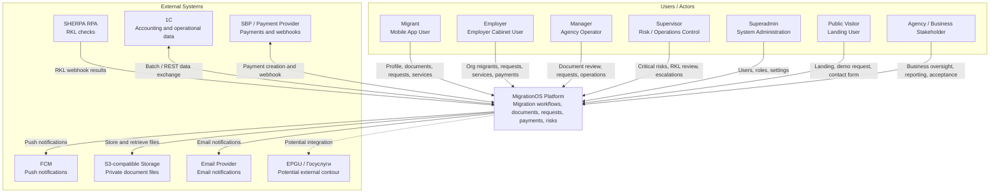

# C4 Context — MigrationOS

## 1. Назначение документа

Документ описывает C4 Context Diagram для MigrationOS.

C4 Context нужен, чтобы:

- показать MigrationOS как единую систему в окружении пользователей и внешних систем;
- зафиксировать системные границы;
- показать основных акторов и их взаимодействие с платформой;
- показать внешние интеграции на контекстном уровне;
- объяснить доверенные и недоверенные контуры;
- подготовить основу для C4 Container Diagram.

---

## 2. Уровень диаграммы

C4 Context — это самый верхний уровень архитектурного описания.

На этом уровне MigrationOS рассматривается как единая система.

Документ не детализирует:

- внутренние микросервисы;
- контейнеры и runtime-компоненты;
- PostgreSQL, Redis и внутренние хранилища;
- внутренние API между сервисами;
- deployment в Docker/Kubernetes.

Эти детали раскрываются в следующих артефактах:

- `c4-container.md`;
- `deployment-context.md`;
- `sequence diagrams`;
- [Architecture Overview](./architecture-overview.md).

---

## 3. Системная граница

На уровне C4 Context MigrationOS представлена как единый продукт:

`MigrationOS Platform`

Внутри этой системной границы находятся:

- мобильное приложение мигранта;
- web-кабинет работодателя;
- административная панель агентства;
- публичный landing;
- backend API;
- доменная бизнес-логика;
- хранение данных и файлов;
- интеграционные адаптеры;
- уведомления;
- аудит и журналирование.

На данном уровне все перечисленное не разбивается на отдельные контейнеры и сервисы.

---

## 4. Основные акторы

| Актор | Описание | Основные цели |
|---|---|---|
| `Migrant` | Иностранный работник, использующий mobile app | Войти, заполнить профиль, загрузить документы, получить уведомления, создать запрос, заказать услугу |
| `Employer` | Представитель компании-работодателя | Видеть своих мигрантов, риски, документы, запросы, услуги и платежи |
| `Manager` | Операционный сотрудник агентства | Проверять документы, обрабатывать запросы, работать с мигрантами |
| `Supervisor` | Старшая внутренняя роль агентства | Контролировать critical risk, RKL matched/unmatched, эскалации и отчеты |
| `Superadmin` | Администратор системы | Управлять пользователями, ролями, настройками и доступами |
| `Public Visitor` | Посетитель landing | Узнать о продукте, оставить заявку, перейти к регистрации или приложению |
| `Agency / Business Stakeholder` | Представитель бизнеса или агентства | Получать прозрачность процессов, контролировать готовность и результаты |

### 4.1. Группы акторов

| Группа | Кто входит | Контекст доверия |
|---|---|---|
| Внешние пользовательские роли | `Migrant`, `Employer`, `Public Visitor` | Находятся вне доверенной серверной границы |
| Внутренние роли | `Manager`, `Supervisor`, `Superadmin` | Используют внутренний административный контур, но все равно не считаются источником истины |
| Бизнес-стейкхолдеры | `Agency / Business Stakeholder` | Потребляют результаты и прозрачность процессов, не обязательно выполняют операционные действия напрямую |

---

## 5. Внешние системы

| Внешняя система | Тип | Назначение взаимодействия |
|---|---|---|
| `SHERPA RPA` | External integration | Передает результаты РКЛ-проверок |
| `1C` | External business system | Передает или получает учетные и операционные данные |
| `SBP / Payment Provider` | External payment system | Создает платежные сценарии и отправляет payment webhook |
| `FCM` | External notification service | Доставляет push-уведомления на устройства |
| `S3-compatible Storage` | External/object storage | Хранит binary-файлы документов и вложений |
| `Email Provider` | External notification service | Отправляет email-уведомления |
| `EPGU / Госуслуги` | Potential external system | Потенциальная интеграция с государственными сервисами |

### 5.1. Что не входит в контекстную диаграмму как отдельная внешняя система

На уровне C4 Context не выделяются как отдельные внешние участники:

- PostgreSQL;
- Redis;
- Kubernetes;
- API Gateway / Kong;
- monitoring internals.

Они относятся к внутренней архитектуре или deployment-уровню и раскрываются в последующих архитектурных артефактах.

---

## 6. Основные взаимодействия

| Источник | Получатель | Взаимодействие |
|---|---|---|
| `Migrant` | `MigrationOS Platform` | Вход по OTP, профиль, документы, запросы, услуги, платежи, push/deep links |
| `Employer` | `MigrationOS Platform` | Регистрация, dashboard, мигранты организации, запросы, услуги, платежи |
| `Manager` | `MigrationOS Platform` | Проверка документов, обработка запросов, операционные действия |
| `Supervisor` | `MigrationOS Platform` | Контроль рисков, RKL matched/unmatched, эскалации |
| `Superadmin` | `MigrationOS Platform` | Управление ролями, пользователями и настройками |
| `Public Visitor` | `MigrationOS Platform` | Просмотр landing, demo request, contact form |
| `Agency / Business Stakeholder` | `MigrationOS Platform` | Контроль готовности, прозрачности и результатов процессов |
| `SHERPA RPA` | `MigrationOS Platform` | Передача результатов РКЛ через webhook |
| `MigrationOS Platform` | `1C` | Обмен данными по мигрантам, работодателям, операциям и batch-сценариям |
| `MigrationOS Platform` | `SBP / Payment Provider` | Создание платежа и получение payment webhook |
| `MigrationOS Platform` | `FCM` | Отправка push-уведомлений |
| `MigrationOS Platform` | `S3-compatible Storage` | Хранение и получение private files |
| `MigrationOS Platform` | `Email Provider` | Отправка email-уведомлений |
| `MigrationOS Platform` | `EPGU / Госуслуги` | Потенциальный внешний обмен в государственных сценариях |

---

## 7. Trust boundaries

| Boundary | Что внутри | Что снаружи | Основное правило |
|---|---|---|---|
| User boundary | UI-сессии пользователей и их действия | Устройства и браузеры конечных пользователей | Клиент не является источником истины |
| Internal operations boundary | Внутренние роли агентства и admin use cases | Внешние роли и публичный контур | Критичные действия требуют RBAC, 2FA и audit |
| Platform boundary | MigrationOS как единая система | Пользователи и все внешние системы | Все проверки прав и доменные решения принимаются внутри платформы |
| Integration boundary | Прием и отправка внешних событий | SHERPA, 1C, SBP, FCM, S3, Email, EPGU | Внешние события валидируются и считаются недоверенными до проверки |
| File boundary | Private document files и контролируемый доступ к ним | Пользователи и внешние системы | Файлы не должны быть публичными |

### 7.1. Доверенные и недоверенные контуры

| Контур | Уровень доверия | Комментарий |
|---|---|---|
| Внутренний backend-контур MigrationOS | Высокий | Источник бизнес-правил и проверок доступа |
| Пользовательские клиентские приложения | Ограниченный | UI доверяется как транспорт и интерфейс, но не как decision maker |
| Внешние webhook и batch-источники | Низкий до валидации | Нужны trust policy, idempotency и safe handling |
| External storage / delivery services | Ограниченный | Используются как инфраструктурные внешние системы, но не определяют доступы и статусы |

---

## 8. Ключевые потоки данных

| Поток | Описание | Чувствительность |
|---|---|---|
| `Profile Data` | Данные мигранта, работодателя и пользователей | High |
| `Document Metadata` | Тип, статус, срок, версия документа | High |
| `Document Binary Files` | Фото/PDF документов | Critical |
| `Payment Data` | Payment status, providerPaymentId, amount | High |
| `RKL Result` | Результат проверки и risk impact | Critical |
| `Notification Payload` | Push / in-app / email уведомления | Medium / High |
| `Integration Logs` | Технические события интеграций | High |
| `Audit Logs` | Критичные действия пользователей | High |
| `Public Lead Data` | Данные формы demo/contact | Medium / High |

### 8.1. Контекстные потоки данных

| Поток | Откуда | Куда | Примечание |
|---|---|---|---|
| OTP/login flow | Пользователь | MigrationOS Platform | Аутентификация и создание сессии |
| Document upload flow | Migrant / Employer / Internal user | MigrationOS Platform → Storage contour | Платформа контролирует доступ и metadata |
| Payment flow | Пользователь / Employer | MigrationOS Platform ↔ Payment Provider | Финальное подтверждение приходит только по webhook |
| RKL flow | SHERPA RPA | MigrationOS Platform | Результат влияет на risk context |
| Notification flow | MigrationOS Platform | FCM / Email Provider | Внешние каналы доставки не определяют бизнес-смысл события |
| 1C batch flow | 1C | MigrationOS Platform | Возможны `duplicate`, `unmatched`, `partial_success` сценарии |

---

## 9. Security and privacy notes

| Область | Контекстное требование |
|---|---|
| Auth | Migrant использует OTP, internal users используют login + 2FA |
| RBAC | Доступ зависит от роли и scope |
| Object-level access | Пользователь не может открыть чужую сущность по прямой ссылке |
| Files | S3 object не публичный, доступ через backend и контролируемый URL |
| Webhooks | Проверка подписи/API key/IP allowlist и idempotency |
| Payments | Оплата подтверждается только webhook от provider |
| RKL | Matched-событие должно приводить к risk escalation |
| Logs | Secrets, tokens, signatures и presigned URL не раскрываются |
| PII | ПДн не должны попадать в unsafe payload, push и публичные ошибки |

### 9.1. Контекстные privacy-акценты

- MigrationOS обрабатывает ПДн и документные файлы, поэтому любые пользовательские и интеграционные контуры считаются чувствительными.
- Public landing работает в отдельном публичном контуре и должен собирать только минимально необходимые данные.
- Внешние каналы доставки уведомлений и файлов не должны становиться источником утечки данных из-за неправильной конфигурации или payload.

---

## 10. Mermaid C4-style context diagram

---

## 11. Context relationships

| ID | Relationship | Тип взаимодействия | Ключевой смысл |
|---|---|---|---|
| `CTX-REL-001` | `Migrant → MigrationOS` | User interaction | Самообслуживание мигранта через mobile app |
| `CTX-REL-002` | `Employer → MigrationOS` | User interaction | Контроль мигрантов организации и сервисных операций |
| `CTX-REL-003` | `Manager / Supervisor / Superadmin → MigrationOS` | Internal operations | Управление операционными процессами и доступами |
| `CTX-REL-004` | `Public Visitor → MigrationOS` | Public interaction | Публичный вход в продукт через landing |
| `CTX-REL-005` | `SHERPA RPA → MigrationOS` | Inbound integration | Передача РКЛ-результатов |
| `CTX-REL-006` | `MigrationOS ↔ 1C` | Business integration | Обмен учетными и операционными данными |
| `CTX-REL-007` | `MigrationOS ↔ SBP` | Financial integration | Платежные сценарии и webhook-подтверждение оплаты |
| `CTX-REL-008` | `MigrationOS → FCM / Email` | Delivery integration | Отправка уведомлений |
| `CTX-REL-009` | `MigrationOS ↔ S3-compatible Storage` | File integration | Хранение binary-файлов документов |
| `CTX-REL-010` | `MigrationOS ↔ EPGU` | Potential external integration | Перспективный государственный обмен |

---

## 12. Контекстные архитектурные решения

| ID | Решение | Обоснование |
|---|---|---|
| `C4C-ADR-001` | Показывать MigrationOS как единую систему на context-уровне | Детализация сервисов будет на container-уровне |
| `C4C-ADR-002` | Разделить пользователей на внешние и внутренние роли | Это важно для RBAC, trust boundaries и UX-сценариев |
| `C4C-ADR-003` | Отдельно показать SHERPA RPA, SBP, 1C, FCM и S3 | Эти системы критичны для бизнес-процессов |
| `C4C-ADR-004` | Выделить S3 как внешний storage-контур | Binary-файлы документов требуют отдельной security-модели |
| `C4C-ADR-005` | Отдельно указать EPGU как потенциальный внешний контур | Интеграция еще не является обязательной частью MVP |

---

## 13. Контекстные риски

| Риск | Возможное последствие | Митигирующая мера |
|---|---|---|
| Внешний пользователь получает чужие данные | Утечка ПДн | Backend permissions, object-level access, tests |
| Webhook от внешней системы подделан | Некорректные платежи или РКЛ-события | Trust policy, signatures, API keys, IP allowlist |
| Payment provider webhook задержался | Пользователь видит ожидание оплаты | Pending state, IntegrationLog, retry |
| S3 object доступен публично | Утечка документов | Private storage, controlled URL, access checks |
| RKL matched не попал supervisor | Пропущенный critical risk | Alerts, queues, IntegrationLog |
| 1C batch содержит ошибки | Некорректные данные | Validation, `partial_success`, unmatched handling |
| Push содержит лишние ПДн | Privacy incident | Safe payload rules |
| Public landing forms спамятся | Нагрузка и мусорные лиды | Rate limiting, anti-spam, validation |

---

## 14. Связанные артефакты

- [Architecture Overview](./architecture-overview.md)
- [Project Scope](../00_project-overview/project-scope.md)
- [Stakeholders](../00_project-overview/stakeholders.md)
- [Integrations Overview](../06_integrations/integrations-overview.md)
- [Permissions](../02_roles-and-access/permissions.md)
- [Non-functional Requirements](../01_requirements/non-functional-requirements.md)
- [C4 Container](./c4-container.md)
