# Deployment Context — MigrationOS

## 1. Назначение документа

Документ описывает deployment context для MigrationOS.

Deployment Context нужен, чтобы:

- показать, где и как разворачиваются основные компоненты системы;
- описать окружения разработки, тестирования, приемки и production;
- зафиксировать runtime-зависимости;
- показать сетевые зоны и внешние интеграции;
- описать базовые подходы к конфигурации, секретам, мониторингу и rollback;
- связать архитектуру продукта с эксплуатационными требованиями.

---

## 2. Уровень описания

Документ не является DevOps-инструкцией и не содержит Kubernetes manifests.

Здесь описываются:

- окружения;
- deployment units;
- инфраструктурные компоненты;
- сетевые границы;
- observability;
- secrets и configuration;
- backup и restore;
- release и rollback;
- эксплуатационные риски.

---

## 3. Предполагаемая инфраструктура

MigrationOS может быть развернута в облачной инфраструктуре:

- Yandex Cloud;
- VK Cloud;
- другой Kubernetes-compatible cloud provider.

Основной runtime-подход:

| Компонент | Подход |
|---|---|
| Backend services | Docker containers в Kubernetes |
| Web frontends | Static build / containerized frontend delivery |
| Mobile app | App Store / Google Play / enterprise distribution |
| API Gateway | Kong / managed gateway / ingress layer |
| PostgreSQL | Managed DB или stateful deployment |
| Redis | Managed Redis или stateful deployment |
| S3-compatible storage | Managed object storage |
| Monitoring | Prometheus + Grafana |
| Logs | Centralized logging stack |
| CI/CD | GitHub Actions / GitLab CI / cloud pipeline |

---

## 4. Окружения

| Окружение | Назначение | Особенности |
|---|---|---|
| `local/dev` | Локальная разработка и быстрые проверки | Docker Compose, mock integrations, локальные данные |
| `test` | QA-проверки и регресс | Тестовые данные, sandbox/stub интеграции |
| `stage / UAT` | Приемка и демонстрации бизнесу | Максимально близко к production, контролируемые тестовые данные |
| `production` | Реальная эксплуатация | Production secrets, monitoring, backups, alerts, SLA |

### 4.1. Принципы окружений

| ID | Принцип |
|---|---|
| `DEP-ENV-001` | Production-данные не используются в `dev/test` без обезличивания |
| `DEP-ENV-002` | `Stage` должен быть максимально близок к production по конфигурации |
| `DEP-ENV-003` | Внешние интеграции в `test/stage` работают через sandbox или stubs |
| `DEP-ENV-004` | Secrets разделяются по окружениям |
| `DEP-ENV-005` | Миграции БД проходят через controlled release process |

---

## 5. Deployment units

| Unit | Что разворачивается | Где работает |
|---|---|---|
| `Migrant Mobile App` | Mobile build | Устройства пользователей |
| `Employer Cabinet` | Web frontend | CDN / frontend hosting / Kubernetes |
| `Admin Panel` | Web frontend | Internal web hosting / Kubernetes |
| `Landing` | Next.js app / static build | Public web hosting / Kubernetes |
| `API Gateway / Kong` | Gateway / ingress | Kubernetes edge layer |
| `Auth Service` | FastAPI service | Kubernetes |
| `User Service` | FastAPI service | Kubernetes |
| `Document Service` | FastAPI service | Kubernetes |
| `File Service` | FastAPI service | Kubernetes |
| `Request Service` | FastAPI service | Kubernetes |
| `Marketplace Service` | FastAPI service | Kubernetes |
| `Payment Service` | FastAPI service | Kubernetes |
| `RKL Service` | FastAPI service | Kubernetes |
| `Analytics / Risk Service` | FastAPI service | Kubernetes |
| `Notification Service` | FastAPI service | Kubernetes |
| `Chat Service` | FastAPI service | Kubernetes |
| `Integration Service` | FastAPI service / workers | Kubernetes |
| `Audit Service` | FastAPI service | Kubernetes |
| `PostgreSQL` | Relational database | Managed DB / private subnet |
| `Redis` | Cache / session / rate limits | Managed Redis / private subnet |
| `S3-compatible Storage` | Object storage | Cloud object storage |
| `Prometheus / Grafana` | Monitoring stack | Kubernetes / managed monitoring |

---

## 6. Runtime dependencies

| Компонент | Зависимости |
|---|---|
| Frontend apps | API Gateway, auth endpoints, static assets |
| API Gateway | Backend services, routing config, TLS certificates |
| `Auth Service` | PostgreSQL, Redis, notification channel for OTP |
| `User Service` | PostgreSQL |
| `Document Service` | PostgreSQL, `File Service` |
| `File Service` | PostgreSQL, S3-compatible storage |
| `Request Service` | PostgreSQL, `Notification Service` |
| `Marketplace Service` | PostgreSQL, `Payment Service` |
| `Payment Service` | PostgreSQL, SBP / payment provider, `IntegrationLog` |
| `RKL Service` | PostgreSQL, SHERPA RPA webhook, `Risk Service`, `IntegrationLog` |
| `Analytics / Risk Service` | PostgreSQL, Redis / cache |
| `Notification Service` | PostgreSQL, FCM, Email Provider |
| `Integration Service` | PostgreSQL, Redis, 1C, EPGU potential |
| `Audit Service` | PostgreSQL |
| Observability | Metrics endpoints, logs, traces |

---

## 7. Network zones

| Zone | Компоненты | Доступ |
|---|---|---|
| `Public zone` | Landing, public endpoints, API Gateway public routes | Internet |
| `Client zone` | Mobile app, employer browser, public users | Internet, untrusted |
| `Internal user zone` | Admin panel users | Restricted access, 2FA |
| `Application zone` | Backend services | Private network |
| `Data zone` | PostgreSQL, Redis | Private network only |
| `Storage zone` | S3-compatible storage | Private bucket / controlled access |
| `Integration zone` | Webhook endpoints, outbound adapters | Restricted by API key, signature, IP allowlist |
| `Observability zone` | Logs, metrics, dashboards | Internal/support access |

### 7.1. Смысл сетевого разделения

| Зона | Основное назначение |
|---|---|
| `Public zone` | Минимальный публичный ingress с защитой на edge-уровне |
| `Application zone` | Выполнение бизнес-логики без прямого внешнего доступа |
| `Data zone` | Защита stateful-компонентов и ограничение lateral access |
| `Observability zone` | Отдельный доступ для эксплуатации, расследований и мониторинга |

---

## 8. Networking and access

| Область | Правило |
|---|---|
| TLS | Все внешние соединения работают по HTTPS |
| API Gateway | Единственная публичная точка входа для API |
| Backend services | Не доступны напрямую из интернета |
| PostgreSQL / Redis | Доступны только из `application zone` |
| S3 files | Bucket private, доступ через backend-controlled presigned URL |
| Webhooks | Отдельные endpoint с trust policy |
| Admin panel | 2FA, RBAC, restricted access |
| Monitoring | Не публикуется в интернет без защиты |

---

## 9. Secrets and configuration

| Тип секрета / настройки | Где используется | Правило |
|---|---|---|
| JWT signing key | `Auth Service` | Хранить в secret storage |
| OTP provider credentials | Auth / Notification | Не хранить в коде |
| DB credentials | Backend services | Раздельно по окружениям |
| Redis credentials | Backend services | Раздельно по окружениям |
| S3 access keys | `File Service` | Ротация и least privilege |
| Payment provider keys | `Payment Service` | Отдельные sandbox / prod keys |
| Webhook signing secrets | Payment / RKL / Integration | Проверка подписи |
| FCM credentials | `Notification Service` | Secret storage |
| Email credentials | `Notification Service` | Secret storage |
| API keys for integrations | Gateway / `Integration Service` | Rotation, audit |

### 9.1. Config principles

| ID | Принцип |
|---|---|
| `DEP-CFG-001` | Config отделен от кода |
| `DEP-CFG-002` | Secrets не попадают в Git |
| `DEP-CFG-003` | Для каждого окружения используются отдельные credentials |
| `DEP-CFG-004` | Production secrets имеют ограниченный доступ |
| `DEP-CFG-005` | Ротация ключей должна быть возможна без изменения бизнес-логики |

---

## 10. Health checks and readiness

| Компонент | Проверка |
|---|---|
| API Gateway | routes available, upstream health |
| Backend service | `/health`, DB connectivity, dependency readiness |
| `Auth Service` | PostgreSQL + Redis connection |
| `File Service` | PostgreSQL + S3 availability |
| `Payment Service` | DB + provider config readiness |
| `RKL Service` | DB + webhook config readiness |
| `Notification Service` | DB + FCM / email config |
| `Integration Service` | DB + queue / retry state |
| PostgreSQL | connection, replication / backup status if available |
| Redis | connection, memory state |
| S3 | bucket access and object operation test |
| Observability | metrics scrape and alert delivery |

---

## 11. Logs, metrics and alerts

| Область | Что отслеживать |
|---|---|
| API Gateway | latency, request rate, 4xx/5xx, blocked requests |
| Auth | failed OTP, lockouts, 2FA failures |
| Payment | webhook failures, duplicate, amount mismatch, processing latency |
| RKL | matched/unmatched, failed validation, no data alerts |
| S3 / File | upload/download failures, forbidden attempts, expired URLs |
| 1C | batch status, `partial_success`, `validation_error` |
| FCM | invalid tokens, failed delivery, retry |
| PostgreSQL | slow queries, locks, storage, connection pool |
| Redis | memory, evictions, key TTL issues |
| Kubernetes | pod restarts, CPU/memory, readiness failures |
| Security | access denied spikes, suspicious webhook attempts |

### 11.1. Critical alerts

| Alert | Условие | Получатель |
|---|---|---|
| `PAYMENT_WEBHOOK_FAILED_SPIKE` | Рост failed payment webhook | Backend / Finance |
| `RKL_NO_DATA` | Нет данных РКЛ к контрольному времени | Supervisor / Support |
| `S3_ACCESS_FAILURE` | Рост ошибок S3 upload/download | Backend / DevOps |
| `FORBIDDEN_SPIKE` | Аномальный рост forbidden errors | Security / Backend |
| `FCM_FAILED_SPIKE` | Рост failed push | Backend / Mobile |
| `DB_SLOW_QUERY_SPIKE` | Рост slow queries | Backend / DBA |
| `INTEGRATION_RETRY_BACKLOG` | Очередь retry растет | Backend / Support |

---

## 12. Backup and restore

| Компонент | Backup strategy | Restore notes |
|---|---|---|
| PostgreSQL | Regular backups + point-in-time recovery if available | Restore проверяется на `test/stage` |
| S3-compatible storage | Versioning / lifecycle / replication if available | Проверять доступность файлов после restore |
| Redis | Обычно не primary source of truth | Restore не должен быть критичным для бизнес-данных |
| Config / secrets | Versioned config без секретных значений + secret storage backup | Восстановление через controlled access |
| Logs | Retention policy | Важно для расследований |
| `IntegrationLog` / `AuditLog` | Хранятся в PostgreSQL | Должны входить в backup как критичные журналы |

### 12.1. Принципы восстановления

| ID | Принцип |
|---|---|
| `DEP-BACKUP-001` | Backup без проверки restore недостаточен |
| `DEP-BACKUP-002` | Восстановление журналов важно для расследования инцидентов |
| `DEP-BACKUP-003` | Stateful storage должно иметь documented restore path |

---

## 13. Release process

| Шаг | Описание |
|---|---|
| 1 | Merge изменений в основную ветку после review |
| 2 | CI запускает lint / tests / build |
| 3 | Собираются Docker images |
| 4 | Images публикуются в registry |
| 5 | Deploy в `test` |
| 6 | Smoke + regression checks |
| 7 | Deploy в `stage / UAT` |
| 8 | Acceptance testing |
| 9 | Go / No-Go decision |
| 10 | Deploy в `production` |
| 11 | Post-release monitoring |

---

## 14. Rollback strategy

| Сценарий | Rollback approach |
|---|---|
| Ошибка frontend | Вернуть предыдущий build |
| Ошибка backend service | Откатить deployment image |
| Ошибка API contract | Откатить service или включить compatibility mode |
| Ошибка DB migration | Использовать backward-compatible migrations или restore plan |
| Ошибка payment webhook | Остановить rollout, сохранить events, обработать вручную |
| Ошибка RKL processing | Остановить processing, сохранить inbound events, manual review |
| Ошибка S3 access | Откатить `File Service` config, проверить bucket policy |
| Ошибка config / secrets | Вернуть предыдущую версию secret / config |

### 14.1. Rollback principles

| ID | Принцип |
|---|---|
| `DEP-RB-001` | Rollback должен быть быстрее, чем полноценный hotfix |
| `DEP-RB-002` | DB migrations должны проектироваться backward-compatible |
| `DEP-RB-003` | Webhook events не должны теряться при rollback |
| `DEP-RB-004` | Payment / RKL incidents требуют отдельного incident handling |
| `DEP-RB-005` | После rollback нужен post-incident review |

---

## 15. Scaling strategy

| Компонент | Scaling approach |
|---|---|
| API Gateway | Horizontal scaling |
| Stateless backend services | Horizontal pod autoscaling |
| `Auth Service` | Scale with Redis-backed rate limiting |
| `Payment Service` | Scale carefully with idempotency |
| `RKL Service` | Scale with duplicate-safe webhook handling |
| Integration workers | Scale by queue / backlog |
| Notification workers | Scale by delivery queue |
| PostgreSQL | Indexing, connection pooling, read optimization |
| Redis | Managed scaling / memory monitoring |
| S3 | Managed object storage scaling |

---

## 16. Incident handling

| Incident | Первое действие |
|---|---|
| Payment webhook failures | Проверить provider status, `IntegrationLog`, signature validation |
| RKL data missing | Проверить SHERPA webhook, `IntegrationLog`, scheduler/control time |
| S3 upload failures | Проверить bucket policy, credentials, `File Service` logs |
| Data leak suspicion | Остановить affected access path, собрать `AuditLog` / `IntegrationLog` |
| High 5xx rate | Проверить API Gateway, service health, DB / Redis |
| DB performance degradation | Проверить slow queries, indexes, locks, connection pool |
| Push failures | Проверить FCM credentials, invalid tokens, retry queue |
| 1C batch issues | Проверить batch summary, validation errors, duplicate/unmatched |

---

## 17. Mermaid deployment diagram

```mermaid
flowchart TD
    subgraph Internet["Internet / Users"]
        Mobile["Migrant Mobile App"]
        Employer["Employer Browser"]
        AdminUser["Internal Admin User"]
        Visitor["Public Visitor"]
        ExternalWebhook["External Webhooks<br/>SBP / SHERPA"]
    end

    subgraph Cloud["Yandex Cloud / VK Cloud"]
        subgraph Edge["Public Edge Zone"]
            LB["Load Balancer / Ingress"]
            Gateway["API Gateway / Kong"]
            Landing["Landing / Frontend Hosting"]
        end

        subgraph AppZone["Application Zone / Kubernetes"]
            Auth["Auth Service"]
            User["User Service"]
            Document["Document Service"]
            File["File Service"]
            Request["Request Service"]
            Marketplace["Marketplace Service"]
            Payment["Payment Service"]
            RKL["RKL Service"]
            Risk["Analytics / Risk Service"]
            Notification["Notification Service"]
            Chat["Chat Service"]
            Integration["Integration Service / Workers"]
            Audit["Audit Service"]
        end

        subgraph DataZone["Data Zone"]
            PG["PostgreSQL"]
            Redis["Redis"]
        end

        subgraph StorageZone["Object Storage"]
            S3["S3-compatible Storage"]
        end

        subgraph Obs["Observability"]
            Prom["Prometheus"]
            Graf["Grafana"]
            Logs["Centralized Logs"]
            Alerts["Alerts"]
        end
    end

    subgraph External["External Systems"]
        SBP["SBP / Payment Provider"]
        Sherpa["SHERPA RPA"]
        OneC["1C"]
        FCM["FCM"]
        Email["Email Provider"]
        EPGU["EPGU / Госуслуги"]
    end

    Mobile --> LB
    Employer --> LB
    AdminUser --> LB
    Visitor --> Landing
    ExternalWebhook --> LB

    LB --> Gateway
    Gateway --> Auth
    Gateway --> User
    Gateway --> Document
    Gateway --> File
    Gateway --> Request
    Gateway --> Marketplace
    Gateway --> Payment
    Gateway --> RKL
    Gateway --> Risk
    Gateway --> Notification
    Gateway --> Chat
    Gateway --> Integration
    Gateway --> Audit

    Landing --> Gateway

    Auth --> PG
    User --> PG
    Document --> PG
    File --> PG
    Request --> PG
    Marketplace --> PG
    Payment --> PG
    RKL --> PG
    Risk --> PG
    Notification --> PG
    Chat --> PG
    Integration --> PG
    Audit --> PG

    Auth --> Redis
    Risk --> Redis
    Integration --> Redis

    File --> S3

    Payment --> SBP
    Sherpa --> LB
    Integration --> OneC
    Notification --> FCM
    Notification --> Email
    Integration -.-> EPGU

    Auth --> Prom
    Payment --> Prom
    RKL --> Prom
    Integration --> Prom
    Prom --> Graf
    Prom --> Alerts
    Auth --> Logs
    Payment --> Logs
    Integration --> Logs
```

---

## 18. Deployment risks

| Риск | Последствие | Митигирующее действие |
|---|---|---|
| Secrets попали в Git | Security incident | Secret storage, secret scanning, rotation |
| Stage отличается от production | Ошибки проявятся только в production | Environment parity |
| DB migration ломает backward compatibility | Ошибка релиза | Backward-compatible migrations, rollback plan |
| Webhook events теряются при deploy | Финансовые/комплаенс-риски | Persistent logs, queues, idempotency |
| S3 bucket стал публичным | Утечка ПДн | Private bucket policy, audits |
| Monitoring не настроен | Позднее обнаружение инцидентов | Alerts, dashboards, on-call rules |
| Redis используется как source of truth | Потеря данных | TTL-only и no critical business state |
| Нет restore-проверок | Backup может оказаться бесполезным | Regular restore drills |

---

## 19. Связанные артефакты

- [Architecture Overview](./architecture-overview.md)
- [C4 Context](./c4-context.md)
- [C4 Container](./c4-container.md)
- [Sequence Diagrams](./sequence-diagrams.md)
- [Non-functional Requirements](../01_requirements/non-functional-requirements.md)
- [Integrations Overview](../06_integrations/integrations-overview.md)
- [Test Strategy](../08_testing/test-strategy.md)
- [Acceptance Testing](../08_testing/acceptance-testing.md)
