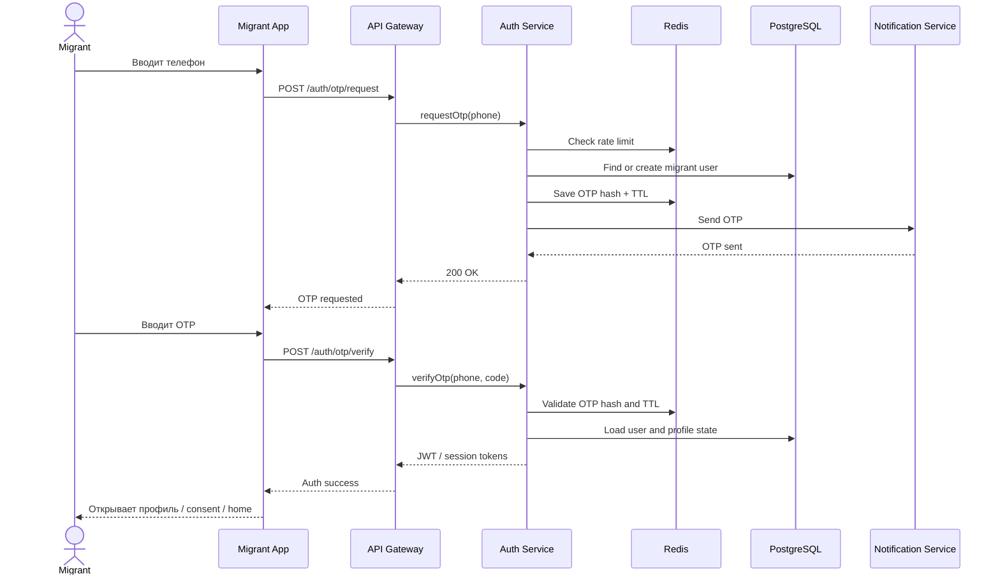
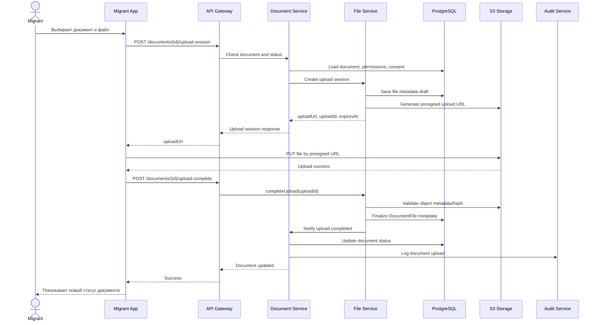
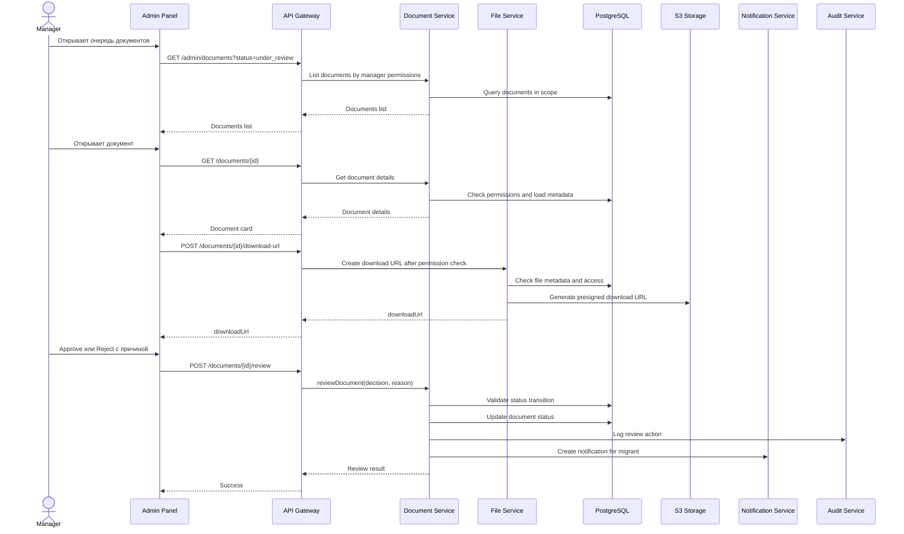
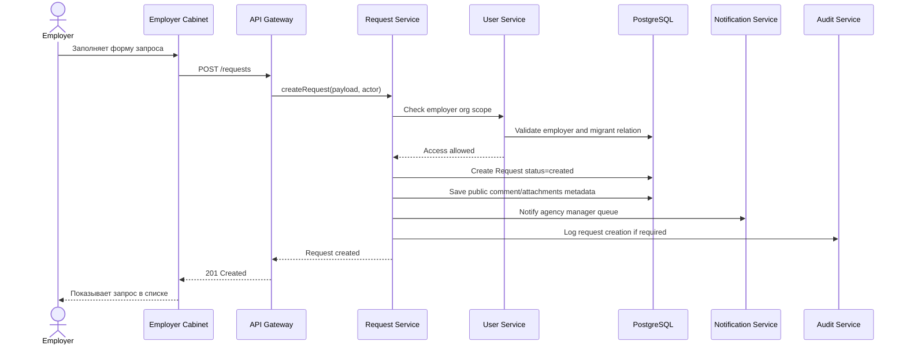
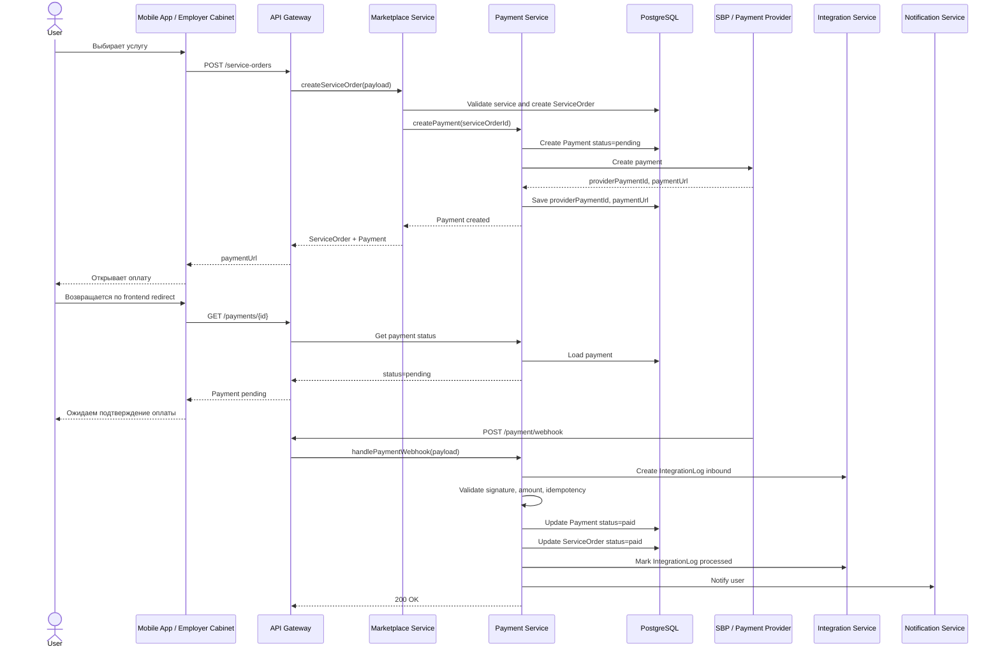
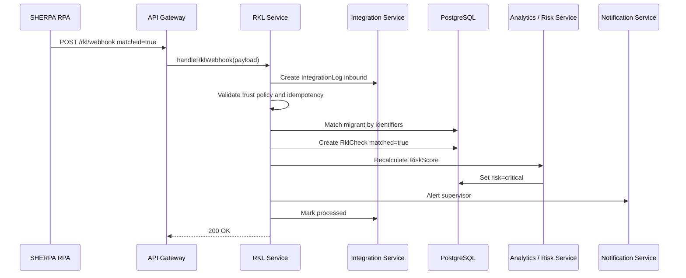
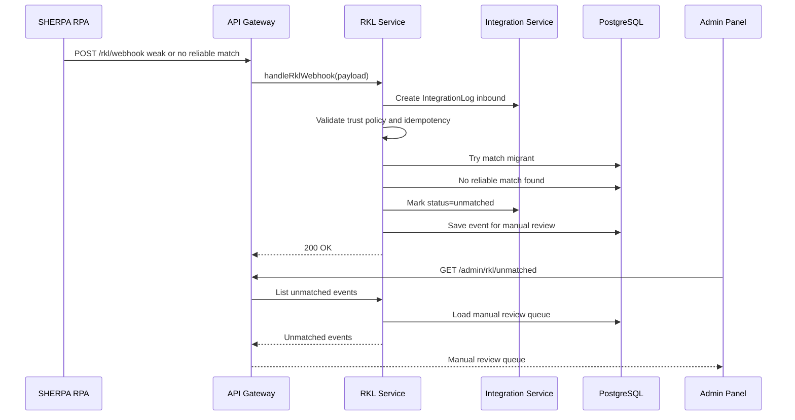
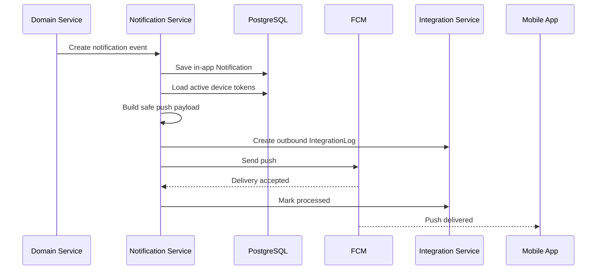
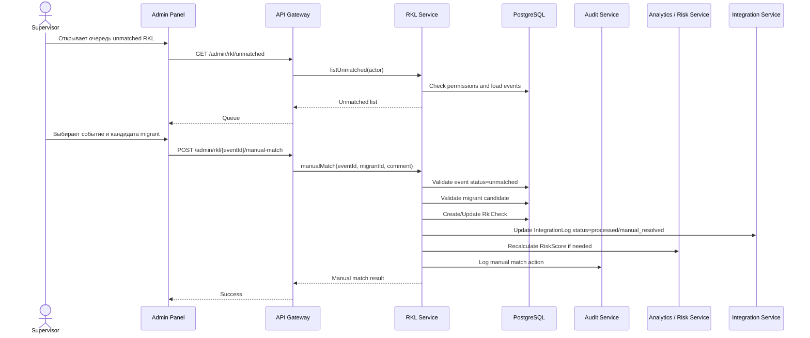

# Sequence Diagrams — MigrationOS

## 1. Назначение документа

Документ описывает ключевые sequence diagrams для MigrationOS.

Sequence Diagrams нужны, чтобы:

- показать порядок взаимодействия между участниками и системными компонентами;
- зафиксировать сквозные `backend/frontend/integration` flows;
- показать, где применяются permissions, status transitions и валидации;
- показать создание `IntegrationLog` и `AuditLog`;
- объяснить асинхронные сценарии: webhooks, push, retry, manual review;
- подготовить основу для разработки, тестирования и обсуждения архитектуры.

---

## 2. Общие обозначения

| Участник | Значение |
|---|---|
| `User` | Пользователь системы |
| `Frontend` | Mobile app, employer cabinet, admin panel или landing |
| `API Gateway` | Единая точка входа |
| `Backend Service` | Доменный сервис FastAPI |
| `PostgreSQL` | Основное хранилище бизнес-данных |
| `Redis` | Временное состояние, OTP, rate limit, cache |
| `S3` | Object storage для файлов |
| `External System` | SHERPA RPA, SBP, FCM, 1C и другие системы |
| `IntegrationLog` | Журнал интеграционных событий |
| `AuditLog` | Журнал критичных действий пользователей |

---

## 3. Общие правила для sequence flows

| ID | Правило |
|---|---|
| `SEQ-GEN-001` | Frontend не принимает финальные решения по доступам |
| `SEQ-GEN-002` | Backend проверяет permissions и status transitions |
| `SEQ-GEN-003` | S3 хранит файлы, но не решает, кто имеет к ним доступ |
| `SEQ-GEN-004` | Оплата подтверждается только payment webhook, а не frontend redirect |
| `SEQ-GEN-005` | Входящие интеграционные события логируются в `IntegrationLog` |
| `SEQ-GEN-006` | Критичные ручные действия логируются в `AuditLog` |
| `SEQ-GEN-007` | Duplicate webhook не должен создавать повторный бизнес-эффект |
| `SEQ-GEN-008` | Unmatched события не должны автоматически связываться со слабым кандидатом |

---

## 4. OTP-вход мигранта

### 4.1. Цель

Мигрант должен войти в mobile app по номеру телефона и OTP-коду.

### 4.2. Участники

| Участник | Роль |
|---|---|
| `Migrant` | Вводит телефон и OTP |
| `Migrant App` | Отображает login flow |
| `API Gateway` | Маршрутизирует запросы |
| `Auth Service` | Создает и проверяет OTP |
| `Redis` | Хранит OTP state и rate limits |
| `PostgreSQL` | Хранит пользователя и профиль |
| `Notification Service` | Отправляет OTP, если используется отдельный канал |

### 4.3. Happy path

### 4.4. Alternative / error flow

| Ошибка | Поведение |
|---|---|
| OTP истек | `Auth Service` возвращает safe validation error |
| OTP неверный | Попытка отклоняется, счетчик попыток увеличивается |
| Превышен лимит | Возвращается rate limit / lockout |
| Пользователь заблокирован | Вход запрещен |
| Redis недоступен | Controlled error, сессия не создается |

### 4.5. Связанные сущности и логи

| Элемент | Назначение |
|---|---|
| `User` | Пользователь мигранта |
| `MigrantProfile` | Профиль мигранта |
| `OTP state` | Временное состояние в Redis |
| `AuditLog` | Может фиксировать security-significant попытки входа |
| `ErrorResponse` | Единая модель ошибок |

---

## 5. Загрузка документа через S3 / presigned URL

### 5.1. Цель

Мигрант должен загрузить документ безопасно, при этом binary-файл хранится в S3, а metadata — в PostgreSQL.

### 5.2. Важное архитектурное правило

S3 не принимает решение о доступе к файлу.  
Доступ проверяет backend, а S3 только хранит объект и принимает `upload/download` по временной ссылке.

### 5.3. Happy path

### 5.4. Alternative / error flow

| Ошибка | Поведение |
|---|---|
| Нет consent | Backend запрещает upload |
| Нет permission | `403` или safe `404` |
| Неверный MIME type | `422 validation_error` |
| Файл слишком большой | `422 validation_error` |
| Upload session expired | Нужно создать новую upload session |
| S3 timeout | Controlled error + retry |
| Status changed during upload | `409 Conflict` |

### 5.5. Связанные сущности и логи

| Элемент | Назначение |
|---|---|
| `Document` | Бизнес-документ |
| `DocumentFile` | Metadata загруженного файла |
| `storageKey` | Ссылка на объект в S3 без ПДн |
| `AuditLog` | Факт загрузки или критичного изменения |
| `ErrorResponse` | Единая модель ошибок |

---

## 6. Проверка документа manager в admin panel

### 6.1. Цель

Manager должен проверить документ и принять решение: `approve` или `reject`.

### 6.2. Happy path approve / reject

### 6.3. Alternative / error flow

| Ошибка | Поведение |
|---|---|
| Reject без причины | `422 validation_error` |
| Документ уже обработан другим manager | `409 Conflict` |
| Нет доступа к документу | `403` или safe `404` |
| Presigned URL истек | Admin panel запрашивает новый URL |
| Notification Service недоступен | Review не откатывается, уведомление уходит в retry |

### 6.4. Связанные сущности и логи

| Элемент | Назначение |
|---|---|
| `Document` | Проверяемая сущность |
| `DocumentFile` | Файл документа |
| `AuditLog` | Кто и когда изменил статус |
| `Notification` | Уведомление мигранту |
| `Status Model` | Допустимые переходы |

---

## 7. Создание запроса employer → agency

### 7.1. Цель

Работодатель должен создать запрос в агентство по своему мигранту или организации.

### 7.2. Happy path

### 7.3. Alternative / error flow

| Ошибка | Поведение |
|---|---|
| Employer выбирает чужого мигранта | `403` или safe `404` |
| Пустой текст запроса | `422 validation_error` |
| Request Service недоступен | UI показывает retry |
| Attachment upload failed | Запрос не создается или создается без файла по бизнес-правилу |
| Notification failed | Запрос остается созданным, notification уходит в retry |

### 7.4. Связанные сущности и логи

| Элемент | Назначение |
|---|---|
| `Request` | Запрос работодателя |
| `RequestComment` | Публичный или внутренний комментарий |
| `Notification` | Уведомление агентству |
| `AuditLog` | Может фиксировать создание/изменение запроса |
| `Permissions` | Проверка `org` scope |

---

## 8. Заказ услуги и подтверждение оплаты через payment webhook

### 8.1. Цель

Пользователь должен заказать услугу и оплатить ее, а система должна подтвердить оплату только через webhook от payment provider.

### 8.2. Важное правило

Frontend redirect после оплаты не подтверждает оплату.  
Он только возвращает пользователя в интерфейс, где показывается статус `pending`, пока backend не получит валидный webhook.

### 8.3. Happy path

### 8.4. Alternative / error flow

| Ошибка | Поведение |
|---|---|
| Duplicate webhook | `IntegrationLog.status = duplicate`, бизнес-статус повторно не меняется |
| Amount mismatch | Payment не становится `paid`, событие фиксируется как error |
| Invalid signature | Webhook отклоняется |
| Unknown providerPaymentId | Событие получает unmatched / safe error |
| Provider timeout при создании payment | Payment остается failed/pending по бизнес-правилу |
| Notification failed | Payment остается `paid`, notification retry отдельно |

### 8.5. Связанные сущности и логи

| Элемент | Назначение |
|---|---|
| `ServiceOrder` | Заявка на услугу |
| `Payment` | Платеж |
| `IntegrationLog` | Webhook от payment provider |
| `Notification` | Уведомление пользователю |
| `Status Model` | `pending → paid` только по webhook |

---

## 9. RKL webhook от SHERPA RPA: matched / unmatched

### 9.1. Цель

MigrationOS должна принять результат РКЛ-проверки от SHERPA RPA, сопоставить его с мигрантом и обновить risk context.

### 9.2. Happy path: matched

### 9.3. Happy path: unmatched / manual review

### 9.4. Alternative / error flow

| Ошибка | Поведение |
|---|---|
| Invalid trust policy | Webhook отклоняется, бизнес-данные не меняются |
| Duplicate eventId | Новый `RklCheck` не создается |
| Weak match | Нет автоматической связи, только manual review |
| Risk service недоступен | Событие логируется, risk recalculation retry/alert |
| Supervisor notification failed | Critical risk сохраняется, уведомление retry отдельно |

### 9.5. Связанные сущности и логи

| Элемент | Назначение |
|---|---|
| `RklCheck` | Результат РКЛ-проверки |
| `RiskScore` | Риск мигранта |
| `IntegrationLog` | Входящее событие SHERPA RPA |
| `Notification` | Alert supervisor |
| `Manual Review Queue` | Очередь unmatched |

---

## 10. Отправка push через FCM

### 10.1. Цель

MigrationOS должна отправить push-уведомление пользователю без отката основной бизнес-операции при ошибке FCM.

### 10.2. Happy path

### 10.3. Alternative / error flow

| Ошибка | Поведение |
|---|---|
| Invalid device token | Token помечается inactive |
| FCM timeout | Retry, business operation не откатывается |
| Push payload содержит лишние ПДн | Payload должен быть отклонен правилами безопасности |
| Пользователь отключил уведомления | Push не отправляется, in-app может сохраняться |
| Deep link открыт без сессии | Сначала auth, потом переход к разрешенной сущности |

### 10.4. Связанные сущности и логи

| Элемент | Назначение |
|---|---|
| `Notification` | In-app уведомление |
| `DeviceToken` | Устройство пользователя |
| `IntegrationLog` | Outbound FCM event |
| `ErrorResponse` | Ошибки UI/API при открытии deep link |

---

## 11. Ручной разбор unmatched RKL в admin panel

### 11.1. Цель

Manager или supervisor должен вручную разобрать unmatched RKL-событие и сопоставить его с мигрантом только при достаточной уверенности.

### 11.2. Happy path

### 11.3. Alternative / error flow

| Ошибка | Поведение |
|---|---|
| Нет permission на manual review | `403 Forbidden` |
| Event уже разобран | `409 Conflict` |
| Candidate не подходит | Validation error |
| Комментарий обязателен, но пустой | `422 validation_error` |
| Weak match без подтверждения | Действие не выполняется |
| Risk recalculation failed | Manual match сохраняется, risk пересчет уходит в retry/alert по правилу |

### 11.4. Связанные сущности и логи

| Элемент | Назначение |
|---|---|
| `IntegrationLog` | Источник unmatched event |
| `RklCheck` | Результат проверки |
| `RiskScore` | Пересчет риска |
| `AuditLog` | Кто выполнил manual match |
| `Migrant` | Целевая сущность сопоставления |

---

## 12. Сводная таблица sequence diagrams

| Сценарий | Ключевые сервисы | Критичный контроль |
|---|---|---|
| OTP login | Auth, User, Redis | OTP TTL, rate limit, session |
| Document upload | Document, File, S3 | Consent, permissions, upload session |
| Document review | Document, File, Audit, Notification | Status transition, reason, audit |
| Employer request | Request, User, Notification | Org scope, external/internal comments |
| Service order/payment | Marketplace, Payment, Integration | Webhook-only confirmation |
| RKL webhook | RKL, Integration, Risk | Trust policy, idempotency, matched/unmatched |
| FCM push | Notification, Integration | Safe payload, retry |
| Manual RKL review | RKL, Risk, Audit, Integration | Permission, no weak auto-match |

---

## 13. Связанные артефакты

- [Architecture Overview](./architecture-overview.md)
- [C4 Context](./c4-context.md)
- [C4 Container](./c4-container.md)
- [OpenAPI Specification](../05_api/openapi.yaml)
- [RKL Webhook](../05_api/rkl-webhook.md)
- [Payment Webhook](../05_api/payment-webhook.md)
- [Request Service API](../05_api/request-service-api.md)
- [S3 Storage Integration](../06_integrations/s3-storage.md)
- [FCM Push Integration](../06_integrations/fcm-push.md)
- [Integration Logs](../06_integrations/integration-logs.md)
- [Error Model](../05_api/error-model.md)
- [Status Models](../04_data-model/status-models.md)
